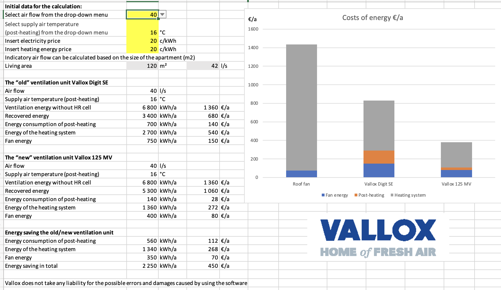

# Vallox

What is post-heating and what is its correct temperature?
The heat recovery cell of the ventilation unit uses the heat of the extract air to heat up the air that is blown into the building in winter. If the temperature of the supply air (the air that is blown into the room) is, after the heat recovery cell, lower than the desired supply air temperature, the supply air can be heated more either with an electric or water-circulating post-heating radiator.

The correct temperature of the supply air that is blown into the apartment depends on a personal preference. It is advisable to keep the supply air temperature as low as possible without unpleasant drafts. This ensures that the heat adjustment of the building also works correctly when e.g. the sun or a fireplace brings heat into the building. The direction of the airflow from the valves, windows, or the heating system can also contribute to drafts.

It is not advisable to set the supply air temperature higher than the room temperature, because it is not practical to use the ventilation unit for the heating of the apartment. If the supply air temperature is increased from 16 °C to 22 °C, the energy used for post-heating will be multiplied. However, this energy is excluded from the heating energy consumption of the building.

If the air coming from the valve is unpleasantly cold (even when considering that moving air coming from the valve always feels cold on the skin when its temperature is below 37°C), it is advisable to measure the temperature of the air entering the duct at the unit and the air coming from the valve. If the air cools down by several degrees in the duct, the insulation of the duct is insufficient.

New and highly efficient cross-counter flow cells can heat the supply air to over +17°C almost throughout the year. In such a case, additional heating of the supply air is usually not needed. For this reason, small Vallox ventilation units that have a high efficiency rate always have electric post-heating. The higher procurement and installation costs of a water-circulating radiator cannot be written off within a reasonable period of time.

If the ducts have been installed on the warm side of the vapour barrier, e.g. in enclosures close to the ceiling, the supply air is heated in the ducts by the “free energy of the heat that is lost when it rises into the attic“, which enhances the comfort of living. In energy-efficient multi-storey buildings, in particular, excess heat is often a problem. The situation should not be made worse by increasing the supply air temperature too high. In most situations, 16–18°C is sufficient.

Poorly insulated ducts installed in the attic cool the supply air, reduce the efficiency of heat recovery, and increase the energy consumption of post-heating.

For more information, see the excel it self [Energy calc excel](/media/Energianlaskentataulukko_xlsx.xlsx)
