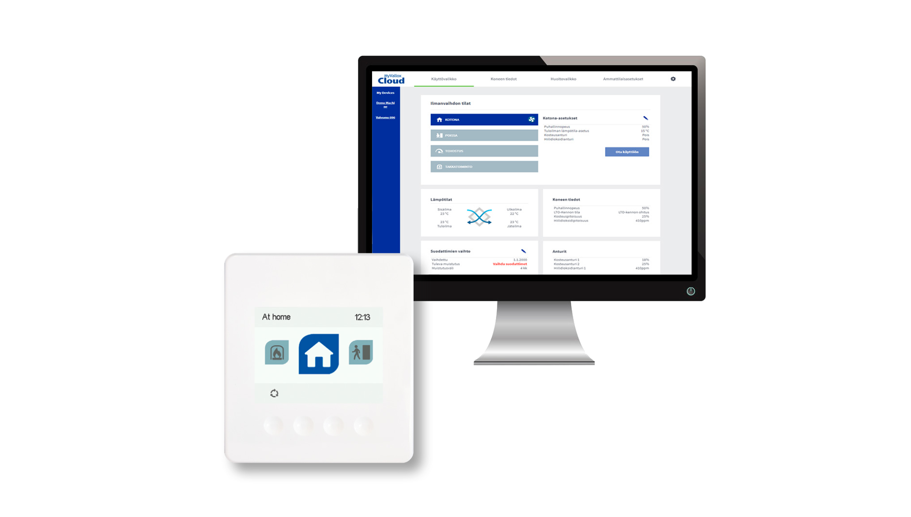
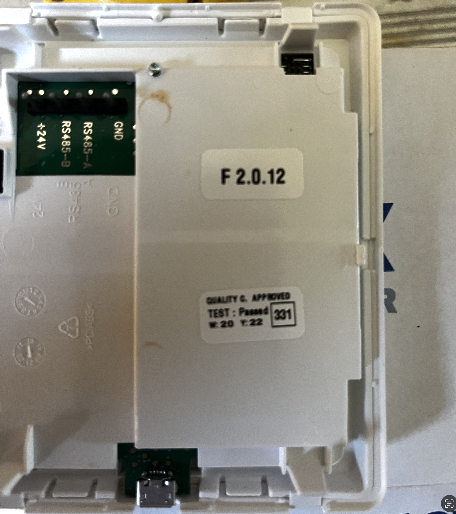
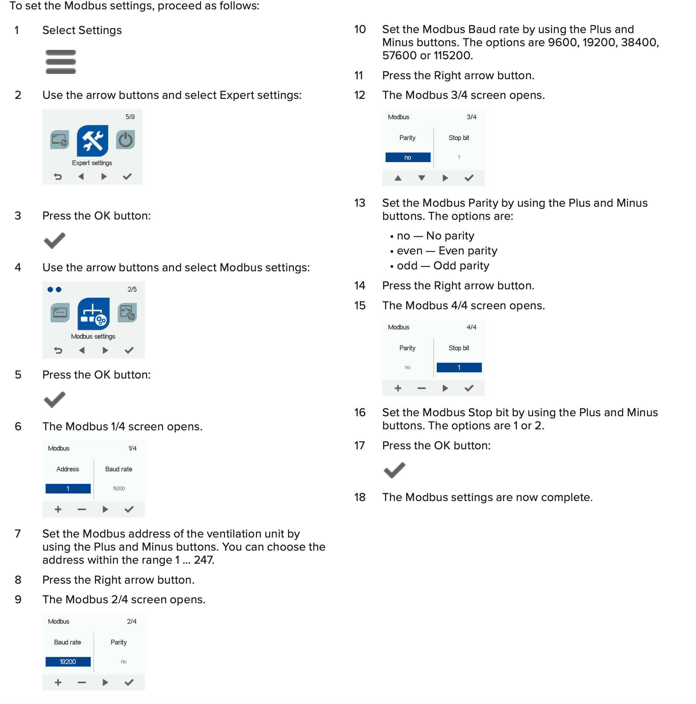
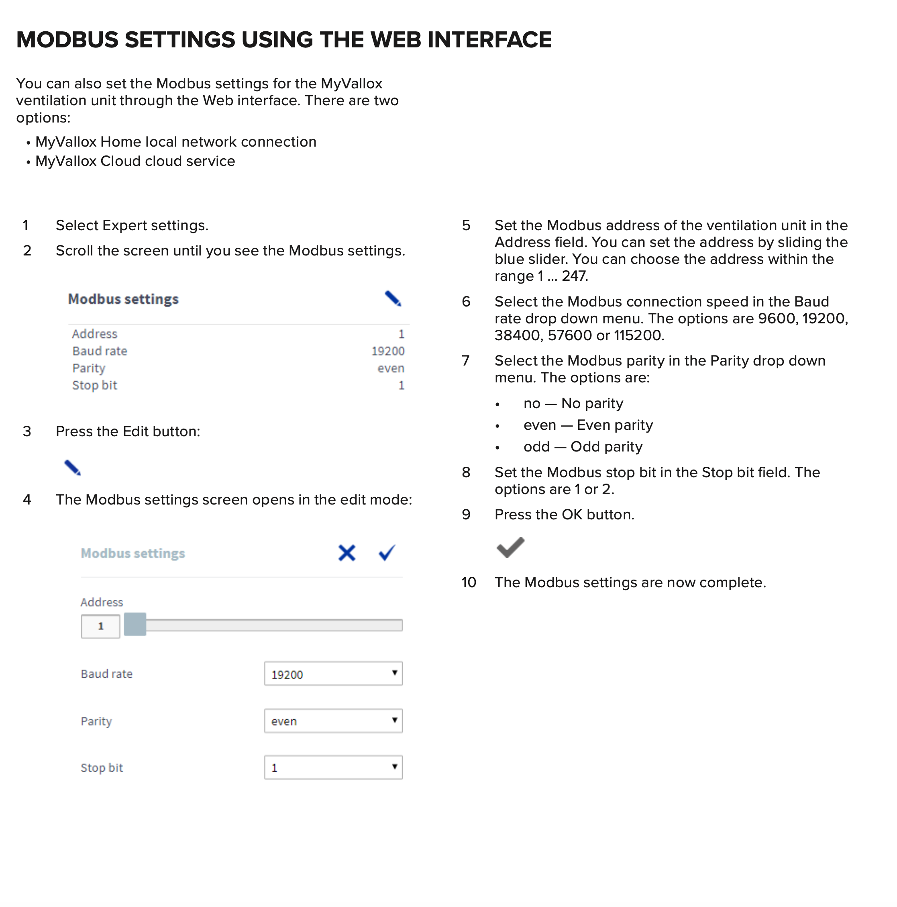
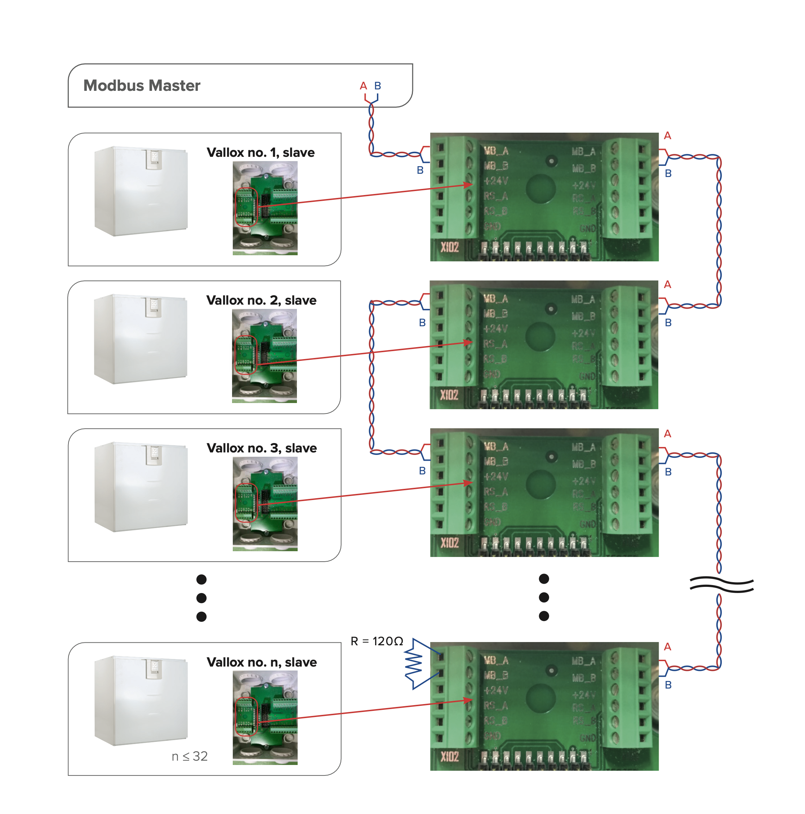

# Modbus Configuration

## Technical instructions

MyVallox ventilation units can be controlled with Modbus RTU compatible building automation systems. Up to 32 MyVallox ventilation units can be connected in the same Modbus line. Through a building automation system it is possible to control the ventilation unit, it e.g. read different sensor values and change the status of the ventilation unit.

### Actually - what I Got is:

It's Modbus allright with RS485 A & B pins etc.

## GENERAL INFORMATION
Everything that can be changed from user interfaces can also be changed over Modbus RTU.
MyVallox Control does not have a Modbus TCP option. Data format is always 16 bit unsigned word.
All the registers are of type ”holding register”.

## Supported function codes:
• Read holding registers, 0x03 • Write single register, 0x06
• Write multiple registers, 0x10
Writing to undefined registers is forbidden and will return error code. This needs to be considered when writing multiple registers at once.
• Writing to registers 20504 - 20508 does NOT work. Register 20504 is undefined.
• Writing to registers 20505 - 20508 works. Registers are defined and writable.
Writing to read-only registers (R) is forbidden and will return error code.
Writing values outside given min - max range is forbidden and will return error code.

## CHANGING BETWEEN MODES
MyVallox Control has two basic modes: Home mode and away mode. One of these is always selected.
• Basic mode can be read and set from register 4609, 0=home mode and 1=away mode.
MyVallox Control also has three timed modes: Boost mode, fireplace mode and programmable mode. Timed modes override the chosen basic mode temporarily. Wanted mode is activated by writing the wanted running time in minutes to the mode’s timer register. The mode activates and the timer register starts counting down. When all timer registers of all timed modes are zero, the MyVallox Control changes back to the chosen basic mode.
• 4612=boost mode timer register
• 4613=fireplace mode timer register
• 4614=programmable mode timer register
Timed mode can be set to run indefinitely by writing value 65535 to the mode’s timer register. This disables the countdown of the timer until the timer register is reset manually or the mode is changed from some other user interface.
Timers can also be deactivated from corresponding timer switch registers, 0=timer off and 1=timer on. This will also disable timers for all user interfaces. NOTE: Using MyVallox digital input for changing modes also changes the contents of the timer switch registers.
• 21766=boost mode timer enabled register
• 21767=fireplace mode timer enabled register
• 21772=programmable mode timer enabled register

### Example: Activating fireplace mode for 15 minutes
• Write 15 to register 4613.
• Write 1 to register 21767 (If not already written).
Example: Activating boost mode without timer (mode stays on)
• Method 1:
• Write 65535 to register 4612.
• Method 2:
• Write any value (non-zero) to register 4612.
• Write 0 to register 21766.
Example: Turning off boost mode, return to chosen basic (away/home) mode
• Write 0 to 4612.
• Optionally write 0 to registers 4613, 4614 to turn off all
timed modes.
Example: Switch from home mode to away mode
• Write 1 to 4609.
• Optionally write 0 to registers 4612, 4613, 4614 to turn off
all timed modes.

## MODE PRIORITY
If more than one modes are active at the same time, the higher priority mode overrides any other mode. For example, if the Fireplace mode and the Boost mode are simultaneously active, the ventilation unit uses the Fireplace mode. The mode priority order is:
1. Programmable mode
2. Fireplace mode
3. Boost mode
4. Home/Away (basic) mode

## SWITCHING UNIT OFF
Unit can be switched off by writing 5 to register 4610, and switched on by writing 0 to register 4610.
## UNIT FAULT CONDITION
Unit fault condition can be read from register 4621. 0 = normal operation, 1 = fault. Type of fault can be only read from MyVallox user interface.
## DATA CONVERSION FORMULAS
Temperatures are given in centKelvins.
• Celsius temperature = (centKelvin - 27315) / 100
• centKelvin = (Celsius temperature * 100) + 27315 
Register contents in general are given in the register
description, inside square brackets, in numerical order starting from zero.

* [no sensor, low, med, high]: 
* 0 = no sensor
* 1 = low
* 2 = med
* 3 = high

## MODBUS SETTINGS
If the ventilation unit is connected to e.g. a building automation system through Modbus line, the following Modbus settings must be given:
• Ventilation unit Modbus address
• Modbus baud rate
• Modbus parity
• Modbus stop-bit

This document describes how to make those settings using either the MyVallox Control panel or the Web interface. With these instructions you can also set individual settings, such as the Modbus address.

# MODBUS SETTINGS USING MYVALLOX CONTROL PANEL

# MODBUS SETTINGS USING THE WEB INTERFACE

# MODBUS OBJECTS

| addr | Variable name     | # R/RW | # Min   | # Max  | # Type | # Description                            |
|:-----|:------------------|:------:|:-------:|:------:|:------:|:-----------------------------------------|
| 4353 |  FAN_SPEED        |      R | 0       |  100   |%       |        Current fan speed                 |
| 4354 |  TEMP_EXTRACT_AIR |      R | 21000   |  33224 |  cK    |        Temperature, extract, cell input  |
|  |   |      |    |   |      |         |

# Modbus Master

