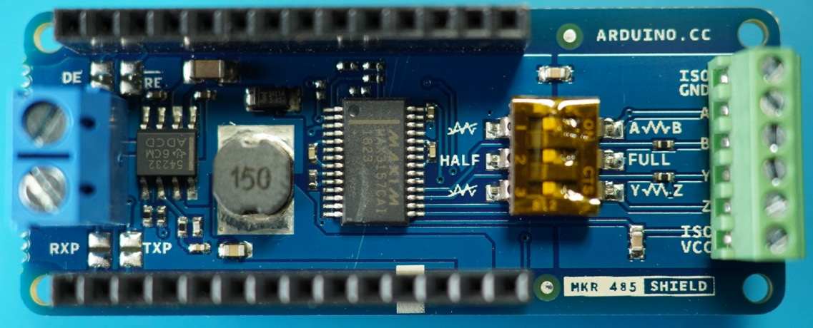
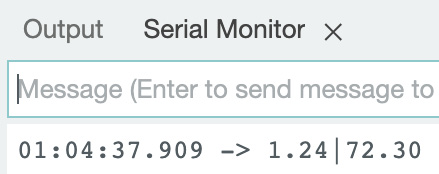
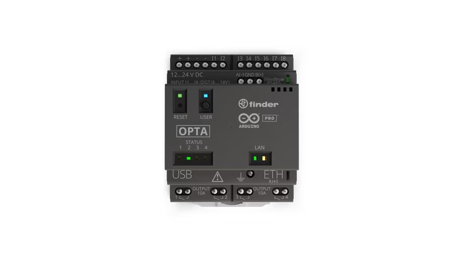
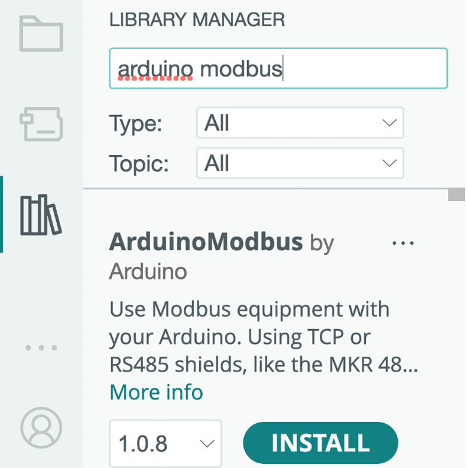
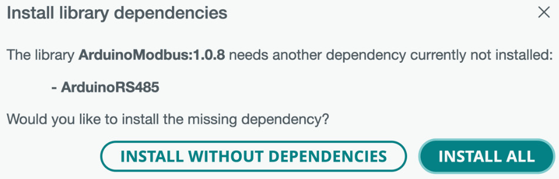

# Managing Communication with RS-485
In the previous chapters, we learned how to communicate using various wireless technologies and hardware. However, there are times when communicating over wireless isn’t suitable because it would cause interference with critical hardware in the vicinity. In this chapter, we will learn about a communication technology that isn’t wireless and is popular in industrial settings.
In this chapter, we’re going to cover the following main topics:

    Introducing RS-485
    Introducing Modbus
    Communicating using RS-485 hardware

Let’s consider what we will need to complete the projects in this chapter.
# Technical requirements
You will need the following items to complete the exercises in this chapter:

    MKR WiFi 1010
    MKR 485 Shield
    MKR ENV Shield
    Jumper wires

The code snippets for this chapter are available in this book’s GitHub repository: https://github.com/PacktPublishing/Arduino-Data-Communications/tree/main/chapter-11.

# Introducing RS-485
RS-485 is a standard for serial communication that allows multiple devices to communicate on the same bus. It is a differential voltage signaling standard, which means that it uses two wires to transmit data. This makes it less susceptible to noise than other serial communication standards, such as RS-232.

RS-485 is a half-duplex communication method, so, as such, only one device can transmit at a time. You can still use it to create a multi-drop network where multiple devices can share the same bus. You can utilize it in the following settings:

    Industrial automation: RS-485 is used in industrial automation and control systems to communicate between devices such as Programmable Logic Controllers (PLCs), sensors, and actuators
    Building automation: RS-485 is used to control Humidity Ventilation and Air Conditioning (HVAC) systems, as well as lights, security, and access control
    Medical equipment: RS-485 is used to communicate between devices such as patient monitors, infusion pumps, and imaging devices
    Transportation systems: RS-485 is used to communicate between devices such as traffic lights, parking meters, and train control systems

RS-485 supports communications between devices that are up to 1 km apart. You can utilize a twisted-pair cable, such as the one used in telephony, to accomplish this.

# Benefits of RS-485
The RS-485 standard has certain benefits:

    Robust: RS-485 is a very robust communication standard. It is less susceptible to noise than other serial communication standards, such as RS-232.
    Long distance: RS-485 can support long distances. The maximum distance between two devices on an RS-485 bus is 1,200 meters.
    Multi-drop: RS-485 can support multiple devices on the same bus. This makes it ideal for applications where a central controller needs to communicate with a large number of devices.
    Low cost: RS-485 is a relatively low-cost communication standard. This makes it a good choice for budget-conscious applications.

# Cons of RS-485
RS-485 has a few constraints or limitations that you should be aware of.

    Slow: RS-485 is a relatively slow communication standard. The maximum data rate for RS-485 is 100 kbps.
    Not suitable for all applications: RS-485 is not suitable for all applications. For example, it is not suitable for applications where real-time data communication is required.

Communicating over RS-485 requires hardware that supports RS-485, with one controller and one or more peripherals. Let’s consider these next.

# RS-485 hardware
You can purchase a shield for working with the Arduino MKR and Arduino Portenta families of microcontrollers. This shield is called the Arduino MKR 485 Shield. You can purchase this shield at https://store-usa.arduino.cc/products/arduino-mkr-485-shield.

This shield works with the MKR boards we have been using. As a result, we will be utilizing it for the exercises in this chapter.

# MKR 485 Shield
The MKR 485 Shield looks similar to the following:

Figure 11.1 – Arduino MKR 485 Shield

The block on the right-hand side of the preceding figure allows for connections. There are six terminals, labeled as follows:

    ISO GND: Connect this from the terminal of the peripheral device to the GND pin of the controller
    A: Leave this vacant on the peripheral
    B: Leave this vacant on the peripheral
    Y: Connect a cable from this block on the peripheral to A on the controller
    Z: Connect a cable from this block on the peripheral to B on the controller
    ISO VCC: Leave this vacant

There are three switches next to the block that need to be configured on the shield, depending on whether it’s being used as a controller or a peripheral. The switches are labeled 1, 2, and 3, and they can be on or off.

For peripherals (or senders), the switches should be set as follows:

    1: Set to OFF
    2: Set to ON
    3: Set to ON

For controllers (or receivers), the switches need to be set as follows:

    1: Set to ON
    2: Set to ON
    3: Set to OFF

You will need the ArduinoRS485 library to program the microcontrollers. Follow the steps provided in the following sub-section to install the library.

# Installing the RS485 library
Follow these steps to install the RS-485 library from Arduino:
1. Launch the Arduino IDE.
2. Open the library manager.
3. Search for rs485.
4. Locate the entry for ArduinoRS485 by Arduino.
5. Install this entry.
You can watch a video showing how to install this library at https://packt.link/Axyff.

With this library installed, you are ready to program the peripheral device to take temperature and humidity readings from the MKR ENV Shield and send them across. We’ll do that next
# Sending temperature and humidity data using RS-485
Follow these steps to send temperature and humidity data over RS-485:
1. Connect the MKR ENV Shield on top of the MRK WiFi 1010.
2. Connect the MKR 485 Shield on top of the MKR ENV Shield.
3. Attach a black male-male Dupont cable or jumper wire to the ISO GND terminal.
4. Attach a blue male-male Dupont cable or jumper wire to the Y terminal.
5. Attach an orange male-male Dupont cable or jumper wire to the Z terminal.
6. Connect a micro-USB cable between the microcontroller and your computer.
7. Launch the Arduino IDE.
8. Start a new sketch.
9. #include the necessary header files:
```
#include <Arduino_MKRENV.h>
#include <ArduinoRS485.h>
```
10. Declare constants and variables to aid with tracking the environment variables and the last time that they were read:
```
unsigned long lastRead = millis();
const int myDelay = 60000;
float t,h;
const int stationId = 1;
```
11. Within the setup() function, we initialize the MKR ENV Shield and the MKR 485 Shield. We set the transmission baud rate of the MRK 485 to 9600:
```
void setup() {
  while (!ENV.begin()) {
    Serial.println("Failed to initialize ENV Shield, waiting ...");
    delay(10000);
  }
  RS485.begin(9600);
}
```
12. Next, within the loop() function, read the temperature and humidity periodically and send that data over RS-485:
```
void loop() {
  if (millis() - lastRead > myDelay) {
    lastRead = millis();
    t = ENV.readTemperature();
    h = ENV.readHumidity();
    String msg = String(String(stationId) + "|" + String(t) + "|" + String(h));
    RS485.beginTransmission();
    RS485.println(msg);
    RS485.endTransmission();
  }
}
``` 
13. Upload the sketch to the microcontroller.

Congratulations – you have successfully programmed the microcontroller to send out temperature and humidity readings over RS-485! These steps are illustrated in a video available at https://packt.link/Axyff.

Now, we need to receive what has been sent out. Let’s program a controller to do that.
# Receiving data over RS-485
Follow these steps to set up a controller:
1. Connect the second MKR 485 Shield to the top of the second MRK WiFi 1010 microcontroller.
2. Connect the black cable from the ISO GND terminal on the peripheral to the GND pin on the controller.
3. Connect the blue cable from the Y terminal on the peripheral to the A terminal on the controller.
4. Connect the orange cable from the Z terminal on the peripheral to the B terminal on the controller.
5. Connect a micro-USB cable between the microcontroller and a computer.
6. Launch the Arduino IDE.
7. Start a new sketch.
8. #include the required header file so that you can make use of the MKR 485 Shield:
```
#include <ArduinoRS485.h>
```
9. Initialize the MKR 485 Shield and set it to receive mode. We can do this in the setup() function:
```
void setup() 
{
    Serial.begin(9600);
    while (!Serial) 
    {
        //
    }
    RS485.begin(9600);
        // enable reception, can be disabled with: RS485.noReceive();
        RS485.receive();
}

```
10. Next, we simply listen for any available data within the loop() function and print it out to the computer serial:

```
void loop() {
    if (RS485.available()) {
        Serial.write(RS485.read());
        }
}
```
11. Upload the sketch to the microcontroller.
12. Open Serial Monitor and set the baud rate to 9600.
13. Ensure that the peripheral we programmed in the previous section is powered.
14. Wait a few seconds for data to start streaming into Serial Monitor. You should see something similar to the following:

Figure 11.2 – The data received via MK0485

Congratulations – you have successfully programmed a controller to receive data over RS-485! You can watch these steps in a video at https://packt.link/Axyff.

There is an Arduino device with embedded capabilities for RS-485. We’ll look at this next.
# Arduino Opta
Arduino has a new micro PLC with industrial IoT capabilities called Arduino Opta. This micro PLC comes in three variants:

    Opta Lite: With onboard Ethernet
    Opta RS485: With onboard Ethernet and RS485
    Opta WiFi: With onboard Ethernet, RS485, and Wi-Fi/BLE

You can use the Opta RS485 and Opta WiFi in projects that require RS-485, although we won’t be making use of them in this book. The Opta is powered by the STM32H747XI dual-core processor. You can read about it at https://www.arduino.cc/pro/hardware-arduino-opta.

Key Benefits

    Easy and fast software development, starting from ready-to-use Arduino sketches, tutorials and libraries
    Optional support for standard IEC 61131-3 PLC languages
    Fieldbus integration via Modbus TCP (Ethernet) and Modbus RTU (serial RS485)
    Seamless IoT connectivity (Ethernet/Wi-Fi®/Bluetooth® Low Energy)
    Real-time remote monitoring via intuitive Arduino Cloud dashboards (or third-party services)
    Security at the hardware level thanks to onboard secure element and X.509 Standard compliance
    Secure OTA firmware updates and Cloud device management
    High-power relay switching (4 x 2.3 kW)
    Reliable by design, thanks to industrial certifications and Finder’s expertise in switching technology
    Easy to install, with DIN rail compatibility

While we might communicate directly over RS-485, there is a protocol that was introduced a while back that we should be aware of.

# Introducing Modbus

Modbus was designed for use with PLCs by Schneider Electric, at that time the PLCs were manufactured by a company called Modicon. Modbus is commonly used for communications between industrial electronic devices, often transmitting data sensors, instrumentation, and control devices back to a main controller. It is royalty-free and published openly. Compared to other standards for industrial communication, Modbus is easy to deploy and maintain. It also places a few restrictions on the format of the data to be transmitted.

Modbus uses character serial communications, Ethernet, or Internet Protocol (IP) as a transport layer. It supports communication to and from multiple devices on the same cable or Ethernet network. Modbus is used in Supervisory Control and Data Acquisition (SCADA) to connect supervisory computers to Remote Terminal Units (RTUs). SCADA is a system of software and hardware that collects and monitors data from remote or field devices and uses that data to control other devices. SCADA is used in several industries, including transportation, oil and gas, elevators, manufacturing equipment, water, and energy. SCADA systems consist of three components:

    Sensors: The devices that measure physical conditions
    Actuators: The devices that control physical devices, such as valves and pumps
    Communication network: This connects the sensors and actuators of the master station

The master station is a computer that collects data from the sensors, displays them on a Human-Machine Interface (HMI), and sends commands to the actuators. The HMI allows a human operator to control the system.

There are several versions of the Modbus protocol, such as Modbus RTU, Modbus TCP, Modbus Plus, and Modbus ASCII. Nodes communicate using send request messages and read response messages. At the physical layer, Modbus can take advantage of the same two-wire communication that RS-485 utilizes.

If you choose to communicate using the RS-485 infrastructure, the entire network will be dedicated to only Modbus communication. If you need to send other types of messages to other devices on the network, you will have to utilize an Ethernet network.

Modbus communication is primarily peer-to-peer, but it supports point-to-point and multidrop networks.

Only one device can initiate transactions on a Modbus network. This device is the controller.

# Modbus pros
Modbus has several advantages.

    Openly published and royalty-free: Modbus is an open standard, which means that anyone can use it without paying royalties. This makes it a cost-effective solution for many applications.
    Reliable: Modbus is a reliable protocol that has been used in industrial environments for many years. It is well-suited for applications where data integrity is critical.
    Versatile: Modbus can be used to communicate with a wide variety of devices. This makes it a flexible solution for many applications.
    Easy to implement: Modbus is relatively easy to implement. There are many available implementations for different platforms, making it a quick and easy solution for many applications.

# Modbus cons
However, Modbus has its weaknesses:

    Slow: Modbus is a relatively slow protocol. The maximum data rate for Modbus is 100 kbps. This may be a limitation for applications that require high-speed data transfer.
    Not suitable for all applications: Modbus is not suitable for all applications. For example, it is not suitable for applications where real-time data communication is required.
    Security: Modbus is not a secure protocol. It does not provide any encryption or authentication, which means that data can be easily intercepted and modified.

Modbus communication can take place over both RS-485 and Ethernet. As such, there are more Arduino shields and devices that support communicating over Modbus.

# Modbus hardware
The following shields are compatible with Modbus:

    MKR 485 Shield
    MKR ETH Shield
    Portenta Vision Shield – Ethernet
    Ethernet Shield Rev 2

The following carriers are compatible with Modbus:

    Portenta Machine Control
    Portenta Max Carrier

The following device is compatible with Modbus:

    Arduino Opta

When setting up your Arduino device as a controller for devices that communicate over a Modbus interface, you will need to be mindful of the labels on the peripherals.
# Connecting peripherals
Peripherals have three terminals that are frequently labeled as follows:

    A: This could also be labeled as TX-/RX- or D-. Connect this to the Y terminal on the MKR 485 Shield.
    B: This could also be labeled as TX+/RX+ or D+. Connect this to the Z terminal on the MKR 485 Shield.
    COM: Connect this to ISO GND on the MKR 485 Shield.

You will also need to set the switches on the MKR 485 Shield to the following:

    1: Set to OFF
    2: Set to OFF
    3: Set to ON

Unlike RS-485, where you just broadcast messages, Modbus has a bit of methodology that you will need to be aware of.
# Modbus messaging
Modbus messaging is centered around reading and writing to device registers on the peripheral. Messages are made up of four components and this never changes. The controller initiates the conversation, and the peripheral responds. The message structure is as follows:

    Device address: This is the address of the peripheral. Peripherals will only respond to messages sent to their address.
    Function code: This instructs the peripheral to either read a device register or write to it.
    Data: This contains either the data requested, or the data being sent.
    CRC error check: This is a checksum that makes it easy to detect accidental changes in the message that was sent.

Let’s read the current energy consumption, as recorded by an energy meter, as an example.

Industrial devices might communicate information that you read using Modbus. Let’s consider the example of reading electrical energy generation or consumption using a Modbus-compatible energy meter. You can purchase these meters from Amazon or any store that sells these types of products. The specific meter that I will be using for this example is available at https://www.amazon.co.uk/gp/product/B098QGZ4KG/ref=ppx_yo_dt_b_asin_title_o01_s00?ie=UTF8&psc=1.

Because this meter is rated for 100A, you might be able to use it to monitor the consumption of an entire phase, but you could choose to install it in a cabinet or distribution box and use it to monitor the energy consumption of a room or a few appliances.

Warning

You must exercise extreme caution when working with alternating currents because of the danger that this poses. The best approach might be to have an electrician install this meter.
# Reading data from a peripheral
The code for this exercise is available at https://github.com/PacktPublishing/Arduino-Data-Communications/tree/main/chapter-11/modbus-meter-reading.

Follow these steps to connect your microcontroller to the smart meter:
1. Connect a wire from the 4 terminal on the meter to the Z terminal on the MKR 485 Shield.
2. Connect a wire from the 5 terminal on the meter to the Y terminal on the MKR 485 Shield.
3. Connect a wire from the 6 terminal on the meter to the ISO GND terminal on the MKR 485 Shield
4. Set switch 1 to OFF on the MKR 485 Shield.
5. Set switch 2 to OFF on the MKR 485 Shield.
6. Set switch 3 to ON on the MKR 485 Shield.
7. Connect the MKR 485 Shield to the Arduino MKR WiFi microcontroller board.
8. Launch the Arduino IDE.
9. Open Library Manager.
10. Search for Arduino Modbus.
11. The result should look similar to the following:

Figure 11.3 – The Arduino Modbus library
12. Click on the INSTALL button to install the library.
13. You might get a prompt similar to the following:

Figure 11.4 – A prompt asking you to install library dependencies
14. If you get this prompt, click on the INSTALL ALL button to install the necessary dependencies.
15. Start a new sketch, if you don’t have one open already.
16. You will need two libraries, so include them, as shown here:
```
#include <ArduinoRS485.h>
#include <ArduinoModbus.h>

```
17. Let’s define the variables that will make it possible to read the meter registers every minute:
```
unsigned long lastRead = millis();
const int myDelay = 60000;
```
18. Let’s start the serial port and the Modbus RTU client in the setup() function:
```
void setup() {
  //initialize the serial port
  Serial.begin(115200);
  delay(1500);
  //start the modbus RTU client
  if (!ModbusRTUClient.begin(9600)) {
    Serial.println("Unable to initialize Modbus RTU Client"); //there was an error
  }
}
```
19. Let’s define a function that gets the energy consumption from the buffer register of the meter. We must also define a variable, kWh, that holds the consumption value:
```
double getEnergy() {
  double kWh = 0.;
  return kWh;
}
```
20. Within the getEnergy() function, we need to read the holding register of the meter using the requestFrom() method of the Modbus RTU client. This method takes four parameters: the ID of the target, the location to read, the start address, and the number of values. We will be reading three values from the start address, which is documented for energy readings:
```
double getEnergy() {
  double kWh = 0.;
  if (!ModbusRTUClient.requestFrom(0x01, HOLDING_REGISTERS, 0x0109, 3)) {
  }
  else {
  }
  return kWh;
}
```
21. If we get an error while attempting to read the register, we will need to print out a notification:
```
double getEnergy() {
  double kWh = 0.;
  if (!ModbusRTUClient.requestFrom(0x01, HOLDING_REGISTERS, 0x0109, 3)) {
    Serial.print("Error reading energy consumption: ");
    Serial.println(ModbusRTUClient.lastError());
  }
  else {
  }
  return kWh;
}
```
22. If we were successful in reading the register, we will need to read three successive words from the register and concatenate them by carrying out a binary shift:
```
double getEnergy() {
  double kWh = 0.;
  if (!ModbusRTUClient.requestFrom(0x01, HOLDING_REGISTERS, 0x0109, 3)) {
  }
  else {
    uint16_t w1 = ModbusRTUClient.read();
    uint16_t w2 = ModbusRTUClient.read();
    uint16_t w3 = ModbusRTUClient.read();
    uint32_t dw = w1 << 32 | w2 << 16 | w3;
    kWh = dw / 1000.0;
  }
  return kWh;
}
```
23. With the function definition complete, we can call it from the loop() function once every minute:
```
void loop() {
  if (millis() - lastRead > myDelay) {
    lastRead = millis();
    float consumption = getEnergy();
    Serial.print("kWh: ");
    Serial.println(consumption);
  }
}
```
24. You may now upload the sketch.

Congratulations – you have successfully communicated with a meter using Modbus!

# Summary
In this chapter, you learned about the RS-485 serial communication standard and Modbus.

In the next chapter, you will learn about some of the security risks that the data you transmit is exposed to and some approaches to mitigating those risks.

# Further reading
To learn more about the topics that were covered in this chapter, take a look at the following resources:

    MKR 485 Shield: https://store-usa.arduino.cc/products/arduino-mkr-485-shield
    MKR ETH Shield: https://store-usa.arduino.cc/products/arduino-ethernet-shield-2
    Portenta Vision Shield – Ethernet: https://store-usa.arduino.cc/products/arduino-portenta-vision-shield-ethernet
    Arduino Opta: https://www.arduino.cc/pro/hardware-arduino-opta
    RS-485: https://docs.arduino.cc/hardware/mkr-485-shield
    Modbus: https://docs.arduino.cc/learn/communication/modbus
    Arduino Modbus library: https://www.arduino.cc/reference/en/libraries/arduinomodbus/
    Modbus protocols: https://realpars.com/modbus/


