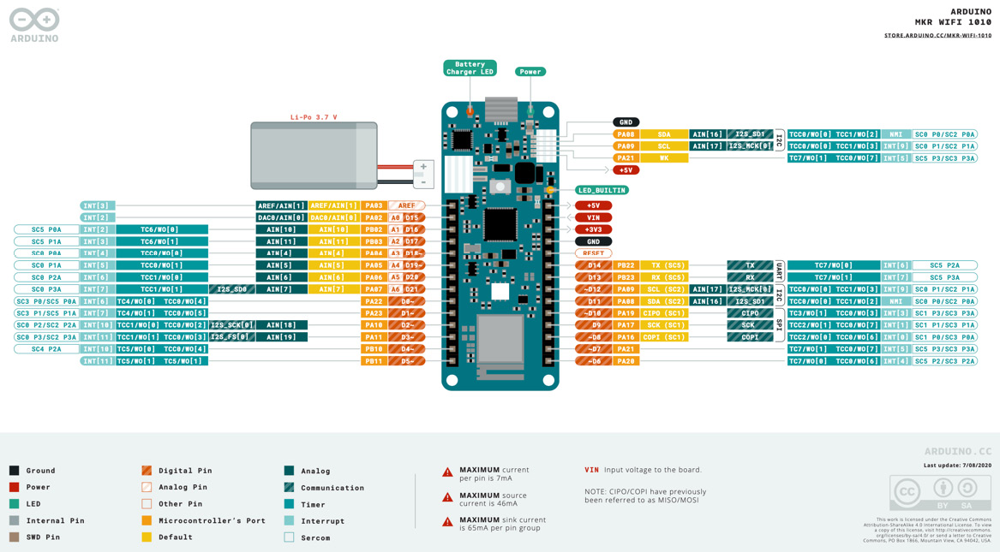
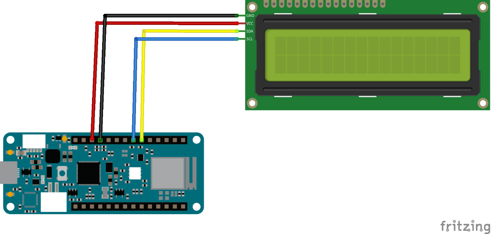

Original source : https://learning.oreilly.com/library/view/arduino-data-communications/9781837632619/cover.xhtml

#Leveraging Various Sensors for Data Acquisition

In the previous chapter, you learned how to blink an LED. Doing that lets the microcontroller interact with its environment. You were using the LED as an actuator to control the environment. With Arduino, you can also read the environment using sensors. Sensors convert the state of the environment into an electrical signal. You can read these signals using input and output pins.
In this chapter, we are going to cover the following main topics:

    Learning about microcontroller input and output pins
    Discovering sensors

By the end of this chapter, you will have learned about various sensors and the various ways in which you can collect data. You will find this knowledge to be useful when you encounter new sensors as you go about your daily activities. The knowledge you will acquire in this chapter will come in handy for collecting data in future projects.

#Technical requirements
All the code examples for this chapter can be found on GitHub at https://github.com/PacktPublishing/Getting-Started-with-TensorFlow. You will also need the following:

    Arduino MKR WiFi 1010
    Micro-USB cable
    LCD 1602
    Arduino Sensor Kit
    Arduino IDE

#Learning about input and output pins
The first time we looked at the pinout diagram of the MKR WiFi 1010, we only discussed the digital and analog pins. Let’s revisit that diagram so that we can consider the other communication technologies that are available on the MKR board:

Figure 2.1 – Arduino MKR WiFi 1010 pinout diagram (source: https://docs.arduino.cc/static/9d6534bb9783a42e3527a8c03472ad10/ABX00023-full-pinout.pdf)
The preceding figure has some pins labeled in dark green. Take a look at the pins on the right-hand side of the board; you will see that they are grouped into three. These are communication protocols that are supported by the pins. We’ll discuss them next.
#UART
Digital pins 13 and 14 work together in tandem to support a protocol that is commonly called **Serial**. In Serial communications, data is transmitted one bit at a time. **UART** is short for **Universal Asynchronous Receiver/Transmitter**. The “Asynchronous” part in the name implies that this doesn’t require the use of an external clock as a timing source. This minimizes the number of wires required for communication but requires some extra work to ensure that the communication works properly. You can use UART for communication between two microcontrollers, or between a microcontroller and a device pump. This works using two pins – one for transmitting data and a second for receiving data. The two devices communicating using serial need to agree on a data speed, called a baud rate. The data is transmitted one bit at a time.

The MKR board has two serial ports, called **Serial** and **Serial1**:

    **Serial** is used for communicating with a computer when connected using a USB cable. You can use this to output information to a console on the host computer, as well as to read input from the console. The microcontroller sends text messages over the serial interface.
    **Serial1** is used for communicating with digital pins 13 and 14. It works the same way as Serial.

You can only use UART to communicate between two devices. Let’s discuss something that supports more devices concurrently.
#SPI
The **Serial Peripheral Interface (SPI)** uses four wires to communicate with a peripheral, in addition to two wires for power and ground. This lets it implement synchronous communication, in which all devices communicate using a common clock, along with a chip select pin that lets it choose the peripheral that it would like to communicate with. Pins D8, D9, and D10 are used for SPI on the MKR board. These pins behave as follows:


    **COPI:** This is controller out, peripheral in. This is the pin/wire over which the microcontroller sends data out to the attached peripheral. This is pin D8 on the MKR.
    **SCK:** This is the serial clock. It is the pin that the controller uses to control timing between itself and the peripheral. This is pin D9 on the MKR.
    **CIPO:** Controller in, peripheral out. This is the pin that the controller uses to receive data from the peripheral. This is pin D10 on the MKR.

You will need four wires to work with each SPI device, plus an additional **chip select (CS)** pin for each peripheral, in addition to two cables for power. This could quickly become a problem. Let’s look at the third communication protocol, which requires only two wires/pins for communications.

#I2C
With **inter-integrated circuit communication (I2C)**, the microcontroller acts as either a controller or a peripheral. It is usually a controller.

The MKR board has two I2C channels, represented by pins D11 and D12, as well as PA08 and PA09. You will be using D11 and D12 more often. The two wires function as follows:

    **SDA:** This is the data channel and is handled by pin D11.
    **SCL:** This is the clock channel and handles the timing. It is on pin D12.

You will also need to provide power to the peripheral, so two extra wires are required for power and ground. These are as follows:

    **+5V:** The power pin, which is colored red in the diagram. You might see this pin labeled as VCC on some peripherals.
    **GND:** The ground pin, which is colored black.

You can use I2C with both sensors and actuators. Also, you can connect a whopping 128 devices to one I2C channel, so long as they have different addresses. You might come across several displays that utilize the I2C communication protocol. One of those displays is the LCD1602, which is available from Waveshare, Seeed Studio, and a host of other vendors. Let’s learn how to work with one such display.
#Project 1 – setting up an LCD

Follow these steps to complete this project. The code is available online at https://github.com/PacktPublishing/Arduino-Data-Communications/tree/main/chapter-2/LCD1602-HelloWorld:

1. Connect the MKR board and the LCD, as shown in the following figure:

Figure 2.2 – Connecting an LCD1602 display to the MKR WiFi 1010
2. Launch the Arduino IDE.
3. Go to Library Manager.
4. Type LCD1602 into the search bar.
5. Click on Install, below the library provided by DFRobot.
6. From the IDE, choose File | New, and replace the code in the .ino file with the following:

```
#include "DFRobot_RGBLCD1602.h"
#define red 0
#define green 0
#define blue 255
DFRobot_RGBLCD1602 lcd(16, 2);
void setup() {
    lcd.init();
    lcd.setRGB(red, green, blue);
    print_lcd("Hello, world", "of embedded");
}

void loop() {
}
void print_lcd(String l1, String l2) {
  lcd.clear();
  lcd.setCursor(0, 0);
  lcd.print(l1);
  lcd.setCursor(0, 1);
  lcd.print(l2);
}
```
##Let’s discuss the code:

    The first line includes the DFRobot library, which is required for communicating with the display. This library encapsulates the I2C communication, but you still need to know that the display uses I2C so that you can wire it up correctly. If you would like to see the code implementation that does the I2C addressing, you can right-click on the name of the header file and choose Go to Definition.
    In the next three lines, you define the brightness of the red, green, and blue channels. The LCD has three color channels. By setting red and green to 0, you turn them off, effectively setting the display to use only blue.
    In the next line, you define an instance of the DFRobot_RGBLCD1602 class. You pass in two parameters, specifying the number of columns and rows supported by the display. You are now ready to address the display.
    In the setup() function, you do three things:
        First, you initialize the display.
        Next, you set the display color.
        Finally, you call a custom function called print_lcd() that takes two parameters and prints them out on different rows. We will discuss the implementation of the print_lcd() function shortly.
    We leave the loop() function empty. If you would like to update the display continuously or periodically, you can program that in the loop() function.
    Finally, we come to the print_lcd() function. First, the function clears the display. Then, it moves the cursor to the first column and first row and prints the first parameter. Finally, it moves to the first column and second row and prints the second parameter. We made use of a function because it helps us keep the main loop smaller and neater, and we can call a function multiple times. It’s also easier to edit the function whenever the need arises without changing our mail function drastically.

Congratulations – you now have code that you can utilize to display information whenever you use this particular display! Click on the Upload button to place the firmware onto the MKR board. You can watch a video recording of the Code in Action at https://packt.link/chG0p.

Let’s do one more thing that will make our lives easier: we will make the code modular. This code for displaying things on the LCD will not change and doesn’t need to be in our .ino file. Making the code modular makes it easier to swap out the LCD for something else without having to change the code too much. Let’s do just that.
