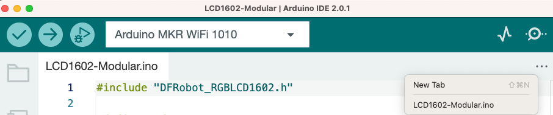

Original source : https://learning.oreilly.com/library/view/arduino-data-communications/9781837632619/cover.xhtml

#Project 2 – making the LCD code modular
Follow these steps to make the code modular. The code for this project is available at https://github.com/PacktPublishing/Arduino-Data-Communications/tree/main/chapter-2/LCD1602-Modular:

    1. Begin by adding a new file to the project you are working on. In the Arduino IDE, on the bar where you have the name of the file we have been working with, click on the ellipses (three dots). This is illustrated here:

Figure 2.3 – Adding a new tab
2. A new interface will pop up, asking for a name for the new file. Type in Display.hpp and hit OK.
3. Place the following code into the newly created header file. This code defines a namespace called Display, which we will use to access the functions we need. We will introduce one new function header, called initialize(), and maintain the old print_lcd() header. Note that the parameter names have been changed to make them more descriptive:

```
#pragma once
#include <Arduino.h>
namespace Display {
  #define red 0
  #define green 0
  #define blue 255
  void initialize();
  void print_lcd(String line1, String line2);
}
```
4. Repeat Steps 1 and 2 to add a new file. Call this file Display.cpp.
5. Paste the following code into the new file. This code implements the headers that you previously defined in Display.hpp:
```
#include "Display.hpp"
#include "DFRobot_RGBLCD1602.h"
namespace Display {
  DFRobot_RGBLCD1602 lcd(/*lcdCols*/16,/*lcdRows*/2);  //16 characters and 2 lines of show
  void initialize() {
    lcd.init();
    lcd.setRGB(red, green, blue);
  }
  void print_lcd(String line1, String line2){
    lcd.clear();
    lcd.setCursor(0, 0);
    lcd.print(line1);
    lcd.setCursor(0, 1);
    lcd.print(line2);
  }
}
```
6. You can now go back to your main Arduino .ino file and replace the code there with the following, much shorter, code, which does the same thing:

```
#include "Display.hpp"
void setup() {
    Display::initialize();
    Display::print_lcd("Hello, world", "of embedded");
}
void loop() {
}
```
As you can see, you are now doing much less in the main file, and the code has better readability. Let’s discuss what is going on:


    You begin by importing Display.hpp. You don’t need to worry about what gets imported into the implementation.
    Within the setup() function, you call the initialize() function to start up the LCD and set the desired color, and then you call the print_lcd() function to display what you want.
    You leave the loop() function empty because there is nothing to do for now.
Great – you now have a setup that you can use with various sensors to display information about what is going on with your code! Click on the Upload button to place this code onto the MKR board. You can watch a video recording of the Code in Action at https://packt.link/chG0p.

