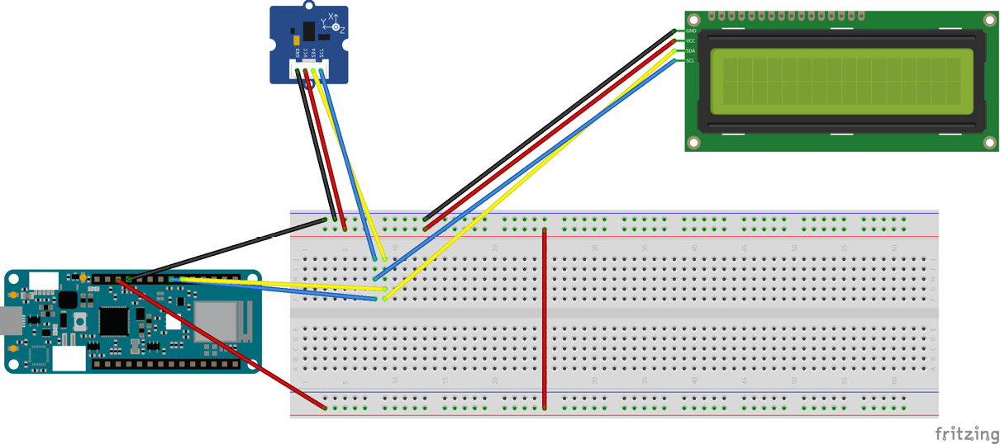
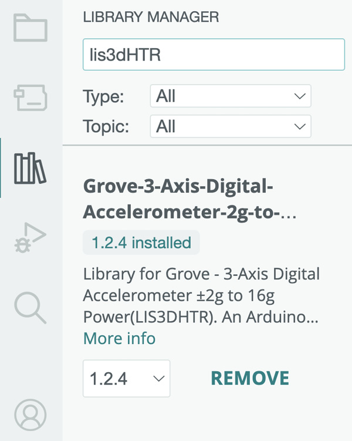
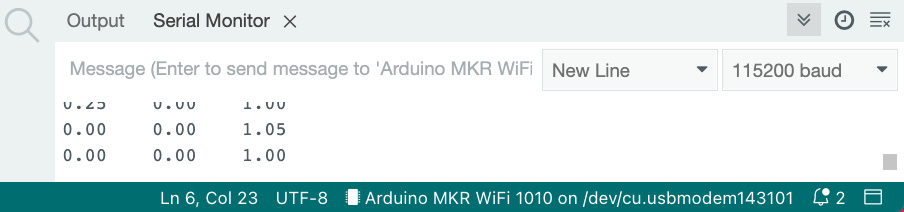
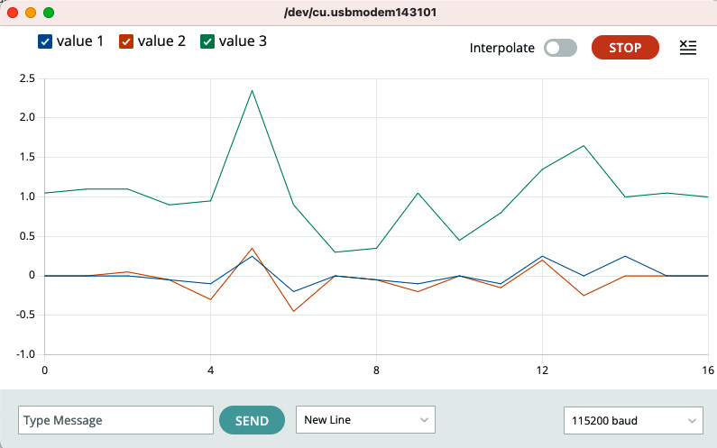

Original source : https://learning.oreilly.com/library/view/arduino-data-communications/9781837632619/cover.xhtml

#Discovering sensors
Sensors convert external readings into electrical signals. There are so many sensors that it would be impossible to list them all here. You can find sensors in three different implementations:

    On-board sensors: These come integrated with the microcontroller development board. MKR boards don’t come with those, but other Arduino Pro boards do.
    Breakout boards: These provide an interface such as a single pin, UART, SPI, or I2C for connecting to and communicating with a microcontroller.
    Shields: These are boards that are meant to attach to the top or bottom of a microcontroller and either integrate sensors or provide interfaces for connecting breakouts. We will discuss shields in the next chapter.

Let’s discuss some sensor categories.
#Motion sensors
Motion sensors try to answer one or more of the following questions:

    Is this item in motion?
    What direction is this item headed in?
    Is this item being held upward or sideways?

You will frequently find these sensors called Inertial Measurement Units (IMUs). There are three types:

    Accelerometers: These measure motion in three dimensions, called axes. An item that is moving straight up might have a change in only one direction, while an item that is moving inside a vehicle on a bumpy road could experience a change in all directions. These sensors are found in phones, smartwatches, activity trackers, and other devices that need to determine what the wearer (or bearer) is up to.
    Gyroscopes: These measure angular momentum in three axes. You can use gyroscopes to measure device orientation, such as in a phone or a smartwatch.
    Magnetometer: These measure the direction relative to magnetic north, similar to a compass.

You will frequently find IMUs being labeled with a certain number of axes, such as 3-axis, 6-axis, or 9-axis. Since each sensor measures three axes, dividing the number of axes on an IMU will give you the number of sensors it contains. For example, a 6-axis IMU has two sensors, usually an accelerometer and a gyroscope.

Let’s look at an example project where we collect accelerometer data using a 3-axis IMU called the LIS3DHTR. This accelerometer is available as part of the Arduino Sensor Kit from Seeed Studio, and it uses I2C to communicate with the microcontroller. This kit is available at https://store.arduino.cc/products/arduino-sensor-kit-bundle.

#Project 3 – reading accelerometer data
Follow these steps to get your project up and running. The code for this project is available at https://github.com/PacktPublishing/Arduino-Data-Communications/tree/main/chapter-2/Accelerometer:

    1. Set up your microcontroller, LCD, and accelerometer, as shown in the following figure. You will notice that both the accelerometer and the LCD utilize the same I2C pins on the MKR board, but we break these out on a breadboard to make connectivity easier:


Figure 2.4 – Connecting the accelerometer and LCD to the MKR board
2. Launch the Arduino IDE.
3. Open the last project where you made the LCD code modular. You can find it at https://github.com/PacktPublishing/Arduino-Data-Communications/tree/main/chapter-2/LCD1602-Modular.
4. From the IDE menu bar, click on File | Save As and name the new project Accelerometer
5. Open LIBRARY MANAGER.
6. Search for LIS3DHTR and locate the library named Grove-3-Axis-Digital-Accelerometer-2g-to-16g-LIS3DHTR by Seeed Studio:

Figure 2.5 – LIBRARY MANAGER

7. Install this library.
8. Create a new file and name it Accel.hpp. Copy the following code into this new file. This code defines the header file with a namespace and functions for initializing and controlling the accelerometer:


#pragma once


#include <Arduino.h>

```
namespace Accel {
  void initialize();
  bool lisAvailable();
  float getAccelerationX();
  float getAccelerationY();
  float getAccelerationZ();
}
```
In this code, we include Arduino.h, and then we declare namespace. By declaring a namespace, we can work with functions, variables, and classes that have the same name as other functions, variables, and classes in another namespace with a different name. For example, we could have the initialize() function in multiple namespaces within our code base. We then proceed to declare five function headers within the namespace:
1. initialize(): This will let us initialize the accelerometer
2. lisAvailable(): This will let us check whether the accelerometer was initialized
3. getAccelerationX(): This will let us get the acceleration along the x-axis
4. getAccelerationY(): This will let us get the acceleration along the y-axis
5. getAccelerationZ(): This will let us get the acceleration along the z-axis

9. Create a new file and name it Accel.cpp. Copy the following code into it. This code declares a namespace and implements functions for initializing the accelerometer, as well as returning the accelerometer values for the x, y, and z axes:
    
```
#include "Accel.hpp"
#include "LIS3DHTR.h"
#include <Wire.h>
namespace Accel {
  LIS3DHTR<TwoWire> LIS;
  #define WIRE Wire
  void initialize() {
    LIS.begin(WIRE, LIS3DHTR_ADDRESS_UPDATED);
    delay(100);
    LIS.setOutputDataRate(LIS3DHTR_DATARATE_50HZ);
  }
  bool lisAvailable() {
    if (!LIS) {
      return false;
    }
    return true;
  }
  float getAccelerationX() {
    return LIS.getAccelerationX();
  }
  float getAccelerationY() {
    return LIS.getAccelerationY();
  }
  float getAccelerationZ() {
    return LIS.getAccelerationZ();
  }
}
```
Let’s review the code:
1. You begin by including the necessary libraries. The second library lets you interact with the accelerometer by reading its registers. The third library, Wire.h, lets you work with I2C devices.
2. Next, you declare the namespace.
3. Within the namespace, you declare an instance of the accelerometer class, called LIS, as well as a constant called Wire, which lets you interact over I2C.
4. Next, you implement the initialize() function. This does two things – it starts up the accelerometer by calling LIS.begin(), passing in the Wire instance, and also specifies the I2C address of the accelerometer. Then, you introduce a 100 millisecond delay() so that the accelerometer has time to start up properly. After the delay, you proceed to set the output data rate of the accelerometer to 50 Hz.
5. The lisAvailable() function lets you know whether or not the accelerometer was initialized successfully.
6. The next three functions return the acceleration on the respective axes.
10. Update the .ino file so that it looks as follows. This code is responsible for importing the LCD and Accel namespaces, reading values from the accelerometer, and controlling the LCD:

```
#include "Display.hpp"
#include "Accel.hpp"
void setup() {
  Serial.begin(115200);
  Accel::initialize();
  Display::initialize();
  if (Accel::lisAvailable()) {
    Display::print_lcd("Accel Demo", "Open serial mon");
    Serial.println("LIS3DHTR connected.");
  } else {
    Display::print_lcd("Accel Demo", "Couldn't Start");
    Serial.println("LIS3DHTR didn't connect.");
    while (1)
      ;
    return;
  }
}
void loop() {
  Serial.print(Accel::getAccelerationX());
  Serial.print("\t");
  Serial.print(Accel::getAccelerationY());
  Serial.print("\t");
  Serial.println(Accel::getAccelerationZ());
  delay(1000);
}
```
Let’s review the code:
1. You begin by including Display and Accel
2. In the setup() function, you start the Serial interface by specifying the baud rate. Don’t forget, Serial is the same as UART. Here, you will be communicating with the computer, not another microcontroller. Afterward, you initialize the accelerometer and the display. Then, you check whether the accelerometer was successfully initialized and output the result to both the display and the Serial terminal. You output to the terminal by using the Serial.println() function.
3. In the loop() function, you collect the acceleration along all three axes and output them to the Serial terminal. You wait 1,000 milliseconds, or 1 second, so that you can read the output on the terminal comfortably.
11. Deploy the firmware to the MKR board.
After a few minutes, the board will reboot. You can open Serial Monitor to see the accelerometer values scrolling by. You will need to set the baud rate to 115200. The display will look similar to the following:

Figure 2.6 – Serial Monitor output showing accelerometer data

This isn’t a lot of fun though, so open Serial Plotter to see the three values plotted on a chart. The output will look similar to the following:

Figure 2.7 – Serial Plotter showing the output of the accelerometer readings
If you haven’t tried to already, begin shaking the accelerometer and the values will change!
Congratulations – you have successfully read data from an IMU! You can watch a video recording of the Code in Action at https://packt.link/chG0p.

Now, let’s discuss more sensors.
##Acoustic sensors
Acoustic sensors measure things based on sound. A microphone is probably the most popular type of acoustic sensor, which you could use to capture speech. Another popular sensor in this category is an ultrasonic sensor, which you can use to measure the distance of one object to another. This is the sensor used in vehicles for parking distance control.

##Environmental sensors
These sensors measure the environment. Some of the things you can measure with this class of sensors include the following:

    Temperature: How hot or cold the environment is.
    Humidity: Relative humidity is a measure of how much moisture is in the air.
    Air pressure: This is a measure of the amount of force that the air is exerting.
    Gases: These are either toxic gases or particulate matter such as smoke.
    Liquid level: This is a measure of the height of liquid in a container. With a knowledge of the diameter of the container, it’s easy to calculate the total volume of liquid within the container.
    Moisture: This is a measure of how much moisture there is in a soil sample. This is useful for precision agriculture.
    Hall effect: This is useful for detecting electrical energy based on magnetic force fields.
    Flame: This is useful for detecting fire outbreaks.
    Color: This is useful for detecting the presence of certain colors.

Let’s move on to vision sensors.

##Vision sensors
These sensors deal with light. Here are some examples:

    Camera: These imaging sensors let you take photographs and are useful in settings where you need to either monitor activity without putting a sensor on the subject or would like to take photographs when an event is detected.
    Thermal: These detect variations in heat within an environment
    Light: These detect light intensity and are useful for controlling other devices based on the output
    Laser sensors: These are useful for measuring distance by emitting light and measuring how long it takes to travel back
    PIR sensors: Passive infrared sensors measure movement within the field of view

##Biometric sensors
You can utilize biometric sensors to take measurements of the human body. Here are some examples of these:

    Pulse sensor: This uses a Photoelectric Pulse Wave Method (PPWM) to measure the change in the volume of a blood vessel as the heart pumps blood
    Heart rate sensor: This measures the heart rate using either the electrical pulses generated during each cardiac cycle or by measuring changes in vascular pressure during heart contractions
    Temperature sensor: This measures the temperature of the wearer
    Fingerprint sensor: This takes a photo of a finger and extracts a template that can be stored, retrieved, and used for comparison
    Muscle sensor: This measures muscle activity by measuring electrical signals
    EMG/ECG/EKG sensor: This measures muscle activity with an electromyography (EMG) or heart rhythm with an electrocardiogram (ECG or EKG)

##Force
These sensors measure the amount of force being applied on a surface. Examples of these sensors are as follows:

    Pressure sensor: This measures the amount of force required to prevent a liquid or gas from expanding. They can also be used to measure the level of fluid in a container.
    Strain sensor: This measures the external force that is being applied to a stationary object.
    Flow sensor: This measures the rate at which liquids and gasses move through a pipe.

##Rotation
This class of sensors is also called encoders, or rotary encoders. One common example of this is a knob. You can utilize them to take a reading based on how far the knob has been rotated.

#Summary
In this chapter, you learned some more about the capabilities of the I/O pins on the MKR board and wrote code to interact using Serial and I2C. You also interacted with an IMU sensor and observed the output using both the Serial terminal and the plotter.

In Chapter 3, you will learn about shields, which let you create prototypes without having to use a breadboard and wires while still giving you access to some common sensors.

Further reading

To learn more about the topics that were covered in this chapter, take a look at the following resources:

    Serial communications from SparkFun Electronics: https://learn.sparkfun.com/tutorials/serial-communication/all
    SPI: https://learn.sparkfun.com/tutorials/serial-peripheral-interface-spi/all
    Inter-integrated circuits: https://learn.sparkfun.com/tutorials/i2c
    C++ namespaces: https://learn.microsoft.com/en-us/cpp/cpp/namespaces-cpp?view=msvc-170

