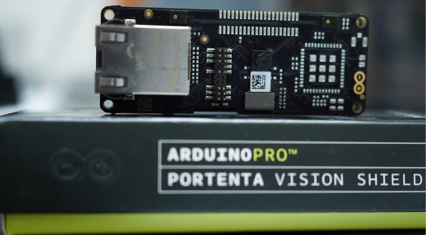
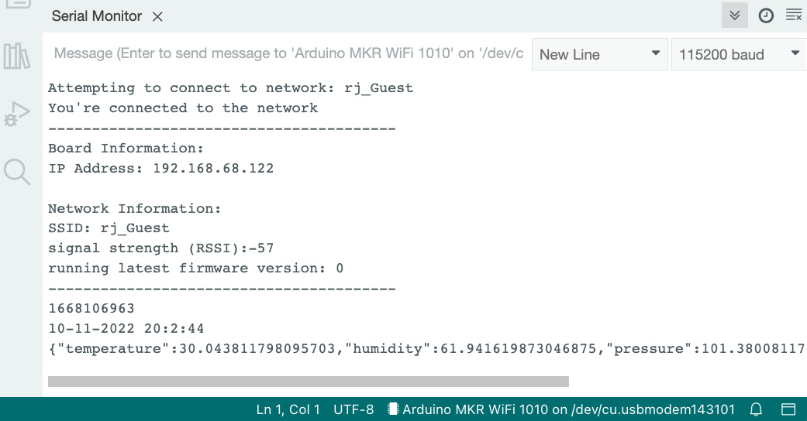

# Prototyping with Shields
In this chapter, you will learn about the sensors that you can work with without having to use a solderless breadboard and cables. When working with breadboards and cables, you might find that something has stopped working because of a loose cable connection. You might also find that you have run out of space on a breadboard. This is where shields come in handy. You will create a project that works with one of these shields: the environment shield. You will also get an introduction to carrier boards and will build a project that makes use of the MKR IoT Carrier. The projects will help build your confidence in collecting data without using breadboards and give you a strong foundation for adding complexity to your setups without worrying about debugging faulty cable connections. By the end of this chapter, you will have written different projects that collect environment data for later use.

In this chapter, we are going to cover the following main topics:

    What is a shield?
    Working with sensor shields
    Discovering other types of shields
    Working with the MKR IoT Carrier

# Technical requirements
The code examples used in this chapter can be found at https://github.com/PacktPublishing/Arduino-Data-Communications/tree/main/chapter-3.

You will also require the following:

    Arduino MKR WiFi 1010
    Arduino MKR ENV Shield (https://docs.arduino.cc/hardware/mkr-env-shield)
    Arduino MKR IoT Carrier (https://docs.arduino.cc/hardware/mkr-iot-carrier)
    Micro-USB cable
    Arduino IDE

# What is a shield?
A shield is a printed circuit board (PCB) that attaches to a microcontroller and gives it additional capabilities that it doesn’t natively ship with. Most shields are the same size as the microcontroller they are meant to work with. An example shield for the Arduino Portenta H7 microcontroller is shown in the following figure:

Figure 3.1 – Arduino Portenta Vision Shield – Ethernet

Shields are meant to be mounted on top of the microcontroller. They receive power from the microcontroller, so they don’t have a power connector. Most shields have stacking headers, so you can mount other shields on top of them.

There is another group of PCBs called carriers.

# What are carriers?
Carriers are boards, but they do not mount onto a microcontroller. Instead, the microcontroller mounts onto the carrier. Carriers provide connectors for plugging other devices into the microcontroller. Arduino currently provides the following carriers for working with the MKR:

    MKR Motor Carrier: You can connect up to four servo motors and four DC motors to this carrier using screw terminals that hold your cables firmly in place. This carrier also comes with an onboard microcontroller so you can offload some processing from the MKR board.
    MKR Connector Carrier: You can connect up to six analog and six digital peripherals to this carrier using Grove connectors. The Grove system was pioneered by Seeed Studio.
    MKR IoT Carrier: You can make use of this carrier to rapidly prototype using a number of onboard sensors. We will make use of this carrier in a project.

Let’s proceed to work with some shields.

# Working with sensor shields
We will work on two projects that measure environmental data and motion data. We will do two new things in these projects:

    Get time from an NTP server so that we have a sense of when exactly we are taking sensor readings. This is useful because it’s important to assign a date and time to any reading that we will be storing.
    Learn to put readings into a format called JSON. JSON is short for JavaScript Object Notation and is a useful format for sending data over the internet.

# Project 1 – Working with the MKR ENV Shield R2
In this project, you will learn to take sensor readings from the Arduino MKR ENV Shield R2. This shield has the following onboard sensors:

    LPS22HP: Atmospheric pressure sensor from ST Microelectronics
    HTS221: Temperature and humidity sensor from ST Microelectronics
    TEMT6000: Light intensity sensor from Vishay
The code for this project is available in the following GitHub repository: https://github.com/PacktPublishing/Arduino-Data-Communications/tree/main/chapter-3/Arduino%20MKR%20WiFi%201010%20ENV%20Shield.

Follow the next steps to attach the shield to the MKR board and read the various sensors:
1. Attach the shield on top of the MKR board while taking care to align the pins.
2. Launch the Arduino IDE.
3. Open the library manager.
4. Search for MKR ENV.
5. Install Arduino_MKRENV by Arduino.
6. Search for and install the UnixTime library.
7. Search for and install the Arduino_JSON library.
8. Search for and install the RTCZero library.
9. Clone the GitHub repository for this project.
10. Open the arduino_secrets.h file. This file contains the credentials for connecting to a wireless network and looks like the following:
```
#define SECRET_SSID ""
#define SECRET_PASS "
```
The first line is the name of the network that you would like to connect to. Put the name between the quote marks.

The second line is the password of the network that you would like to connect to. Put that in between the quote marks.
11. You are ready to verify the code and upload it to the board. Upload the code to the board.
12. Open the Serial terminal and set the baud rate to 115200. You will see output similar to the following after a few seconds:

Figure 3.2 – The output of the firmware

The video showing the code in action is available at https://packt.link/sfncm.

Let’s dissect the output:

    The first line informs you that the MKR board is trying to connect to a Wi-Fi network, and also tells you the name of the network.
    The second line notifies you when the connection is successful.
    The lines between the two dashed lines give you some information about the wireless network that the board is connected to.
    The line showing 1668106963 displays the Unix time or epoch. This is the number of seconds since 1970.
    The next line shows the date and time obtained by converting the Unix time from the previous line.
    The last line shows you all of the environmental readings from the ENV shield. These readings have been put into a JSON object and are subsequently displayed in String format.

Let’s discuss the code in some of these files.

# Understanding Arduino MKR WiFi 1010 ENV Shield.ino
Let’s look at the first 40 lines in this file. As you would expect, this file imports the necessary libraries that will let the microcontroller connect to the Wi-Fi network to read the current time from a server and also take various readings from the ENV shield. The microcontroller outputs all of this information via Serial, and that is what you see in the Serial terminal. Let’s review the code:
1. You will start by importing four header files. All four files are locally defined, and you can inspect their source codes. The code for this is shown here:
```
#include "MyWireless.hpp"
#include "MyNTPClient.hpp"
#include "MyEnv.hpp"
#include "MyClock.hpp"
```
1. MyWireless.hpp gives you the functions required to initialize the Wi-Fi radio and to connect to a wireless radio.
2. MyNTPClient.hpp gives you the functions required to read time from an NTP server.
3. MyEnv.hpp gives you the functions required to read the sensor values from the ENV shield.
4. MyClock.hpp gives you a real-time clock. This will let you set and keep the time and is useful for knowing when exactly you are taking a reading.
2. In the next line, we define a variable, status, which keeps track of the connection status of the Wi-Fi module. This is shown in the code section here:
```
int status = MyWireless::getIdleStatus();
```
3. Next, we define lastMillis with a type of auto. The type will be inferred from the return type of millis(), which tells us how many milliseconds the microcontroller has been running for and is useful for measuring intervals. We also define a constant, myDelay, which determines how many seconds our interval will last. These two lines are shown here:
```
auto lastMillis = millis();
const int myDelay = 5000;
```
4. Next, we define an instance of MyClock, which we call rtc. This instance, or object, will let us set the current time and then get the time whenever we need it. This line of code is shown here:
```
MyClock::MyClock rtc = MyClock::MyClock();
```
5. Within the setup() function, we connect to the Serial terminal and specify a baud rate of 115200. The function will pause until the terminal is opened from the Arduino IDE. This code snippet is shown here:
```
Serial.begin(115200);
  while (!Serial);
  ```
  6. Still within the setup() function, after the Serial terminal has been opened, the function proceeds to attempt a connection to the wireless network. It tries this every 10 seconds until the connection succeeds. This code snippet is shown here:
```
while (status != MyWireless::getConnectedStatus()) {
    Serial.print("Attempting to connect to network: ");
    Serial.println(MyWireless::get_ssid());
    status = MyWireless::initialize();
    delay(10000);
  }
```
7. After establishing a connection, the microcontroller will attempt to initialize the NTP client and get the current time from an NTP server. This is shown in the following lines of code:
```
MyNTPClient::initialize();
  unsigned long currentTime = MyNTPClient::getUnixTime();
  if(!rtc.initialize(currentTime)) {
    Serial.println("Unable to initialize the Realtime Clock, aborting ...");
    while(1);
  }
  ```
8. After getting the current time, the microcontroller will attempt to initialize the ENV shield:
```
if(!MyEnv::initialize()) {
    Serial.println("Couldn't initialize the ENV Shield, halting");
    while(1);
  }
```
9. If the microcontroller succeeds in all of the preceding steps, it will proceed to print out information to the Serial terminal. This code snippet is shown here:
```
Serial.println("You're connected to the network");
  Serial.println("----------------------------------------");
  printData();
  Serial.println("----------------------------------------");
  Serial.print("NTP Unix Time: ");
  Serial.println(currentTime);
 Serial.println(MyNTPClient::getTimeFromUnix(currentTime));
  Serial.print("RTC Unix Time: ");
  Serial.println(rtc.getEpochs());
  Serial.println(rtc.getWATDateTime());
  lastMillis = millis();
  Serial.println(MyEnv::getReadings(currentTime));
```
# Understanding MyWireless.hpp
This header file defines functions that make it possible to control the Wi-Fi module on the microcontroller. Here is a quick look at the code:
```
#pragma once
#include <Arduino.h>
namespace MyWireless {
  int initialize();
  int getStatus();
  int getIdleStatus();
  int getConnectedStatus();
  IPAddress getLocalIp();
  String getSSID();
  String get_ssid();
  long getRSSI();
  bool isOnLatestFirmware();
}
```
Here is a brief explanation of the functions:

    initialize(): Use this function to initiate a connection to the wireless network.
    getStatus(): This returns the status of the Wi-Fi module, whether it is connected or not.
    getIdleStatus(): This returns the value of an IDLE status, so we can check whether the Wi-Fi module is not connected.
    getConnectedStatus(): This returns the value of a CONNECTED status, so we can check whether the Wi-Fi module is connected to a wireless network.
    getLocalIp(), getSSID(), and getRSSI(): These return details from the Wi-Fi module such as the IP address that was assigned to the microcontroller and the signal strength.
    isOnLatestFirmware(): This informs the user whether the MKR board is running the latest Wi-Fi firmware. This is useful for knowing when to update the firmware.

The Wi-Fi module has many capabilities, but we will not be exploring them for now.

# Understanding MyNTPClient.hpp
This header file defines functions that are useful for getting the time from a Network Time Protocol (NTP) server. The time is sent back as the number of seconds since 1900. We then subtract 70 years in seconds from this value to get Unix time, also known as epochs. This operation is handled by the getUnixTime() function. Unix time is a popular format and there are websites that you can use to convert Unix time to date and time. In our code, the getTimeFromUnix() function gives us this information. The Unix time, or date and time, is useful for knowing when you collected sensor data. The code in the header file is shown here:
```
#pragma once
#include <Arduino.h>
namespace MyNTPClient {
  void initialize();
  unsigned long getUnixTime();
  unsigned long sendNTPpacket(IPAddress& address);
  String getTimeFromUnix(unsigned long unixTime);
}
```
# Understanding MyEnv.hpp
This header file provides functions for reading sensor data. The initialize() function starts the sensors, while getTemp(), getHumid(), getPressure(), and getLux() return the temperature, humidity, pressure, and illuminance, respectively. The getJSONReadings() function returns all of the readings for temperature, humidity, pressure, and illuminance as a JSON object. The JSON object that is returned looks like the following:
```
{
  "unixTime": 1668205306,
  "temperature": 27.833511352539062,
  "humidity": 53.654937744140625,
  "pressure": 101.5428237915039,
  "illuminance": 12.903225898742676
}
```
The final function, getReadings(), returns the result in the String format. This time, the result is returned on one line, as you would have seen in Figure 3.2.

# Discovering other types of shields
Arduino provides various shields. Let’s place some of these in categories.

Providing additional connectivity

MKR boards come in different variants, providing different connectivity options. One popular connectivity option is Wi-Fi. There are other connectivity options that you will not find as MKR boards, but you can get a shield for some of these:

    The MKR ETH Shield will let you plug an Ethernet cable into your MKR board. This is useful for environments where wireless signals would interfere with the operation of other machinery, such as in a medical setting. This shield also provides an SD card slot for data logging purposes.
    The MKR 485 Shield will let you connect to a legacy industrial system and communicate with it. This shield lets you implement communications using the serial protocol.

# Communicating with automobiles
The MKR CAN Shield will let you connect to the brains of an automobile using something called a Controller Area Network. You can make use of this connection to control sensors and displays, or to read data from sensors within the automotive space.
# Outputting information
The MKR RGB Shield provides a dense way of outputting information in the absence of an actual screen. It comes with an array of RGB LEDs arranged in 7 rows and 12 columns.

# Providing expansion
A number of shields will let you expand the storage on the MKR board or solder additional components. These include the following:

    The MKR MEM Shield provides an additional 2 MB flash memory as well as SD card storage for any MKR board. It also provides a prototyping area, so you can solder on sensors, actuators, or motors.
    The MKR SD Proto Shield provides an SD card slot as well as the prototyping area, without the flash storage.
    The MKR Proto Shield provides a prototyping area, so you can solder on any sensors, actuators, or screens.

# Motion sensing
The MKR IMU Shield provides a nine-axis inertial measurement unit for measuring accelerometer, gyroscope, and magnetometer information. This is useful for measuring different things from activity on a shipping crate to earth tremors at a location of interest. You can also use this to build a motion controller.

# Geolocation
The MKR GPS Shield utilizes various satellites to provide location information. This shield is useful in applications where you need to track the location of items such as vehicles and shipping containers.

We have had a brief discussion of shields, so let’s proceed to discuss the MKR IoT Carrier, which provides additional capabilities.


