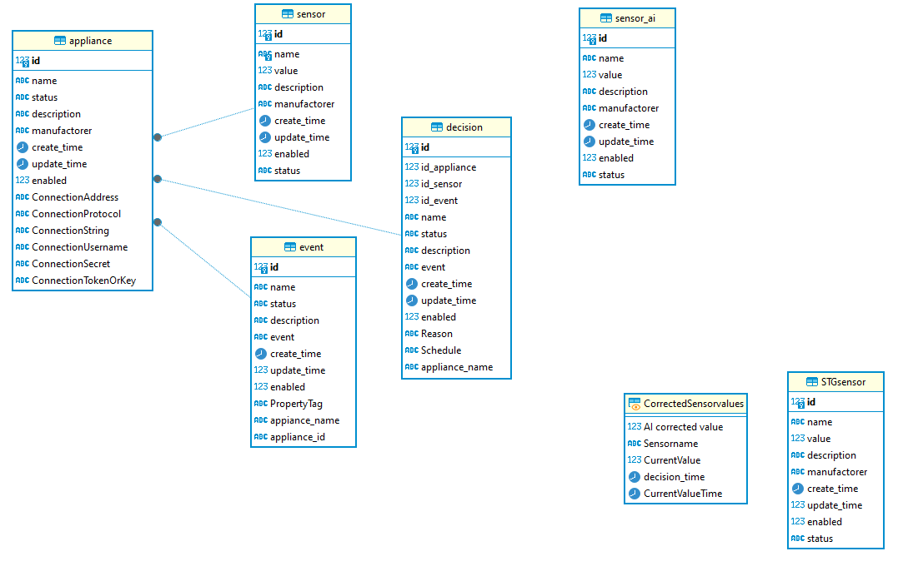

# mySQL db

*Don't expect to find any Nodered flow JSON's here to download until I have done full testing :)*
This implementation is done with all my experience with several decades of data engineer & data architect work in complex production systems. I'm following very tight security and best practise quidance and strict cloud dependencies policys. Everything must work even if there is not internet connection. Naturally cloud AI and some other online features can be automatically off - for a moment or longer period of time.


*Iteration 2*

## Description of this iteration:

### Appliance table
This holds a house device like washing machine etc or a AC or heatpump basic information. Connection prefixed fields holds needed information to connect the device for reading or writing a data. For example connection protocol is something like ModbusSerial, ModbusTCP, MQTT or more convinient REST API if available/implemented. All in LAN.

### Sensor table
Related table with Appliance, holds possible many endpoints / sensors in that appliance and a current value. Value depends on the sensor. It may be something like %, mV, Celsius etc. depends on purpose. That purpose and unit is also what is classification and is used to dataprofiling. Profiled data is simply executed all the time when sensor data is transferred to cloud - for AI to do some clever things to it :
#### Nodered ETL process


#### SQL for this profiling and classification
``` 
SELECT name
	,value
	,description
	,manufactorer
	,create_time
	,CURRENT_TIMESTAMP AS update_time
	,1 enabled
	,'Active' STATUS
	,'mySQLOnPrem' AS source
	,'humidy' AS measure_type
FROM `sensor`
WHERE description = '%'
	AND name LIKE '%humidity%'

UNION ALL

SELECT name
	,value
	,description
	,manufactorer
	,create_time
	,CURRENT_TIMESTAMP AS update_time
	,1 enabled
	,'Activve' STATUS
	,'mySQLOnPrem' AS source
	,'batterylevel' AS measure_type
FROM `sensor`
WHERE description = '%'
	AND name LIKE '%battery%'

UNION ALL

SELECT name
	,value
	,description
	,'Apple' manufactorer
	,create_time
	,CURRENT_TIMESTAMP AS update_time
	,1 enabled
	,'Active' STATUS
	,'mySQLOnPrem' AS source
	,'storege % left' AS measure_type
FROM `sensor`
WHERE description = '% available'
	AND name LIKE '%storage%'

UNION ALL

SELECT name
	,value
	,description
	,'' manufactorer
	,create_time
	,CURRENT_TIMESTAMP AS update_time
	,1 enabled
	,'Active' STATUS
	,'mySQLOnPrem' AS source
	,'Consumption Power reading' AS measure_type
FROM `sensor`
WHERE description = 'W'

UNION ALL

SELECT name
	,value
	,description
	,'' manufactorer
	,create_time
	,CURRENT_TIMESTAMP AS update_time
	,1 enabled
	,'Active' STATUS
	,'mySQLOnPrem' AS source
	,'Noise dB' AS measure_type
FROM `sensor`
WHERE description = 'dB'

UNION ALL

SELECT name
	,value
	,description
	,'' manufactorer
	,create_time
	,CURRENT_TIMESTAMP AS update_time
	,1 enabled
	,'Active' STATUS
	,'mySQLOnPrem' AS source
	,'Noise dB' AS measure_type
FROM `sensor`
WHERE description = 'floors'

UNION ALL

SELECT name
	,value
	,description
	,'' manufactorer
	,create_time
	,CURRENT_TIMESTAMP AS update_time
	,1 enabled
	,'Active' STATUS
	,'mySQLOnPrem' AS source
	,'Temperature Celsius' AS measure_type
FROM `sensor`
WHERE description = '°C'

UNION ALL

SELECT name
	,value
	,description
	,'' manufactorer
	,create_time
	,CURRENT_TIMESTAMP AS update_time
	,1 enabled
	,'Active' STATUS
	,'mySQLOnPrem' AS source
	,'Pressure' AS measure_type
FROM `sensor`
WHERE description = 'hPa'

UNION ALL

SELECT name
	,value
	,description
	,'' manufactorer
	,create_time
	,CURRENT_TIMESTAMP AS update_time
	,1 enabled
	,'Active' STATUS
	,'mySQLOnPrem' AS source
	,'Wind' AS measure_type
FROM `sensor`
WHERE description = 'km/h'

UNION ALL

SELECT name
	,value
	,description
	,'' manufactorer
	,create_time
	,CURRENT_TIMESTAMP AS update_time
	,1 enabled
	,'Active' STATUS
	,'mySQLOnPrem' AS source
	,'Distance' AS measure_type
FROM `sensor`
WHERE description = 'm'

UNION ALL

SELECT name
	,value
	,description
	,'' manufactorer
	,create_time
	,CURRENT_TIMESTAMP AS update_time
	,1 enabled
	,'Active' STATUS
	,'mySQLOnPrem' AS source
	,'Battery voltage left' AS measure_type
FROM `sensor`
WHERE description = 'mV'

UNION ALL

SELECT name
	,value
	,description
	,'' manufactorer
	,create_time
	,CURRENT_TIMESTAMP AS update_time
	,1 enabled
	,'Active' STATUS
	,'mySQLOnPrem' AS source
	,'Person Activity' AS measure_type
FROM `sensor`
WHERE description = 'steps'

UNION ALL

SELECT name
	,value
	,description
	,'' manufactorer
	,create_time
	,CURRENT_TIMESTAMP AS update_time
	,1 enabled
	,'Active' STATUS
	,'mySQLOnPrem' AS source
	,'co2' AS measure_type
FROM `sensor`
WHERE description = 'ppm'

UNION ALL

SELECT name
	,value
	,description
	,'' manufactorer
	,create_time
	,CURRENT_TIMESTAMP AS update_time
	,1 enabled
	,'Active' STATUS
	,'mySQLOnPrem' AS source
	,'Sun azimuth or Sun elevation' AS measure_type
FROM `sensor`
WHERE description = '°'

UNION ALL

SELECT name
	,value
	,description
	,manufactorer
	,create_time
	,CURRENT_TIMESTAMP AS update_time
	,'1' enabled
	,'Active' STATUS
	,'mySQLOnPrem' AS source
	,'Not profiled' AS measure_type
FROM `sensor`
WHERE description <> '%'
	AND description <> '% available'
	AND description <> 'W'
	AND description <> 'dB'
	AND description <> 'floors'
	AND description <> '°C'
	AND description <> 'hPa'
	AND description <> 'km/h'
	AND description <> 'm'
	AND description <> 'mV'
	AND description <> 'steps'
	AND description <> 'ppm'
	AND description <> '°'
ORDER BY 10
```
### Event table
Holds the events of change. Example Bathroom temperature is too low or too high. That subject relates to table decision, what describes the actual change action needed - based on AI recomendation, or if there isn't one (or it's same as current value) let the current value be a valid. Which means the event of change is 'none', based on decision 'do not change value'.
The field 'propertytag' holds the information which profiled classification valuetype is valid on this sensor. This can be something like : 'Temperature or Humidity' depends what sensor and even and decision says.

### Decision
Desribes and holds the reason for a change. It is directly from sensor data and even table. If AI data is updated later that event table data, only then AI altered data will be compared with the current value. Offline version of the AI data lives in sensor_ai table

### Sensor_ai table
Latest AI services data. It's used only is is it more recent than the current one. (Check the logic in the tests)

## Cloud transfer ETL (there and back)

### Sensor data from local mySQL To cloud SQL Server(NodeRed ETL)


### Sensor data From cloud SQL Server to local mySQL (NodeRed ETL)
