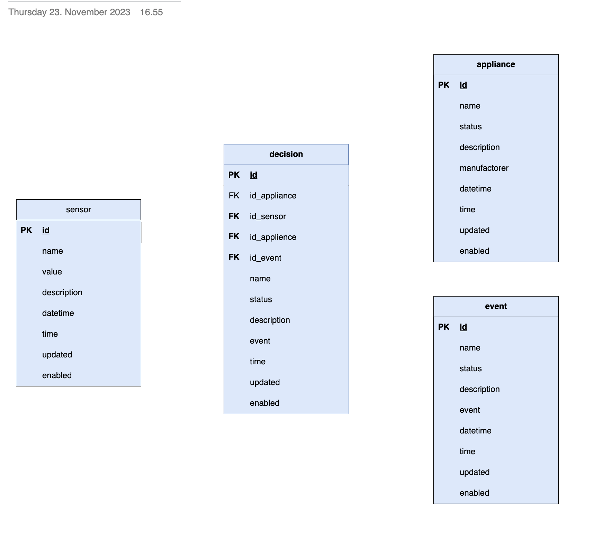

# Here the first idea is to have short time data storage

on tests, I realized that sensor table is most actively used by automation logic. It how ever needs to have a companion table like sensor_ai. It's counter part and a copy is living in the cloud for AI purposes. 
Also, data profile must be created in it's initial form and that way that it will work based on that init version - even when new sensors are esposed.
This prorile work is done and schema will be changed according that. 

Event table will be needed to describe how sensor, sensor_ai and possible corrected sensor values table or original sensor table is used. Event table is really very good list of use cases!
