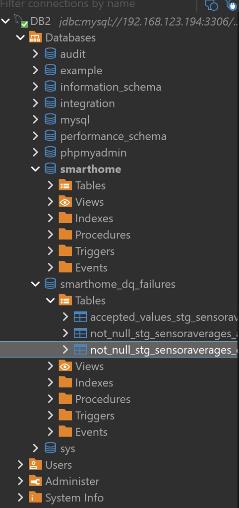

# A complete, warehouse-native dbt pattern that delivers:
Below is a complete, warehouse-native dbt pattern that delivers:

- Data standardization as views (timestamps/epoch, numeric precision, string normalization)

- DQ execution “run counter” + KPI metrics (passed/failed tests per run, durations)

- DQ defect statistics (accepted vs defect counts) using stored failures

- Reporting views for dashboards (Power BI/Grafana-style KPIs)

It is designed to work for both SQL Server and MariaDB via adapter-dispatched macros (noting that MariaDB has no varchar(max), so the closest equivalent is typically LONGTEXT). 

Attention!
Datatypes in data standardization is, by default a bit off. LONGTEXT and BIGINT types does not translate correctly with MariaDb (mySQL dbt connector). BIGINT must be INT and LONGTEXT must be varchar(2000). Othervice, it does not work at all. Another bug - prehaps with Dbt mysql/mariadb connector - may be CTE/WITH capabilities with views. I'll work only when materialized as table.

## 1) Target architecture (dbt-native)
### A. Standardization layer (views)

Create stg_* standardized views on top of raw_*, work_*, curated_* tables/files:

- Canonical timestamp columns (datetime, epoch, “short”)

- Numeric cast to consistent types/precision

- Strings normalized to “varchar(max)-equivalent”
### B. DQ layer (tests + stored failures)

- Use dbt tests (not_null, unique, accepted_values, relationships, custom tests)

- Enable store_failures so dbt persists failing rows to the warehouse

- Create DQ report views that aggregate those failure tables into defect counts
### C. Audit layer (run counter + KPI)

- Use dbt hooks on-run-start / on-run-end to write:

  - audit.dbt_run (one row per dbt invocation)

  - audit.dbt_result (one row per model/test result)

- Build reporting views:

  - “Latest run KPI”

  - KPI by day/week

  - Failures by test/model/column
## 2) dbt_project.yml (core settings)
```
name: dw
version: 1.0.0
config-version: 2

model-paths: ["models"]
macro-paths: ["macros"]
test-paths: ["tests"]

models:
  dw:
    +materialized: view   # default: views (standardization first)
    staging:
      +schema: stg
    dq:
      +schema: dq
    audit:
      +schema: audit
      +materialized: table

tests:
  +store_failures: true   # critical for defect counts
  +schema: dq_failures    # schema where failure tables land (adapter dependent naming)

on-run-start:
  - "{{ dq_init_audit() }}"
  - "{{ dq_log_run_start() }}"

on-run-end:
  - "{{ dq_log_run_end(results) }}"
  - "{{ dq_log_results(results) }}"
```
Notes:

- +store_failures: true lets you compute defects vs accepted from actual failing rows.

- Audit models are tables; your DQ reporting is primarily views.
## 3) Cross-warehouse standard types (macros)

Create macros/standard_types.sql:
````

  {{ return(adapter.dispatch('std_string')()) }}



  {{ return(adapter.dispatch('std_decimal')(p, s)) }}



  {{ return(adapter.dispatch('std_float')()) }}



  {{ return(adapter.dispatch('std_int')()) }}



  {{ return(adapter.dispatch('std_datetime')()) }}

````
Create macros/standard_types__sqlserver.sql:
```
 varchar(max) 
 decimal({{p}}, {{s}}) 
 float 
 bigint 
 datetime2(0) 
```
Create macros/standard_types__mysql.sql (MariaDB uses mysql adapter):
````
 longtext 
 decimal({{p}}, {{s}}) 
 double 
 bigint 
 datetime 
````
Attention ! move sql server versions to disabled macros folder. Othervice thay are scanned and will cause synatax errors on build!
## 4) Timestamp + epoch standardization (macros)

Create macros/standard_datetime.sql:
````

  {{ return(adapter.dispatch('ts_from_epoch_seconds')(epoch_expr)) }}



  {{ return(adapter.dispatch('epoch_seconds_from_ts')(ts_expr)) }}

````
macros/standard_datetime__sqlserver.sql:
````

  dateadd(second, {{ epoch_expr }}, convert(datetime2(0), '1970-01-01', 120))



  datediff(second, convert(datetime2(0), '1970-01-01', 120), {{ ts_expr }})

````
macros/standard_datetime__mysql.sql:
````

  from_unixtime({{ epoch_expr }})



  unix_timestamp({{ ts_expr }})

````
## 5) Standardized staging view example (sensor averages)

Example model: models/staging/stg_sensoraverages.sql (materialized as view)
````
with src as (
  select
    -- Source columns (adjust to your actual layer)
    time as time_raw,
    friendly_name,
    location,
    room,
    avg_value,
    measurement,
    entity_id,
    domain,
    precise_location,
    source,
    inserted as inserted_raw,

    building,
    comment,
    RAWClassification_Tag,
    RAWLifecycleName

  from {{ ref('curated_sensoraverages') }}
),

std as (
  select
    /* Canonical timestamps */
    cast(time_raw as {{ std_datetime() }})                            as measurement_time,
    cast({{ epoch_seconds_from_ts("cast(time_raw as " ~ std_datetime() ~ ")") }} as {{ std_int() }}) as measurement_time_epoch,

    /* “Short” timestamp (minute-grain) */
    {{ adapter.dispatch('dt_short_minute')("cast(time_raw as " ~ std_datetime() ~ ")") }} as measurement_time_short,

    /* Date parts */
    {{ adapter.dispatch('dt_year')("cast(time_raw as " ~ std_datetime() ~ ")") }}  as datetime_year,
    {{ adapter.dispatch('dt_month')("cast(time_raw as " ~ std_datetime() ~ ")") }} as datetime_month,
    {{ adapter.dispatch('dt_week')("cast(time_raw as " ~ std_datetime() ~ ")") }}  as datetime_week,
    {{ adapter.dispatch('dt_day')("cast(time_raw as " ~ std_datetime() ~ ")") }}   as datetime_day,
    {{ adapter.dispatch('dt_hour')("cast(time_raw as " ~ std_datetime() ~ ")") }}  as datetime_hour,
    {{ adapter.dispatch('dt_min')("cast(time_raw as " ~ std_datetime() ~ ")") }}   as datetime_min,
    {{ adapter.dispatch('dt_sec')("cast(time_raw as " ~ std_datetime() ~ ")") }}   as datetime_sec,

    /* Strings standardized (varchar(max) / longtext equivalent) */
    cast(trim(friendly_name) as {{ std_string() }})   as friendly_name,
    cast(trim(location) as {{ std_string() }})        as location,
    cast(trim(room) as {{ std_string() }})            as room,
    cast(trim(precise_location) as {{ std_string() }}) as precise_location,
    cast(trim(domain) as {{ std_string() }})          as domain,
    cast(trim(entity_id) as {{ std_string() }})       as entity_id,
    cast(trim(measurement) as {{ std_string() }})     as measurement,
    cast(trim(source) as {{ std_string() }})          as source,

    /* Numeric standardization */
    cast(avg_value as {{ std_decimal(18,6) }})        as avg_value,

    /* Lifecycle/audit passthrough */
    cast(inserted_raw as {{ std_datetime() }})        as inserted_at_raw,
    cast(trim(building) as {{ std_string() }})        as building,
    cast(trim(comment) as {{ std_string() }})         as comment,
    cast(trim(RAWClassification_Tag) as {{ std_string() }}) as raw_classification_tag,
    cast(trim(RAWLifecycleName) as {{ std_string() }})      as lifecycle_name

  from src
)

select * from std;
````
You will need the small adapter helpers for date parts; add these:

macros/dateparts.sql:
````
 {{ return(adapter.dispatch('dt_year')(ts_expr)) }} 
 {{ return(adapter.dispatch('dt_month')(ts_expr)) }} 
 {{ return(adapter.dispatch('dt_week')(ts_expr)) }} 
 {{ return(adapter.dispatch('dt_day')(ts_expr)) }} 
 {{ return(adapter.dispatch('dt_hour')(ts_expr)) }} 
 {{ return(adapter.dispatch('dt_min')(ts_expr)) }} 
 {{ return(adapter.dispatch('dt_sec')(ts_expr)) }} 
 {{ return(adapter.dispatch('dt_short_minute')(ts_expr)) }} 
````
macros/dateparts__sqlserver.sql:
````
 datepart(year, {{ ts_expr }}) 
 datepart(month, {{ ts_expr }}) 
 datepart(iso_week, {{ ts_expr }}) 
 datepart(day, {{ ts_expr }}) 
 datepart(hour, {{ ts_expr }}) 
 datepart(minute, {{ ts_expr }}) 
 datepart(second, {{ ts_expr }}) 

  dateadd(minute, datediff(minute, convert(datetime2(0),'1970-01-01',120), {{ ts_expr }}), convert(datetime2(0),'1970-01-01',120))

````
macros/dateparts__mysql.sql:
````
 year({{ ts_expr }}) 
 month({{ ts_expr }}) 
 week({{ ts_expr }}, 3) 
 day({{ ts_expr }}) 
 hour({{ ts_expr }}) 
 minute({{ ts_expr }}) 
 second({{ ts_expr }}) 
 date_format({{ ts_expr }}, '%Y-%m-%d %H:%i:00') 
````
## 6) DQ tests with stored failures (counts of defects)

In models/staging/stg_sensoraverages.yml:
````
version: 2

models:
  - name: stg_sensoraverages
    columns:
      - name: measurement_time
        tests:
          - not_null

      - name: entity_id
        tests:
          - not_null

      - name: avg_value
        tests:
          - not_null
          - dbt_utils.accepted_range:
              min_value: 0
              max_value: 1000000

      - name: domain
        tests:
          - accepted_values:
              values: ['sensor', 'binary', 'climate', 'switch', 'light']
              quote: true
              severity: warn
````
Key point: with store_failures: true, each failing test produces a failure table in dq_failures (naming depends on adapter and dbt version). That gives you row-level defects to count and profile.
## 7) Audit tables + run counter (KPI)

Create macros/dq_audit.sql:
````

  {{ return(adapter.dispatch('dq_init_audit')()) }}



  {{ return(adapter.dispatch('dq_log_run_start')()) }}



  {{ return(adapter.dispatch('dq_log_run_end')(results)) }}



  {{ return(adapter.dispatch('dq_log_results')(results)) }}

````
## SQL Server implementation

macros/dq_audit__sqlserver.sql:
````

  
  

  

  

  



  



  
  
  
  
  

  
    
    
    
    
    
  

  

  



  
    
    
  

````
## MariaDB implementation

macros/dq_audit__mysql.sql:
````

  

  

  



  



  
  
  
  
  

  
    
    
    
    
    
  

  

  



  
    
    
  

````

This produces the DQ execution counter and per-result logging per run.
## 8) DQ reporting views (KPI + defects)
### A. KPI view: latest execution

models/dq/vw_dq_kpi_latest.sql (view):
````
select
  r.invocation_id,
  r.target_name,
  r.started_at,
  r.ended_at,
  r.status,
  r.total_results,
  r.passed,
  r.failed,
  r.errored,
  r.warned
from {{ source('audit', 'dbt_run') }} r
qualify 1 = 1

  -- SQL Server: emulate latest row

````
Because QUALIFY is not portable, prefer a portable pattern:
````
with x as (
  select *
  from {{ ref('audit_dbt_run') }} -- if you expose as a model; otherwise use fully qualified
),
m as (
  select max(started_at) as max_started_at from x
)
select x.*
from x
join m on x.started_at = m.max_started_at;
````
(Implement as needed in your project—portability depends on how you expose audit.dbt_run.)
### B. KPI by day

models/dq/vw_dq_kpi_by_day.sql:
````
select
  cast(started_at as date) as run_date,
  count(*) as runs,
  sum(case when status='success' then 1 else 0 end) as successful_runs,
  sum(case when status='failed' then 1 else 0 end) as failed_runs,
  sum(passed) as tests_passed,
  sum(failed) as tests_failed,
  sum(errored) as tests_errored,
  sum(warned) as tests_warned
from audit.dbt_run
group by cast(started_at as date);
````
## C. Defect counts (from stored failures)

Create a view that unions failure tables. Because dbt names these tables based on test unique_id, the most robust approach is:

- Tag your tests, and/or

- Build a “failure registry” model (manual or generated) listing failure table names.

A practical approach: create custom singular “dq metrics” models that compute defect counts directly from your standardized views (this is the most portable).

Example: models/dq/dq_sensoraverages_metrics.sql (view)
````
select
  '{{ invocation_id }}' as invocation_id,
  'stg_sensoraverages' as model_name,
  'avg_value_nonnegative' as check_name,
  count(*) as total_rows,
  sum(case when avg_value >= 0 then 1 else 0 end) as accepted_count,
  sum(case when avg_value < 0 then 1 else 0 end) as defect_count
from {{ ref('stg_sensoraverages') }};
````
Then build KPI views on top of these metric models:

- defect rate = defect_count / total_rows

- accepted rate = accepted_count / total_rows

This avoids adapter-specific failure-table naming and gives you the “accepted vs defects” stats you asked for, consistently.
## 9) How to run (recommended commands)

- Standardization + tests + metrics (end-to-end):
````
dbt build --select models/staging+ models/dq+ --target dev
````
- DQ only (tests + metrics):
````
dbt test --select tag:dq --target dev
dbt run  --select models/dq+ --target dev
````
## 10) What you get (deliverables)

- Standardization views (stg_*) with consistent:

  - measurement_time (datetime)

  - measurement_time_epoch (int/bigint)

  - date parts

  - numeric precision

  - string type normalization (varchar(max) / longtext equivalent)

- Run counter + KPI tables:

  - audit.dbt_run (one row per invocation)

  - audit.dbt_result (one row per test/model result)

- DQ reporting views (for Power BI / Grafana):

  - latest run KPI

  - KPI by day/week

  - DQ metric views (accepted/defect counts, defect rate)

# Adapt the examples explicitly to your naming 
(raw_sensoraverages, work_sensoraverages, curated_sensoraverages, md_sensor_reading) and produce a ready-to-drop folder tree (models/, macros/, tests/) that matches your existing project conventions (schemas, tags, and your lifecycle columns).

dbt “standardization + data quality + KPI run-counter” solution tailored to your RAW → WORK → CURATED → md_sensor_reading flow, with an alternate md_sensor_reading_from_work path (intentionally skipping CURATED). It is designed to run on MariaDB (dbt-mysql adapter) and SQL Server (dbt-sqlserver adapter) using adapter.dispatch() macros.

## 1) Folder structure
````
.
├── dbt_project.yml
├── packages.yml
├── macros
│   ├── dateparts.sql
│   ├── dateparts__mysql.sql
│   ├── dateparts__sqlserver.sql
│   ├── dq_audit.sql
│   ├── dq_audit__mysql.sql
│   ├── dq_audit__sqlserver.sql
│   ├── standard_datetime.sql
│   ├── standard_datetime__mysql.sql
│   ├── standard_datetime__sqlserver.sql
│   ├── standard_types.sql
│   ├── standard_types__mysql.sql
│   ├── standard_types__sqlserver.sql
│   ├── string_utils.sql
│   ├── string_utils__mysql.sql
│   └── string_utils__sqlserver.sql
└── models
    ├── sources
    │   └── smarthome_sources.yml
    ├── staging
    │   ├── stg_raw_sensoraverages.sql
    │   ├── stg_work_sensoraverages.sql
    │   ├── stg_curated_sensoraverages.sql
    │   └── stg_sensoraverages.yml
    ├── marts
    │   ├── md_sensor_reading.sql
    │   ├── md_sensor_reading_from_work.sql
    │   └── md_sensor_reading.yml
    └── dq
        ├── dq_md_sensor_reading_metrics.sql
        ├── dq_kpi_latest.sql
        ├── dq_kpi_by_day.sql
        └── dq_views.yml
````
## 2) Core config
dbt_project.yml
````
name: smarthome_dw
version: 1.0.0
config-version: 2

model-paths: ["models"]
macro-paths: ["macros"]
test-paths: ["tests"]

vars:
  # IMPORTANT:
  # - MariaDB: set source_schema to your database name (e.g. "smarthome")
  # - SQL Server: set source_schema to your schema name (e.g. "dbo" or "smarthome")
  source_schema: "smarthome"

models:
  smarthome_dw:
    +materialized: view
    staging:
      +schema: stg
    marts:
      +schema: mart
    dq:
      +schema: dq
    audit:
      +schema: audit
      +materialized: table

tests:
  +store_failures: true
  +schema: dq_failures

on-run-start:
  - "{{ dq_init_audit() }}"
  - "{{ dq_log_run_start() }}"

on-run-end:
  - "{{ dq_log_run_end(results) }}"
  - "{{ dq_log_results(results) }}"
````
packages.yml:
````
packages:
  - package: dbt-labs/dbt_utils
    version: 1.1.1
````
## 3) Cross-warehouse standardization macros
macros/standard_types.sql
````

  {{ return(adapter.dispatch('std_string')()) }}



  {{ return(adapter.dispatch('std_decimal')(p, s)) }}



  {{ return(adapter.dispatch('std_float')()) }}



  {{ return(adapter.dispatch('std_int')()) }}



  {{ return(adapter.dispatch('std_datetime')()) }}

````
macros/standard_types__sqlserver.sql
````
 varchar(max) 
 decimal({{p}}, {{s}}) 
 float 
 bigint 
 datetime2(0) 
````
macros/standard_types__mysql.sql (MariaDB) - change LONGTEXT to VARCHAR(2000)
````
 longtext 
 decimal({{p}}, {{s}}) 
 double 
 bigint 
 datetime 
````
Like this:
````
 varchar(2000) 
 decimal({{p}}, {{s}}) 
 double 
 INT 
 datetime 
```
## 4) Timestamp + epoch macros
macros/standard_datetime.sql (check the BIGINT = INT - in earlier macros)
````

  {{ return(adapter.dispatch('ts_from_epoch_seconds')(epoch_expr)) }}



  {{ return(adapter.dispatch('epoch_seconds_from_ts')(ts_expr)) }}

````
macros/standard_datetime__sqlserver.sql
````

  dateadd(second, {{ epoch_expr }}, convert(datetime2(0), '1970-01-01', 120))



  datediff(second, convert(datetime2(0), '1970-01-01', 120), {{ ts_expr }})

````
macros/standard_datetime__mysql.sql
```

  from_unixtime({{ epoch_expr }})



  unix_timestamp({{ ts_expr }})

````
## 5) Date-part macros 
(year/month/week/day/hour/min/sec + “short minute”)
macros/dateparts.sql
```
 {{ return(adapter.dispatch('dt_year')(ts_expr)) }} 
 {{ return(adapter.dispatch('dt_month')(ts_expr)) }} 
 {{ return(adapter.dispatch('dt_week')(ts_expr)) }} 
 {{ return(adapter.dispatch('dt_day')(ts_expr)) }} 
 {{ return(adapter.dispatch('dt_hour')(ts_expr)) }} 
 {{ return(adapter.dispatch('dt_min')(ts_expr)) }} 
 {{ return(adapter.dispatch('dt_sec')(ts_expr)) }} 
 {{ return(adapter.dispatch('dt_short_minute')(ts_expr)) }} 
```
macros/dateparts__sqlserver.sql
````
 datepart(year, {{ ts_expr }}) 
 datepart(month, {{ ts_expr }}) 
 datepart(iso_week, {{ ts_expr }}) 
 datepart(day, {{ ts_expr }}) 
 datepart(hour, {{ ts_expr }}) 
 datepart(minute, {{ ts_expr }}) 
 datepart(second, {{ ts_expr }}) 


  dateadd(
    minute,
    datediff(minute, convert(datetime2(0),'1970-01-01',120), {{ ts_expr }}),
    convert(datetime2(0),'1970-01-01',120)
  )

````
macros/dateparts__mysql.sql
````
 year({{ ts_expr }}) 
 month({{ ts_expr }}) 
 week({{ ts_expr }}, 3) 
 day({{ ts_expr }}) 
 hour({{ ts_expr }}) 
 minute({{ ts_expr }}) 
 second({{ ts_expr }}) 
 date_format({{ ts_expr }}, '%Y-%m-%d %H:%i:00') 
````
## 6) String normalization macros (trim + “null if blank”)
macros/string_utils.sql
````

  {{ return(adapter.dispatch('std_trim')(expr)) }}



  {{ return(adapter.dispatch('null_if_blank')(expr)) }}

````
macros/string_utils__sqlserver.sql
````

  ltrim(rtrim({{ expr }}))



  nullif(ltrim(rtrim({{ expr }})), '')

````
macros/string_utils__mysql.sql
````

  trim({{ expr }})



  nullif(trim({{ expr }}), '')

````
## 7) Sources (RAW/WORK/CURATED)
models/sources/smarthome_sources.yml
This part causes issues in MariaDb. Change database, source schema & target schema so that Dbt does not create a new database!
````
version: 2

sources:
  - name: smarthome
    database: "{{ target.database }}"
    schema: "{{ var('source_schema', target.schema) }}"
    tables:
      - name: raw_sensoraverages
      - name: work_sensoraverages
      - name: curated_sensoraverages
````

## 8) Standardization staging views (RAW/WORK/CURATED)

These standardize datatypes and normalize strings consistently across both warehouses.

RE-CHECK THESE! DOES NOT LOOK OK !
models/staging/stg_raw_sensoraverages.sql

````
with src as (
  select *
  from {{ source('smarthome', 'raw_sensoraverages') }}
),
std as (
  select
    cast(time as {{ std_datetime() }}) as measurement_time,
    cast({{ epoch_seconds_from_ts("cast(time as " ~ std_datetime() ~ ")") }} as {{ std_int() }}) as measurement_time_epoch,
    {{ dt_short_minute("cast(time as " ~ std_datetime() ~ ")") }} as measurement_time_short,

    {{ dt_year("cast(time as " ~ std_datetime() ~ ")") }}  as datetime_year,
    {{ dt_month("cast(time as " ~ std_datetime() ~ ")") }} as datetime_month,
    {{ dt_week("cast(time as " ~ std_datetime() ~ ")") }}  as datetime_week,
    {{ dt_day("cast(time as " ~ std_datetime() ~ ")") }}   as datetime_day,
    {{ dt_hour("cast(time as " ~ std_datetime() ~ ")") }}  as datetime_hour,
    {{ dt_min("cast(time as " ~ std_datetime() ~ ")") }}   as datetime_min,
    {{ dt_sec("cast(time as " ~ std_datetime() ~ ")") }}   as datetime_sec,

    cast({{ null_if_blank("friendly_name") }} as {{ std_string() }}) as friendly_name,
    cast({{ null_if_blank("location") }} as {{ std_string() }}) as location,
    cast({{ null_if_blank("room") }} as {{ std_string() }}) as room,
    cast({{ null_if_blank("precise_location") }} as {{ std_string() }}) as precise_location,
    cast({{ null_if_blank("domain") }} as {{ std_string() }}) as domain,
    cast({{ null_if_blank("entity_id") }} as {{ std_string() }}) as entity_id,
    cast({{ null_if_blank("measurement") }} as {{ std_string() }}) as measurement,
    cast({{ null_if_blank("source") }} as {{ std_string() }}) as source,

    cast(avg_value as {{ std_decimal(18,6) }}) as avg_value,

    cast(inserted as {{ std_datetime() }}) as inserted_at_raw,

    cast({{ null_if_blank("building") }} as {{ std_string() }}) as building,
    cast({{ null_if_blank("comment") }} as {{ std_string() }}) as comment,
    cast({{ null_if_blank("RAWClassification_Tag") }} as {{ std_string() }}) as raw_classification_tag,
    cast({{ null_if_blank("RAWLifecycleName") }} as {{ std_string() }}) as lifecycle_name
  from src
)
select * from std;
````
models/staging/stg_work_sensoraverages.sql
````
with src as (
  select *
  from {{ source('smarthome', 'work_sensoraverages') }}
),
std as (
  select
    cast(time as {{ std_datetime() }}) as measurement_time,
    cast({{ epoch_seconds_from_ts("cast(time as " ~ std_datetime() ~ ")") }} as {{ std_int() }}) as measurement_time_epoch,
    {{ dt_short_minute("cast(time as " ~ std_datetime() ~ ")") }} as measurement_time_short,

    {{ dt_year("cast(time as " ~ std_datetime() ~ ")") }}  as datetime_year,
    {{ dt_month("cast(time as " ~ std_datetime() ~ ")") }} as datetime_month,
    {{ dt_week("cast(time as " ~ std_datetime() ~ ")") }}  as datetime_week,
    {{ dt_day("cast(time as " ~ std_datetime() ~ ")") }}   as datetime_day,
    {{ dt_hour("cast(time as " ~ std_datetime() ~ ")") }}  as datetime_hour,
    {{ dt_min("cast(time as " ~ std_datetime() ~ ")") }}   as datetime_min,
    {{ dt_sec("cast(time as " ~ std_datetime() ~ ")") }}   as datetime_sec,

    cast({{ null_if_blank("friendly_name") }} as {{ std_string() }}) as friendly_name,
    cast({{ null_if_blank("location") }} as {{ std_string() }}) as location,
    cast({{ null_if_blank("room") }} as {{ std_string() }}) as room,
    cast({{ null_if_blank("precise_location") }} as {{ std_string() }}) as precise_location,
    cast({{ null_if_blank("domain") }} as {{ std_string() }}) as domain,
    cast({{ null_if_blank("entity_id") }} as {{ std_string() }}) as entity_id,
    cast({{ null_if_blank("measurement") }} as {{ std_string() }}) as measurement,
    cast({{ null_if_blank("source") }} as {{ std_string() }}) as source,

    cast(avg_value as {{ std_decimal(18,6) }}) as avg_value,

    cast(inserted as {{ std_datetime() }}) as inserted_at_work
  from src
)
select * from std;
````
models/staging/stg_curated_sensoraverages.sql
````
with src as (
  select *
  from {{ source('smarthome', 'curated_sensoraverages') }}
),
std as (
  select
    cast(time as {{ std_datetime() }}) as measurement_time,
    cast({{ epoch_seconds_from_ts("cast(time as " ~ std_datetime() ~ ")") }} as {{ std_int() }}) as measurement_time_epoch,
    {{ dt_short_minute("cast(time as " ~ std_datetime() ~ ")") }} as measurement_time_short,

    {{ dt_year("cast(time as " ~ std_datetime() ~ ")") }}  as datetime_year,
    {{ dt_month("cast(time as " ~ std_datetime() ~ ")") }} as datetime_month,
    {{ dt_week("cast(time as " ~ std_datetime() ~ ")") }}  as datetime_week,
    {{ dt_day("cast(time as " ~ std_datetime() ~ ")") }}   as datetime_day,
    {{ dt_hour("cast(time as " ~ std_datetime() ~ ")") }}  as datetime_hour,
    {{ dt_min("cast(time as " ~ std_datetime() ~ ")") }}   as datetime_min,
    {{ dt_sec("cast(time as " ~ std_datetime() ~ ")") }}   as datetime_sec,

    cast({{ null_if_blank("friendly_name") }} as {{ std_string() }}) as friendly_name,
    cast({{ null_if_blank("location") }} as {{ std_string() }}) as location,
    cast({{ null_if_blank("room") }} as {{ std_string() }}) as room,
    cast({{ null_if_blank("precise_location") }} as {{ std_string() }}) as precise_location,
    cast({{ null_if_blank("domain") }} as {{ std_string() }}) as domain,
    cast({{ null_if_blank("entity_id") }} as {{ std_string() }}) as entity_id,
    cast({{ null_if_blank("measurement") }} as {{ std_string() }}) as measurement,
    cast({{ null_if_blank("source") }} as {{ std_string() }}) as source,

    cast(avg_value as {{ std_decimal(18,6) }}) as avg_value,

    cast(inserted as {{ std_datetime() }}) as inserted_at_curated
  from src
)
select * from std;
````
## 9) md_sensor_reading (CURATED path) + alternate (WORK path)
models/marts/md_sensor_reading.sql (from CURATED)

DOES LOOK OK! BUT RE-VISIT AND CHECK AGAIN!

````
with s as (
  select *
  from {{ ref('stg_curated_sensoraverages') }}
),
md as (
  select
    measurement_time,
    measurement_time_epoch,
    measurement_time_short,

    datetime_year,
    datetime_month,
    datetime_week,
    datetime_day,
    datetime_hour,
    datetime_min,
    datetime_sec,

    friendly_name,
    location,
    room,
    precise_location,
    domain,
    entity_id,
    measurement,
    source,

    avg_value,

    -- Lifecycle / lineage fields (CURATED path)
    cast(null as {{ std_datetime() }}) as inserted_at_raw,
    cast(null as {{ std_datetime() }}) as inserted_at_work,
    inserted_at_curated as inserted_at_curated,

    cast('curated_sensoraverages' as {{ std_string() }}) as source_system,
    cast(null as {{ std_string() }}) as raw_classification_tag,
    cast(null as {{ std_string() }}) as work_classification_tag,
    cast(null as {{ std_string() }}) as curated_classification_tag,
    cast(null as {{ std_string() }}) as lifecycle_name

  from s
)
select * from md;
````
models/marts/md_sensor_reading_from_work.sql (alternate, from WORK)
````
with s as (
  select *
  from {{ ref('stg_work_sensoraverages') }}
),
md as (
  select
    measurement_time,
    measurement_time_epoch,
    measurement_time_short,

    datetime_year,
    datetime_month,
    datetime_week,
    datetime_day,
    datetime_hour,
    datetime_min,
    datetime_sec,

    friendly_name,
    location,
    room,
    precise_location,
    domain,
    entity_id,
    measurement,
    source,

    avg_value,

    -- Lifecycle / lineage fields (WORK path; intentionally skipping curated)
    cast(null as {{ std_datetime() }}) as inserted_at_raw,
    inserted_at_work as inserted_at_work,
    cast(null as {{ std_datetime() }}) as inserted_at_curated,

    cast('work_sensoraverages' as {{ std_string() }}) as source_system,
    cast(null as {{ std_string() }}) as raw_classification_tag,
    cast(null as {{ std_string() }}) as work_classification_tag,
    cast(null as {{ std_string() }}) as curated_classification_tag,
    cast(null as {{ std_string() }}) as lifecycle_name

  from s
)
select * from md;
````
## 10) Tests (DQ) on staging + md
TESTS ARE NOT 'ON' AT THE MOMENT! RE-VISIT AND IMPLEMENT. IT'S EASIER TO REMOVE TESTS WHEN DEVELOPING END TO END FIRST WITHOUT ACTUAL TESTS!

models/staging/stg_sensoraverages.yml
```
version: 2

models:
  - name: stg_curated_sensoraverages
    tags: ["dq"]
    columns:
      - name: measurement_time
        tests: [{not_null: {severity: error}}]
      - name: entity_id
        tests: [{not_null: {severity: error}}]
      - name: measurement
        tests: [{not_null: {severity: warn}}]
      - name: avg_value
        tests:
          - not_null: {severity: warn}
          - dbt_utils.accepted_range:
              min_value: 0
              max_value: 1000000
              severity: warn
      - name: domain
        tests:
          - accepted_values:
              values: ["sensor","binary","climate","switch","light"]
              quote: true
              severity: warn

  - name: stg_work_sensoraverages
    tags: ["dq"]
    columns:
      - name: measurement_time
        tests: [{not_null: {severity: error}}]
      - name: entity_id
        tests: [{not_null: {severity: error}}]
      - name: avg_value
        tests:
          - dbt_utils.accepted_range:
              min_value: 0
              max_value: 1000000
              severity: warn
````
models/marts/md_sensor_reading.yml
````
version: 2

models:
  - name: md_sensor_reading
    tags: ["dq"]
    tests:
      - dbt_utils.unique_combination_of_columns:
          combination_of_columns: ["measurement_time", "entity_id", "measurement"]
          severity: warn
    columns:
      - name: measurement_time
        tests: [{not_null: {severity: error}}]
      - name: entity_id
        tests: [{not_null: {severity: error}}]

  - name: md_sensor_reading_from_work
    tags: ["dq"]
    tests:
      - dbt_utils.unique_combination_of_columns:
          combination_of_columns: ["measurement_time", "entity_id", "measurement"]
          severity: warn
````
## 11) DQ metrics views (accepted vs defects counts, rates)
This is the “basic stats” layer you asked for (accepted/defect counts per rule), as views, portable across both engines.

models/dq/dq_md_sensor_reading_metrics.sql
````
with base as (
  select * from {{ ref('md_sensor_reading') }}
),
tot as (
  select count(*) as total_rows from base
),

checks as (

  select
    'md_sensor_reading' as model_name,
    'not_null_measurement_time' as check_name,
    (select total_rows from tot) as total_rows,
    sum(case when measurement_time is not null then 1 else 0 end) as accepted_count,
    sum(case when measurement_time is null then 1 else 0 end) as defect_count
  from base

  union all

  select
    'md_sensor_reading',
    'not_null_entity_id',
    (select total_rows from tot),
    sum(case when entity_id is not null then 1 else 0 end),
    sum(case when entity_id is null then 1 else 0 end)
  from base

  union all

  select
    'md_sensor_reading',
    'avg_value_range_0_1m',
    (select total_rows from tot),
    sum(case when avg_value is not null and avg_value between 0 and 1000000 then 1 else 0 end),
    sum(case when avg_value is null or avg_value < 0 or avg_value > 1000000 then 1 else 0 end)
  from base

  union all

  select
    'md_sensor_reading',
    'accepted_domain_values',
    (select total_rows from tot),
    sum(case when domain in ('sensor','binary','climate','switch','light') then 1 else 0 end),
    sum(case when domain is null or domain not in ('sensor','binary','climate','switch','light') then 1 else 0 end)
  from base
)

select
  model_name,
  check_name,
  total_rows,
  accepted_count,
  defect_count,
  case when total_rows = 0 then 0 else defect_count * 1.0 / total_rows end as defect_rate
from checks;
````
### KPI views (run-counter + passed/failed tests)
models/dq/dq_kpi_latest.sql
````
with r as (
  select * from audit.dbt_run
),
m as (
  select max(started_at) as max_started_at from r
)
select
  r.invocation_id,
  r.target_name,
  r.started_at,
  r.ended_at,
  r.status,
  r.total_results,
  r.passed,
  r.failed,
  r.errored,
  r.warned
from r
join m on r.started_at = m.max_started_at;
````
models/dq/dq_kpi_by_day.sql
````
select
  cast(started_at as date) as run_date,
  count(*) as runs,
  sum(case when status = 'success' then 1 else 0 end) as successful_runs,
  sum(case when status = 'failed' then 1 else 0 end) as failed_runs,
  sum(passed) as tests_passed,
  sum(failed) as tests_failed,
  sum(errored) as tests_errored,
  sum(warned) as tests_warned
from audit.dbt_run
group by cast(started_at as date);
````
models/dq/dq_views.yml
````
version: 2

models:
  - name: dq_md_sensor_reading_metrics
    description: "Accepted vs defect counts per DQ check for md_sensor_reading."
  - name: dq_kpi_latest
    description: "Latest dbt execution KPI: total tests, passed, failed, errored, warned."
  - name: dq_kpi_by_day
    description: "Daily KPI trend."
````
## 12) Audit tables + run counter (created automatically by hooks)
macros/dq_audit.sql
````

  {{ return(adapter.dispatch('dq_init_audit')()) }}



  {{ return(adapter.dispatch('dq_log_run_start')()) }}



  {{ return(adapter.dispatch('dq_log_run_end')(results)) }}



  {{ return(adapter.dispatch('dq_log_results')(results)) }}

````
macros/dq_audit__sqlserver.sql
````

  

  

  



  



  
  
  
  
  

  
    
    
    
    
    
  

  

  



  
    
    
  

````
macros/dq_audit__mysql.sql
````

  

  

  



  



  
  
  
  
  

  
    
    
    
    
    
  

  

  



  
    
    
  

````
## 13) Run commands you will actually use
Full build: standardization + marts + tests + DQ views
````
dbt deps
dbt build --select staging+ marts+ dq+ --target dev
````
### DQ-only (tests + KPI + metrics views)
````
dbt test --select tag:dq --target dev
dbt run  --select dq+ --target dev
````
### Demonstration path (CURATED vs WORK)
````
dbt run --select md_sensor_reading md_sensor_reading_from_work --target dev
````
# What you’ll see in the warehouse

- Standardized views

  - stg.stg_raw_sensoraverages

  - stg.stg_work_sensoraverages

  - stg.stg_curated_sensoraverages

- Mart views

  - mart.md_sensor_reading (CURATED path)

  - mart.md_sensor_reading_from_work (WORK path)

- DQ reporting views

  - dq.dq_md_sensor_reading_metrics (accepted vs defects, defect rate)

  - dq.dq_kpi_latest

  - dq.dq_kpi_by_day

- Audit tables (run counter + results)

  - audit.dbt_run

  - audit.dbt_result

# CI/CD automation
CI/CD and run orchestration pattern that matches your landing zone (RAW/WORK/CURATED in MinIO + same schemas in RDBMS) and your responsibility split (Node-RED = ingestion/sync; dbt = DQ + master data + STG/MD/MART transforms).

## 1) Target operating model (what runs when)
### Responsibilities

#### Node-RED (ETL / ingestion & sync)

- Pulls from sources, lands immutable RAW objects in MinIO (JSON).

- Produces WORK (normalized/reshaped but still “processing”).

- Produces CURATED (contracted “ready for analytics” dataset).

- Syncs RAW/WORK/CURATED into corresponding RDBMS schemas (or at minimum sync CURATED + optional RAW/WORK for traceability and debugging).

- Maintains watermarks (per entity/source) and idempotent loads.

#### dbt (data quality + modeling)

- Treats RAW/WORK/CURATED RDBMS schemas as dbt sources.

- Implements:

  - DQ assertions (schema tests, relationships, accepted values, freshness, anomaly tests)

  - DQ logging to your DQ schema / separate DQ database

  - Master data models (MD schema) and conformed dimensions/facts (MART)

  - STG models for standardized business-layer semantics
#### Orchestration (the key automation decision)

You typically choose one of these patterns:

A. Event-driven (recommended if you already have MinIO notifications)

- When CURATED objects arrive (or a “_SUCCESS” marker object is written), MinIO emits an event.

- Node-RED catches the event and triggers a dbt run (directly or via CI pipeline “run” endpoint).

- dbt builds only what is impacted (incremental models keyed by load watermark) and runs tests.

B. Schedule-driven (simpler)

- A pipeline runs every X minutes/hours:

  - confirms ingestion health / reads watermark tables

  - runs dbt incremental build + tests

- This is easier to operate initially, but less “reactive.”

In both cases, Node-RED remains the data-movement engine and dbt remains the data-trust + business-model engine.

## 2) What “good” looks like for CI/CD (core principles)
### Principle 1: Treat CURATED as a contract boundary

- CURATED is the stable interface between ingestion and analytics.

- Enforce it with:

  - JSON schema checks (at ingestion time)

  - dbt source tests and freshness checks (at modeling time)

- If CURATED breaks, dbt should fail fast and log to DQ.

### Principle 2: Separate “build pipeline” from “data run pipeline”

- Build pipeline (CI): validate code, compile dbt, run unit-style checks, package artifacts (Node-RED container image, dbt runner image).

- Data run pipeline (CD / Ops): deploy Node-RED, then execute dbt against real environments, publish DQ outcomes.

### Principle 3: Use promotion with immutable artifacts

- Build once (image/artifact), promote the same artifact dev → test → prod.

- Only environment configuration differs (secrets, connection strings, dbt targets).

## 3) Repo and artifact structure (recommended)
### Option: mono-repo (works well for small teams)

````
/infra                 (IaC: network, MinIO, DB, runners, etc.)
/nodered               (flows, subflows, custom nodes, package.json)
/dbt                   (dbt_project.yml, models/, macros/, tests/, packages.yml)
/contracts             (JSON schemas, source-to-curated contracts, naming rules)
/ops                   (runbooks, sql bootstrap, scripts)
````
### Artifacts

- Node-RED runtime image (pinned Node-RED + custom nodes + flows packaged)

- dbt runner image (dbt + adapter + sqlfluff + dbt deps cached)

- Optional: a “contract bundle” versioned separately (contracts used by both Node-RED validation and dbt tests)

## 4) Azure DevOps Pipelines: ideal CI/CD flow
### A) CI pipeline (trigger: PR to main / feature branches)

#### Stage 1 — Validate Node-RED

- Lint any JS in Function nodes (best practice: move complex logic to versioned JS modules and test them).

- Validate flows.json structure and required environment variables.

- Run minimal unit tests if you maintain Node modules.

#### Stage 2 — Validate dbt

- dbt deps

- dbt parse and dbt compile

- Run style/lint: sqlfluff lint (optional but valuable)

- Run dbt tests against an ephemeral MariaDB container with small fixture data (fast feedback).

  - This is not a full integration test; it’s to catch regressions in SQL and macros.

#### Stage 3 — Build & publish artifacts

- Build/push Node-RED Docker image to ACR

- Build/push dbt runner image to ACR

- Publish dbt manifest.json and run_results.json as build artifacts (useful for state-based selection later)

Outputs: versioned images + build artifacts.

#### Stage Dev

- Deploy Node-RED image (or update flows) to Dev runtime

- Smoke test ingestion endpoints (basic health check)

- Run dbt (Dev target):

  - dbt build --select state:modified+ (if using state) or entity-based selectors

  - Run DQ tests; write results to DQ database/schema

- Publish artifacts:

  - dbt docs (optional)

  - DQ report summary (pipeline summary)

#### Stage Test

- Repeat with test connection strings + approvals + more extensive tests

#### Stage Prod

- Repeat with prod approvals

- Add:

  - Strict “no breaking changes” gate based on contract checks

  - Optional “backout” strategy: revert to previous images; db rollback strategy depends on your approach (see below)

### How dbt writes to your DQ database

#### Common pattern:

- Run dbt tests with store_failures (where supported) or custom test macros that insert into dq.test_results.

- Alternatively, add a dbt package like Elementary-style observability if it supports your adapter; if not, implement a lightweight “dq_results” incremental model that ingests test artifacts (manifest/run_results) into tables.

## 5) GitLab CI/CD: equivalent flow (clean mapping)

### GitLab maps naturally:

#### CI (Merge Request pipelines)

- validate:nodered

- validate:dbt

- build:images

- publish:artifacts

#### CD (environments)

- deploy:dev → run:dbt:dev

- deploy:test → run:dbt:test

- deploy:prod → run:dbt:prod
Use protected environments + manual approvals.

### GitLab advantages in this setup

- Integrated container registry and environment approvals are often simpler.

- Review apps can be used if you can spin disposable DB targets (optional).

## 6) Automation details that make this robust
### A) Triggering dbt after ingestion (without tight coupling)

#### Recommended pattern:

- Node-RED writes a marker when a CURATED batch is complete:

  - e.g., curated/<entity>/load_dt=YYYY-MM-DDTHH:MM/_SUCCESS.json

- MinIO event triggers a small webhook → CI pipeline “run”

- Pipeline runs dbt with selectors restricted to that entity.

This avoids “dbt on every file,” and instead runs “dbt on completed batch.”

### B) Selectors to avoid full rebuilds

#### Define dbt selectors such as:

- curated_entity:<name> (models that depend on that source)

- dq_critical (critical tests must pass to promote)

- mart_refresh (facts/dims for that domain)

#### Then your pipeline runs:

- Dev: build + tests for impacted domain

- Prod: same, plus critical DQ

### C) Schema changes (contracts + controlled evolution)

#### Because your RAW/WORK data is JSON and your CURATED is the contract boundary:

- Node-RED should validate JSON schema before promoting to CURATED.

- If schema changes:

  - update /contracts

  - update dbt sources.yml and downstream models

  - CI catches compile/test failures before deployment

### D) Database changes and rollback reality

#### For MariaDB:

- Prefer additive changes in analytics layers (new columns/models) where possible.

- For destructive changes:

  - gate with explicit migration steps (Flyway/Liquibase) or carefully managed dbt pre-hooks

  - run in test first

- Rollback: usually “roll forward” with a fix, not DB rollback, unless you’ve invested in migration tooling.

## 7) Minimal YAML skeletons (illustrative, not copy-paste complete)
### Azure DevOps (conceptual)

- CI pipeline:

  - jobs: validate nodered, validate dbt, build images, publish artifacts

- CD pipeline:

  - stages: dev/test/prod

  - each stage: deploy nodered → run dbt build/tests → publish DQ summary

### GitLab CI (conceptual)

- stages: validate, build, deploy, run_dbt

- deploy:dev uses environment dev

- run_dbt:dev depends on deploy:dev and uses dbt image

If you want, I can provide full working YAML templates aligned to your current stack (MinIO, MariaDB, dbt 1.7.x, Node-RED) and your naming conventions—without changing your operating model.

## 8) Practical “ideal” end-state workflow (end-to-end)

### 1. Developer changes Node-RED flow or dbt model in a feature branch.

### 2. CI runs:

- validates flows + contracts

- dbt compile + unit-style tests

- builds versioned images

### 3. Merge to main triggers CD:

- deploy Node-RED to Dev

- ingestion writes CURATED batch markers

- pipeline runs dbt build/tests for impacted domains

- DQ results logged to DQ DB/schema and surfaced in pipeline summary

### 4. Promote to Test/Prod with approvals:

- same artifacts, different env configs

- critical DQ gates enforced

This gives you: direct loads via Node-RED, while dbt owns trust, master data, and all STG/MD/MART transformations—and it is automated with clear promotion controls.

# Data Profiling
