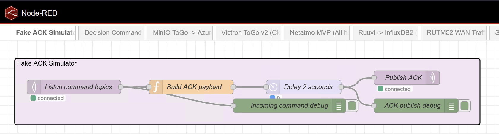
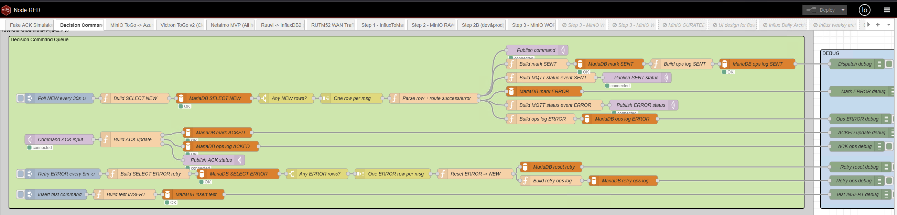

# Home IT Node-RED Flows and SQL Snippets

## Purpose

This document collects the operational pieces used around the command queue and ACK handling:

- Node-RED `Decision Command Queue v2`
- Node-RED `Fake ACK Simulator`
- MariaDB SQL snippets for testing and inspection
- queue lifecycle explanation
- notes on where real device adapters replace the simulator

---

# 1. Node-RED tabs in use

## 1.1 Decision Command Queue v2

This is the real command dispatch tab.

Responsibilities:

- poll `decision_command_queue`
- select rows where `status = 'NEW'`
- parse `payload_json`
- inject database `command_id` into outbound MQTT payload
- publish command to MQTT
- mark row `SENT`
- log to `ops_pipeline_run_log`
- listen for ACK topics
- mark row `ACKED`
- retry rows in `ERROR`

## 1.2 Fake ACK Simulator

This is a separate test tab.

Responsibilities:

- subscribe to `home/home/cmd/#`
- extract `command_id` from command payload
- wait 2 seconds
- publish an ACK back to MQTT

This simulates a real device adapter or real hardware ACK path.

---

# 2. MariaDB tables used

Prefix-based naming is assumed.

Main tables:

- `decision_command_queue`
- `ops_pipeline_run_log`

Related upstream/downstream tables:

- `decision_current_energy_state`
- `present_energy_daily`

---

# 3. Queue lifecycle

Expected command queue row lifecycle:

```text
NEW -> SENT -> ACKED
```

Error path:

```text
NEW -> ERROR -> NEW (retry)
```

Where:

- `NEW` means ready to dispatch
- `SENT` means Node-RED published the MQTT command and updated the queue row
- `ACKED` means an ACK message was received and mapped back to the queue row
- `ERROR` means command payload parsing or dispatch handling failed and the row was marked for retry

---

# 4. SQL snippets

## 4.1 Insert a dishwasher test command

```sql
INSERT INTO decision_command_queue
(created_ts, device_id, topic, payload_json, status)
VALUES
(
  NOW(),
  'dw_1',
  'home/home/cmd/appliance/dishwasher/dw_1/allow_start',
  JSON_OBJECT(
    'allow', true,
    'device_id', 'dw_1'
  ),
  'NEW'
);
```

## 4.2 Insert an HVAC test command

```sql
INSERT INTO decision_command_queue
(created_ts, device_id, topic, payload_json, status)
VALUES
(
  NOW(),
  'livingroom_fancoil_1',
  'home/home/cmd/hvac/sabiana/livingroom_fancoil_1/set_fan_speed',
  JSON_OBJECT(
    'set_fan_speed', 2,
    'device_id', 'livingroom_fancoil_1'
  ),
  'NEW'
);
```

## 4.3 Inspect latest command queue rows

```sql
SELECT
  command_id,
  created_ts,
  device_id,
  topic,
  payload_json,
  status,
  sent_ts,
  ack_ts
FROM decision_command_queue
ORDER BY command_id DESC
LIMIT 20;
```

## 4.4 Inspect ops log

```sql
SELECT
  run_id,
  pipeline_name,
  started_ts,
  finished_ts,
  status,
  message
FROM ops_pipeline_run_log
ORDER BY run_id DESC
LIMIT 50;
```

## 4.5 Reset a row back to NEW

```sql
UPDATE decision_command_queue
SET status = 'NEW',
    sent_ts = NULL,
    ack_ts = NULL
WHERE command_id = 100001;
```

## 4.6 Requeue all ERROR rows

```sql
UPDATE decision_command_queue
SET status = 'NEW'
WHERE status = 'ERROR';
```

## 4.7 Delete test rows

```sql
DELETE FROM decision_command_queue
WHERE command_id IN (100001, 100002);
```

---

# 5. Decision Command Queue v2 behavior

## 5.1 Poller

The flow polls MariaDB approximately every 30 seconds.

SQL used:

```sql
SELECT command_id, created_ts, device_id, topic, payload_json, status
FROM decision_command_queue
WHERE status = 'NEW'
ORDER BY created_ts ASC
LIMIT 20;
```

## 5.2 Payload parsing

The Node-RED function node parses `payload_json` and injects:

- `command_id` from the database row
- `device_id` if it is missing in the payload

This ensures outbound MQTT messages carry the database correlation identifier.

## 5.3 MQTT publish

The command is published to the exact topic stored in the queue row.

Examples:

```text
home/home/cmd/appliance/dishwasher/dw_1/allow_start
home/home/cmd/hvac/sabiana/livingroom_fancoil_1/set_fan_speed
```

## 5.4 Mark SENT

After publish, the flow updates the queue row:

```sql
UPDATE decision_command_queue
SET status = 'SENT', sent_ts = NOW()
WHERE command_id = ? AND status = 'NEW';
```

## 5.5 Ops log row

The flow writes an audit row into `ops_pipeline_run_log`.

Example values:

- `pipeline_name = 'decision_command_dispatch'`
- `status = 'SENT'`
- `message = 'command_id=<id>'`

## 5.6 Error handling

If payload parsing fails, the flow marks the row as `ERROR` and logs the event.

## 5.7 Retry loop

Every 5 minutes, the flow selects `ERROR` rows and resets them to `NEW`.

---

# 6. ACK handling behavior

The `Decision Command Queue v2` flow listens for ACKs on:

```text
home/home/ack/+/+/+
```

Expected ACK payload example:

```json
{
  "command_id": 123,
  "status": "ACKED",
  "device_id": "dw_1",
  "ack_source": "fake_ack_simulator",
  "ts": "2026-04-03T16:30:00.000Z"
}
```

When an ACK arrives:

1. extract `command_id`
2. update queue row to `ACKED`
3. set `ack_ts = NOW()`
4. write ACK log row to `ops_pipeline_run_log`
5. publish ACK status event to MQTT

ACK update SQL:

```sql
UPDATE decision_command_queue
SET status = 'ACKED', ack_ts = NOW()
WHERE command_id = ?;
```

---

# 7. Fake ACK Simulator behavior

## 7.1 Input

The simulator subscribes to:

```text
home/home/cmd/#
```

## 7.2 ACK creation

It reads the outgoing command payload and extracts:

- `command_id`
- `device_id`

If `command_id` is missing, it does nothing and emits a warning.

## 7.3 Delay

It waits 2 seconds to simulate a device response delay.

## 7.4 Output

It publishes to:

```text
home/home/ack/simulated/device/response
```

Example ACK payload:

```json
{
  "command_id": 123,
  "status": "ACKED",
  "device_id": "dw_1",
  "ack_source": "fake_ack_simulator",
  "ts": "2026-04-03T16:30:00.000Z"
}
```

---

# 8. Combined dispatch and ACK flow diagram

```text
+----------------------------+
| MariaDB                    |
| decision_command_queue     |
| ops_pipeline_run_log       |
+-------------+--------------+
              |
              | poll NEW rows
              v
+----------------------------+
| Node-RED                   |
| Decision Command Queue v2  |
| - parse payload            |
| - inject DB command_id     |
| - publish MQTT command     |
| - mark SENT                |
| - log dispatch             |
+-------------+--------------+
              |
              | MQTT command publish
              v
+----------------------------+
| MQTT Broker                |
| Teltonika                  |
+-------------+--------------+
              |
              | command topic
              v
+----------------------------+
| Fake ACK Simulator         |
| - subscribe home/home/cmd/#|
| - wait 2s                  |
| - publish ACK              |
+-------------+--------------+
              |
              | MQTT ACK publish
              v
+----------------------------+
| Node-RED                   |
| Decision Command Queue v2  |
| - receive ACK              |
| - mark ACKED               |
| - log ACK                  |
+-------------+--------------+
              |
              v
+----------------------------+
| MariaDB                    |
| decision_command_queue     |
| ops_pipeline_run_log       |
+----------------------------+
```

---

# 9. Where real device actuation replaces the simulator

The fake ACK simulator is only a test placeholder.

In production it is replaced with a real device adapter flow.

## Current test path

```text
Decision Command Queue v2 -> MQTT -> Fake ACK Simulator -> MQTT ACK
```

## Future real path

```text
Decision Command Queue v2 -> MQTT -> Device Adapter Flow -> Real Device -> MQTT ACK
```

The device adapter flow is where generic commands are turned into actual device actions.

Examples:

- Sabiana fan coil / konvektor -> Modbus register writes
- Sorel XHCC -> Modbus register or coil commands
- AC -> vendor API or IR bridge command
- appliance allow-start -> local adapter logic or smart relay
- lights -> device-specific MQTT/HomeKit/relay action

---

# 10. Example generic command vs device-specific action

## Generic command from decision queue

Topic:

```text
home/home/cmd/hvac/sabiana/livingroom_fancoil_1/set_fan_speed
```

Payload:

```json
{
  "command_id": 7001,
  "device_id": "livingroom_fancoil_1",
  "set_fan_speed": 2
}
```

## Device adapter translation

Example actual action:

- write Modbus register for fan speed = 2

## ACK after success

Topic:

```text
home/home/ack/hvac/sabiana/livingroom_fancoil_1
```

Payload:

```json
{
  "command_id": 7001,
  "status": "ACKED",
  "device_id": "livingroom_fancoil_1"
}
```

---

# 11. Test procedure

## 11.1 Dispatch test

1. insert a row into `decision_command_queue`
2. wait for poll or press the poll inject node
3. verify command is published to MQTT
4. verify row becomes `SENT`
5. verify fake ACK simulator publishes ACK
6. verify row becomes `ACKED`
7. verify log rows are written to `ops_pipeline_run_log`

## 11.2 Recommended SQL checks

Check queue:

```sql
SELECT command_id, device_id, topic, status, sent_ts, ack_ts
FROM decision_command_queue
ORDER BY command_id DESC
LIMIT 20;
```

Check ops log:

```sql
SELECT run_id, pipeline_name, status, message, started_ts, finished_ts
FROM ops_pipeline_run_log
ORDER BY run_id DESC
LIMIT 50;
```

---

# 12. Current implementation boundary

## Implemented now

- queue polling from MariaDB
- MQTT command dispatch
- SENT updates
- ACK handling
- ACKED updates
- retry of ERROR rows
- dispatch and ACK ops logging
- fake ACK simulation

## Not yet implemented

- real Sabiana / konvektor adapter flow
- real Sorel XHCC adapter flow
- real AC adapter flow
- real appliance-specific actuation adapter flows

---

# 13. Recommended next step

The next production-grade step is to replace the fake ACK simulator with one real device adapter flow.

Best first candidates:

- Sabiana / konvektor Modbus adapter
- Sorel XHCC adapter
- dishwasher or laundry allow-start adapter

That will convert the current tested command-dispatch path into real physical control.


Fake tests


The Flow for decision engine