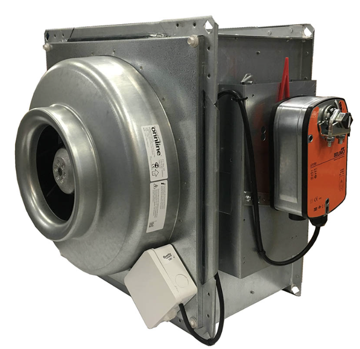

# Half of the energy is produced by generator(s)

## Generator Room Ventilation Requirements

Did you know that the emissions of generators account for about 10% of the consumed fuel? Ventilation or air replacement is one of the key aspects of sustainable operations of generators. It must be well-designed considering the environment of the generator room. Adequate ventilation contributes to the safety and efficiency of operations. 

The elevated temperature results in increased internal resistance within generator components and modification in the viscosity and composition of the fuel. Colder temperature leads to less than half of the current delivery and instability in the field. They also absorb compression heat, which hampers starting the generator. Owing to such consequences, proper ventilation requirements would help cut maintenance costs and further losses due to lack of efficiency. 

## Importance of Generator Room Ventilation 
Generator room ventilation is important according to different aspects of the company. The poor ventilation setup has the following implications. 

- This leads to hot environmental temperatures and engine overheating, resulting in damage to the head gasket. 
- It can not prevent loud noise, thus disrupting the proper flow of work 
- It leads to power loss, affecting the overall productivity of the organization 
- Decreases the working life of the generator  
- Adds to the risk of fire hazards 
- Contributes to accumulation of carbon monoxide emissions aiding to potential lethality 
- Enhances greenhouse gas emissions, hampering the air quality 

The generator room ventilation systems are of different types. Choosing the one that suits the generator room and other factors is important. The requirements may vary, and here are the different types that should be known before choosing one: 

- Forced Exhaust Ventilation
It is effective in maintaining a controlled environment but requires a well-designed exhaust system with strategic placement of fans.

- Supply and Exhaust Ventilation
It required proper design for effective balance and to avoid air stagnation. It ensures a continuous supply of fresh air in combination with expelling.

- Natural Ventilation with Louvers
These are cost-effective and energy-efficient, suitable for small generator rooms. They also depend on external weather conditions. 

- Emergency Ventilation Systems
They are designed to ensure rapid fire evacuation of heat or gasses during emergencies. They work on integration with alarms or sensors. 

- Ducted Ventilation Systems 
They are suitable for targeted ventilation in large rooms. 

- Combination of Mechanical and Natural Ventilation
They provide flexible and adaptable solutions but only with careful coordination. 

Ref:
https://csdieselgenerators.com/generator-room-ventilation-requirements/

## Single Generator system

### pros

### cons

## 2 Generator system

### pros

### cons

# Ventilations is critical
Reduces emissions
Increases engine lifetime
... more 
