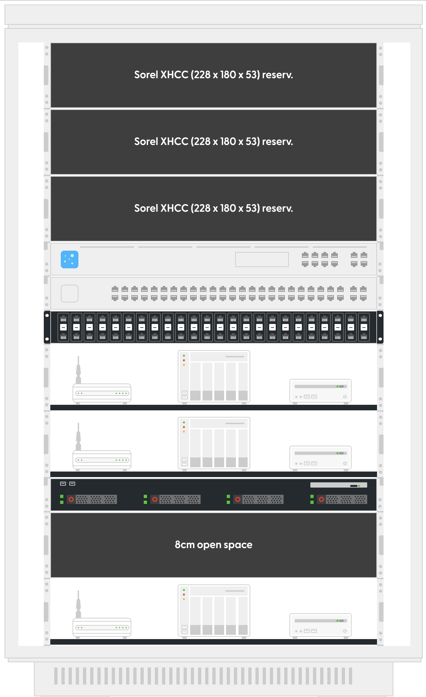

# Rack panning
https://rack-planner.patchbox.com/plan?id=x7DBL47AUgc3

```
A rack unit (abbreviated as U, less commonly seen as RU) is a unit of measurement applied to equipment racks and the servers, disk drives and other devices that they contain. One U is 1.75 inches (44.45mm); the standard rack, at 19 inches, is 42U.
```

Hardware/patchbox_rackplan_x7DBL47AUgc3.pdf
