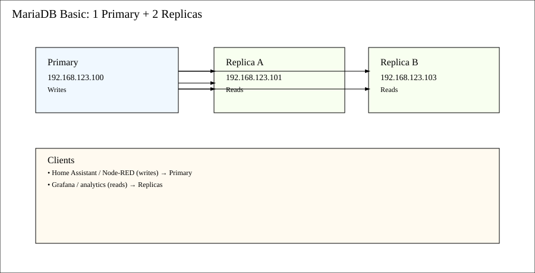

# MariaDB Cluster — Basic Primary/Replica Setup

## Summary
Small, reliable MariaDB for home-automation sensor data. Topology: **1 Primary + 2 Replicas** (async or semi-sync). 
IPs: **000.000.000.100, 000.000.000.101, 000.000.000.103**. 
Use case: write to primary, read from replicas for dashboards/analytics.

## Architecture
- **Primary:** 000.000.000.100
- **Replica A:** 000.000.000.101
- **Replica B:** 000.000.000.103
- Replication: MariaDB GTID-based (recommended) with optional semi-sync plugin.
- Backups: `mariabackup` + nightly cron + test restores.
- Monitoring: `performance_schema`, `information_schema`, and Telegraf → InfluxDB.



## Server Prep (All Nodes)
```bash
sudo apt update && sudo apt install -y mariadb-server
sudo systemctl enable mariadb && sudo systemctl stop mariadb

# Optional: pin a specific version for stability
# sudo apt-cache policy mariadb-server
```

## my.cnf (All Nodes; adjust server-id and bind-address)
Place under `/etc/mysql/mariadb.conf.d/60-cluster.cnf`:

```ini
[mysqld]
bind-address=0.0.0.0
server-id=100           # change per node (100,101,103)
log_bin=mysqld-bin
binlog_format=ROW
gtid_strict_mode=ON
gtid_domain_id=1
enforce_gtid_consistency=ON
log_slave_updates=ON
relay_log=relay-bin
replicate_wild_do_table=sensordb.%
skip_name_resolve=ON

# Performance basics
innodb_flush_log_at_trx_commit=1
sync_binlog=1
innodb_buffer_pool_size=1G        # tune for RAM
innodb_log_file_size=256M
max_connections=200
```

Set `server-id` per node:
- Primary: `server-id=100`
- Replica A: `server-id=101`
- Replica B: `server-id=103`

## Create Replication User (Primary @ 000.000.000.100)
```sql
CREATE USER 'repl'@'000.000.000.%' IDENTIFIED BY 'Str0ngReplP@ss!';
GRANT REPLICATION SLAVE ON *.* TO 'repl'@'000.000.000.%';
FLUSH PRIVILEGES;
```

## Initialize Database and Seed Backup (Primary)
```bash
sudo systemctl start mariadb
mysql -e "CREATE DATABASE IF NOT EXISTS sensordb;"
mariabackup --backup --target-dir=/tmp/basebackup
mariabackup --prepare --target-dir=/tmp/basebackup
```

Transfer the prepared backup to replicas (e.g., `rsync -a /tmp/basebackup/ replica:/var/lib/mysql/`).

## Prepare Replicas
On each replica:
```bash
sudo systemctl stop mariadb
sudo rm -rf /var/lib/mysql/*
sudo rsync -a /tmp/basebackup/ /var/lib/mysql/
sudo chown -R mysql:mysql /var/lib/mysql
```

## Start Replication
On each replica:
```sql
SET GLOBAL gtid_slave_pos='0-1-0';  -- optional reset if needed
CHANGE MASTER TO
  MASTER_HOST='000.000.000.100',
  MASTER_USER='repl',
  MASTER_PASSWORD='Str0ngReplP@ss!',
  MASTER_USE_GTID=slave_pos;
START SLAVE;
SHOW SLAVE STATUS\G
```

**Semi-sync (optional, improves durability):**
```sql
INSTALL SONAME 'semisync_master';
INSTALL SONAME 'semisync_slave';
SET GLOBAL rpl_semi_sync_master_enabled=ON;
SET GLOBAL rpl_semi_sync_slave_enabled=ON;
```

## Client Connection Strategy
- **Writes:** point Home Assistant / Node-RED / apps at primary `000.000.000.100`.
- **Reads:** dashboards query replicas `000.000.000.101` and `000.000.000.103`.

## Backups (Primary)
Nightly mariabackup + weekly full + daily incrementals:
```bash
# /usr/local/sbin/backup_mariadb.sh
#!/usr/bin/env bash
set -euo pipefail
TS=$(date +%F_%H%M)
mariabackup --backup --target-dir=/srv/backups/mariadb/$TS
# retention policy
find /srv/backups/mariadb -type d -mtime +14 -exec rm -rf {} +
```

Cron:
```bash
0 2 * * * root /usr/local/sbin/backup_mariadb.sh
```

## Monitoring
- Telegraf → InfluxDB: enable `[[inputs.mysql]]` with DSN to each node.
- Alert on replication lag (`Seconds_Behind_Master`) and IO/SQL thread states.

## Failover
Manual: promote a replica if primary fails.
```sql
STOP SLAVE; RESET SLAVE ALL; RESET MASTER;
-- Point writers to the promoted node, re-point other replicas to it.
```

## Security Basics
- Strong passwords, limit `root` remote access, use firewall to allow only 000.000.000.0/24.
- Encrypt backups at rest; consider LUKS on backup disk.
```