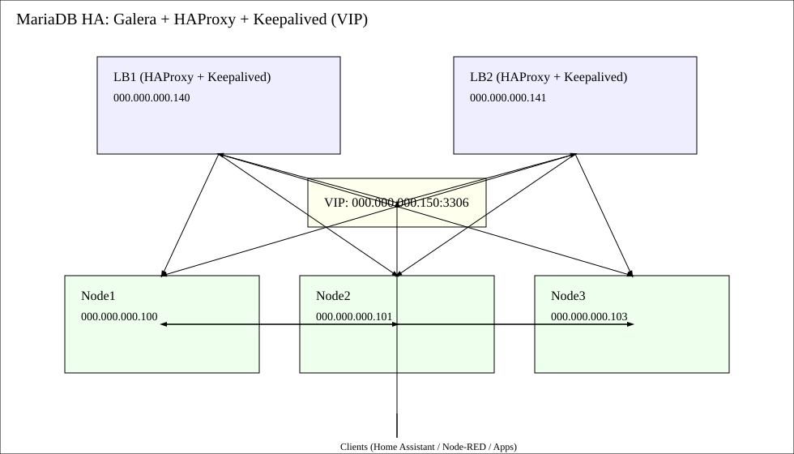

# MariaDB Cluster — HA Design (Galera + HAProxy + Keepalived)

## Summary
Highly-available 3-node **MariaDB Galera** cluster, fronted by **HAProxy** (read/write routing) and **Keepalived** (VIP for client failover). 
Same IPs: **000.000.000.100, 000.000.000.101, 000.000.000.103**. Clients use the **VIP** (e.g., `000.000.000.150`).

## Architecture
- **DB Nodes (Galera):**
  - Node1: 000.000.000.100
  - Node2: 000.000.000.101
  - Node3: 000.000.000.103
- **Load Balancers:**
  - LB1 (HAProxy + Keepalived): 000.000.000.140
  - LB2 (HAProxy + Keepalived): 000.000.000.141
  - **VIP**: 000.000.000.150 (moves between LB1/LB2)



## Server Prep (DB Nodes)
```bash
sudo apt update && sudo apt install -y mariadb-server galera-4 rsync
sudo systemctl enable mariadb && sudo systemctl stop mariadb
```

## Galera Config `/etc/mysql/mariadb.conf.d/60-galera.cnf` (All DB nodes)
```ini
[mysqld]
bind-address=0.0.0.0
binlog_format=ROW
default_storage_engine=InnoDB
innodb_autoinc_lock_mode=2
innodb_flush_log_at_trx_commit=2
wsrep_on=ON
wsrep_provider=/usr/lib/galera/libgalera_smm.so
wsrep_cluster_name="homeit-galera"
wsrep_cluster_address="gcomm://000.000.000.100,000.000.000.101,000.000.000.103"
wsrep_node_address="CHANGE_ME"       # per node: this node's IP
wsrep_node_name="CHANGE_ME"          # per node: node name
wsrep_sst_method=rsync               # or mariabackup for large data
# optional: for mariabackup
# wsrep_sst_auth="sst:Str0ngSstP@ss!"
```

Set per-node values:
- Node1: `wsrep_node_address=000.000.000.100`, `wsrep_node_name=node1`
- Node2: `wsrep_node_address=000.000.000.101`, `wsrep_node_name=node2`
- Node3: `wsrep_node_address=000.000.000.103`, `wsrep_node_name=node3`

## Bootstrap Cluster
On **one** node (Node1):
```bash
sudo galera_new_cluster
```
Then start others:
```bash
sudo systemctl start mariadb
```

Verify:
```sql
SHOW STATUS LIKE 'wsrep_cluster_size';
SHOW STATUS LIKE 'wsrep_local_state_comment';
```

## HAProxy (LB1 & LB2)
```bash
sudo apt install -y haproxy
```

`/etc/haproxy/haproxy.cfg` (simplified):
```cfg
global
  daemon
  maxconn 4096

defaults
  mode tcp
  timeout connect 5s
  timeout client  60s
  timeout server  60s

# MySQL listener (VIP will point here)
frontend mysql-in
  bind *:3306
  default_backend galera

backend galera
  balance roundrobin
  option mysql-check user haproxy_check
  server node1 000.000.000.100:3306 check
  server node2 000.000.000.101:3306 check
  server node3 000.000.000.103:3306 check
```

Create MySQL user for healthcheck (on any DB node):
```sql
CREATE USER 'haproxy_check'@'000.000.000.%' IDENTIFIED BY '' WITH MAX_QUERIES_PER_HOUR 0;
GRANT USAGE ON *.* TO 'haproxy_check'@'000.000.000.%';
```

## Keepalived (LB1 & LB2)
```bash
sudo apt install -y keepalived
```

LB1 `/etc/keepalived/keepalived.conf`:
```conf
vrrp_instance VI_1 {
  state MASTER
  interface eth0
  virtual_router_id 51
  priority 110
  advert_int 1
  authentication {
    auth_type PASS
    auth_pass 1nternalVIP
  }
  virtual_ipaddress {
    000.000.000.150/24 dev eth0
  }
  track_script {
    chk_haproxy
  }
}

vrrp_script chk_haproxy {
  script "pidof haproxy"
  interval 2
  weight 5
}
```

LB2 uses the same, but `state BACKUP` and `priority 100`.

Enable & start:
```bash
sudo systemctl enable haproxy keepalived
sudo systemctl restart haproxy keepalived
```

## Client Connection
Point all clients (writers and readers) to `000.000.000.150:3306`.
- Optionally split read/write with two frontends (RW to nodes in `wsrep_local_state_comment=Synced`, RO for analytics).

## Backups
For Galera, use `mariabackup` (node in `Synced` state). Example:
```bash
mariabackup --backup --target-dir=/srv/backups/mariadb/$(date +%F_%H%M)
```

## Maintenance & Tips
- Quorum: keep **odd** number of Galera nodes.
- Flow control: watch `wsrep_flow_control_paused` to tune performance.
- Avoid `ALTER TABLE` on very large tables during peak hours.

## Security
- Firewall allowlist only LBs and internal nets.
- Strong passwords; restrict SST credentials if used.