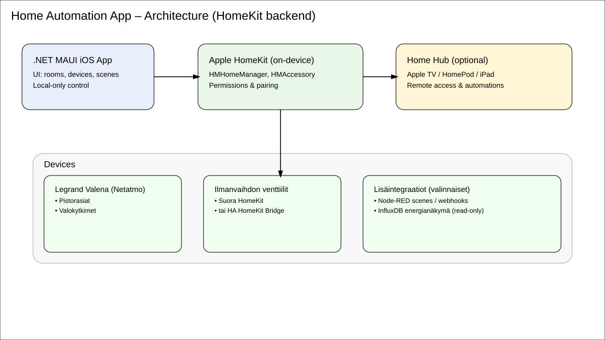

# Home Automation iOS App (.NET MAUI) — Legrand Valena & Vents (HomeKit)

**Scope:** Native iOS app built with **.NET MAUI** to control **Legrand Valena** power sockets & light switches and **external AC vents** via **Apple HomeKit**. Includes Finnish App Store copy, UI mockups, and production notes.

## TL;DR
- **Platform:** .NET 8 MAUI (iOS target)
- **Backend:** **HomeKit** (local, private). Optional: Home Assistant **HomeKit Bridge** for non-HomeKit devices.
- **Features:** Room/device list, On/Off, brightness, scenes, schedules, energy glance (optional), quick tiles.
- **Privacy:** Local-only by default; no cloud account required.



---

## Architecture Overview
- **App (MAUI)** → **HomeKit (HMHomeManager, HMAccessory)** on-device.
- **Home Hub (optional):** Apple TV / HomePod / iPad for automations and remote access.
- **Devices:** Legrand Valena (Netatmo) sockets & switches, external AC vents (if exposed to HomeKit directly or via **Home Assistant → HomeKit Bridge**).
- **Optional Integrations:** Node-RED scenes webhooks; energy metrics via InfluxDB → presented read-only.

### Why HomeKit as “Backend”?
- Secure by design; device control stays on your LAN.
- Apple UX for pairing/accessory permissions.
- Works offline (LAN) after pairing; no vendor cloud dependency.

---

## Project Structure (recommended)
```
HomeApp/
├─ HomeApp.csproj
├─ MauiProgram.cs
├─ App.xaml
├─ App.xaml.cs
├─ Resources/
│  └─ Strings/
│     ├─ App.resx
│     └─ App.fi.resx
├─ Views/
│  ├─ MainPage.xaml
│  └─ DevicePage.xaml
├─ ViewModels/
│  ├─ MainViewModel.cs
│  └─ DeviceViewModel.cs
├─ Services/
│  ├─ IHomeService.cs            # abstraction
│  └─ HomeKitService.ios.cs      # iOS impl (HomeKit)
└─ Platforms/iOS/
   ├─ Info.plist
   ├─ Entitlements.plist
   └─ AppDelegate.cs
```

---

## iOS Entitlements & Capabilities
Enable **HomeKit** capability and add usage description.

**Platforms/iOS/Entitlements.plist**
```xml
<?xml version="1.0" encoding="UTF-8"?>
<!DOCTYPE plist PUBLIC "-//Apple//DTD PLIST 1.0//EN" "http://www.apple.com/DTDs/PropertyList-1.0.dtd">
<plist version="1.0">
<dict>
  <key>com.apple.developer.homekit</key>
  <true/>
</dict>
</plist>
```

**Platforms/iOS/Info.plist (snippet)**
```xml
<key>NSHomeKitUsageDescription</key>
<string>Sovellus tarvitsee HomeKit-oikeudet ohjatakseen pistorasioita, valoja ja venttiilejä.</string>
```

**csproj (ensure entitlements)**
```xml
<PropertyGroup>
  <TargetFrameworks>net8.0-ios</TargetFrameworks>
  <UseMaui>true</UseMaui>
  <CodesignEntitlements>Platforms/iOS/Entitlements.plist</CodesignEntitlements>
</PropertyGroup>
```

---

## HomeKit Service (iOS partial)
```csharp
// Services/IHomeService.cs
public interface IHomeService
{
    Task InitializeAsync();
    Task<IEnumerable<HomeDevice>> GetDevicesAsync();
    Task SetPowerAsync(string deviceId, bool on);
    Task<double?> GetBrightnessAsync(string deviceId);
    Task SetBrightnessAsync(string deviceId, double percent);
}

public record HomeDevice(string Id, string Name, string Room, string Category, bool? IsOn);
```

```csharp
// Services/HomeKitService.ios.cs (platform-specific for iOS)
#nullable enable
using HomeKit;
using Foundation;
using System.Linq;

public sealed class HomeKitService : NSObject, IHomeService, IHMHomeManagerDelegate
{
    private readonly HMHomeManager _manager = new HMHomeManager();
    private TaskCompletionSource<bool> _ready = new();

    public HomeKitService() => _manager.Delegate = this;

    [Export("homeManagerDidUpdateHomes:")]
    public void DidUpdateHomes(HMHomeManager manager)
    {
        if (!_ready.Task.IsCompleted) _ready.TrySetResult(true);
    }

    public async Task InitializeAsync() => await _ready.Task;

    public async Task<IEnumerable<HomeDevice>> GetDevicesAsync()
    {
        await InitializeAsync();
        var home = _manager.PrimaryHome ?? _manager.Homes.FirstOrDefault();
        if (home is null) return Enumerable.Empty<HomeDevice>();
        return home.Accessories.Select(a => new HomeDevice(
            Id: a.IdentifierAsString(),
            Name: a.Name,
            Room: a.Room?.Name ?? "Unknown",
            Category: a.Category?.LocalizedDescription ?? a.Category?.ToString() ?? "Device",
            IsOn: a.FindPowerState()
        ));
    }

    public async Task SetPowerAsync(string deviceId, bool on)
    {
        await InitializeAsync();
        var acc = _manager.AllAccessories().FirstOrDefault(a => a.IdentifierAsString() == deviceId);
        var ch = acc?.FindCharacteristic(HMCharacteristicType.PowerState);
        if (ch != null) ch.WriteValue(NSNumber.FromBoolean(on), (err) => { /* handle err */ });
    }

    public Task<double?> GetBrightnessAsync(string deviceId)
    {
        var acc = _manager.AllAccessories().FirstOrDefault(a => a.IdentifierAsString() == deviceId);
        var ch = acc?.FindCharacteristic(HMCharacteristicType.Brightness);
        double? value = null;
        ch?.ReadValue((err) => { value = ch?.Value?.ToDouble(); });
        return Task.FromResult(value);
    }

    public Task SetBrightnessAsync(string deviceId, double percent)
    {
        var acc = _manager.AllAccessories().FirstOrDefault(a => a.IdentifierAsString() == deviceId);
        var ch = acc?.FindCharacteristic(HMCharacteristicType.Brightness);
        ch?.WriteValue(NSNumber.FromDouble(Math.Clamp(percent, 0, 100)), (err) => {});
        return Task.CompletedTask;
    }
}

// Helpers (extension methods)
static class HomeKitExtensions
{
    public static string IdentifierAsString(this HMAccessory a) => a?.Identifier?.ToString() ?? Guid.NewGuid().ToString();
    public static IEnumerable<HMAccessory> AllAccessories(this HMHomeManager m) => 
        m.Homes.SelectMany(h => h.Accessories);

    public static HMCharacteristic? FindCharacteristic(this HMAccessory a, string type) =>
        a?.Services?
          .SelectMany(s => s.Characteristics)
          .FirstOrDefault(c => c?.CharacteristicType == type);

    public static bool? FindPowerState(this HMAccessory a)
    {
        var ch = a.FindCharacteristic(HMCharacteristicType.PowerState);
        return ch?.Value is Foundation.NSNumber n ? n.BoolValue : null;
    }

    public static double ToDouble(this Foundation.NSObject obj) =>
        obj is Foundation.NSNumber n ? n.DoubleValue : 0d;
}
```

> ⚠️ **Note:** HomeKit access requires the devices are already paired in Apple Home. Developer provisioning must include HomeKit capability.

---

## Basic UI (XAML)
```xml
<!-- Views/MainPage.xaml -->
<ContentPage xmlns="http://schemas.microsoft.com/dotnet/2021/maui"
             x:Class="HomeApp.Views.MainPage"
             Title="Koti">
  <CollectionView ItemsSource="{Binding Devices}">
    <CollectionView.ItemTemplate>
      <DataTemplate>
        <Grid Padding="12" ColumnDefinitions="*,Auto">
          <VerticalStackLayout>
            <Label Text="{Binding Name}" FontAttributes="Bold" />
            <Label Text="{Binding Room}" FontSize="12" />
          </VerticalStackLayout>
          <Switch IsToggled="{Binding IsOn}" VerticalOptions="Center" />
        </Grid>
      </DataTemplate>
    </CollectionView.ItemTemplate>
  </CollectionView>
</ContentPage>
```

```csharp
// ViewModels/MainViewModel.cs
public class MainViewModel : INotifyPropertyChanged
{
    private readonly IHomeService _home;
    public ObservableCollection<HomeDevice> Devices { get; } = new();

    public MainViewModel(IHomeService home) => _home = home;

    public async Task LoadAsync()
    {
        await _home.InitializeAsync();
        Devices.Clear();
        foreach (var d in await _home.GetDevicesAsync())
            Devices.Add(d);
    }
}
```

```csharp
// MauiProgram.cs (register services & VM)
builder.Services.AddSingleton<IHomeService, HomeKitService>();
builder.Services.AddTransient<MainViewModel>();
builder.Services.AddTransient<MainPage>();
```

---

## Finnish App Store Copy (FI)
**Nimi:** *Koti – Pistorasiat & Ventiilit*  
**Lyhyt kuvaus:** Ohjaa Legrand Valena -pistorasioita, valoja ja ilmanvaihdon venttiilejä turvallisesti HomeKitin kautta.  
**Kuvaus:**  
- Nopea ohjaus huoneittain ja laitteittain  
- Ajastukset ja kohtaukset (Skenet)  
- Paikallinen toiminta – ei pilvitiliä  
- Tuki HomePod/Apple TV -keskittimelle etäohjaukseen  
- Yksityisyys ensin: kaikki pysyy kotiverkossa  

**Avainsanat:** Legrand, Valena, Netatmo, HomeKit, älykoti, pistorasia, valot, ilmanvaihto, MAUI

**Tietosuojaseloste (tiivistelmä):** Sovellus käsittelee vain paikallisen verkon laitetietoja, eikä siirrä dataa kolmansille osapuolille. iCloud/HomeKit-arkkitehtuuri voi välittää salattua metatietoa Applelle Apple ID -asetuksiesi mukaisesti.

---

## Optional: Home Assistant Bridge
Jos venttiilejä ei voi parittaa suoraan HomeKitiin:
1. Ota käyttöön **Home Assistant → HomeKit Bridge** -integraatio.
2. Valitse halutut entiteetit (venttiilit, tuulettimet, pistorasiat).  
3. Parita “silta” Applen Koti-sovellukseen → laitteet näkyvät myös tähän MAUI-sovellukseen HomeKitin kautta.

---

## Testing Checklist
- [ ] Ensimmäinen käynnistys: käyttöoikeuspyyntö HomeKitille.
- [ ] Huone- ja laitelista päivittyy.
- [ ] Kytkin ohjaa Legrand-pistorasiaa ja valoa.
- [ ] Venttiilin tilan luku/ohjaus toimii (HomeKit-tyyppi: `VentilationFan` tai `Valve`).
- [ ] Skenet näkyvät ja toimivat (valinnaisesti).

---

## Next Steps
- Energia-näkymä: integroidut luvut InfluxDB:stä (vain luku).
- Widgetit (iOS 18) ja toimintopainikkeet.
- Skenarionäppäimet (Aamu / Poissa / Ilmanvaihto MAX).