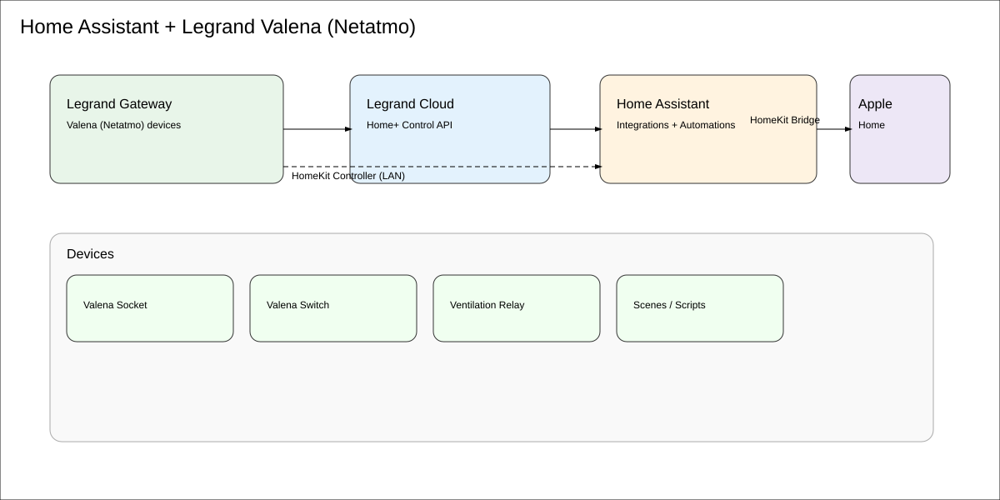

# Home Assistant + Legrand Valena (Netatmo)

This package shows **two reliable ways** to bring **Legrand Valena with Netatmo** sockets & switches into **Home Assistant**, plus
how to expose them back to Apple Home with **HomeKit Bridge**, and practical automations/dashboards.

## Choose an integration path
- **Path A — Legrand Home+ Control (cloud)**: Quickest; pairs HA with your Legrand account. Works even if your gateway is already paired to Apple Home.  
- **Path B — HomeKit Controller (local/LAN)**: Pairs HA **directly** with the Legrand gateway via HomeKit. **Mutually exclusive** with pairing the same gateway to Apple Home (a HomeKit accessory can only have one primary controller).

If you want **both Apple Home & HA**, use **Path A** (cloud) **or** keep Apple as primary and expose HA entities to Apple via **HomeKit Bridge**.

---

## Path A — Legrand Home+ Control (cloud)
1. HA → **Settings → Devices & Services → Add Integration** → search **“Legrand Home+ Control”**.  
2. Sign in with your Legrand account (region as prompted).  
3. After linking, entities like `switch.<room>_<device>` and `light.<room>_<device>` appear.

**Pros:** Easiest, compatible with Apple pairing. **Cons:** Cloud dependency and API rate limits (rare at home scale).

---

## Path B — HomeKit Controller (local)
> Works only if the Legrand gateway is **not** already paired to Apple Home. If paired, unpair/reset the gateway first.

1. HA → **Settings → Devices & Services → Add Integration** → **HomeKit Controller**.  
2. HA will discover the Legrand gateway; select it and enter the **HomeKit code** from the device/packaging.  
3. Entities are created locally; no cloud required.

**Pros:** Local, low-latency, private. **Cons:** Only one primary controller; you cannot also pair to Apple at the same time.

---

## Expose HA back to Apple — HomeKit Bridge
If you keep HA as your logic engine and still want controls in Apple Home, enable **HomeKit Bridge** in HA. See `ha/configuration_snippets/homekit_bridge.yaml` in this pack.

---

## Practical automations
- **Coffee socket schedule** (weekdays 07:00 → ON, auto‑OFF after 45 min)  
- **“Ilmanvaihto MAX”** scene toggle that can include Valena outlets + Node‑RED/Vallox actions  
- **Safety auto‑off** if a high‑load outlet exceeds a duration

All YAML examples are included under `ha/configuration_snippets/`.

---

## Lovelace dashboard
A compact view that groups **Rooms**, **Scenes**, and **Ventilation** quick actions. Import `ha/lovelace/dashboard_valena.yaml`.

---

## Diagram

---

## Tips
- Name devices clearly in Legrand app → HA inherits names for friendly entity_ids.  
- For energy tracking, use smart plugs with power sensors (if supported by your Valena model) or add Shelly/Zigbee meters.  
- Keep **HomeKit Controller** and **HomeKit Bridge** straight: *Controller* = HA pairs **to** accessory; *Bridge* = Apple pairs **to HA**.