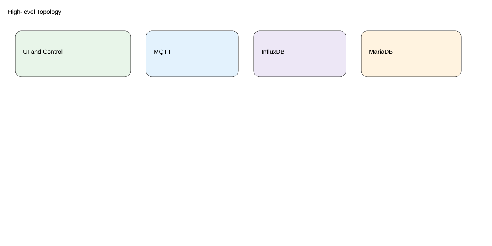
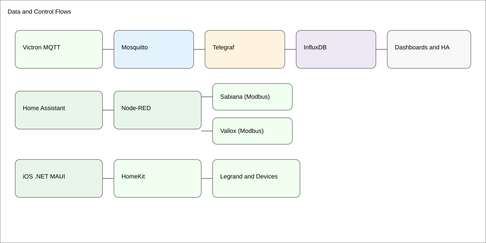
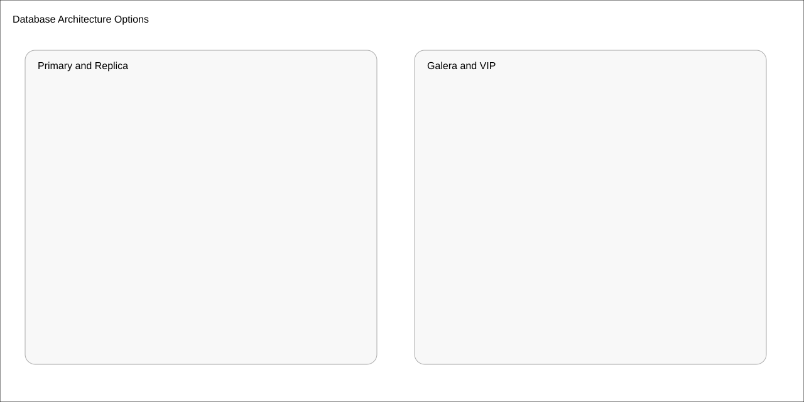
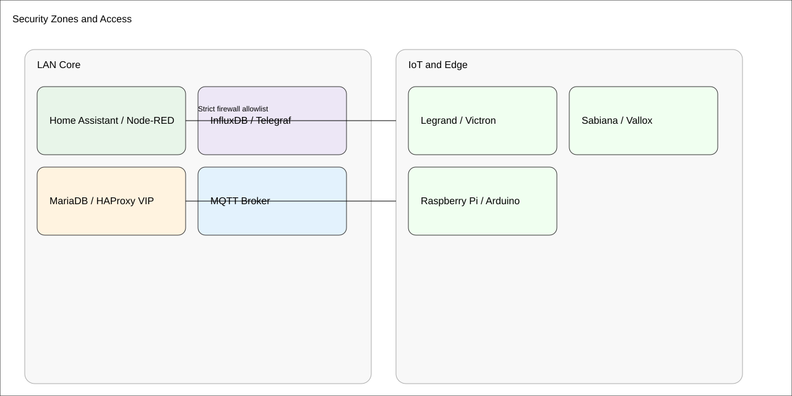

# HomeIT — Overall Architecture

**Date:** 2025-08-16  
**Scope:** End‑to‑end view of HomeIT: devices, apps, data flows, storage, and operations.

## 1) Topology at a glance

**Key components**
- **Control/UI:** Apple Home, **.NET MAUI iOS app** (HomeKit), Home Assistant (HA), Node‑RED
- **Messaging:** MQTT (Mosquitto) @ **000.000.000.115:1883**
- **Metrics/TS:** Telegraf → **InfluxDB** (bucket `sensors`), optional downsample `sensors_agg`
- **DB:** MariaDB (basic or **HA Galera** via HAProxy + Keepalived VIP `000.000.000.150:3306`)
- **Edge:** Raspberry Pi nodes (e.g., static `000.000.000.151`, Wi‑Fi off), Arduino/Opta
- **Devices:** Legrand Valena (Netatmo), Victron Cerbo, Sabiana, Vallox

---

## 2) Data & Control Flows

**Examples**
- **Energy path:** Victron MQTT → Telegraf → InfluxDB → (Dashboards / HA / Node‑RED)
- **HVAC path:** HA/Node‑RED rules → Modbus (Sabiana/Vallox) via RS485
- **App path:** iOS MAUI app ↔ HomeKit ↔ Devices (or HA via HomeKit Bridge)

---

## 3) Storage Layer Options

- **Option A: Primary/Replica** — simple, single writer, async replica for reads/backups.
- **Option B: HA Galera (x3)** — multi‑master with quorum; fronted by **HAProxy** on two LBs with a **Keepalived VIP**.
- Backups: `mariabackup` (Galera), dump to NAS; verify restores monthly.

---

## 4) Network & Hosts
- MQTT/Influx/Telegraf host: **000.000.000.115**
- HAProxy/Keepalived LBs: **000.000.000.140**, **000.000.000.141**, VIP **000.000.000.150**
- MariaDB nodes: **000.000.000.100 / .101 / .103**
- Raspberry Pi example (static): **000.000.000.151**
- Home Assistant / Node‑RED: _TBD_ (fill in actual IPs)
- RS485 adapters: `/dev/ttyUSB0` (Sabiana), `/dev/ttyUSB1` (Vallox)

> Adjust IPs to your LAN; prefer DHCP reservations where possible.

---

## 5) Security & Segmentation

- **LAN Core:** HA, Node‑RED, DB/LBs, Influx, MQTT
- **IoT VLAN (optional):** Legrand gateway, Victron, Sabiana/Vallox
- **Principles:** least privilege, strong creds, limit inbound to VIP/HA; MQTT auth; off‑LAN access via VPN only.
- **Secrets:** store tokens/DB creds in HA/Node‑RED secret stores or env vars; avoid hardcoding.

---

## 6) Observability & Ops
- **InfluxDB** metrics + dashboards; downsample tasks @ 5m
- **Health checks:** HAProxy MySQL checks; wsrep status alarms; MQTT liveness topic
- **Backups:** DB (`mariabackup`), HA config snapshots, Node‑RED flows export
- **RTO/RPO targets:** RTO ≤ 30 min (HA DB), RPO ≤ 5 min (Galera); adjust to needs

---

## 7) Appendix — Ports & Protocols
| Service | Port | Notes |
|---|---:|---|
| MQTT (Mosquitto) | 1883 | Authenticated, LAN only |
| InfluxDB v2 | 8086 | Token‑based |
| MariaDB VIP | 3306 | HAProxy → Galera nodes |
| HA (UI/API) | 8123 | Reverse proxy or LAN only |
| Node‑RED | 1880 | Admin auth |
| HomeKit | mDNS/MDNS + TCP | Local pairing |
| Modbus RTU | serial | `/dev/ttyUSB*` |

---

**Related topic packs** (already delivered):
- MariaDB: Basic & HA Galera (with diagrams)  
- iOS MAUI HomeKit app (docs + mockups + skeleton project)  
- VS Code + Arduino/Opta setup  
- Raspberry Pi networking (static IP + Wi‑Fi off)  
- InfluxDB + Victron (24h Flux, Telegraf)  
- Node‑RED (Sabiana, Vallox)