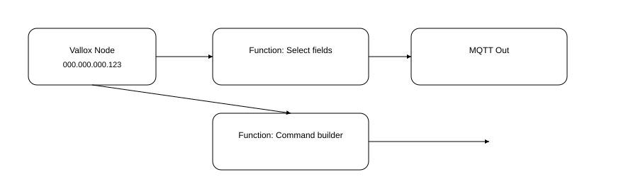
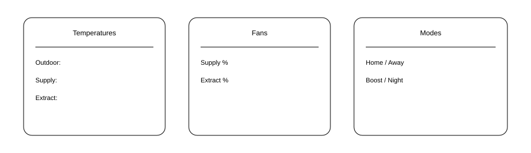

# Node‑RED + Vallox TSK Multi 80 MV — Configuration Guide

**Target device:** Vallox TSK Multi 80 MV (B3608, SW 3.0.6)  
**Local IP (example):** `000.000.000.123`  
**Goal:** Use Node‑RED to read/write Vallox parameters and integrate with MQTT / Home Assistant.

## 1. Install required nodes
In Node‑RED, go to **Manage palette → Install** and add:
- `node-red-contrib-vallox`
- (Alternative / advanced) `@mobsean/node-red-vallox-webserver-api`

## 2. Basic connection
Create a Vallox node:
- **Host:** 000.000.000.123
- **Port:** 80 (or 8070 if your API exposes that)
- **Polling:** 5 s
- **Outputs:** full JSON state



## 3. Example flow: Read state → Publish to MQTT
This flow reads status and publishes selected metrics to MQTT topics.

See `flows/vallox_status_to_mqtt.json` for an importable Flow.

Topics used:
- `vallox/airflow/supply`
- `vallox/airflow/extract`
- `vallox/temp/outdoor`, `.../supply`, `.../extract`
- `vallox/mode` (home/away/boost/night)

## 4. Example flow: Control profiles (Home / Away / Boost / Night)
Inject nodes set `msg.payload` as a command object to the Vallox node.
Supported commands in these nodes typically include:
```json
{ "setProfile": "home" }
{ "setProfile": "away" }
{ "setProfile": "boost" }
{ "setProfile": "night" }
```
You can also set fan percentages:
```json
{ "setFan": { "supply": 60, "extract": 60 } }
```

## 5. Home Assistant integration (via MQTT Discovery)
Publish to topics with HA discovery structure, e.g.:
```
homeassistant/sensor/vallox_supply_temp/config
homeassistant/sensor/vallox_supply_temp/state
```
and set `uniq_id`, `name`, and `stat_t` accordingly. See example in the flow JSON.

## 6. Troubleshooting
- **JSON.parse error (like “unexpected character at line 40 col 3”)**  
  - Usually caused by an upstream node returning non‑JSON or a trailing comma.  
  - Add a **`json` node** after HTTP/Function nodes to normalize payload.  
  - Use a **`debug` node** set to `Complete msg` to inspect what arrives before the JSON node.
- **No connection**: confirm the Vallox local API is enabled and reachable from Node‑RED host.
- **CORS errors** in frontends: use Node‑RED server-side flows, not browser calls.
- **Credentials**: if your Vallox requires credentials, configure them in the node settings.

## 7. Example dashboards


- Temperatures (outdoor/supply/extract)
- Fan percentages
- Mode selection buttons (home/away/boost/night)

---

**Appendix — Flow JSON Files**  
- `flows/vallox_status_to_mqtt.json` (status → MQTT)  
- `flows/vallox_control_profiles.json` (mode/profile control)