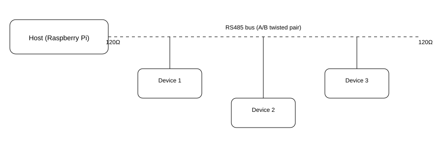

# ZK USB RS485 Dongles — Practical Guide

**Scope:** What you can do with ZK USB↔RS485 adapters, wiring, OS setup (Linux/Windows), and quick-start recipes for Home Assistant, Node‑RED, InfluxDB, and Python.

## 1. What RS485 Is (and why it’s useful)
- Balanced differential bus for **long cables** and **noisy environments**.
- Multi-drop: up to ~32 unit loads on a single pair (A/B / D+ D‑).
- Common protocols on top: **Modbus RTU**, **BACnet MS/TP**, vendor‑specific serial protocols.

## 2. Hardware wiring basics
- RS485 uses **A (D-)** and **B (D+)** plus **GND reference**.
- Daisy-chain devices; avoid star topology.
- Terminate the **two ends** with ~120Ω and enable **bias resistors** (one place only).
- Typical pinout for screw‑terminal dongles: `A(–)`, `B(+)`, `GND`.



## 3. Host OS setup

### Linux / Raspberry Pi
1. Plug the dongle; check device: `ls /dev/ttyUSB*` → e.g. `/dev/ttyUSB0`  
2. Add udev rule (optional, stable name):
   ```bash
   SUBSYSTEM=="tty", ATTRS{idVendor}=="1a86", ATTRS{idProduct}=="7523", SYMLINK+="ttyRS485"
   ```
3. Add your user to dialout: `sudo usermod -aG dialout $USER`

### Windows
- Device shows as **COMx** (e.g., COM4). Use 8‑N‑1, 9600–115200 bps depending on device.

## 4. Quick-start recipes

### 4.1 Read a Modbus sensor into Home Assistant
**configuration.yaml**
```yaml
modbus:
  - name: rs485
    type: serial
    method: rtu
    port: /dev/ttyUSB0
    baudrate: 9600
    stopbits: 1
    bytesize: 8
    parity: N
    sensors:
      - name: co2_ppm
        slave: 1
        address: 0
        input_type: input
        data_type: uint16
```
Then create an automation to act on `sensor.co2_ppm`.

### 4.2 Node‑RED as a bridge (RS485 → MQTT)


Use `node-red-contrib-modbus`:
- **Modbus-Read** (Serial RTU `/dev/ttyUSB0`, ID=1, FC=4, Addr=0, Qty=2, Poll=5000 ms)
- **Function** to parse values
- **MQTT out** → topic `sensors/co2`

### 4.3 Python poller → InfluxDB 2
```python
import minimalmodbus, time
from influxdb_client import InfluxDBClient, Point, WritePrecision

inst = minimalmodbus.Instrument('/dev/ttyUSB0', 1)  # slave 1
inst.serial.baudrate = 9600
while True:
    co2 = inst.read_register(0, 0, 4)  # FC=3/4 depending on device
    with InfluxDBClient(url="http://000.000.000.115:8086", token="YOUR_TOKEN", org="Arvosoft Oy") as c:
        w = c.write_api(write_options=None)
        w.write(bucket="sensors",
                record=Point("co2").field("ppm", int(co2)),
                write_precision=WritePrecision.S)
    time.sleep(5)
```

## 5. Multi-drop best practices
- Unique device addresses, consistent baudrate/parity.
- Termination **only on the two ends**; lift others.
- Keep stub lengths short.

## 6. Troubleshooting
- **No response:** wrong A/B polarity → swap wires.
- **CRC errors:** baud/parity mismatch or missing termination.
- **Occasional timeouts:** insufficient biasing, long stubs, or ground reference missing.
- **Linux permission denied:** add user to `dialout`, replug dongle, relogin.

## 7. Security & safety
- RS485 is not galvanically isolated by default; prefer isolated dongles in mixed‑ground systems.
- Treat mains-powered meters/PLCs with care; follow device manuals.

---

**Appendix A — Minimal Node‑RED flow (JSON)**  
See `code/rs485_to_mqtt_flow.json`.

**Appendix B — Serial settings cheat sheet**
- 9600/19200/38400 bps, 8‑N‑1 are common defaults.
- Modbus RTU framing requires silent intervals; avoid overly short polls.