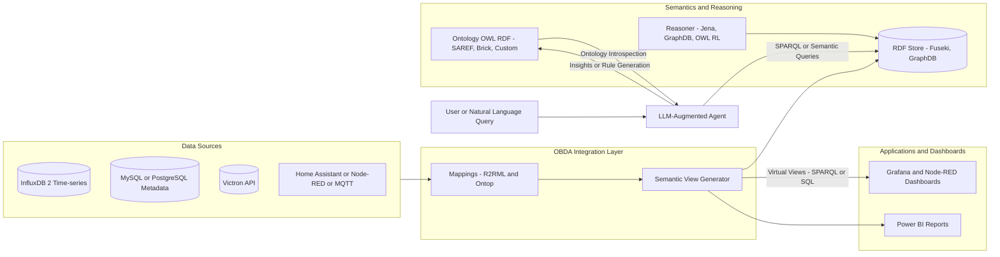

What I'm thinking describing is exactly the kind of problem semantic modeling and ontology-based systems are designed for.

Let’s unpack this a bit so you can see how it fits together:

## What I want to achieve

I have many heterogeneous data sources:

- Environmental sensors: temperature, humidity, CO₂, particulates (PM2.5, etc.)

- Building context: insulation quality (roof/floor/walls), materials, ventilation (Vallox), water heating/circulation (Sorel, Sabiana), renewable generation (Victron solar, battery)

- Behavioral context: 2-person occupancy, sleep times, comfort preferences

I want to generate intelligent database views that automatically:

- Combine data across these domains

- Interpret it semantically (e.g. “sleep comfort”, “heating efficiency”, “air quality health index”)

- Enable analysis and optimization (“how well are we sleeping given humidity trends and CO₂ levels?”)

## Why semantics and ontology are a good fit

A semantic model lets you describe what things mean — not just their names or columns.

## An ontology defines:

- Entities (e.g. Room, Sensor, Appliance, Occupant, Activity)

- Relationships (e.g. Room hasSensor Sensor, Sensor measures Temperature)

- Classes and properties (e.g. Temperature is a subclass of EnvironmentalMetric)

- Rules / inference logic (e.g. If CO₂ > 1200 ppm and OccupantState = Sleeping → SleepAirQuality = Poor)

With this in place, your system can automatically generate views such as:
```
SELECT
  Bedroom.name,
  AVG(temp.value) AS avg_temp,
  AVG(co2.value) AS avg_co2,
  CASE
    WHEN AVG(temp.value) BETWEEN 19 AND 21 AND AVG(co2.value) < 800 THEN 'Optimal Sleep'
    WHEN AVG(temp.value) > 23 OR AVG(co2.value) > 1200 THEN 'Poor Sleep Environment'
    ELSE 'Moderate Sleep'
  END AS sleep_quality
FROM SemanticView('SleepEnvironment')
WHERE timestamp BETWEEN '2025-10-21 23:00' AND '2025-10-22 07:00';
````
(Here, SemanticView('SleepEnvironment') would be generated dynamically from your ontology.)

## Architecture idea

1. Ontology Layer

- Base: [SAREF](https://saref.etsi.org/core/), [Brickschema](https://brickschema.org/), or [SSN/SOSA](https://www.w3.org/TR/vocab-ssn/)
- Extend with your house-specific concepts (insulation, solar power, sleep comfort)
  
2. Data Layer
 - InfluxDB or TimescaleDB for sensor data

- MySQL or PostgreSQL for metadata (device descriptions, room layouts)

- RDF triple store (e.g. Apache Jena Fuseki, GraphDB) for ontology and reasoning

3. Semantic Mapper / View Generator
- Maps raw data (e.g. influxdb.measurement = temperature) → ontology concept (sosa:Observation of saref:Temperature)

- Generates virtual SQL views or SPARQL endpoints per semantic category (e.g. “Thermal Efficiency”, “Sleep Health”, “Power Balance”)

4. Analytics / Dashboard Layer

- Node-RED, Grafana, or Power BI use semantic views directly

- Views adapt automatically as ontology evolves

## Example categories I could model
| Category                          | Example Inputs                                        | Derived Insights          |
| --------------------------------- | ----------------------------------------------------- | ------------------------- |
| **Thermal Efficiency**            | Insulation quality, indoor/outdoor ΔT, heater runtime | Energy loss per m²        |
| **Air Quality & Health**          | CO₂, PM2.5, humidity, temperature                     | Comfort & health score    |
| **Sleep Environment**             | Bedroom temp, CO₂, humidity, noise                    | Sleep quality index       |
| **Energy Production/Consumption** | Victron PV, grid, Sabiana power draw                  | Self-sufficiency ratio    |
| **System Coordination**           | Sorel pump cycles, Vallox AC modes                    | Optimal HVAC coordination |

## Tools & technologies you can use
Ontology / reasoning:

- [Protégé](https://protege.stanford.edu/) for ontology editing
- [Apache Jena](https://jena.apache.org/) or [GraphDB](https://www.ontotext.com/products/graphdb/) for for RDF/SPARQL

Semantic integration:
- [Ontop](https://ontop-vkg.org/) (for generating SQL views from OWL ontologies)
- [OBDA Ontology Based Data Access](https://obda.org/) framework

Data access layer:
- Python or Node.js microservice using RDFLib / rdflib.js for SPARQL queries

Visualization:
- Grafana or Node-RED dashboards built on generated semantic queries
- Power Bi

Result:

You’ll have a living knowledge graph of your house, capable of answering questions like:

“How does roof insulation quality correlate with heating energy consumption when outside temperature drops below -10°C?”

“Was the air quality in the bedroom optimal for good sleep between 00:00–06:00 this week?”

“Which rooms deviate most from the recommended humidity and CO₂ thresholds?”

# Semantic + AI View Generator for Smart Home — Diagram & Starter Kit

## Goal
To automatically generate contextual, meaningful “views” of your house’s data — not just raw sensor metrics — that reflect how well the home performs for human wellbeing and energy efficiency.

> A practical blueprint (diagram + ontology + mappings + queries + Python agent) to generate semantic views for sleep health, energy efficiency, and system coordination in your home.

---

## 1) Architecture Diagram (Mermaid)


## Ontology Skeleton (simplified OWL-like)
````
@prefix saref: <https://saref.etsi.org/core/> .
@prefix sosa: <http://www.w3.org/ns/sosa/> .
@prefix home: <http://example.com/home#> .

home:Room a owl:Class .
home:Sensor a owl:Class .
home:EnergySystem a owl:Class .
home:HealthProfile a owl:Class .

home:Bedroom a home:Room .
home:Kitchen a home:Room .

home:Bedroom1 home:hasSensor home:CO2Sensor1, home:TempSensor1 .
home:Kitchen1 home:hasDevice home:Woodburner1 .
home:House1 home:hasEnergySystem home:VictronSolar, home:ValloxVentilation .

home:CO2Sensor1 sosa:observes saref:CO2Concentration .
home:TempSensor1 sosa:observes saref:Temperature .
home:VictronSolar saref:measures saref:EnergyProduction .

home:HealthySleepProfile a home:HealthProfile ;
  home:recommendedTempRange "19-21" ;
  home:recommendedCO2Max "800" ;
  home:recommendedHumidity "40-55" .
````
This allows you to reason semantically:

If Room has sensors measuring temperature and CO₂,
and readings match HealthySleepProfile,
then tag the environment as "OptimalSleepEnvironment".

Example: Semantic View Generator
SQL/SPARQL View Template
````
CONSTRUCT {
  ?room home:hasSleepQuality ?quality .
}
WHERE {
  ?room a home:Bedroom ;
        home:hasSensor ?tempSensor, ?co2Sensor .
  ?tempSensor sosa:observes saref:Temperature ;
              sosa:hasResult ?tempVal .
  ?co2Sensor sosa:observes saref:CO2Concentration ;
              sosa:hasResult ?co2Val .
  FILTER (?tempVal >= 19 && ?tempVal <= 21 && ?co2Val < 800)
  BIND ("Optimal" AS ?quality)
}
````
Now the AI-enhanced part — where LLMs come in

Rule-based reasoning is great for explicit knowledge,
but LLMs (like GPT or fine-tuned open models) can:

Infer context from imperfect or missing data

Generate new semantic views dynamically

Learn correlations beyond simple thresholds

Translate natural-language questions into SPARQL or SQL

Suggest rules based on observed patterns

1. Natural Language Query Interface
You could ask:

“How was our sleep environment last week when outdoor temperature dropped below 5°C?”

The LLM can:

Parse this into ontology terms (Bedroom, Temperature, CO₂, SleepQuality)

Generate and execute the correct SPARQL/SQL view

Summarize results linguistically (“Average bedroom CO₂ rose to 950 ppm on cold nights, suggesting lower ventilation efficiency.”)

2. AI-based Rule Learning

LLMs can suggest new semantic categories:

Detect correlations like:
“When Sorel pump runs at low speed and humidity > 70%, condensation risk increases in kitchen walls.”

It can propose a new semantic class:
home:CondensationRiskSituation
with inferred conditions for you to validate and add to ontology.

3. Adaptive View Generation

Instead of static SQL/SPARQL templates,
an LLM agent can synthesize new views on demand.

Example:

“Make me a new view showing how energy production from Victron correlates with AC runtime and room temperature stability.”

The LLM:

Extracts entities from ontology (Victron → EnergyProduction, Vallox → HVAC, Room → Temperature)

Queries the knowledge graph

Outputs a view or materialized table definition automatically

4. AI-assisted Reasoning & Summaries

Once semantic views exist, the LLM can interpret them in human terms:

“The insulation effectiveness score improved by 8% after lowering Vallox AC night mode airflow.”

“Your average CO₂ during sleep exceeded the healthy range on 3 nights this week.”

This “semantic narrative generation” layer is extremely powerful for daily insights.

## How to Combine These Practically

| Layer        | Technology                   | AI Role                          |
| ------------ | ---------------------------- | -------------------------------- |
| Ontology     | Protégé + SAREF/Brick        | Source of truth                  |
| Mapping      | Ontop / R2RML                | Structural reasoning             |
| Reasoning    | Apache Jena rules / Pellet   | Deductive reasoning              |
| AI Agent     | LLM (GPT / local model)      | Inductive & linguistic reasoning |
| Query Engine | SPARQL / SQL + Python bridge | Execution                        |
| Dashboard    | Node-RED / Grafana           | Visualization                    |

Next Steps

Create base ontology (SAREF + your home context)

Connect to live data (InfluxDB, Victron, etc.)

Deploy a semantic store (e.g. Jena Fuseki)

Build Python agent that:

Reads ontology metadata

Accepts natural-language queries

Generates dynamic views using LLM

Visualize via Grafana / Node-RED

(Optional) Add reinforcement loop — LLM proposes better thresholds based on outcomes (“sleep quality improved when CO₂ < 700 ppm”).
