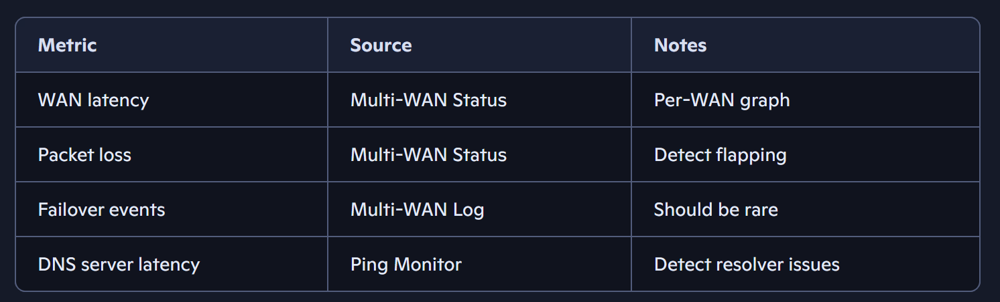
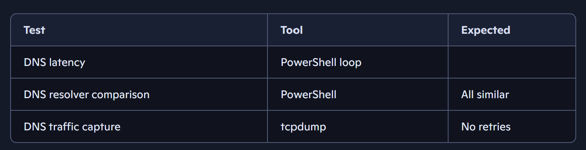
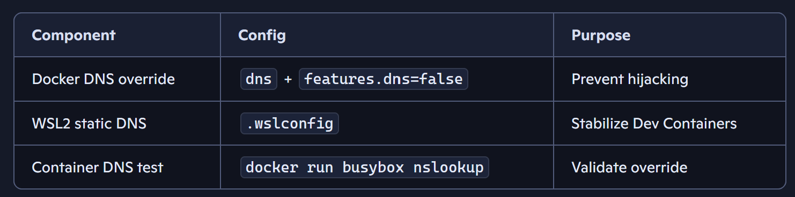
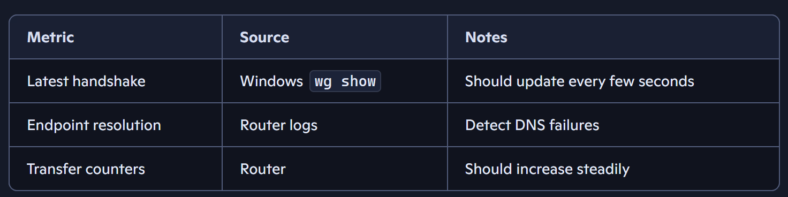
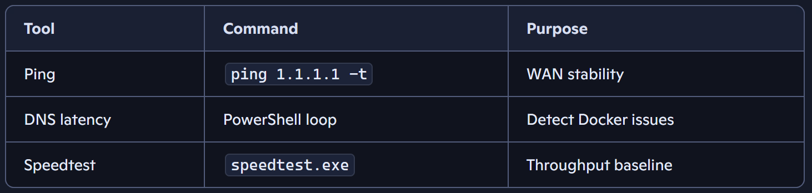

# Is Docker messing up DNS?

Docker (and especially VS Code Dev Containers) can temporarily disrupt DNS resolution or network throughput on both Windows and Linux hosts. And with your Teltonika + multi‑WAN + WireGuard setup, even small changes in DNS behavior can ripple through the whole network. 

Let’s break this into two parts:

    Is Docker actually messing with your DNS or routing?

    How to monitor your network in a way that gives you confidence — using tools you already have (Teltonika + Windows + simple CLI).

Below is a structured, practical approach you can run manually and repeat whenever you suspect issues.

# 1. Why Docker/Dev Containers Can Cause DNS Weirdness

## Docker Desktop (Windows/macOS) does:
- Creates a virtual network adapter

- Injects its own DNS proxy (typically 127.0.0.1:53)

- Rewrites /etc/resolv.conf inside containers

- Sometimes forces the host to use Hyper-V NAT or WSL2 DNS forwarders

## VS Code Dev Containers adds:
- Additional network namespaces

- Per-container DNS overrides

- Occasional slowdowns when the DNS proxy inside WSL2 stalls

## Symptoms you might see:
- DNS resolving sometimes takes 1–3 seconds

- Some domains fail on first lookup but succeed on retry

- Speedtest shows lower throughput until Docker is restarted

- WireGuard handshake delays (because DNS lookup for endpoint stalls)

Given your multi‑WAN Teltonika setup, DNS latency is especially noticeable because:
- Load balancing can cause DNS queries to exit via different WANs

- Some WANs may have slower DNS resolvers

- WireGuard endpoint resolution happens on the client side

# 2. Manual Monitoring: The Most Reliable Approach
Below is a repeatable, low-noise diagnostic workflow that works beautifully with Teltonika routers.
## A. Continuous DNS latency monitoring
Run this on your Windows laptop:
````
# Powershell
# DNS latency test every second
while ($true) {
  Resolve-DnsName google.com | Select-Object Name, QueryType, @{n="ms";e={$_.QueryTime}} 
  Start-Sleep -Seconds 1
}
````
- If Docker is causing issues, you’ll see:
Sudden spikes to 200–2000 ms

- Occasional timeouts

##  B. Continuous ping to detect WAN instability
Pick a stable target (Cloudflare is ideal):
````
# Powershell
ping 1.1.1.1 -t
````
If your multi‑WAN load balancing is misbehaving, you’ll see:
- Bursts of packet loss

- Latency jumps when WANs switch

## C. DNS server comparison test
This tells you whether the problem is Docker or your WANs:
````
# Powershell
# Cloudflare DNS
Resolve-DnsName google.com -Server 1.1.1.1

# Google DNS
Resolve-DnsName google.com -Server 8.8.8.8

# Teltonika router DNS
Resolve-DnsName google.com -Server <your-router-LAN-IP>

````

If:
- Only the default resolver is slow → Docker/WSL2 issue

- All resolvers are slow → WAN or Teltonika issue

# 3. Monitoring From Teltonika RUTM52
Your RUTM52 is actually a great monitoring tool.
## A. Use built‑in Ping Reboot / Ping Monitor (but not for rebooting)
Go to:
**Services → Ping Reboot → Ping Monitor**
Add:
- 1.1.1.1

- 8.8.8.8

- Your VPN endpoint

- Your DNS servers

Set:
- Interval: 10 seconds

- Count: 1

- Timeout: 1

This gives you a **WAN health graph.**

## B. Use Multi‑WAN → Status
This shows:
- Per‑WAN latency

- Packet loss

- Failover events

If Docker triggers DNS issues, you’ll often see:
- No WAN failover events

- But DNS latency spikes on the client side

This confirms the problem is local, not on the router.

## C. Use System → Maintenance → Troubleshoot → “tcpdump”
You can capture DNS traffic:
````
tcpdump -i br-lan port 53
````

Look for:
- Retries

- Long gaps between query and response

- Queries going to unexpected DNS servers (Docker sometimes injects its own)

# 4. The Most Likely Culprit in this Setup
Given your environment, the most common pattern is:
✔ Docker/WSL2 temporarily hijacks DNS

→
✔ Windows host DNS queries slow down

→
✔ WireGuard endpoint resolution slows

→
✔ You feel like “internet is slow” even though WANs are fine

This is extremely common with:
- VS Code Dev Containers

- WSL2 backend

- Windows 11

- Multi‑WAN routers

You’re not imagining it.
# 🛠 5. Practical Fixes You Can Try
## 🟦 A. Force Docker to use your Teltonika DNS
In Docker Desktop:
**Settings → Docker Engine → add:**
````
"dns": ["192.168.x.1", "1.1.1.1"]
````
Restart Docker.
## 🟦 B. Disable Docker’s internal DNS proxy
Add:
````
"features": {
  "dns": false
}
````
## 🟦 C. Force WSL2 to use static DNS
Edit:
%UserProfile%\.wslconfig

````
[wsl2]
dns = 1.1.1.1
````

Restart WSL:
````
wsl --shutdown
````
# 📊 Unified Monitoring Dashboard for Teltonika + Docker DNS Stability

Below is a full blueprint you can implement immediately. It combines:

    - Teltonika RUTM52 WAN health monitoring

    - DNS latency monitoring

    - WireGuard handshake monitoring

    - Docker DNS override

    - Optional Windows/WSL2 monitoring scripts

    - A simple dashboard layout you can paste into Confluence

Everything is modular — you can run only the parts you need.

# 🧱 1. Teltonika Router Monitoring Setup (RUTM52 + RUTX series)
## 🟦 A. WAN Latency & Packet Loss Monitoring (Multi‑WAN)

On the RUTM52:

Go to:  
Network → Failover / Load Balancing → Status

Enable monitoring for each WAN:

    Ping target 1: 1.1.1.1

    Ping target 2: 8.8.8.8

    Ping target 3: Your VPN endpoint

    Ping interval: 10 seconds

    Timeout: 1 second

    Retries: 1

This gives you:

    Per‑WAN latency graph

    Packet loss

    Failover events

    WAN flapping detection

## 🟦 B. DNS Health Monitoring (Router‑side)

On the RUTM52:

Services → Ping Reboot → Ping Monitor

Add DNS servers:

    1.1.1.1

    8.8.8.8

    Your ISP DNS

    Your internal DNS (if any)

Set:

    Interval: 10 seconds

    Count: 1

    Timeout: 1

This gives you a DNS‑specific health graph independent of Docker.
## 🟦 C. DNS Traffic Capture (for deep debugging)

System → Maintenance → Troubleshoot → tcpdump

Run:
````
tcpdump -i br-lan port 53 -n
````

You’ll see:

    - DNS retries

    - Slow responses

    - Unexpected DNS servers (Docker sometimes injects its own)

    🐳 2. Docker DNS Override Configuration (Stable & Teltonika‑friendly)

This is the most reliable configuration for Windows + WSL2 + Dev Containers.
## 🟦 A. Edit Docker Engine config

**Docker Desktop → Settings → Docker Engine**

Add:
````
{
  "dns": [
    "192.168.1.1",
    "1.1.1.1",
    "8.8.8.8"
  ],
  "features": {
    "dns": false
  }
}
````
Replace 192.168.1.1 with your RUTM52 LAN IP.

This does two things:

    - Forces Docker to use your router’s DNS

    - Disables Docker’s internal DNS proxy (the usual troublemaker)

Restart Docker Desktop.

## 🟦 B. WSL2 DNS Stabilization (critical for Dev Containers)

Edit:

%UserProfile%\.wslconfig

Add:
````
[wsl2]
dns = 1.1.1.1
````
Then:
````
wsl --shutdown
````
This prevents WSL2 from hijacking DNS when Dev Containers start.
🖥 3. Windows Host Monitoring Tools (Simple & Effective)

These give you real‑time visibility into DNS and WAN behavior.
## 🟦 A. Continuous DNS Latency Monitor
````
while ($true) {
  Resolve-DnsName google.com | Select-Object Name, QueryType, @{n="ms";e={$_.QueryTime}}
  Start-Sleep -Seconds 1
}
````

Watch for:

    - Spikes above 200 ms

    - Timeouts

    - Irregular patterns when Docker starts

## 🟦 B. Continuous Ping (WAN stability)
````
ping 1.1.1.1 -t
````

If your multi‑WAN is switching, you’ll see:

    - Latency jumps

    - Packet loss bursts

## 🟦 C. Compare DNS resolvers (detect Docker interference)

````
Resolve-DnsName google.com -Server 1.1.1.1
Resolve-DnsName google.com -Server 8.8.8.8
Resolve-DnsName google.com -Server <your-router-ip>
````

If:

    - Only default resolver is slow → Docker/WSL2 issue

    - All resolvers slow → WAN or Teltonika issue

# 🔐 4. WireGuard Monitoring (Laptop + Router)
## 🟦 A. Windows WireGuard handshake monitor
````
while ($true) {
  wg show | Select-String "latest handshake"
  Start-Sleep -Seconds 5
}
````
If DNS is unstable, you’ll see:

    - Delayed handshakes

    - No handshake for long periods

## 🟦 B. Teltonika WireGuard peer monitoring

**Services → VPN → WireGuard → Status**

Watch:

    - Latest handshake

    - Transfer counters

    - Endpoint resolution failures


# 📊 5. Unified Dashboard Layout (Confluence‑ready)

You can paste this directly into Confluence.
## Unified Network Monitoring Dashboard
1. WAN Health (RUTM52)



2. DNS Stability


3. Docker/WSL2 Health


4. WireGuard Monitoring


5. Host Network Monitoring
