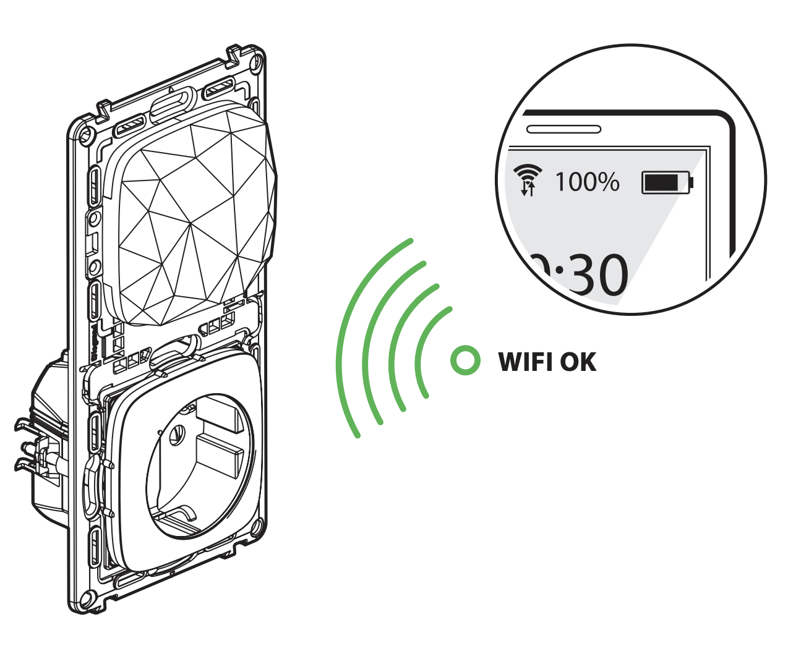
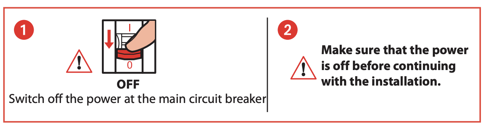
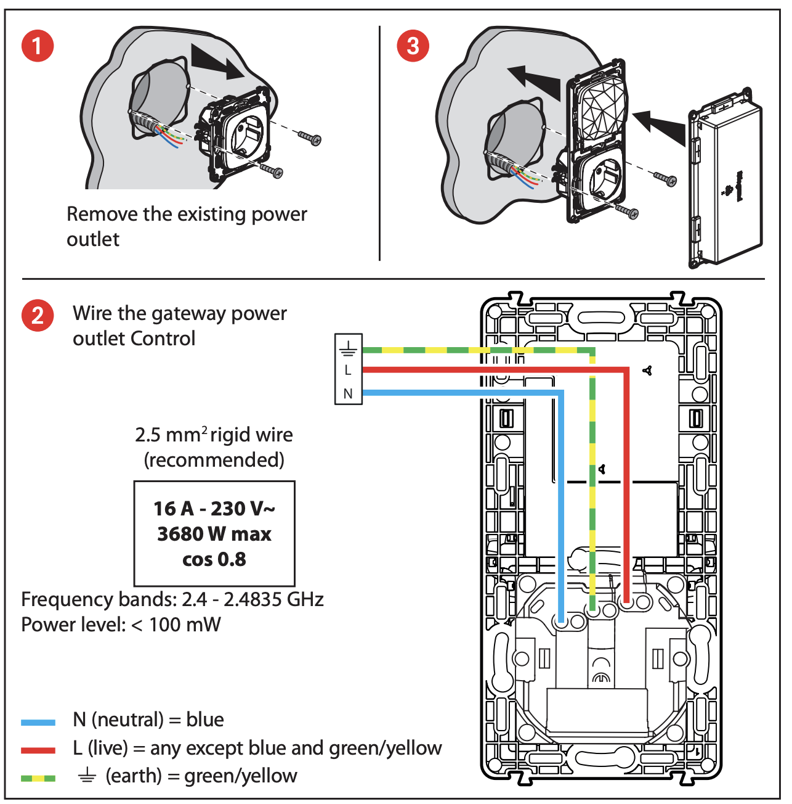
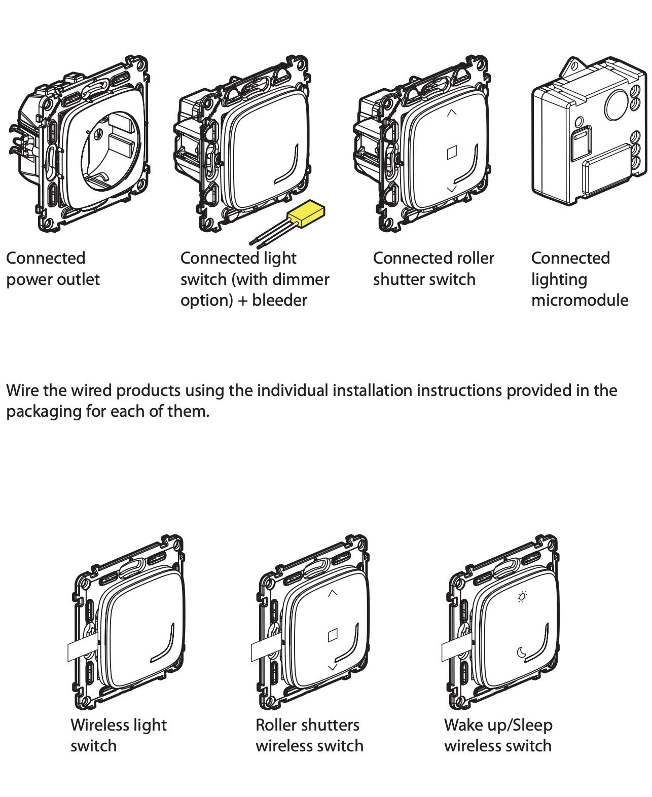

# 1. Step by step installation
Choose a place to put the gateway power outlet Control, 
where a standard power outlet is located:

1. If there is an Internet router in the home, use a smartphone to check if the WiFi 
signal is strong enough in the chosen place.
2. If there isn’t a router yet, choose a place near a fibre or telephone outlet
 which will be used for the router.
3. Install the gateway power outlet Control where the selected standard power 
outlet is. This is compatible with standard, 40mm-deep flush-mounting boxes 
attached with screws or claws.

# 2. Necessary safety precautions

# 3. Install the gateway power outlet Control

# 4. Complete your installation with additional products
 (not included in this pack) :

 The wireless switches will be installed later