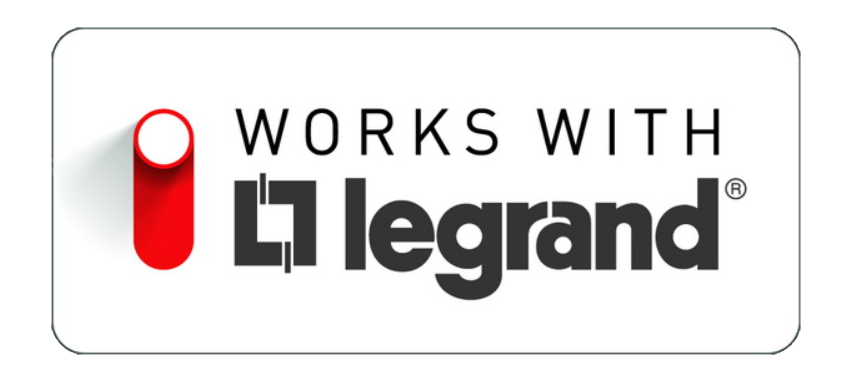
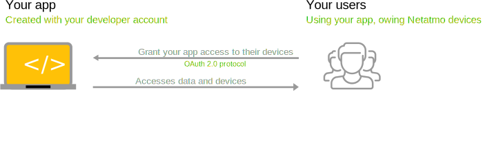

# Out of the box API by Netatmo 

https://dev.netatmo.com/apidocumentation/

https://my.netatmo.com/app/station

# Out of the box Legrand API
https://portal.developer.legrand.com/reference#api=emergency-lighting-api&operation=decodeFailureFlag

https://dev.netatmo.com/apidocumentation/control
https://developer.legrand.com/tutorial/

## Netatmo weather station

### Authentication
Before reading or writing data with Netatmo Connect APIs, an application needs to authenticate. Netatmo Connect APIs implements the OAuth 2 authorization protocol and respects it RFC.

This authentification method basically consist in asking the owner of the products for reading and writing rights. Rights are handled through "Scopes". Once the user has given you the permission you need, your server will receive a temporary code with which you will request an access and a refresh token. Once you have the access token, you will be able to retrieve data from the Netatmo API.

This standard method is the "Authorization code" grant type. For personal use only (the account with which the API application have been created), you can also authenticate with the "Client credentials" grant type in which the username and the password should be sent along with the request.

In both cases, you will retrieve one access token and one refresh token. The access token represent a key for each user to access the data and it should be sent along with the request you will make to Netatmo backend. To know how you should send the access token, check out the "Using a token" part.

As all access token expires after a certain duration, you need to refresh it using the refresh token. This process is described in the "Refreshing a token" part of the documentation.

#### Scopes
Access tokens are associated to a scope, when requesting one, you should precise which scope you require. There are nine available scopes:

read_station: to retrieve weather station data (Getstationsdata, Getmeasure)

read_thermostat: to retrieve thermostat data ( Homestatus, Getroommeasure...)

write_thermostat: to set up the thermostat (Synchomeschedule, Setroomthermpoint...)

read_camera: to retrieve Smart Indoor Cameradata (Gethomedata, Getcamerapicture...)

write_camera: to inform the Smart Indoor Camera that a specific person or everybody has left the Home (Setpersonsaway, Setpersonshome)

access_camera: to access the camera, the videos and the live stream *

read_presence: to retrieve Smart Outdoor Camera data (Gethomedata, Getcamerapicture...)

access_presence: to access the camera, the videos and the live stream *

read_smokedetector : to retrieve the Smart Smoke Alarm informations and events (Gethomedata, Geteventsuntil...)

read_homecoach: to read data coming from Smart Indoor Air Quality Monitor (gethomecoachsdata)

If no scope is provided during the token request, the default is "read_station"

* Netatmo cares a lot about users privacy and security. The "access" scope grants you access to sensitive data and is delivered by Netatmo teams on a per-app basis. To submit an access scope request, see here.

Authorization code grant type
The authorization code flow is the most common flow for a secure authorization. It allows the end user to provide an explicit consent provide his data to the third party application.

This authentication flow takes place in 4 steps.
Your application calls the browser and redirects the user to Netatmo OAuth2 dialog

The user is prompted to authorize your application

The user is redirected to your application with an additional parameter

You retrieve the access token from the API using the additional parameter

Step 1 - Redirect the user to Netatmo OAuth2 dialog
Redirect the user to the API authorize url. Our platform will authenticate the user and ask them to confirm they agree with the application accessing their data.

Method: POST

Request example

https://api.netatmo.com/oauth2/authorize?
    client_id=[YOUR_APP_ID]
    &redirect_uri=[YOUR_REDIRECT_URI]
    &scope=[SCOPE_SPACE_SEPARATED]
    &state=[SOME_ARBITRARY_BUT_UNIQUE_STRING]

If the callback URL of your application is statically configured in the settings, the redirect_uri parameter may be omitted. If present, it should match the one statically defined. Response_type parameter can also be set to 'code' but this field is not mandatory as it will be set directly by default by our service.

To ensure the security of the process, you should generate and store a state parameter which is unique to this request. The state parameter is an arbitrary string you choose. It will be passed back to your application as a parameter of the redirect_uri when the user completes the authentication flow. Before trusting the authorization response, you should check that the returned state parameter matches the one sent in the request.
Use of the state parameter helps to prevent Cross-site Request Forgery.

Step 2 - The user is prompted to authorize your application
Note: If the user is not already logged in to their Netatmo account, they will be prompted to log in.

Step 3 - The user is redirected to your application
The user is now redirected to the callback URL defined in your application settings or to the redirect_uri provided in the request. If they authorized the application they will be redirected with additional parameters :

[YOUR_REDIRECT_URI]?state=[YOUR_STATE_VALUE]code=[NETATMO_GENERATED_CODE]
If they did not authorize the application, the additional parameters will be "error=access_denied"

Step 4 - Retrieve the access token with the code
Retrieve an access token for your user with the code parameter received at step 3 with method https://api.netatmo.com/oauth2/token and grant_type authorization_code.

When requesting an access token, you should precise which scope you require.

Request example

POST /oauth2/token HTTP/1.1
    Host: api.netatmo.com
    Content-Type: application/x-www-form-urlencoded;charset=UTF-8

    grant_type=authorization_code
    client_id=[YOUR_APP_ID]
    client_secret=[YOUR_CLIENT_SECRET]
    code=[CODE_RECEIVED_FROM_USER]
    redirect_uri=[YOUR_REDIRECT_URI]
    scope=[SCOPE_SPACE_SEPARATED]

Return example

HTTP/1.1 200 OK
    Content-Type: application/json;charset=UTF-8
    Cache-Control: no-store
    Pragma: no-cache

    {
    "access_token":"2YotnFZFEjr1zCsicMWpAA",
    "expires_in":10800,
    "refresh_token":"tGzv3JOkF0XG5Qx2TlKWIA",
    }

Client credentials grant type
https://api.netatmo.com/oauth2/token
Method: POST

!! This method will be deprecated in october 2022 !!
If you want to access data from another user's account, you MUST use the Authorization code grant type.

Entry parameters

Name

Required

Example

Description

client_id

yes

10acb39bc818e5789

Your app client_id

client_secret

yes

10dsfxyzbkzva

Your app client_secret

grant_type

yes

password

OAuth grant type

username

yes

user@email.address

User address email

password

yes

UserPassword

User password

scope

no

read_station read_thermostat

Scopes space separated

Return parameters

Name

Description

access_token

Access token for your user

expires_in

Validity timelaps in seconds

refresh_token

Use this token to get a new access_token once it has expired

Request example

POST /oauth2/token HTTP/1.1
    Host: api.netatmo.com
    Content-Type: application/x-www-form-urlencoded;charset=UTF-8

    grant_type=password
    client_id=[YOUR_APP_ID]
    client_secret=[YOUR_CLIENT_SECRET]
    username=[USER_MAIL]
    password=[USER_PASSWORD]
    scope=[SCOPES_SPACE_SEPARATED]

Return example

HTTP/1.1 200 OK
    Content-Type: application/json;charset=UTF-8
    Cache-Control: no-store
    Pragma: no-cache

    {
    "access_token":"2YotnFZFEjr1zCsicMWpAA",
    "expires_in":10800,
    "refresh_token":"tGzv3JOkF0XG5Qx2TlKWIA",
    }
Using a token
Netatmo uses the Bearer authentication (also called token authentication) which is an HTTP authentication scheme that involves security tokens called bearer tokens. The name “Bearer authentication” can be understood as “give access to the bearer of this token.” The Bearer authentication scheme was originally created as part of OAuth 2.0 in RFC 6750

You must send the access token previously retrieve in the Authorization header when making requests to Netatmo Home API

Header

Key

Value

Authorization

Bearer [YOUR_ACCESS_TOKEN]

Refreshing a token
When you request a token (via grant type credentials or authorization code) you retrieve as well the validity timelapse and a refresh token. Once your token has expired, you'll have to request a new one using the grant_type refresh_token.

Endpoint: https://api.netatmo.com/oauth2/token
Method: POST

Entry parameters

Name

Required

Description

grant_type

yes

refresh_token

refresh_token

yes

the refresh token retrieved while requesting an access_token

client_id

yes

your client id

client_secret

yes

your client secret

Return parameters

Name

Description

access_token

Access token for your user

expires_in

Validity timelaps in seconds

refresh_token

Use this token to get a new access_token once it has expired

Request example

POST /oauth2/token HTTP/1.1
  Host: api.netatmo.com
  Content-Type: application/x-www-form-urlencoded;charset=UTF-8

  grant_type=refresh_token
  refresh_token=[YOUR_REFRESH_TOKEN]
  client_id=[YOUR_APP_ID]
  client_secret=[YOUR_CLIENT_SECRET]

Return example
HTTP/1.1 200 OK
Content-Type: application/json;charset=UTF-8
Cache-Control: no-store
Pragma: no-cache

{
  "access_token":"2YotnFZFEjr1zCsicMWpAA",
  "expires_in":10800,
  "refresh_token":"tGzv3JOkF0XG5Qx2TlKWIA",
}
Errors
Here are the error codes you can encounter during the Oauth flow:

Error returned

Description

invalid_request

Missing parameters, \"username\" and \"password\" are required

invalid_request

Scope is not identical as the one granted by the user

unauthorized_client

The client is not authorized to use the requested response type.

redirect_uri_mismatch

The redirection URI provided does not match a pre-registered value.

access_denied

The end-user or authorization server denied the request.

unsupported_response_type

The requested response type is not supported by the authorization server.

invalid_scope

The requested scope is invalid (unknown or malformed).

invalid_grant

This is caused by an URI issue. Either you're not specifying the same URI in your calls; \ror the one you specified didn't match the one you associated with your app in your account settings.

## Data from cloud to OnPrem NoSql