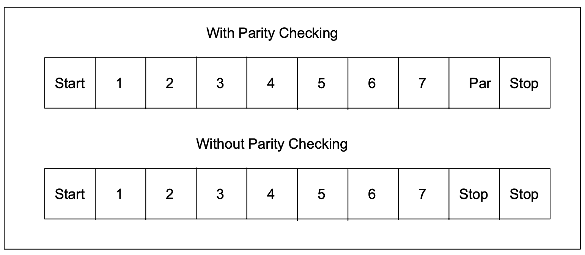

# Introducing Modbus Protocol
Modicon programmable controllers can communicate with each other and with
other devices over a variety of networks. Supported networks include the Modicon
Modbus and Modbus Plus industrial networks, and standard networks such as
MAP and Ethernet. Networks are accessed by built–in ports in the controllers or
by network adapters, option modules, and gateways that are available from
Modicon. For original equipment manufacturers, Modicon ModConnect ‘partner’
programs are available for closely integrating networks like Modbus Plus into
proprietary product designs.

The common language used by all Modicon controllers is the Modbus protocol.
This protocol defines a message structure that controllers will recognize and use,
regardless of the type of networks over which they communicate. It describes the
process a controller uses to request access to another device, how it will respond
to requests from the other devices, and how errors will be detected and reported.
It establishes a common format for the layout and contents of message fields.

The Modbus protocol provides the internal standard that the Modicon controllers
use for parsing messages. During communications on a Modbus network, the
protocol determines how each controller will know its device address, recognize a
message addressed to it, determine the kind of action to be taken, and extract any
data or other information contained in the message. If a reply is required, the
controller will construct the reply message and send it using Modbus protocol.

On other networks, messages containing Modbus protocol are imbedded into the
frame or packet structure that is used on the network. For example, Modicon
network controllers for Modbus Plus or MAP, with associated application software
libraries and drivers, provide conversion between the imbedded Modbus message
protocol and the specific framing protocols those networks use to communicate
between their node devices.

This conversion also extends to resolving node addresses, routing paths, and
error–checking methods specific to each kind of network. For example, Modbus
device addresses contained in the Modbus protocol will be converted into node
addresses prior to transmission of the messages. Error–checking fields will also
be applied to message packets, consistent with each network’s protocol. At the
final point of delivery, however – for example, a controller – the contents of the
imbedded message, written using Modbus protocol, define the action to be taken.

## Modbus Protocol
Figure 1 shows how devices might be interconnected in a hierarchy of networks
that employ widely differing communication techniques. In message transactions,
the Modbus protocol imbedded into each network’s packet structure provides the
common language by which the devices can exchange data.
*
Figure 1 Overview of Modbus Protocol Application*
##Transactions on Modbus Networks
Standard Modbus ports on Modicon controllers use an RS–232C compatible serial
interface that defines connector pinouts, cabling, signal levels, transmission baud
rates, and parity checking. Controllers can be networked directly or via modems.
Controllers communicate using a master–slave technique, in which only one
device (the master) can initiate transactions (called ‘queries’). The other devices
(the slaves) respond by supplying the requested data to the master, or by taking
the action requested in the query. Typical master devices include host processors
and programming panels. Typical slaves include programmable controllers.
The master can address individual slaves, or can initiate a broadcast message to
all slaves. Slaves return a message (called a ‘response’) to queries that are
addressed to them individually. Responses are not returned to broadcast queries
from the master.
The Modbus protocol establishes the format for the master’s query by placing into
it the device (or broadcast) address, a function code defining the requested action,
any data to be sent, and an error–checking field. The slave’s response message
is also constructed using Modbus protocol. It contains fields confirming the action
taken, any data to be returned, and an error–checking field. If an error occurred in
receipt of the message, or if the slave is unable to perform the requested action,
the slave will construct an error message and send it as its response.

## Transactions on Other Kinds of Networks
In addition to their standard Modbus capabilities, some Modicon controller models
can communicate over Modbus Plus using built–in ports or network adapters, and
over MAP, using network adapters.
On these networks, the controllers communicate using a peer–to–peer technique,
in which any controller can initiate transactions with the other controllers. Thus a
controller may operate either as a slave or as a master in separate transactions.
Multiple internal paths are frequently provided to allow concurrent processing of
master and slave transactions.

At the message level, the Modbus protocol still applies the master–slave principle
even though the network communication method is peer–to–peer. If a controller
originates a message, it does so as a master device, and expects a response from
a slave device. Similarly, when a controller receives a message it constructs a
slave response and returns it to the originating controller.

## The Query–Response Cycle

*Figure 2 Master–Slave Query–Response Cycle*
### The Query: 
The function code in the query tells the addressed slave device what
kind of action to perform. The data bytes contain any additional information that
the slave will need to perform the function. For example, function code 03 will
query the slave to read holding registers and respond with their contents. The
data field must contain the information telling the slave which register to start at
and how many registers to read. The error check field provides a method for the
slave to validate the integrity of the message contents.
### The Response: 
If the slave makes a normal response, the function code in the
response is an echo of the function code in the query. The data bytes contain the
data collected by the slave, such as register values or status. If an error occurs,
the function code is modified to indicate that the response is an error response,
and the data bytes contain a code that describes the error. The error check field
allows the master to confirm that the message contents are valid.
## The Two Serial Transmission Modes
Controllers can be setup to communicate on standard Modbus networks using
either of two transmission modes: ASCII or RTU. Users select the desired mode,
along with the serial port communication parameters (baud rate, parity mode, etc),
during configuration of each controller. The mode and serial parameters must be
the same for all devices on a Modbus network .
The selection of ASCII or RTU mode pertains only to standard Modbus networks.
It defines the bit contents of message fields transmitted serially on those networks.
It determines how information will be packed into the message fields and decoded.
On other networks like MAP and Modbus Plus, Modbus messages are placed into
frames that are not related to serial tranasmission. For example, a request to read
holding registers can be handled between two controllers on Modbus Plus without
regard to the current setup of either controller’s serial Modbus port.
###ASCII Mode
When controllers are setup to communicate on a Modbus network using ASCII
(American Standard Code for Information Interchange) mode, each 8–bit byte in a
message is sent as two ASCII characters. The main advantage of this mode is
that it allows time intervals of up to one second to occur between characters
without causing an error.

The format for each byte in ASCII mode is:
**Coding System**: Hexadecimal, ASCII characters 0–9, A–F
One hexadecimal character contained in each
ASCII character of the message
**Bits per Byte**: 1 start bit
7 data bits, least significant bit sent first
1 bit for even/odd parity; no bit for no parity
1 stop bit if parity is used; 2 bits if no parity
**Error Check Field**: Longitudinal Redundancy Check (LRC)

## RTU Mode
When controllers are setup to communicate on a Modbus network using RTU
(Remote Terminal Unit) mode, each 8–bit byte in a message contains two 4–bit
hexadecimal characters. The main advantage of this mode is that its greater
character density allows better data throughput than ASCII for the same baud rate.
Each message must be transmitted in a continuous stream.
The format for each byte in RTU mode is:

**Coding System**: 8–bit binary, hexadecimal 0–9, A–F
Two hexadecimal characters contained in each
8–bit field of the message
**Bits per Byte**: 1 start bit
8 data bits, least significant bit sent first
1 bit for even/odd parity; no bit for no parity
1 stop bit if parity is used; 2 bits if no parity
**Error Check Field**: Cyclical Redundancy Check (CRC)

## Modbus Message Framing
In either of the two serial transmission modes (ASCII or RTU), a Modbus message
is placed by the transmitting device into a frame that has a known beginning and
ending point. This allows receiving devices to begin at the start of the message,
read the address portion and determine which device is addressed (or all devices,
if the message is broadcast), and to know when the message is completed.
Partial messages can be detected and errors can be set as a result.
On networks like MAP or Modbus Plus, the network protocol handles the framing
of messages with beginning and end delimiters that are specific to the network.
Those protocols also handle delivery to the destination device, making the
Modbus address field imbedded in the message unnecessary for the actual
transmission. (The Modbus address is converted to a network node address and
routing path by the originating controller or its network adapter.)
### ASCII Framing
In ASCII mode, messages start with a ‘colon’ ( : ) character (ASCII 3A hex), and
end with a ‘carriage return – line feed’ (CRLF) pair (ASCII 0D and 0A hex).

The allowable characters transmitted for all other fields are hexadecimal 0–9, A–F.
Networked devices monitor the network bus continuously for the ‘colon’ character.
When one is received, each device decodes the next field (the address field) to
find out if it is the addressed device.

Intervals of up to one second can elapse between characters within the message.

If a greater interval occurs, the receiving device assumes an error has occurred.

A typical message frame is shown below.

*Figure 3 ASCII Message Frame*

Exception: With the 584 and 984A/B/X controllers, an ASCII message can
normally terminate after the LRC field without the CRLF characters being sent.
An interval of at least one second must then occur. If this happens, the controller
will assume that the message terminated normally.
## RTU Framing
In RTU mode, messages start with a silent interval of at least 3.5 character times.
This is most easily implemented as a multiple of character times at the baud rate
that is being used on the network (shown as T1–T2–T3–T4 in the figure below).
The first field then transmitted is the device address.

The allowable characters transmitted for all fields are hexadecimal 0–9, A–F.
Networked devices monitor the network bus continuously, including during the
‘silent’ intervals. When the first field (the address field) is received, each device
decodes it to find out if it is the addressed device.

Following the last transmitted character, a similar interval of at least 3.5 character
times marks the end of the message. A new message can begin after this interval.

The entire message frame must be transmitted as a continuous stream. If a silent
interval of more than 1.5 character times occurs before completion of the frame,
the receiving device flushes the incomplete message and assumes that the next
byte will be the address field of a new message.

Similarly, if a new message begins earlier than 3.5 character times following a
previous message, the receiving device will consider it a continuation of the
previous message. This will set an error, as the value in the final CRC field will not
be valid for the combined messages. A typical message frame is shown below.

*Figure 4 RTU Message Frame*

## How the Address Field is Handled
The address field of a message frame contains two characters (ASCII) or eight
bits (RTU). Valid slave device addresses are in the range of 0 – 247 decimal.
The individual slave devices are assigned addresses in the range of 1 – 247. A
master addresses a slave by placing the slave address in the address field of the
message. When the slave sends its response, it places its own address in this
address field of the response to let the master know which slave is responding.
Address 0 is used for the broadcast address, which all slave devices recognize.
When Modbus protocol is used on higher level networks, broadcasts may not be
allowed or may be replaced by other methods. For example, Modbus Plus uses a
shared global database that can be updated with each token rotation.
## How the Function Field is Handled
The function code field of a message frame contains two characters (ASCII) or
eight bits (RTU). Valid codes are in the range of 1 – 255 decimal. Of these, some
codes are applicable to all Modicon controllers, while some codes apply only to
certain models, and others are reserved for future use. Current codes are
described in Chapter 2.

When a message is sent from a master to a slave device the function code field
tells the slave what kind of action to perform. Examples are to read the ON/OFF
states of a group of discrete coils or inputs; to read the data contents of a group of
registers; to read the diagnostic status of the slave; to write to designated coils or
registers; or to allow loading, recording, or verifying the program within the slave.

When the slave responds to the master, it uses the function code field to indicate
either a normal (error–free) response or that some kind of error occurred (called
an exception response). For a normal response, the slave simply echoes the
original function code. For an exception response, the slave returns a code that is
equivalent to the original function code with its most–significant bit set to a logic 1.

For example, a message from master to slave to read a group of holding registers
would have the following function code:

    0000 0011 (Hexadecimal 03)
If the slave device takes the requested action without error, it returns the same
code in its response. If an exception occurs, it returns:

    1000 0011 (Hexadecimal 83)

In addition to its modification of the function code for an exception response, the
slave places a unique code into the data field of the response message. This tells
the master what kind of error occurred, or the reason for the exception.
The master device’s application program has the responsibility of handling
exception responses. Typical processes are to post subsequent retries of the
message, to try diagnostic messages to the slave, and to notify operators.

## Contents of the Data Field
The data field is constructed using sets of two hexadecimal digits, in the range of
00 to FF hexadecimal. These can be made from a pair of ASCII characters, or
from one RTU character, according to the network’s serial transmission mode

The data field of messages sent from a master to slave devices contains
additional information which the slave must use to take the action defined by the
function code. This can include items like discrete and register addresses, the
quantity of items to be handled, and the count of actual data bytes in the field.

For example, if the master requests a slave to read a group of holding registers
(function code 03), the data field specifies the starting register and how many
registers are to be read. If the master writes to a group of registers in the slave
(function code 10 hexadecimal), the data field specifies the starting register, how
many registers to write, the count of data bytes to follow in the data field, and the
data to be written into the registers.

If no error occurs, the data field of a response from a slave to a master contains
the data requested. If an error occurs, the field contains an exception code that
the master application can use to determine the next action to be taken.

The data field can be nonexistent (of zero length) in certain kinds of messages.
For example, in a request from a master device for a slave to respond with its
communications event log (function code 0B hexadecimal), the slave does not
require any additional information. The function code alone specifies the action.

## Contents of the Error Checking Field
Two kinds of error–checking methods are used for standard Modbus networks.
The error checking field contents depend upon the method that is being used.

### ASCII
When ASCII mode is used for character framing, the error checking field contains
two ASCII characters. The error check characters are the result of a Longitudinal
Redundancy Check (LRC) calculation that is performed on the message contents,
exclusive of the beginning ‘colon’ and terminating CRLF characters.

The LRC characters are appended to the message as the last field preceding the
CRLF characters

 ### RTU
 The CRC field is appended to the message as the last field in the message.
When this is done, the low–order byte of the field is appended first, followed by the
high–order byte. The CRC high–order byte is the last byte to be sent in the
message.

Additional information about error checking is contained later in this chapter.
Detailed steps for generating LRC and CRC fields can be found in Appendix C.

## How Characters are Transmitted Serially
When messages are transmitted on standard Modbus serial networks, each
character or byte is sent in this order (left to right):
With ASCII character framing, the bit sequence is:

*Figure 5 Bit Order (ASCII)*

Least Significant Bit (LSB) . . . Most Significant Bit (MSB)

With RTU character framing, the bit sequence is:

*Figure 6 Bit Order (RTU)*

## Error Checking Methods
Standard Modbus serial networks use two kinds of error checking. Parity checking
(even or odd) can be optionally applied to each character. Frame checking (LRC
or CRC) is applied to the entire message. Both the character check and message
frame check are generated in the master device and applied to the message
contents before transmission. The slave device checks each character and the
entire message frame during receipt

The master is configured by the user to wait for a predetermined timeout interval
before aborting the transaction. This interval is set to be long enough for any
slave to respond normally. If the slave detects a transmission error, the message
will not be acted upon. The slave will not construct a response to the master.
Thus the timeout will expire and allow the master’s program to handle the error.
Note that a message addressed to a nonexistent slave device will also cause a
timeout

Other networks such as MAP or Modbus Plus use frame checking at a level above
the Modbus contents of the message. On those networks, the Modbus message
LRC or CRC check field does not apply. In the case of a transmission error, the
communication protocols specific to those networks notify the originating device
that an error has occurred, and allow it to retry or abort according to how it has
been setup. If the message is delivered, but the slave device cannot respond, a
timeout error can occur which can be detected by the master’s program.

### Parity Checking
Users can configure controllers for Even or Odd Parity checking, or for No Parity
checking. This will determine how the parity bit will be set in each character.

If either Even or Odd Parity is specified, the quantity of 1 bits will be counted in the
data portion of each character (seven data bits for ASCII mode, or eight for RTU).
The parity bit will then be set to a 0 or 1 to result in an Even or Odd total of 1 bits.

For example, these eight data bits are contained in an RTU character frame:

    For example, these eight data bits are contained in an RTU character frame:

The total quantity of 1 bits in the frame is four. If Even Parity is used, the frame’s
parity bit will be a 0, making the total quantity of 1 bits still an even number (four).
If Odd Parity is used, the parity bit will be a 1, making an odd quantity (five).
When the message is transmitted, the parity bit is calculated and applied to the
frame of each character. The receiving device counts the quantity of 1 bits and
sets an error if they are not the same as configured for that device (all devices on
the Modbus network must be configured to use the same parity check method)

Note that parity checking can only detect an error if an odd number of bits are
picked up or dropped in a character frame during transmission. For example, if
Odd Parity checking is employed, and two 1 bits are dropped from a character
containing three 1 bits, the result is still an odd count of 1 bits.

If No Parity checking is specified, no parity bit is transmitted and no parity check
can be made. An additional stop bit is transmitted to fill out the character frame.

### LRC Checking
In ASCII mode, messages include an error–checking field that is based on a
Longitudinal Redundancy Check (LRC) method. The LRC field checks the
contents of the message, exclusive of the beginning ‘colon’ and ending CRLF pair.
It is applied regardless of any parity check method used for the individual
characters of the message.

The LRC field is one byte, containing an 8–bit binary value. The LRC value is
calculated by the transmitting device, which appends the LRC to the message.
The receiving device calculates an LRC during receipt of the message, and
compares the calculated value to the actual value it received in the LRC field.
If the two values are not equal, an error results.

The LRC is calculated by adding together successive 8–bit bytes of the message,
discarding any carries, and then two’s complementing the result. It is performed
on the ASCII message field contents excluding the ‘colon’ character that begins
the message, and excluding the CRLF pair at the end of the message.

### CRC Checking
In RTU mode, messages include an error–checking field that is based on a
Cyclical Redundancy Check (CRC) method. The CRC field checks the contents
of the entire message. It is applied regardless of any parity check method used
for the individual characters of the message.

The CRC field is two bytes, containing a 16–bit binary value. The CRC value is
calculated by the transmitting device, which appends the CRC to the message.
The receiving device recalculates a CRC during receipt of the message, and
compares the calculated value to the actual value it received in the CRC field.
If the two values are not equal, an error results.

The CRC is started by first preloading a 16–bit register to all 1’s. Then a process
begins of applying successive 8–bit bytes of the message to the current contents
of the register. Only the eight bits of data in each character are used for generating
the CRC. Start and stop bits, and the parity bit, do not apply to the CRC.

During generation of the CRC, each 8–bit character is exclusive ORed with the
register contents. Then the result is shifted in the direction of the least significant
bit (LSB), with a zero filled into the most significant bit (MSB) position. The LSB is
extracted and examined. If the LSB was a 1, the register is then exclusive ORed
with a preset, fixed value. If the LSB was a 0, no exclusive OR takes place

This process is repeated until eight shifts have been performed. After the last
(eighth) shift, the next 8–bit byte is exclusive ORed with the register’s current
value, and the process repeats for eight more shifts as described above. The final
contents of the register, after all the bytes of the message have been applied, is
the CRC value.

When the CRC is appended to the message, the low-order byte is appended first,
followed by the high-order byte.

In ladder logic, the CKSM function calculates a CRC from the message contents.
For applications using host computers, a detailed example of CRC generation is
contained in Appendix C.

# The Two Serial Transmission Modes

# Modbus Message Framing

# Error Checking Methods
