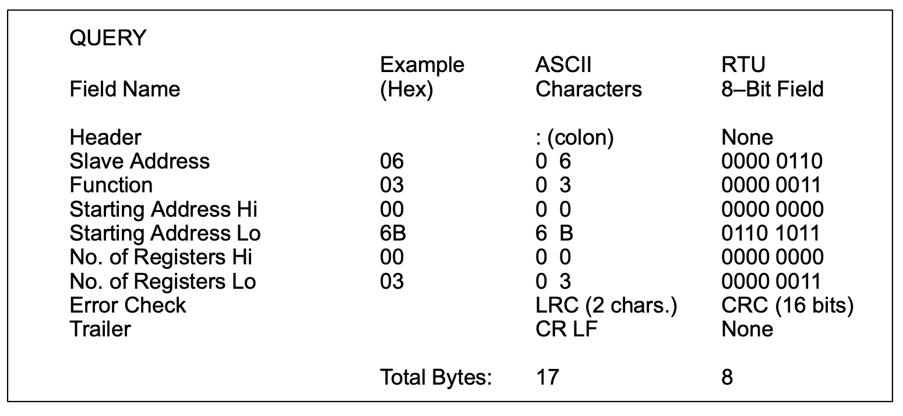
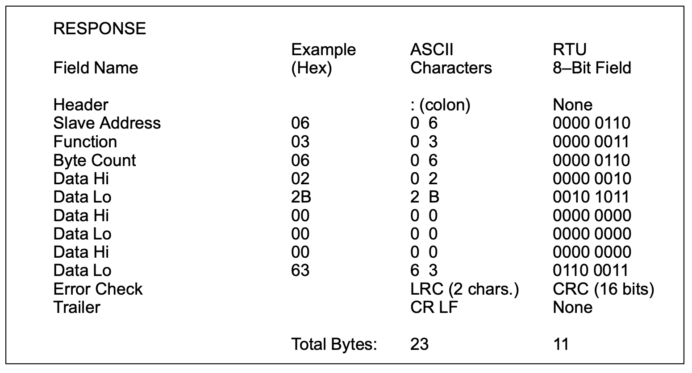
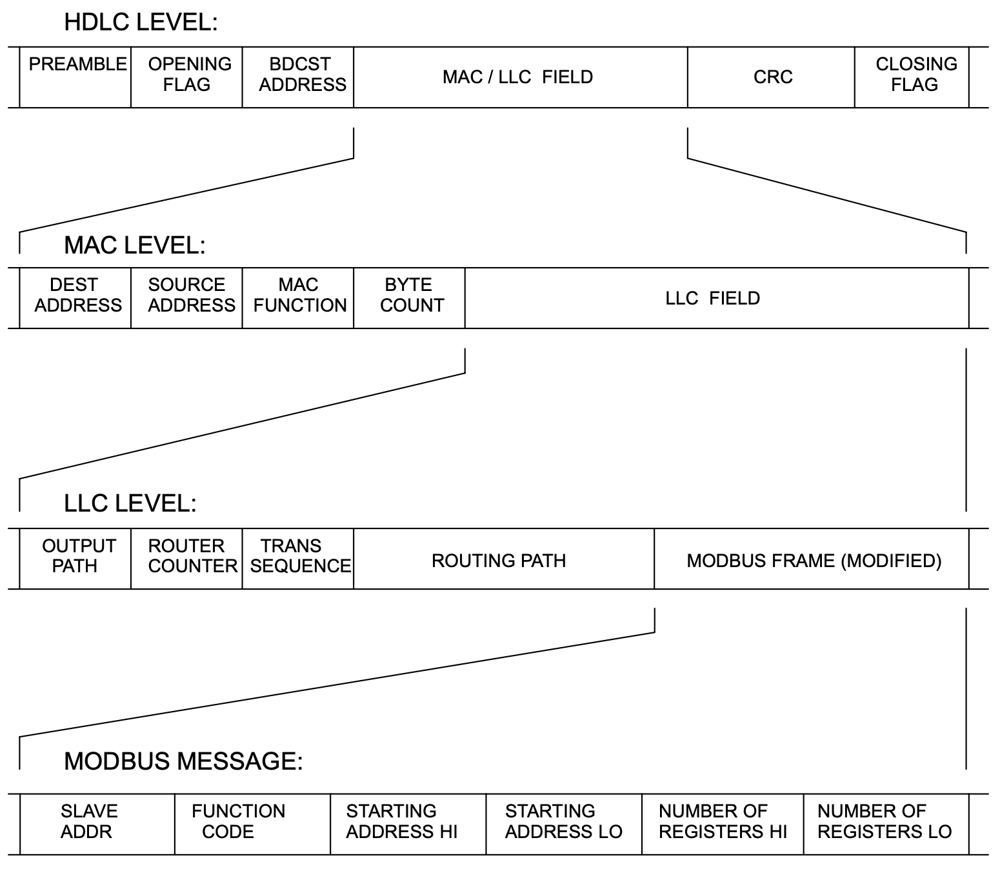
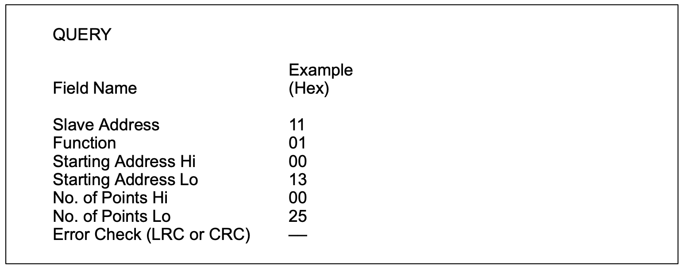
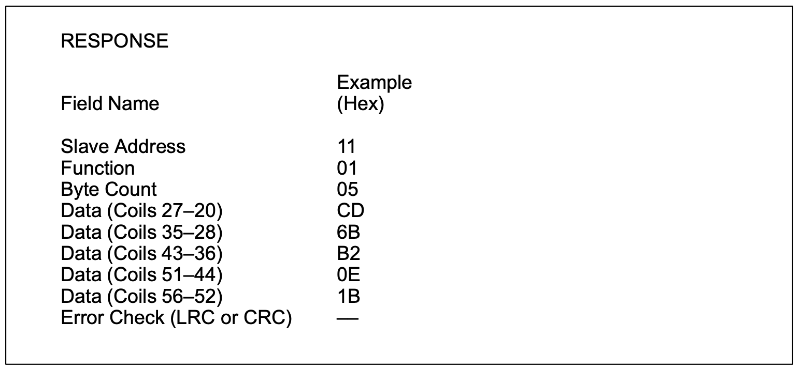
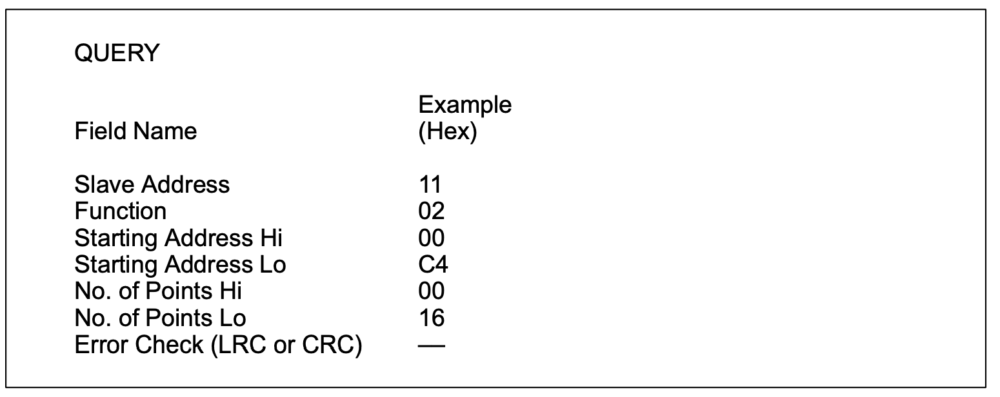
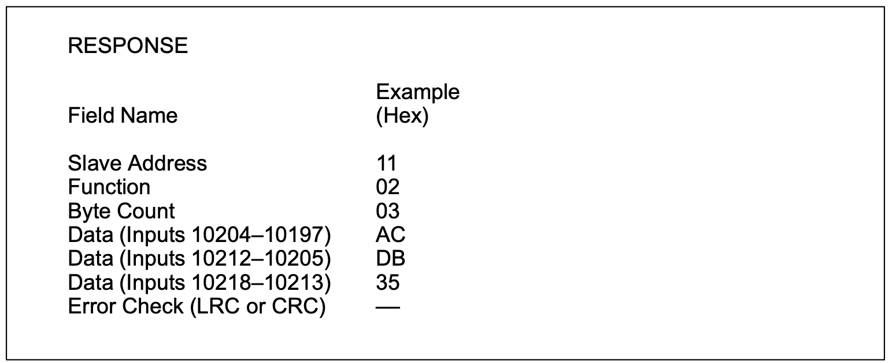
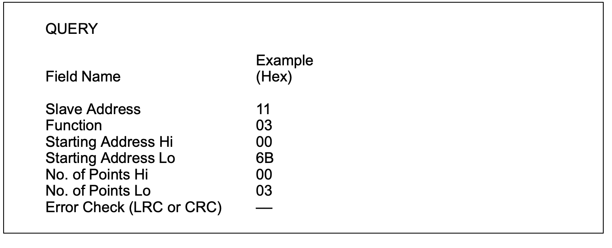
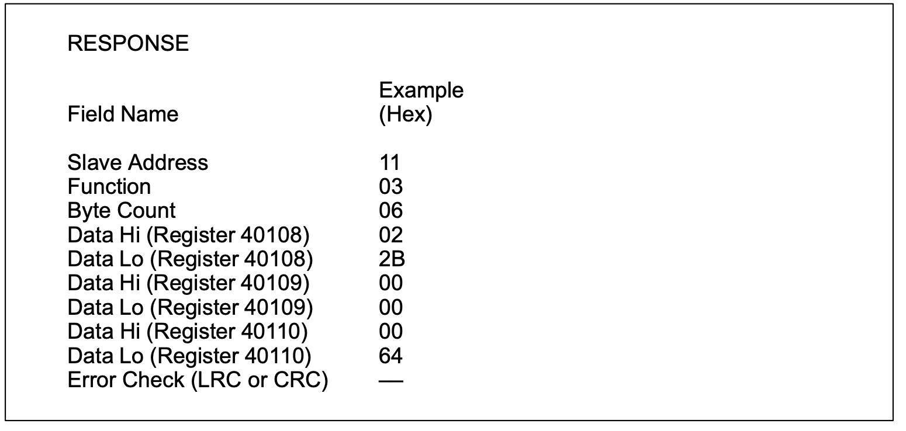

# Modbus Function Formats

## How Numerical Values are Expressed
Unless specified otherwise, numerical values (such as addresses, codes, or data)
are expressed as decimal values in the text of this section. They are expressed
as hexadecimal values in the message fields of the figures

## Data Addresses in Modbus Messages
All data addresses in Modbus messages are referenced to zero. The first
occurrence of a data item is addressed as item number zero. For example:
- The coil known as ‘coil 1’ in a programmable controller is addressed as coil
0000 in the data address field of a Modbus message.
- Coil 127 decimal is addressed as coil 007E hex (126 decimal).
- Holding register 40001 is addressed as register 0000 in the data address field
of the message. The function code field already specifies a ‘holding register’
operation. Therefore the ‘4XXXX’ reference is implicit.
- Holding register 40108 is addressed as register 006B hex (107 decimal).
## Field Contents in Modbus Messages
Figure 7 shows an example of a Modbus query message. Figure 8 is an example
of a normal response. Both examples show the field contents in hexadecimal, and
also show how a message could be framed in ASCII or in RTU mode.

The master query is a Read Holding Registers request to slave device address 06.
The message requests data from three holding registers, 40108 through 40110.
Note that the message specifies the starting register address as 0107 (006B hex).
The slave response echoes the function code, indicating this is a normal
response. The ‘Byte Count’ field specifies how many 8–bit data items are being
returned.

It shows the count of 8–bit bytes to follow in the data, for either ASCII or RTU..
With ASCII, this value is one–half the actual count of ASCII characters in the data.
In ASCII, each 4–bit hexadecimal value requires one ASCII character, therefore
two ASCII characters must follow in the message to contain each 8–bit data item. 
For example, the value 63 hex is sent as one 8–bit byte in RTU mode (01100011).
The same value sent in ASCII mode requires two bytes, for ASCII ‘6’ (0110110)
and ‘3’ (0110011). The ‘Byte Count’ field counts this data as one 8–bit item,
regardless of the character framing method (ASCII or RTU).
**How to Use the Byte Count Field:** When you construct responses in buffers,
use a Byte Count value that equals the count of 8–bit bytes in your message data.
The value is exclusive of all other field contents, including the Byte Count field.
Figure 8 shows how the byte count field is implemented in a typical response.

*Figure 7 Master Query with ASCII/RTU Framing*

*Figure 8 Slave Response with ASCII/RTU Framing*
## Field Contents on Modbus Plus
Modbus messages sent on Modbus Plus networks are imbedded into the Logical
Link Control (LLC) level frame. Modbus message fields consist of 8–bit bytes,
similar to those used with RTU framing.
The Slave Address field is converted to a Modbus Plus routing path by the
sending device. The CRC field is not sent in the Modbus message, because it
would be redundant to the CRC check performed at the High–level Data Link
Control (HDLC) level.
The rest of the message remains as in the standard serial format. The application
software (e.g., MSTR blocks in controllers, or Modcom III in hosts) handles the
framing of the message into a network packet.
Figure 9 shows how a Read Holding Registers query would be imbedded into a
frame for Modbus Plus transmission.

*Figure 9 Field Contents on Modbus Plus*

# Function Codes Supported by Controllers
Manufactiren specific ?

# Read Coil Status
## Description
Reads the ON/OFF status of discrete outputs (0X references, coils) in the slave.
Broadcast is not supported.

Appendix B lists the maximum parameters supported by various controller models.

## Query
The query message specifies the starting coil and quantity of coils to be read.
Coils are addressed starting at zero: coils 1–16 are addressed as 0–15.

Here is an example of a request to read coils 20–56 from slave device 17:

*Figure 10 Read Coil Status – Query*
## Response
The coil status in the response message is packed as one coil per bit of the data
field. Status is indicated as: 1 = ON; 0 = OFF. The LSB of the first data byte
contains the coil addressed in the query. The other coils follow toward the high
order end of this byte, and from ‘low order to high order’ in subsequent bytes.

If the returned coil quantity is not a multiple of eight, the remaining bits in the final
data byte will be padded with zeros (toward the high order end of the byte). The
Byte Count field specifies the quantity of complete bytes of data.

Here is an example of a response to the query on the opposite page:

*Figure 11 Read Coil Status – Response*

The status of coils 27–20 is shown as the byte value CD hex, or binary 1100 1101.
Coil 27 is the MSB of this byte, and coil 20 is the LSB. Left to right, the status of
coils 27 through 20 is: ON–ON–OFF–OFF–ON–ON–OFF–ON.

By convention, bits within a byte are shown with the MSB to the left, and the LSB
to the right. Thus the coils in the first byte are ‘27 through 20’, from left to right.
The next byte has coils ‘35 through 28’, left to right. As the bits are transmitted
serially, they flow from LSB to MSB: 20 . . . 27, 28 . . . 35, and so on.

In the last data byte, the status of coils 56–52 is shown as the byte value 1B hex,
or binary 0001 1011. Coil 56 is in the fourth bit position from the left, and coil 52 is
the LSB of this byte. The status of coils 56 through 52 is: ON–ON–OFF–ON–ON.
Note how the three remaining bits (toward the high order end) are zero–filled.

# Read Input Status
## Description
Reads the ON/OFF status of discrete inputs (1X references) in the slave.
Broadcast is not supported.

Appendix B lists the maximum parameters supported by various controller models.
## Query
The query message specifies the starting input and quantity of inputs to be read.
Inputs are addressed starting at zero: inputs 1–16 are addressed as 0–15.

Here is an example of a request to read inputs 10197–10218 from slave device
17:

*Figure 12 Read Input Status – Query*

## Response
The input status in the response message is packed as one input per bit of the
data field. Status is indicated as: 1 = ON; 0 = OFF. The LSB of the first data
byte contains the input addressed in the query. The other inputs follow toward the
high order end of this byte, and from ‘low order to high order’ in subsequent bytes.

If the returned input quantity is not a multiple of eight, the remaining bits in the final
data byte will be padded with zeros (toward the high order end of the byte). The
Byte Count field specifies the quantity of complete bytes of data.

Here is an example of a response to the query on the opposite page:

*Figure 13 Read Input Status – Response*

The status of inputs 10204–10197 is shown as the byte value AC hex, or binary
1010 1100. Input 10204 is the MSB of this byte, and input 10197 is the LSB.
Left to right, the status of inputs 10204 through 10197 is: ON–OFF–ON–OFF–
ON–ON–OFF–OFF.

The status of inputs 10218–10213 is shown as the byte value 35 hex, or binary
0011 0101. Input 10218 is in the third bit position from the left, and input 10213 is
the LSB. The status of inputs 10218 through 10213 is: ON–ON–OFF–ON–OFF–
ON. Note how the two remaining bits (toward the high order end) are zero–filled.

# Read Holding Registers
## Description
Reads the binary contents of holding registers (4X references) in the slave.
Broadcast is not supported.
Appendix B lists the maximum parameters supported by various controller models.
## Query:
The query message specifies the starting register and quantity of registers to be
read. Registers are addressed starting at zero: registers 1–16 are addressed as
0–15.
Here is an example of a request to read registers 40108–40110 from slave device
17:

*Figure 14 Read Holding Registers – Query*
## Response
The register data in the response message are packed as two bytes per register,
with the binary contents right justified within each byte. For each register, the first
byte contains the high order bits and the second contains the low order bits.
Data is scanned in the slave at the rate of 125 registers per scan for 984–X8X
controllers (984–685, etc), and at the rate of 32 registers per scan for all other
controllers. The response is returned when the data is completely assembled.
Here is an example of a response to the query on the opposite page:

*Figure 15 Read Holding Registers – Response*
The contents of register 40108 are shown as the two byte values of 02 2B hex, or
555 decimal. The contents of registers 40109–40110 are 00 00 and 00 64 hex, or
0 and 100 decimal.
## Read Input Registers
... not yet...
## Force Single Coil
... not yet...
## Preset Single Register
... not yet...
## Read Exception Status
... not yet...
##  (0B Hex) Fetch Comm Event Counter
... not yet...
## (0C Hex) Fetch Comm Event Log
... not yet...
## (0F Hex) Force Multiple Coils
... not yet...
##  (10 Hex) Preset Multiple Registers
... not yet...
## (11 Hex) Report Slave ID
... not yet...
## (14Hex) Read General Reference
... not yet...
## (15Hex) Write General Reference
... not yet...
##  (16Hex) Mask Write 4X Register
... not yet...
## (17Hex) Read/Write 4X Registers
... not yet...
## (18Hex) Read FIFO Queue
... not yet...

# A Summary of Function Codes

# Details of Modbus Functions