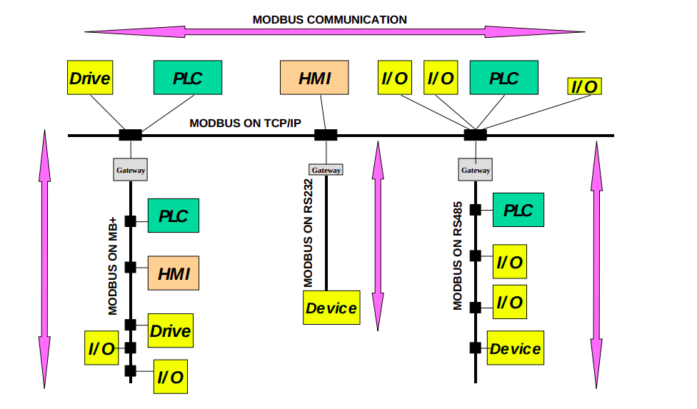

# To be clear about these...
**Master**:
- can initiate transactions (called ‘queries’).
- 
**Slave**:
- respond by supplying the requested data to the master, or by taking
the action requested in the query
- Device

https://en.wikipedia.org/wiki/Modbus
**Drive:**

**Device**

*Architecture of a network for Modbus communication*

*Architecture of a network for Modbus communication*

## PDU and ADU
Modbus defines client which is an entity which initiates a transaction to request any specific task from its "request receiver".[7] The client's "request receiver", which the client has initiated the transaction with, is then called server.[7] For example, when a MCU connects to a sensor to read its data by Modbus on a wired network, e.g RS485 bus, the MCU in this context is the client and the sensor is the server.

Modbus defines a protocol data unit (PDU) independently to its lower layer protocols in its protocol stack. The mapping of MODBUS protocol on specific buses or network requires some additional fields, which are defined as application data unit (ADU). ADU is formed by a client inside a Modbus network when the client initiates a transaction. Contents are:[8]

- PDU = Function code + data
- ADU = Additional address + PDU + error check

ADU is officially called a Modbus frame by the Modbus Organization,[8] although frame is used as the data unit in the data-link layer in the OSI and TCP/IP model (while Modbus is an application layer protocol).

PDU max size is 253 bytes. ADU max size on RS232/RS485 network is 256 bytes, and with TCP is 260 bytes.[9]

For data encoding, Modbus uses a big-endian representation for addresses and data fields. Thus, for a 16-bit value, the most significant byte is sent first. For example, when a 16-bit register has value 0x1234, byte 0x12 is sent before byte 0x34.[9]

Function code is 1 byte which gives the code of the function to execute. Function codes are integer values, ranging from 1 to 255, and the range from 128 to 255 is for exception responses.

The data field of the PDU has the address from 0 to 65535 (not to be confused with the address of the Additional address field of ADU).[10] The data field of the PDU can be empty, and then has a size of 0. In this case, the server will not request any information and the function code defines the function to be executed. If there is no error during the execution process, the data field of the ADU response from server to client will include the data requested, i.e. the data the client previously received. If there is any error, the server will respond with an exception code.[7]

## Modbus transaction and PDU

# Modbus over Serial Line protocol
Modbus standard also defines Modbus over Serial Line, a protocol over the data link layer of the OSI model for the Modbus application layer protocol to be communicated over a serial bus.[20] Modbus Serial Line protocol is a master-slave protocol which supports one master and multiple slaves in the serial bus.[21] With Modbus protocol on the application layer, client/server model is used for the devices on the communication channel. With Modbus over Serial Line, client's role is implemented by master, and the server's role is implemented by slave.[21][22]

The organization's naming convention inverts the common usage of having multiple clients and only one server. To avoid this confusion, the RS-485 transport layer uses the terms "node" or "device" instead of "server", and the "client" is not a "node".[22]

The (Modbus Organization) is using "client-server" to describe Modbus communications, characterized by communication between [client device (s), which initiates communication and makes requests of server device(s), which process requests and return an appropriate response (or error message).
