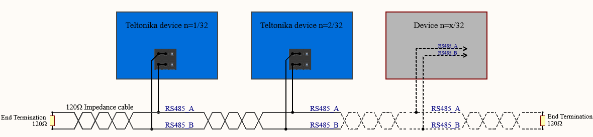
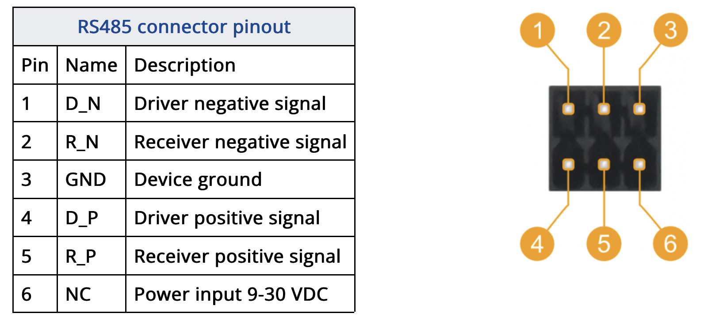

# Tech details and theory

*Example 2-wire network electrical connection: to enable a 2-wire RS485 configuration you need to connect D_P to R_P and D_N to R_N on the device’s RS485 socket. Termination resistors are placed at each cable end (120 Ω each)*

## RS485 connector pinout

# Open AI helps
The Teltonika TRB145 is a cellular IoT gateway that supports various interfaces, including RS485, which is commonly used for connecting industrial devices and sensors. The RS485 connector pinout typically consists of several pins, each serving a specific purpose. While I can provide general information on RS485 and driver polarity, specific details about the TRB145's pinout might require consulting its documentation for accuracy.

## Here's a general explanation:

**RS485 Connector Pinout:** RS485 connectors usually have at least two pins: A and B, which are used for data transmission. Additionally, there may be pins for power supply (e.g., VCC and GND) and other optional features depending on the device and its configuration.

Vallox example (A & B as driver/master ?)
- what means RS_A & RS_B ?
  - maybe Receiver ? to be input for a new registervalues?
- what are MB_A & MB_B ? 
  - if RS is receiver - is this Mster/Driver ?

**Driver Positive and Driver Negative:** In RS485 communication, data is transmitted differentially. This means that instead of a single wire carrying the signal (as in RS232), RS485 uses two wires: A and B. When the driver sends a "1" bit, it raises the voltage on wire A relative to wire B. When it sends a "0" bit, it lowers the voltage on wire A relative to wire B. The terms "driver positive" and "driver negative" refer to these voltage polarities. However, it's important to note that RS485 is a balanced interface, meaning it's the voltage difference between A and B that matters, not the absolute voltage levels.

To find the specific pinout of the RS485 connector on the Teltonika TRB145 and understand the driver polarity conventions, you should refer to the official documentation provided by Teltonika or consult their technical support. They typically provide detailed information on the pinout and how to interface with RS485 devices correctly.