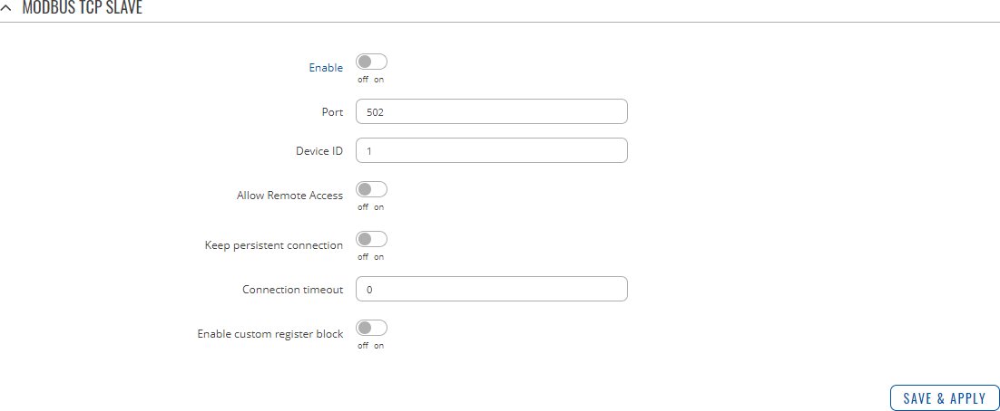

# Introduction

*ref : https://wiki.teltonika-networks.com/view/RUTX10_Monitoring_via_Modbus*

Modbus is a serial communications protocol originally published by Modicon (now Schneider Electric) in 1979 for use with its programmable logic controllers (PLCs). Modbus has become a de facto standard communication protocol and is now a commonly available means of connecting industrial electronic devices. The main reasons for the use of Modbus in the industrial environment are:

    - developed with industrial applications in mind,
    - openly published and royalty-free,
    - easy to deploy and maintain,
    - moves raw bits or words without placing many restrictions on vendors.

Modbus enables communication among many devices connected to the same network, for example, a system that measures temperature and humidity and communicates the results to a computer. Modbus is often used to connect a supervisory computer with a remote terminal unit (RTU) in supervisory control and data acquisition (SCADA) systems. Many of the data types are named from its use in driving relays: a single-bit physical output is called a coil, and a single-bit physical input is called a discrete input or a contact.

This article provides a guide on how to use Modbus TCP to monitor RUTX10 routers with a PC using a Linux Operating System. 

#Configuring the router
In order to start using Modbus TCP, we must first configure the router. Modbus TCP configuration from the router's side is very simple. All you need to do is log in to the router's WebUI, go to Services → Modbus, Enable the Modbus TCP service, enter a Port number through which the Modbus TCP communication will take place and Allow remote access if you wish to connect to the router remotely (from WAN). 


#Installing the necessary software
Next you'll need software capable of communicating via Modbus. The software that we'll be using for this guide is called modbus-cli. To get it you'll first have to install ruby. To do so, open the Terminal app and enter these commands. 
```
$ sudo apt-get install ruby
$ sudo gem install modbus-cli
````
*I did that in my mac ...*

# Getting router parameters
Modbus TCP can be used to both get and set certain router parameters. First lets do an overview of how to obtain parameters via Modbus TCP. Please keep in mind that in order to get routers parameters when using Request Configuration ( [Request Configuration](https://wiki.teltonika-networks.com/view/RUTX10_Modbus#Requests_configuration) ) you need to use Register Number instead of Register Address. 

Click [here](https://www.geeksforgeeks.org/){:target="_blank"} 
to visit GeeksForGeeks website.
