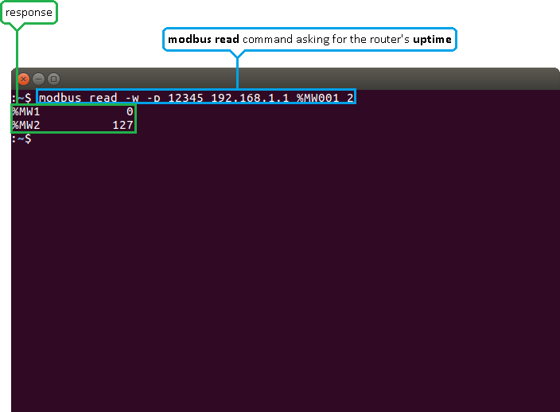
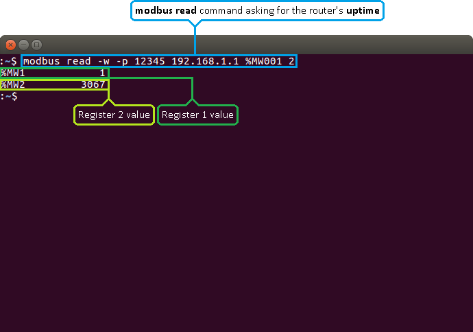
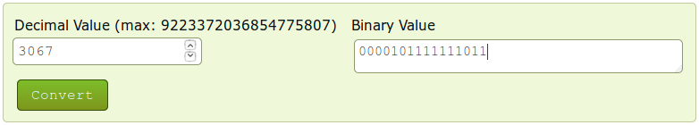
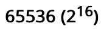
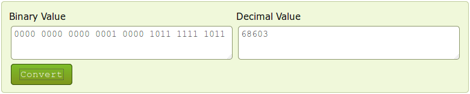
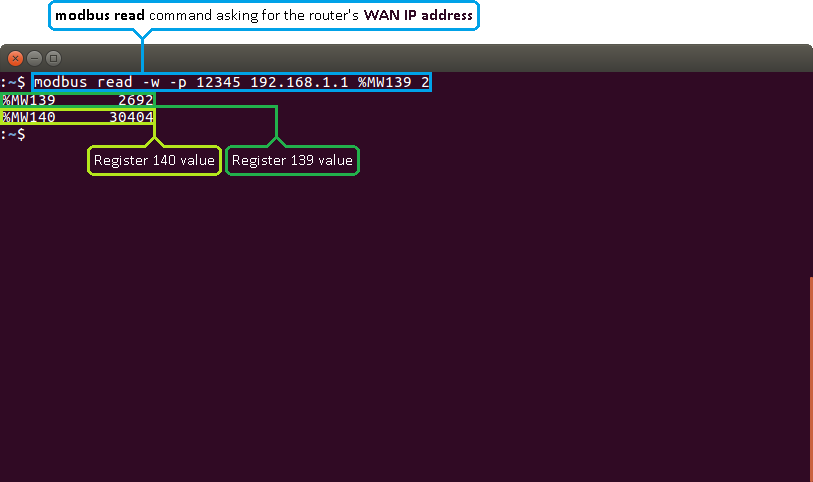
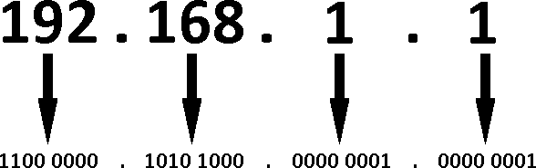
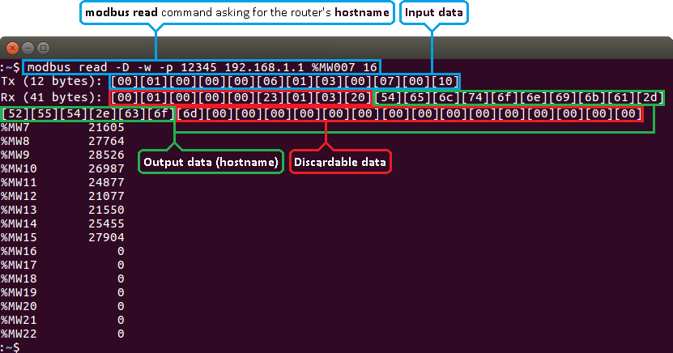

# Introduction

*ref : https://wiki.teltonika-networks.com/view/RUTX10_Monitoring_via_Modbus*

*keep in mind, that this particular text here in readme section is Teltonika RUTX10 modbus register related only. Vallox & Sabiana are completely different registry values...*

Modbus is a serial communications protocol originally published by Modicon (now Schneider Electric) in 1979 for use with its programmable logic controllers (PLCs). Modbus has become a de facto standard communication protocol and is now a commonly available means of connecting industrial electronic devices. The main reasons for the use of Modbus in the industrial environment are:

    - developed with industrial applications in mind,
    - openly published and royalty-free,
    - easy to deploy and maintain,
    - moves raw bits or words without placing many restrictions on vendors.

Modbus enables communication among many devices connected to the same network, for example, a system that measures temperature and humidity and communicates the results to a computer. Modbus is often used to connect a supervisory computer with a remote terminal unit (RTU) in supervisory control and data acquisition (SCADA) systems. Many of the data types are named from its use in driving relays: a single-bit physical output is called a coil, and a single-bit physical input is called a discrete input or a contact.

This article provides a guide on how to use Modbus TCP to monitor RUTX10 routers with a PC using a Linux Operating System. 

#Configuring the router
In order to start using Modbus TCP, we must first configure the router. Modbus TCP configuration from the router's side is very simple. All you need to do is log in to the router's WebUI, go to Services → Modbus, Enable the Modbus TCP service, enter a Port number through which the Modbus TCP communication will take place and Allow remote access if you wish to connect to the router remotely (from WAN). 


#Installing the necessary software
Next you'll need software capable of communicating via Modbus. The software that we'll be using for this guide is called modbus-cli. To get it you'll first have to install ruby. To do so, open the Terminal app and enter these commands. 
```
$ sudo apt-get install ruby
$ sudo gem install modbus-cli
```
*I did that in my mac ...*

# Getting router parameters
Modbus TCP can be used to both get and set certain router parameters. First lets do an overview of how to obtain parameters via Modbus TCP. Please keep in mind that in order to get routers parameters when using Request Configuration ( [Request Configuration](https://wiki.teltonika-networks.com/view/RUTX10_Modbus#Requests_configuration) ) you need to use Register Number instead of Register Address. 

# Get Parameters
Modbus parameters are held within registers. Each register contains 2 bytes of information. For simplification, the number of registers for storing numbers is 2 (4 bytes), while the number of registers for storing text information is 16 (32 bytes).

The register numbers and corresponding system values are described in the table below: 

| required value  | register address |register number | number of registers | representation |
|---|---|---|---|---|
|System uptime|1|2|2|32 bit unsigned integer|
|System hostname | 7 | 8 | 16 | Text |
| Router serial number | 39 | 40 | 16 | Text |
| LAN MAC address | 55 | 56 | 16 | Text |
| Router name | 71 | 72 | 16 | Text |
| Current WAN IP address | 139 | 140 | 2 | 8 bit unsigned integer |
| Digital non-isolated input | 342 | 325 | 1 | 16 bit unsigned integer |
| Digital open collector output | 325 | 365 | 1 | 16 bit unsigned integer |
| Unix timestamp | 364 | 365 | 2 | 32 bit unsigned integer |
| Local ISO time | 366 | 367 | 12 |Text |
| UTC time | 378 | 389 | 12 |Text |
| LAN IP | 394 | 395 | 2 | 8 bit unsigned integer |
| | | | | |

# Modbus read
To obtain parameters from the system, the modbus read command is used. The syntax for this command is: 

```ruby
 $ modbus read [OPTIONS] HOST_NAME REGISTER_ADDRESS NUMBER_OF_REGISTERS
```
OPTIONS can describe things like data type, port number, type of addressing, etc.

HOST_NAME is the router's hostname or IP address (WAN IP, if you are connecting remotely).

REGISTER_ADDRESS specifies the register that you wish to read.

NUMBER_OF_REGISTERS specifies how many registers should be read starting from the register specified in REGISTER_ADDRESS.

Note: all of this information and more can be viewed by executing these commands in The Linux Terminal: modbus read -h or modbus read --help.

For the first example, lets use a modbus read command to attempt to obtain the router's uptime value in seconds. If you look back at the table above, you will see that the uptime value is stored in two registers starting from the first register, therefore: 


```ruby
$ modbus read -w -p portnumber 192.168.xxx.xxx %MW001 2
```
In this case - it will show:
```
%MW1            1
%MW2        33014
```
-w specifies the data type. In this case, unsigned 16 bit integers.

-p specifies the port number.

192.168.xxx.xxx - the router's LAN IP address.

%MW001 specifies the register address.

2 - specifies how many registers should be read. 


As you can see from the example above, the router returns the values stored in two registers: the first one and the second one. The values returned are presented in decimal form. 

# Interpreting the response
The values are returned in decimal and, if you add -D to the command, hexadecimal forms. Sometimes the answer is self-explanatory as in the example above. But, since a register only hold 2 bytes (16 bits) of information, the value stored in a register can't be higher than 65535 (216 -1). So what happens if the router's uptime is higher than that? Lets examine another example where the router's uptime is higher than 65535: 

When the value climbs over 65535 the counter resets and the value held by the first register increases by 1. So one way to interpret the results would be to multiply the value in the first register by 65536 (216) and add it to the value of the second register: **%MW1 * 65536 + %MW2**. Which, following from the example above, would be: **1 * 65536 + 3067 = 68603 s or 19 hours 3 minutes 23 seconds**. 

However, while this works when calculating uptime values, it will not work for all parameters. The correct way to calculate the final values would be to first convert them to binary. As mentioned earlier in this chapter, a register holds 16 bits of information, which can be represented by a 16-digit long binary number. Following from the example above, the first register's value of 1 converted to binary would be 0000 0000 0000 0001 and the second register's value of 3067 would be 0000 1011 1111 1011. You can easily convert numbers from one numeral system to another using any online conversion tool: 

The zeros at the beginning are added to represent the fact that the numbers are expressed in a 16-bit format. The next step is to add the two values, but not in the traditional sense. Instead, the value of the second register should act as an extension of the value of the first register or, to put it more simply, the values should be added up as if they were strings, **i.e., 0000 0000 0000 0001 + 0000 1011 1111 1011 = 0000 0000 0000 0001 0000 1011 1111 1011**. What happens here is that in this sum the first register's value of 1 shouldn't be considered as 1, but instead as  , which is the value of the 17th digit of a 32-bit long binary number. If you convert this value back to decimal, you will see that we get the same answer: 

# WAN IP address
Lets examine a different, more complex example by issuing a request for the router's WAN IP address. If you look at the table above, you will see that the WAN IP address value is contained within the 139th and 140th registers. Therefore, we should specify the 139th address and read 2 registers from that address: 
```
$ modbus read -w -p xxx 192.168.xxx.xxx %MW139 2

%MW139      49320
%MW140      31490

```

An IPv4 address is divided into 4 segments. Each segment contains 8 bits (or 1 byte) of information: 


So in order to get the WAN IP address from the response received, we'll need to convert the values of both registers to binary and split them into 8-bit segments. Lets do that with the values from the last example: 
**%MW139 49320** and **%MW140 31490** which converted to binary would be: 49320 = 1100000010101000 ; 31490 = 111101100000010
As discussed earlier, we'll need to separate the two numbers into 8-bit segments to get the IP address: 

11000000    10101000    11110110    0000010
    192         168         246         2
https://www.rapidtables.com/convert/number/decimal-to-binary.html
https://www.rapidtables.com/convert/number/binary-to-decimal.html

# Text
Some values like Hostname, Router name, Network type are represented as text in their original form, but are stored in registers as numbers. You can interpret these values the same way as all discussed before (by converting them to binary and then to text), but a simpler way would be to get them in hexadecimal form and then convert them to text. To do so, we'll have to add the -D parameter to the command. Lets do it by asking for the router's Hostname: 
```
$ modbus read -D -w -p 502 192.168.123.2 %MW007 16

Tx (12 bytes): [00][01][00][00][00][06][01][03][00][07][00][10]
Rx (41 bytes): [00][01][00][00][00][23][01][03][20][54][65][6c][74][6f][6e][69][6b][61][2d][52][55][54][58][31][30][5f][31][2e][63][6f][6d][00][00][00][00][00][00][00][00][00][00]
%MW7        21605
%MW8        27764
%MW9        28526
%MW10       26987
%MW11       24877
%MW12       21077
%MW13       21592
%MW14       12592
%MW15       24369
%MW16       11875
%MW17       28525
%MW18           0
%MW19           0
%MW20           0
%MW21           0
%MW22           0

```


