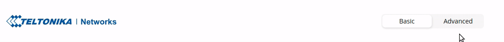
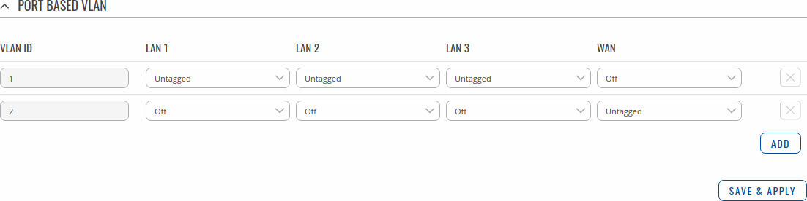
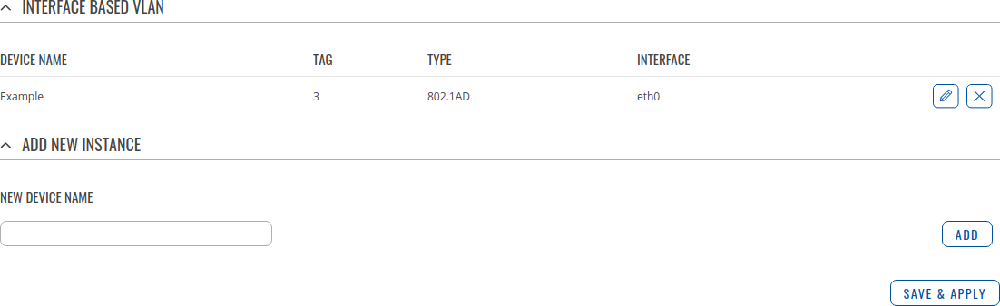
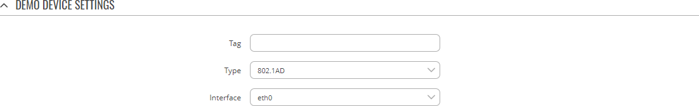
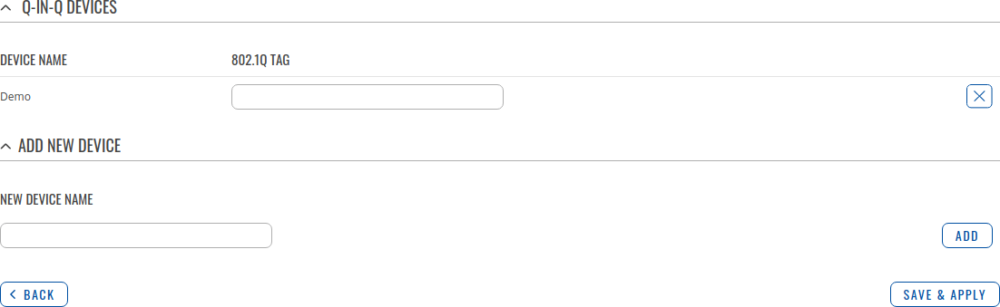
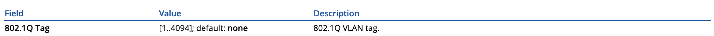

# VLAN by Teltonika wiki

sources:
https://osi-model.com/data-link-layer/
https://wiki.teltonika-networks.com/view/RUTX11_VLAN

## Summary

A Virtual LAN (VLAN) is any broadcast domain that is partitioned and isolated in a computer network at the data link layer (OSI layer 2). LAN is the abbreviation for local area network and in this context virtual refers to a physical object recreated and altered by additional logic. VLANs work by applying tags to network packets and handling these tags in networking systems - creating the appearance and functionality of network traffic that is physically on a single network but acts as if it is split between separate networks. In this way, VLANs can keep network applications separate despite being connected to the same physical network, and without requiring multiple sets of cabling and networking devices to be deployed.

VLANs allow network administrators to group hosts together even if the hosts are not on the same network switch. This can greatly simplify network design and deployment, because VLAN membership can be configured through software. Without VLANs, grouping hosts according to their resource needs necessitates the labor of relocating nodes or rewiring data links. It also has benefits in allowing networks and devices that must be kept separate to share the same physical cabling without interacting, for reasons of simplicity, security, traffic management, or economy. For example, a VLAN could be used to separate traffic within a business due to users, and due to network administrators, or between types of traffic, so that users or low priority traffic cannot directly affect the rest of the network's functioning. Many Internet hosting services use VLANs to separate their customers' private zones from each other, allowing each customer's servers to be grouped together in a single network segment while being located anywhere in their datacenter. Some precautions are needed to prevent traffic "escaping" from a given VLAN, an exploit known as VLAN hopping.

This chapter is an overview of the VLAN section for RUTX11 devices.

If you're having trouble finding this page or some of the parameters described here on your device's WebUI, you should turn on "Advanced WebUI" mode. You can do that by clicking the "Advanced" button, located at the top of the WebUI. 

### Port Based

The Port Based VLAN section allows you to create Port based and Tag based VLAN networks.

Port based VLAN allows you to assign different LAN ports to desired LAN networks. The method is pretty simple: first you have to create a VLAN, choose which LAN port(s) will provide addresses for that network and then configure LAN network.

Tag based VLAN allows a single router port to carry traffic from multiple VLAN's. Tags containing the respective VLAN identifiers indicating the VLAN to which the frame belongs are attached to the individual Ethernet frames.

By default RUTX11 automatically have 2 VLANs created - one for LAN and one Wired WAN interfaces. These two VLAN instances cannot be deleted. 

### Interface Based

This section is an overview of created VLAN Devices. 

Device Settings

The Device Settings section is used to configure the main parameters of a Q-in-Q device. Refer to the tables below for information on the configuration fields in the Q-in-Q Device Settings section. 

| Field  | Value |Description |
|---|---|---|
| Tag  |[1..4094]; default: none   |802.1 VLAN tag|
|Type|802.1AD - 802.1Q; default: 802.1AD|The type of this Device|
|Interface|ethernet network interface; default: eth0|Network interfaces can be configured in the Network → Interfaces page|

#### Q-IN-Q Devices

Q-in-Q VLAN tunnel enables a possibility to segregate the traffic of different users in their infrastructure, while still giving a full range of VLANs for their internal use by adding a second tag to an already tagged frame.

By default the Q-in-Q Devices list is empty. To create a new Q-in-Q Device, enter as custom name for it and click the 'Add' button. After this you will be able to configure it's 802.1Q Tag and Tagged interface. 

