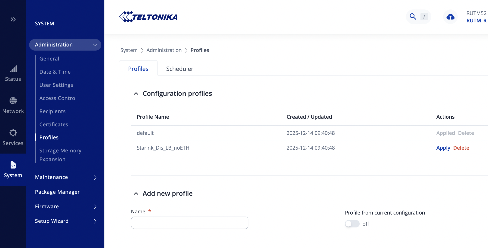
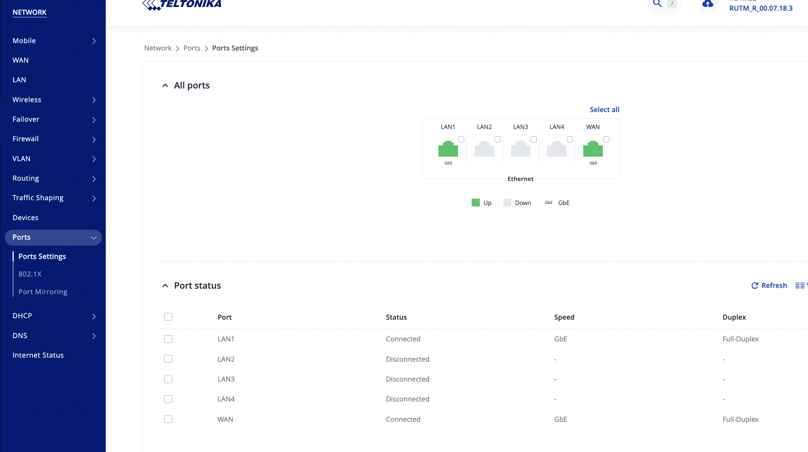
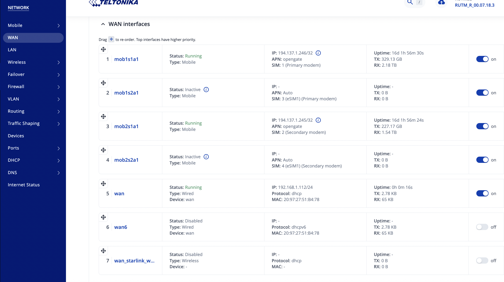
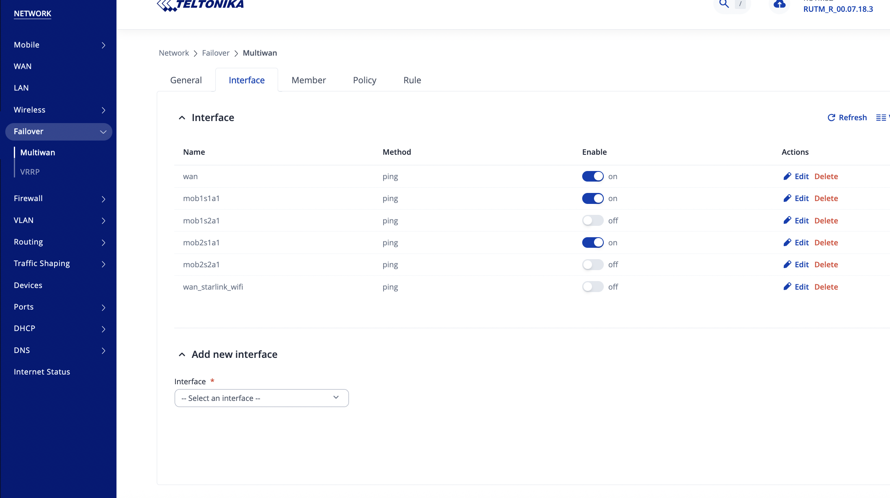
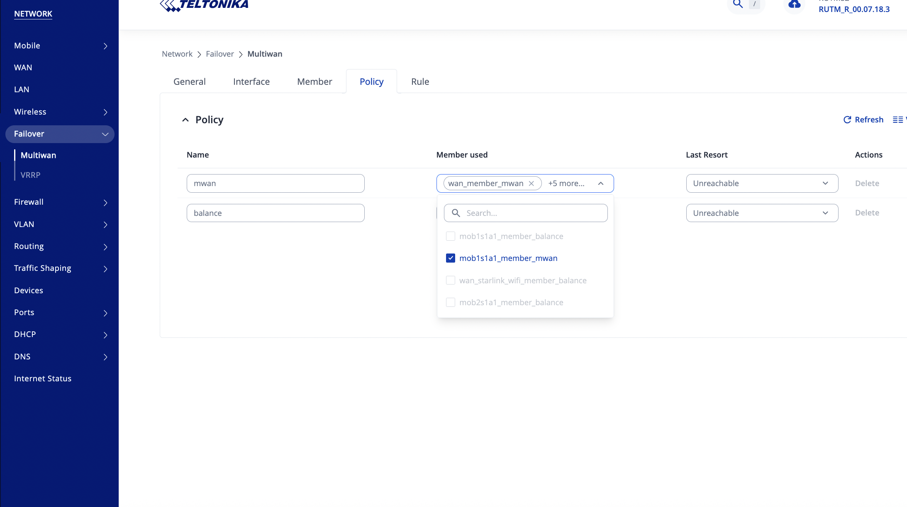

# 1. Physically connect Starlink

There are two main connection methods:

    a. Ethernet adapter (recommended).If you have Starlink with the official Ethernet adapter, plug that into one of RUTM52’s LAN/WAN ports, e.g. LAN4, and then:
    
    - Go to Network → Interfaces → Add.
    Choose WAN type: DHCP client.
    Assign to the physical port (e.g., eth1 or lan4).
    Rename it something like wan3_starlink.

    b. Wi-Fi as WAN (optional backup). If you can’t use the Ethernet adapter:
    Go to Network → Wireless → Scan.
    Join your Starlink Wi-Fi as a WAN client.
    Create a new interface (e.g. wan3_starlink_wifi).
    Mode: DHCP client.

Ethernet is always preferred for stability and throughput.

# 2. Configure Load Balancing

    Once Starlink interface is up:
    Navigate to Network → Load Balancing.
    Click Add or edit existing policy.
    
    You’ll now see all WANs:
        wan1_telia5g
        wan2_telia4g
        wan3_starlink

Set “Weight” for each according to your desired balance:

Example setup:

| Connection | Role      | Weight |
| ---------- | --------- | ------ |
| Telia 5G   | Primary   | 3      |
| Starlink   | Secondary | 2      |
| Telia LTE  | Backup    | 1      |
The higher the weight → the more traffic it handles.

# Ensure “Health Check” is enabled for each WAN (ping to e.g. 1.1.1.1 or 8.8.8.8) — this lets RUTM52 auto-disable a link if it fails.

Optional: Connection priorities (Failover + Balance hybrid)

If you want Starlink mainly as backup, not simultaneous load-balance:

Change mode to “Failover” for Starlink.

Keep Telia 5G and LTE for balance.
→ Then Starlink kicks in only when both mobile WANs fail.

# Verify
Go to:
- Status → Load Balancing
- You should see 3 WAN interfaces, their status, IPs, and traffic distribution.
- You can test by disconnecting one link — the router should seamlessly rebalance or fail over.

# Starlink considerations

Starlink has CGNAT — you’ll get a non-public IP (no inbound access).
If you need inbound connections (VPN, servers), consider:

Starlink Business (public IP)

Or use RUTM52’s VPN tunnel via your Telia WAN for inbound traffic.

Check MTU; Starlink often prefers MTU 1500, while mobile links might use 1420–1460.
You can adjust per interface if needed.

# Summary
You do not need much more than plugging it in, but:
- Create a separate WAN interface (DHCP).
- Add it to the Load Balancer policy.
- Set weights and health checks.
- Verify failover behavior and MTU compatibility.

# What the Starlink Ethernet Adapter is

The Starlink Ethernet Adapter is a small, official accessory from SpaceX that gives your Starlink router a wired Ethernet port.

By default, Starlink’s “Standard” or “Rectangular” dish connects to a Wi-Fi router that doesn’t have any LAN ports at all — it’s purely wireless. The adapter fixes that limitation.

## How it works (physically)
The Starlink dish cable connects to your Starlink router using a single proprietary cable (it carries both power and data, like PoE).
The Ethernet Adapter plugs in between that connection:
```
Dish  <───>  [Ethernet Adapter]  <───>  Starlink Router
                        │
                        └───> RJ45 Ethernet port → (to your router/firewall, e.g. RUTM52)
```

So you get one standard RJ45 port you can use to connect:
- a Teltonika RUTM52,
- a switch,
- or any wired device.

It works as a simple Ethernet bridge — the device you plug in gets a public (or CGNAT) IP directly from Starlink.

## What it does (network-wise)
The Ethernet adapter allows you to:
- Bypass Starlink’s Wi-Fi router (by enabling “Bypass Mode” in the Starlink app).
- Use your own router/firewall (like RUTM52) for advanced networking, VPNs, or load balancing.
- Achieve better latency, reliability, and speed than via Wi-Fi as WAN.

## Key specs
| Feature        | Description                                       |
| -------------- | ------------------------------------------------- |
| Connector type | RJ45 (Gigabit Ethernet)                           |
| Power handling | Pass-through PoE (same line powers dish)          |
| Speed          | Up to 1 Gbps                                      |
| Use case       | Connect external routers, mesh, or load-balancers |
| Setup          | Plug-and-play, DHCP client on your router         |
| Cost           | ~US $25 – 40 (in Finland usually ~€45–60)         |

## When you need it
You’ll want the Ethernet adapter if you:

- Plan to connect Starlink to RUTM52, mesh network, or NAS.
- Want load balancing or failover with other WANs.
- Need wired performance or more stable connections.

Without it, Starlink only offers Wi-Fi connection from its router, which isn’t ideal for WAN integration.

## A simple wiring diagram of how it connects with your RUTM52 and Telia 5G/LTE setup

### Topology Overview
```
                       +----------------------+
                       |     Starlink Dish    |
                       +----------+-----------+
                                  |
                                  | (PoE + Data cable)
                                  |
                     +------------v------------+
                     | Starlink Ethernet       |
                     | Adapter                 |
                     |  - PoE Pass-through     |
                     |  - RJ45 LAN Port        |
                     +------------+------------+
                                  |
                                  |  Ethernet (Cat6)
                                  |
                     +------------v------------+
                     |  Teltonika RUTM52       |
                     |--------------------------|
                     | WAN1: Telia 5G Modem     |
                     | WAN2: Telia LTE Modem    |
                     | WAN3: Starlink (Ethernet)|
                     | LAN Ports → Local Net    |
                     +------------+-------------+
                                  |
                            +-----v------+
                            | LAN Switch |
                            +-----+------+
                                  |
                         +--------+--------+
                         | Wi-Fi / Devices |
                         +-----------------+
```
## Configuration Summary
| Interface | Connection Type | Source               | Purpose                           | Notes                           |
| --------- | --------------- | -------------------- | --------------------------------- | ------------------------------- |
| `wan1`    | Mobile (SIM1)   | Telia 5G             | Primary WAN                       | Fastest, lowest latency         |
| `wan2`    | Mobile (SIM2)   | Telia LTE            | Backup / Secondary                | Keeps connection if 5G fails    |
| `wan3`    | Ethernet        | Starlink via Adapter | Load-balance or tertiary failover | DHCP client, plug in Cat6 cable |
| `lan`     | LAN bridge      | Local network        | Internal devices                  | e.g., 192.168.1.0/24            |

## Optional Load-Balancing Weights Example
| WAN       | Role      | Weight | Description           |
| --------- | --------- | ------ | --------------------- |
| Telia 5G  | Primary   | 3      | main traffic path     |
| Starlink  | Secondary | 2      | supplement throughput |
| Telia LTE | Backup    | 1      | failover only         |

Health-check (ping target): 8.8.8.8 or 1.1.1.1 for each WAN.

## Notes and Tips
- Enable “Bypass Mode” in the Starlink app → disables Starlink Wi-Fi router, so RUTM52 controls everything.
- RUTM52 WAN3 should be set as DHCP client; Starlink will automatically assign IP (likely CGNAT).
- Keep all WANs in Load Balancing → Policies with proper weights.
- For inbound VPN or servers, use Telia 5G/LTE for public IP or a VPN tunnel (Starlink CGNAT blocks inbound).

# how to enable Starlink Bypass Mode and connect the dish directly to RUTM52 (so the Starlink router isn’t needed at all)

I'm Preserving Starlink WiFi configuration in RUTM52, so that I can go back to that if wired and bypassed configuration ever brackes down...

And because my Starlink 'Without ethernet adapter' configuration has been working do far almost perfectly. Some issues have been with mystic DHCP and DNS 'jams'. Occasianally Starlink must be taken off the loadbalancer, becaus LAN to Internet becomes un usable.

## Using RUT OS Configuration profiles
This preserves Starlink WiFi to RUTM52 without ethernet adapter


# Prepare Ethernet Starlink on the RUTM52 (before enabling bypass)

A. Physically connect
- Install the Starlink Ethernet adapter inline (dish ↔ adapter ↔ Starlink router), then run:

  - Adapter RJ45 → RUTM52 chosen port (often easiest to use a configurable LAN/WAN port, e.g. LAN4).

B. Create a new WAN interface for Starlink Ethernet
- In RUTOS this is typically:
- Network → Interfaces → Add
  - Protocol: DHCP client
  - Device/Port: the Ethernet port you plugged Starlink into
  - Name it e.g. wan_starlink_eth

C. Put it into the correct firewall zone
- Network → Firewall
  - Ensure wan_starlink_eth is in the WAN zone (or the same zone as your other WAN uplinks).

At this point, it may or may not get a lease yet depending on how your Starlink is currently operating, but the interface definition is ready.

# Enable Starlink Bypass Mode (Starlink app)
In the Starlink app:
- Enable Bypass Mode (this turns the Starlink router into essentially a pass-through).
- Expect the Starlink router Wi-Fi to be disabled after this, so make sure you still have local management access via your RUTM52.

Once bypass is enabled, your RUTM52 Ethernet WAN should obtain an IP via DHCP.

Important rollback note: on many Starlink setups, leaving bypass mode may require toggling it back in the app or doing a router factory reset (process differs by hardware generation). Plan accordingly.

# Switch load balancing from Wi-Fi WAN to Ethernet WAN (without deleting anything)
A. Add the new Ethernet WAN to load balancing
- Network → Load Balancing
  - Add wan_starlink_eth to the member list/policy
  - Set weight/priority as desired
  - Enable health checks (recommended)

# Disable or remove the old Wi-Fi Starlink WAN from active use
You have two “backup-friendly” options:

Option 1 (preferred): Keep Wi-Fi WAN defined, but remove it from load balancing

- In Load Balancing, uncheck/remove the old Starlink Wi-Fi interface from the policy members.

- Leave the interface itself configured (so it’s one click to re-enable later).

Option 2: Disable the Wi-Fi WAN interface

- Network → Interfaces → (your Starlink Wi-Fi WAN) → Disable

    - This keeps all settings but stops it from being used.

Either way: do not delete it if your goal is “spare backup configuration.”

# My way (keeps Wi-Fi Starlink as “spare”)
## 0) Take a router backup (do this first)

System → Administration → Backup → Download
This is your guaranteed rollback.

## 1) Plug Starlink Ethernet adapter into the RUTM52 WAN port

Starlink dish → Starlink router (via the adapter inline as intended)

Adapter RJ45 → RUTM52 “WAN” port

Then re-open your Ports page: the WAN port should switch from Disconnected to Connected (GbE).

If WAN stays Disconnected, it’s a cabling/adapter/Starlink-router-side issue (or you accidentally plugged into a LAN port).

## 2) Enable the existing wired wan interface (this becomes Starlink Ethernet)

Go to Network → WAN (your screenshot “picture 2”):


Find wan (Type: Wired, Protocol: DHCP, Device: wan)

Toggle it ON (enable)


You do not need to create a new interface if you are using the physical WAN port — the existing wan is exactly what you want.

## 3) Enable wan health checks in Multiwan

Go to Network → Failover → Multiwan → Interface (your “picture 5”):

Toggle wan to ON

Keep method ping

Set Track IPs if needed (your mobile links already have track IPs; do the same for wan if it’s blank)

## 4) Put wan into your active policies (and keep Wi-Fi Starlink out)

Go to Multiwan → Policy (your “picture 7”):

For policy balance: ensure it includes wan_member_balance and does NOT include wan_starlink_wifi_member_balance

For policy mwan: ensure it includes wan_member_mwan and does NOT include wan_starlink_wifi_member_mwan


Your default_rule already assigns policy balance (your “picture 8”), so once wan is in the balance policy, it will be used.

## 5) Leave wan_starlink_wifi as standby (disabled)

Do not delete it. Keep it as-is:

Network → WAN: leave wan_starlink_wifi OFF

Multiwan → Interface: leave wan_starlink_wifi OFF

Multiwan → Policy: keep it excluded

That gives you a quick fallback: if ever needed, turn wan_starlink_wifi ON and add its members back into the policy.

# When to enable Starlink Bypass Mode

Do it after steps 1–4, once you see wan is up and routing.

In normal mode, the Starlink router will typically hand out a DHCP lease to wan (Starlink router NAT).

In Bypass mode, wan will still use DHCP, but the lease details may change (more “direct” pass-through behavior).

After enabling bypass, if wan doesn’t recover immediately, simply:

disable/enable wan on the RUTM52, or unplug/replug the Ethernet cable.

# Firewall

Your firewall zones look standard; typically no change is needed as long as the wan interface is in the WAN zone (it usually is by default). If you run into “no internet but link is up,” the first thing to confirm is that wan is indeed assigned to the WAN zone.

