# NodeRed JSON basics
Sources:
    https://nodered.org/docs/user-guide/messages

##Working with messages
A Node-RED flow works by passing messages between nodes. The messages are simple JavaScript objects that can have any set of properties.
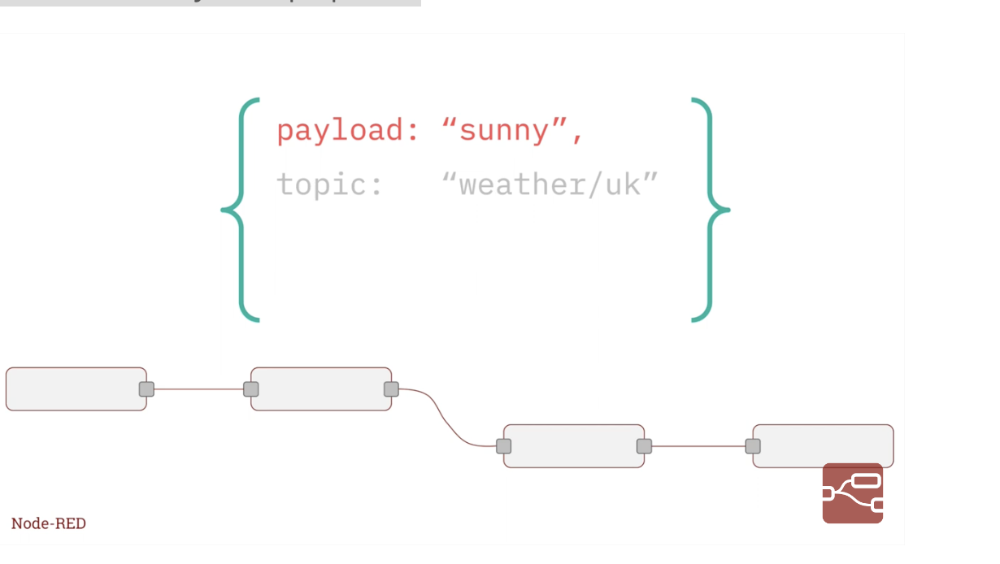

Messages usually have a payload property - this is the default property that most nodes will work with.

Node-RED also adds a property called _msgid - this is an identifier for the message which can be used to trace its progress through a flow.

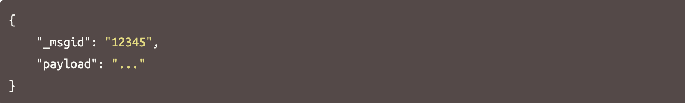
The value of a property can be any valid JavaScript type, such as:

- Boolean - true, false
- Number - eg 0, 123.4
- String - "hello"
- Array - [1,2,3,4]
- Object - { "a": 1, "b": 2}
- Null

##Understanding the structure of a message
The easiest way to understand the structure of a message is to pass it to a Debug node and view it in the Debug sidebar.

By default, the Debug node will display the msg.payload property, but can be configured to display any property or the whole message.

When displaying an Array or Object, the sidebar provides a structured view that can be used to explore the message.
- At the top it shows the name of the property that has been passed in. Here, the default msg.payload has been used.
- Next to the property name is the type of the property - Object, String, Array etc.
- It then shows the contents of the property. For Arrays and Objects, the property is collapsed into a single line. By clicking on it, the property will expand to show more detail

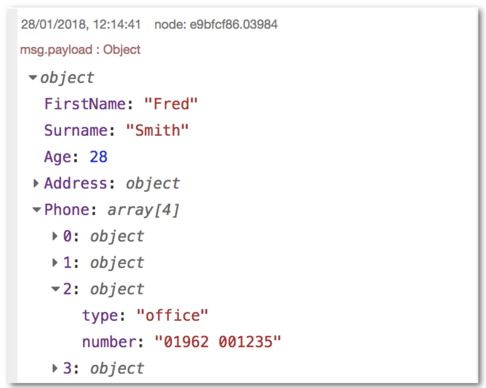
When you hover over any element, a set of buttons appear on the right:
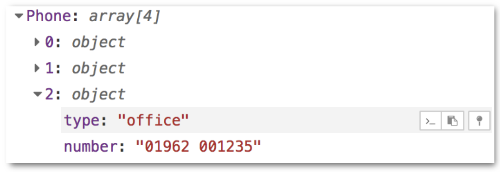
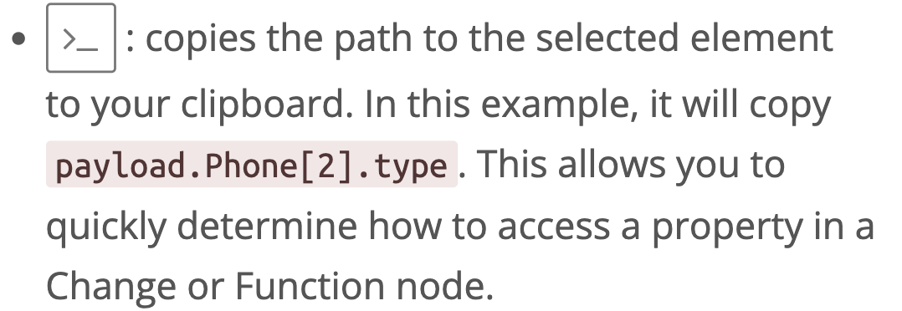
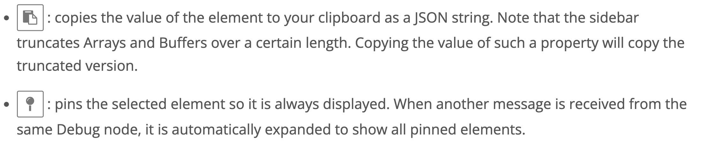

##Working with JSON
JSON, (JavaScript Object Notation), is a standard way for representing a JavaScript object as a String. It is commonly used by web APIs to return data.

If a message property contains a JSON string it must first be parsed to its equivalent JavaScript object before the properties it contains can be accessed. To determine whether a property contains a String or Object, the Debug node can be used.

Node-RED provides a JSON node to do this conversion.

##Changing message properties
A common task in a flow is to modify the properties of a message as it passes between nodes. For example, the result of an HTTP Request may be an object with many properties, of which only some are needed.

There are two main nodes for modifying a message, the Function node and the Change node.
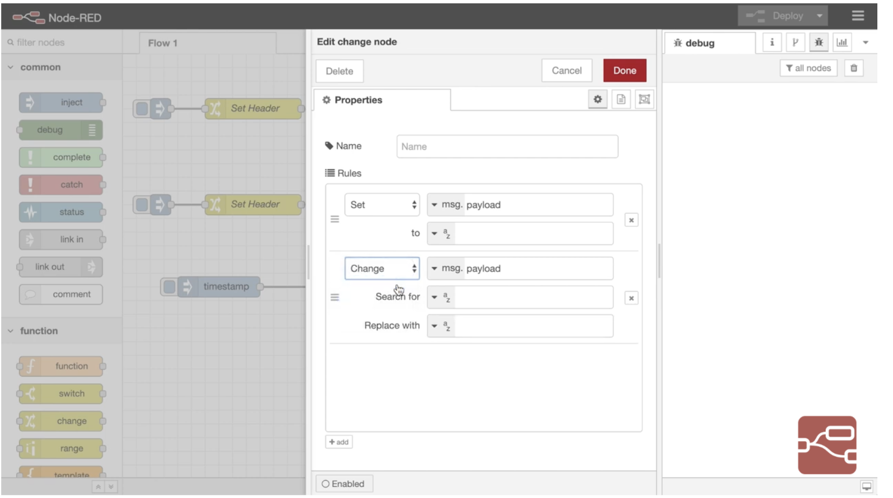

The Function node allows you to run any JavaScript code against the message. This gives you complete flexibility in what you do with the message, but does require familiarity with JavaScript and is unnecessary for many simple cases. More information about writing Functions is available here.

The Change node provides a lot of functionality without needing to write JavaScript code. Not only can it modify message properties, but it can also access flow- and global-context.

It provides four basic operations:

- Set a property to a value,
- Change a String property by performing a search and replace,
- Delete a property,
- Move a property.

###JSONata
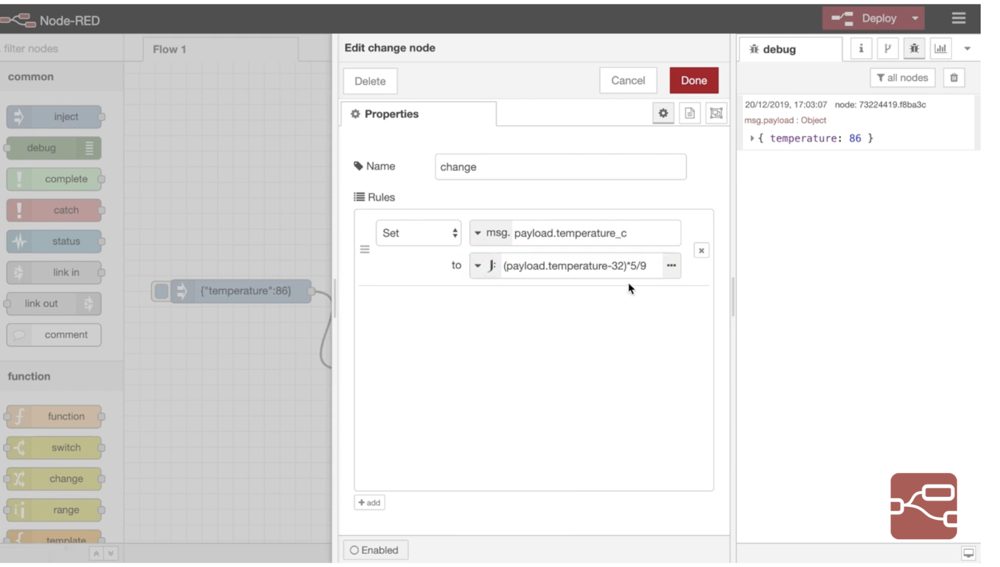
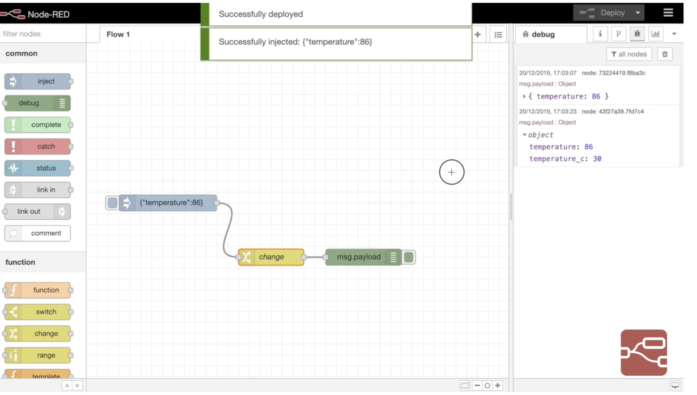
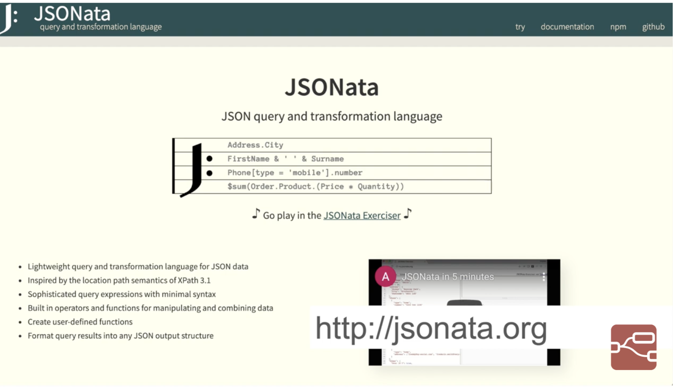

For the set operation, you first identify what property you want to set, then the value you want it to have. That value can either be a hardcoded value, such as a string or number, or it can be taking from another message or flow/global context property. It also supports using the JSONata expression language to calculate a new value.

For example, using the Debug node’s ability to determine a message element’s path, you can paste the path straight into the ‘to’ field, with msg. selected from the list. That will then set msg.payload to the value of msg.payload.Phone[2].type.
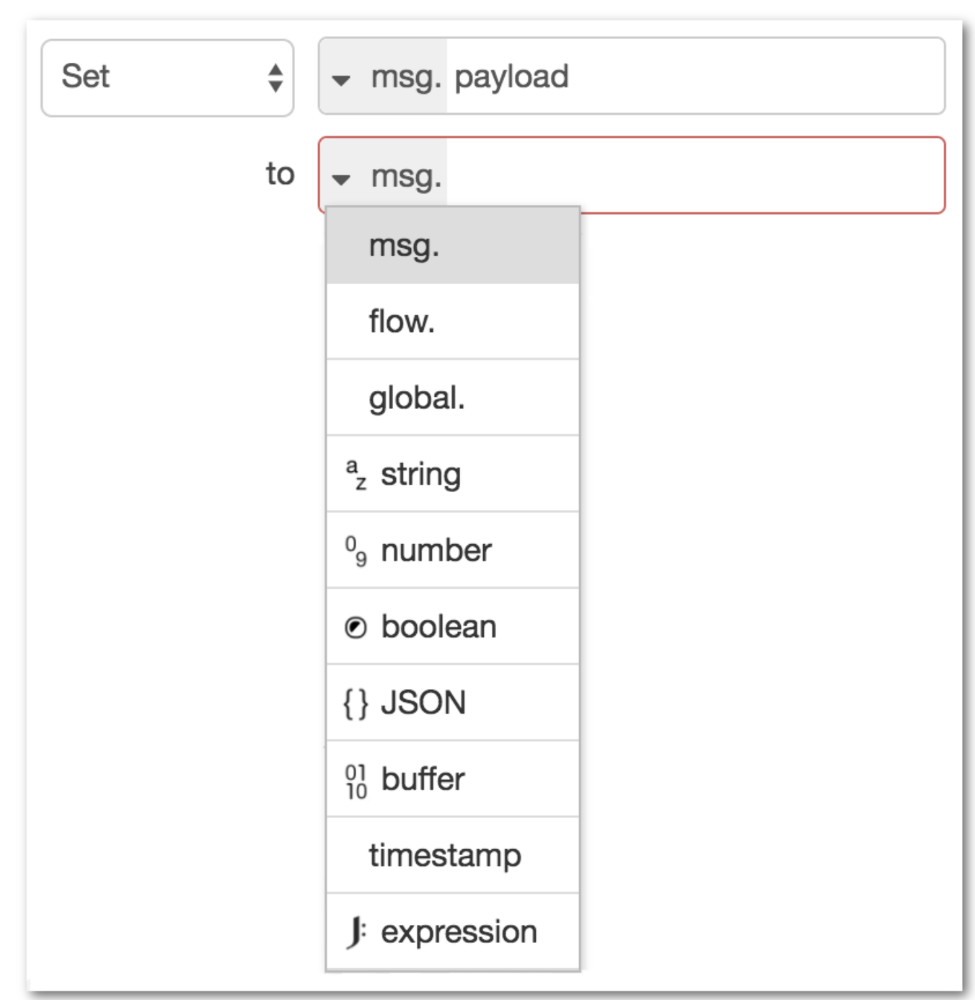

Another example, using a JSONata expression, is to convert a temperature, held in msg.payload.temperature, from Fahrenheit to Celsius and store the result in a new message property msg.payload.temperature_c.
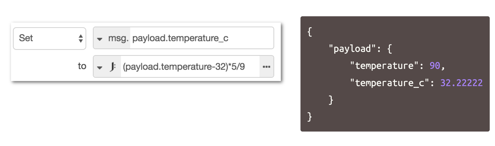

Note that JSONata expressions look a lot like JavaScript, but have some key differences. Refer to the jsonata.org site for more information.
##Message sequences
A message sequence is an ordered series of messages that are related in some way. For example, the Split node can turn a single message whose payload is an Array, into a message sequence where each message has a payload corresponding to one of the array elements.
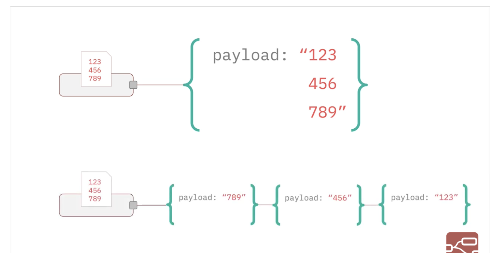
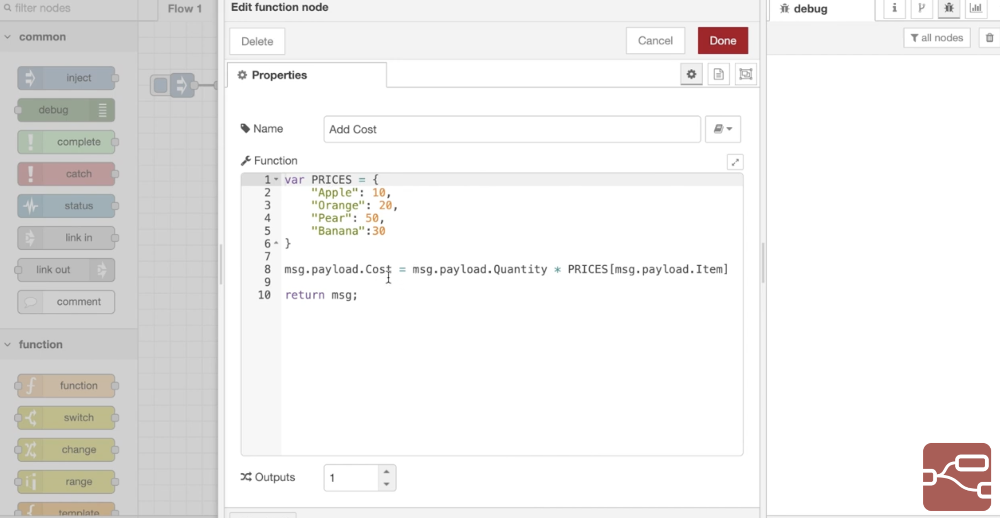
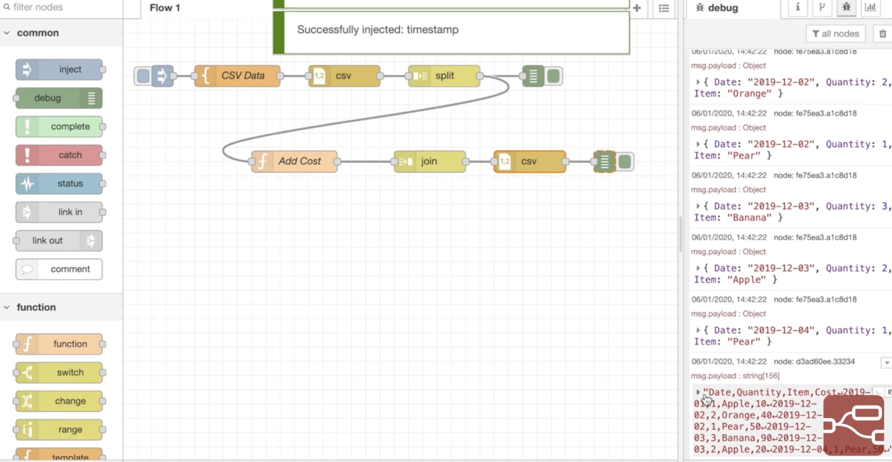
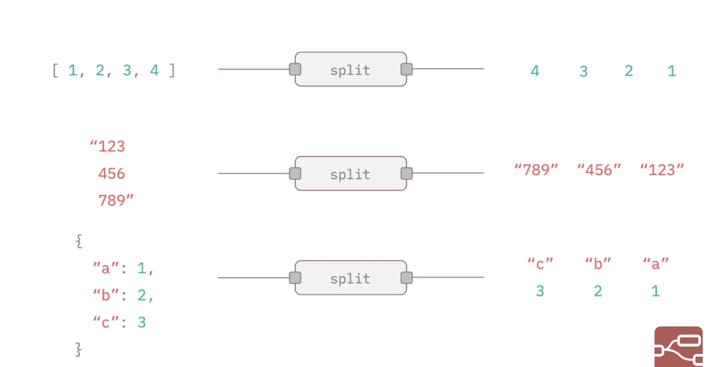
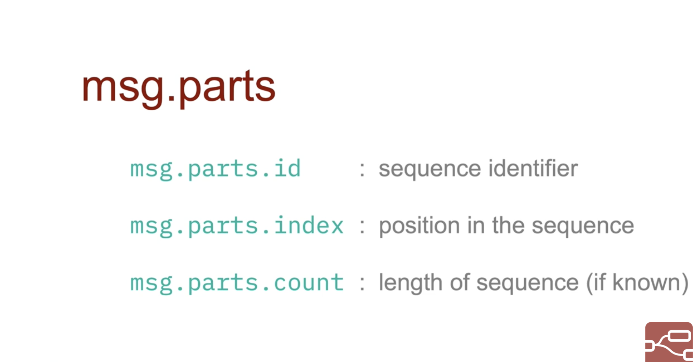
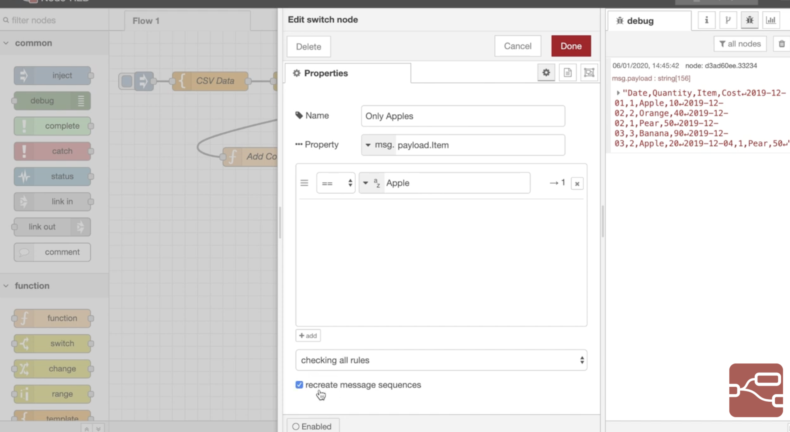
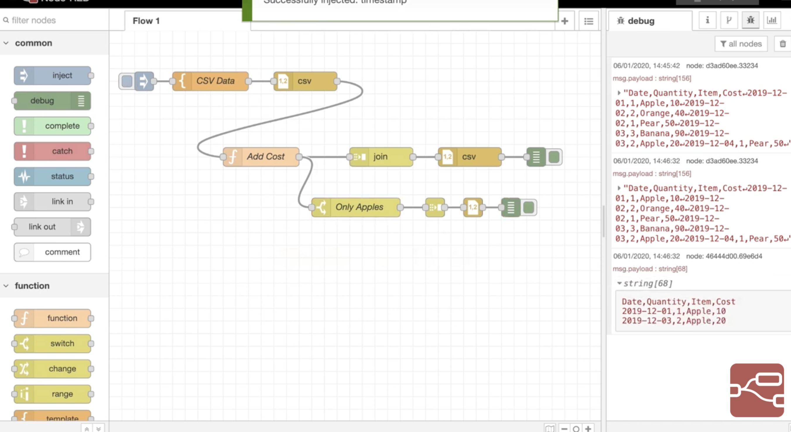
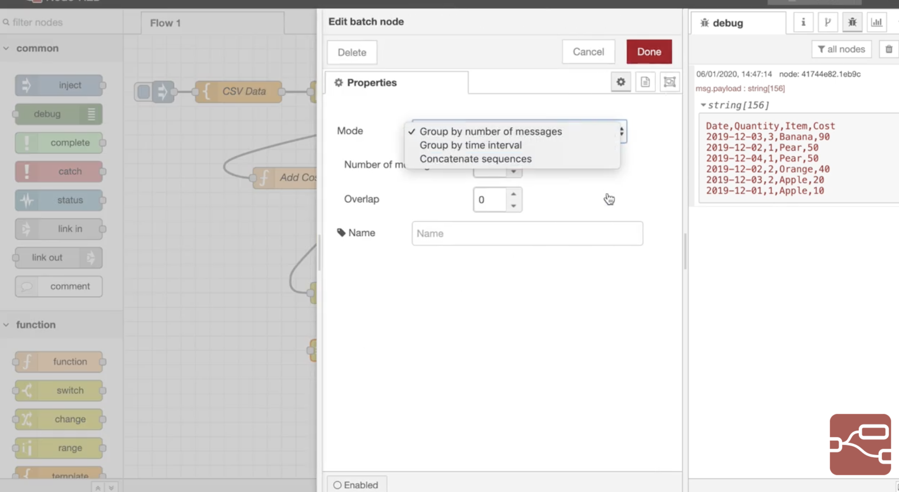
##Understanding msg.parts
Each message in a sequence has a property called msg.parts. This is an object that contains information how the message fits in the sequence. It has the following properties:
- msg.parts.id
- - a unique identifier for the sequence
- msg.parts.index
- - the message's position within the sequence
- msg.parts.count
- - if known, the total number of messages in the sequence
```
Note: the parts array may contain additional meta-data about the
sequence. For example, the split node also attaches information
that can be used by the join node to reassemble the sequence. 
See the split node’s documentation.
```
##Working with sequences
There are a number of core nodes that can work across message sequences:
###Split
Turns a single message into a sequence of messages.
The exact behaviour of the node depends on the type of msg.payload:
####String/Buffer
- the message is split using the specified character (default: `\n`), buffer sequence or into fixed lengths.
####Array
- the message is split into either individual array elements, or arrays of a fixed-length.
####Object
- a message is sent for each key/value pair of the object.
####Join
Turns a sequence of messages into a single message.
The node provides three modes of operation:
#####Automatic
- attempts to reverse the action of a previous Split node
#####Manual
- allows finer control on how the sequence should be joined
#####Reduce
- New in 0.18 - allows a JSONata expression to be run against each message in the sequence and the result accumulated to produce a single message.
####Sort
New in 0.18
Sorts the sequence based on a property value or JSONata expression result.
####Batch
New in 0.18
Creates new sequences of messages from those received.
The node provides three modes of operation:
#####Number of messages
- groups messages into sequences of a given length. The overlap option specifies how many messages at the end of one sequence should be repeated at the start of the next sequence.
#####Time interval
- groups messages that arrive within the specified interval. If no messages arrive within the interval, the node can optionally send on an empty message.
#####Concatenate Sequences
- creates a message sequence by concatenating incoming sequences. Each sequence must have a msg.topic property to identify it. The node is configured with a list of topic values to identify the order sequences are concatenated.