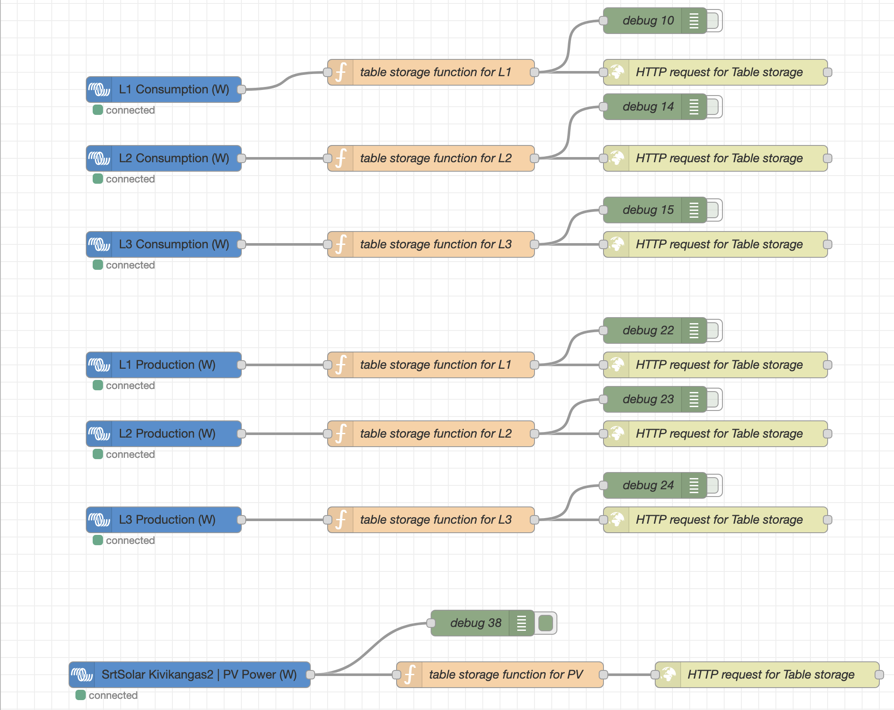

#Data for AI
At this version, AI used data is pushed from Victron devies directly to axure storage table.
Next version would be more flexible for maintain with storage blob or sql server integration.

##For now - the bare minimum flow is like this:


Here is the JSON for import if you want to do investigations on you Nodered. 
Remark! Sensitive info is replaced with 10 x (xxxxxxxxxx). Use find and replace and put you own ip or domain names there. Other sensitive info is Shared access signature (SASToken), with is replaced as yyyyyyyyyy. Replave that too with your own.
```json
[
    {
        "id": "2aa34dc2ad387880",
        "type": "tab",
        "label": "Azure Storage Flow",
        "disabled": false,
        "info": "",
        "env": []
    },
    {
        "id": "65b4fb8135f38e45",
        "type": "http request",
        "z": "2aa34dc2ad387880",
        "name": "HTTP request for Table storage",
        "method": "use",
        "ret": "txt",
        "paytoqs": "ignore",
        "url": "",
        "tls": "",
        "persist": false,
        "proxy": "",
        "insecureHTTPParser": false,
        "authType": "",
        "senderr": false,
        "headers": [],
        "x": 830,
        "y": 120,
        "wires": [
            []
        ]
    },
    {
        "id": "b63c07589642283a",
        "type": "victron-input-system",
        "z": "2aa34dc2ad387880",
        "service": "com.victronenergy.system/0",
        "path": "/Ac/Consumption/L1/Power",
        "serviceObj": {
            "service": "com.victronenergy.system/0",
            "name": "Venus system"
        },
        "pathObj": {
            "path": "/Ac/Consumption/L1/Power",
            "type": "float",
            "name": "AC Consumption L1 (W)"
        },
        "name": "L1 Consumption (W)",
        "onlyChanges": true,
        "roundValues": "2",
        "x": 190,
        "y": 140,
        "wires": [
            [
                "1c361cf1a6f3db7c"
            ]
        ]
    },
    {
        "id": "1c361cf1a6f3db7c",
        "type": "function",
        "z": "2aa34dc2ad387880",
        "name": "table storage function for L1",
        "func": "var URL = \"https://xxxxxxxxxx.table.core.windows.net\"\nvar Table = \"VictronConsumption\"\nvar SASToken = \"yyyyyyyyyy\"\nvar PartitionKey = \"L1\"\nvar Timestamp = Date.now()\nvar Attrib = msg.topic.split('/')[4]\nvar body = { PartitionKey: PartitionKey ,RowKey: Timestamp , W : msg.payload}\nmsg.payload = body\nmsg.headers = {};\nmsg.headers['x-ms-version'] = '2017-04-17';\nmsg.headers['Content-Type'] = 'application/json';\nmsg.headers['Accept'] = 'application/json;odata=fullmetadata';\nmsg.url = URL + \"/\" + Table + \"(PartitionKey='\" + PartitionKey + \"',RowKey='\" + Timestamp + \"')\" + SASToken\nmsg.method = 'merge'\nreturn msg;",
        "outputs": 1,
        "noerr": 0,
        "initialize": "// Code added here will be run once\n// whenever the node is started.\nif (context.get(\"counter\") === undefined) {\n    context.set(\"counter\", 0)\n}",
        "finalize": "",
        "libs": [],
        "x": 500,
        "y": 120,
        "wires": [
            [
                "65b4fb8135f38e45",
                "adba549a87a139cf"
            ]
        ]
    },
    {
        "id": "adba549a87a139cf",
        "type": "debug",
        "z": "2aa34dc2ad387880",
        "name": "debug 10",
        "active": false,
        "tosidebar": true,
        "console": false,
        "tostatus": false,
        "complete": "payload",
        "targetType": "msg",
        "statusVal": "",
        "statusType": "auto",
        "x": 760,
        "y": 60,
        "wires": []
    },
    {
        "id": "3a1d4a60234c5fb3",
        "type": "victron-input-system",
        "z": "2aa34dc2ad387880",
        "service": "com.victronenergy.system/0",
        "path": "/Ac/Consumption/L2/Power",
        "serviceObj": {
            "service": "com.victronenergy.system/0",
            "name": "Venus system"
        },
        "pathObj": {
            "path": "/Ac/Consumption/L2/Power",
            "type": "float",
            "name": "AC Consumption L2 (W)"
        },
        "name": "L2 Consumption (W)",
        "onlyChanges": true,
        "roundValues": "2",
        "x": 190,
        "y": 220,
        "wires": [
            [
                "50b0ab29e8e0acc9"
            ]
        ]
    },
    {
        "id": "50b0ab29e8e0acc9",
        "type": "function",
        "z": "2aa34dc2ad387880",
        "name": "table storage function for L2",
        "func": "var URL = \"https://xxxxxxxxxx.table.core.windows.net\"\nvar Table = \"VictronConsumption\"\nvar SASToken = \"yyyyyyyyyy\"\nvar PartitionKey = \"L2\"\nvar Timestamp = Date.now()\nvar Attrib = msg.topic.split('/')[4]\nvar body = { PartitionKey: PartitionKey ,RowKey: Timestamp , W : msg.payload}\nmsg.payload = body\nmsg.headers = {};\nmsg.headers['x-ms-version'] = '2017-04-17';\nmsg.headers['Content-Type'] = 'application/json';\nmsg.headers['Accept'] = 'application/json;odata=fullmetadata';\nmsg.url = URL + \"/\" + Table + \"(PartitionKey='\" + PartitionKey + \"',RowKey='\" + Timestamp+ \"')\" + SASToken\nmsg.method = 'merge'\nreturn msg;",
        "outputs": 1,
        "noerr": 0,
        "initialize": "// Code added here will be run once\n// whenever the node is started.\nif (context.get(\"counter\") === undefined) {\n    context.set(\"counter\", 0)\n}",
        "finalize": "",
        "libs": [],
        "x": 500,
        "y": 220,
        "wires": [
            [
                "bb2598711b4ccc11",
                "7551316f4be3422f"
            ]
        ]
    },
    {
        "id": "bb2598711b4ccc11",
        "type": "http request",
        "z": "2aa34dc2ad387880",
        "name": "HTTP request for Table storage",
        "method": "use",
        "ret": "txt",
        "paytoqs": "ignore",
        "url": "",
        "tls": "",
        "persist": false,
        "proxy": "",
        "insecureHTTPParser": false,
        "authType": "",
        "senderr": false,
        "headers": [],
        "x": 830,
        "y": 220,
        "wires": [
            []
        ]
    },
    {
        "id": "a6d3160d21c1d476",
        "type": "victron-input-system",
        "z": "2aa34dc2ad387880",
        "service": "com.victronenergy.system/0",
        "path": "/Ac/Consumption/L3/Power",
        "serviceObj": {
            "service": "com.victronenergy.system/0",
            "name": "Venus system"
        },
        "pathObj": {
            "path": "/Ac/Consumption/L3/Power",
            "type": "float",
            "name": "AC Consumption L3 (W)"
        },
        "name": "L3 Consumption (W)",
        "onlyChanges": true,
        "roundValues": "2",
        "x": 190,
        "y": 320,
        "wires": [
            [
                "14550b17e4eae16a"
            ]
        ]
    },
    {
        "id": "14550b17e4eae16a",
        "type": "function",
        "z": "2aa34dc2ad387880",
        "name": "table storage function for L3",
        "func": "var URL = \"https://xxxxxxxxxx.table.core.windows.net\"\nvar Table = \"VictronConsumption\"\nvar SASToken = \"yyyyyyyyyy\"\nvar PartitionKey = \"L3\"\nvar Timestamp = Date.now()\nvar Attrib = msg.topic.split('/')[4]\nvar body = { PartitionKey: PartitionKey ,RowKey: Timestamp , W : msg.payload}\nmsg.payload = body\nmsg.headers = {};\nmsg.headers['x-ms-version'] = '2017-04-17';\nmsg.headers['Content-Type'] = 'application/json';\nmsg.headers['Accept'] = 'application/json;odata=fullmetadata';\nmsg.url = URL + \"/\" + Table + \"(PartitionKey='\" + PartitionKey + \"',RowKey='\" + Timestamp + \"')\" + SASToken\nmsg.method = 'merge'\nreturn msg;",
        "outputs": 1,
        "noerr": 0,
        "initialize": "// Code added here will be run once\n// whenever the node is started.\nif (context.get(\"counter\") === undefined) {\n    context.set(\"counter\", 0)\n}",
        "finalize": "",
        "libs": [],
        "x": 500,
        "y": 320,
        "wires": [
            [
                "2af4f01049d76772",
                "eeddb56dda3e04ba"
            ]
        ]
    },
    {
        "id": "2af4f01049d76772",
        "type": "http request",
        "z": "2aa34dc2ad387880",
        "name": "HTTP request for Table storage",
        "method": "use",
        "ret": "txt",
        "paytoqs": "ignore",
        "url": "",
        "tls": "",
        "persist": false,
        "proxy": "",
        "insecureHTTPParser": false,
        "authType": "",
        "senderr": false,
        "headers": [],
        "x": 830,
        "y": 320,
        "wires": [
            []
        ]
    },
    {
        "id": "7551316f4be3422f",
        "type": "debug",
        "z": "2aa34dc2ad387880",
        "name": "debug 14",
        "active": false,
        "tosidebar": true,
        "console": false,
        "tostatus": false,
        "complete": "payload",
        "targetType": "msg",
        "statusVal": "",
        "statusType": "auto",
        "x": 760,
        "y": 160,
        "wires": []
    },
    {
        "id": "eeddb56dda3e04ba",
        "type": "debug",
        "z": "2aa34dc2ad387880",
        "name": "debug 15",
        "active": false,
        "tosidebar": true,
        "console": false,
        "tostatus": false,
        "complete": "payload",
        "targetType": "msg",
        "statusVal": "",
        "statusType": "auto",
        "x": 760,
        "y": 280,
        "wires": []
    },
    {
        "id": "31c8deb14a42665e",
        "type": "victron-input-system",
        "z": "2aa34dc2ad387880",
        "service": "com.victronenergy.system/0",
        "path": "/Ac/Genset/L1/Power",
        "serviceObj": {
            "service": "com.victronenergy.system/0",
            "name": "Venus system"
        },
        "pathObj": {
            "path": "/Ac/Genset/L1/Power",
            "type": "float",
            "name": "Genset L1 (W)"
        },
        "name": "L1 Production (W)",
        "onlyChanges": true,
        "roundValues": "2",
        "x": 190,
        "y": 460,
        "wires": [
            [
                "50c6cb55d69ff8f8"
            ]
        ]
    },
    {
        "id": "50c6cb55d69ff8f8",
        "type": "function",
        "z": "2aa34dc2ad387880",
        "name": "table storage function for L1",
        "func": "var URL = \"https://xxxxxxxxxx.table.core.windows.net\"\nvar Table = \"VictronProductionGenset\"\nvar SASToken = \"yyyyyyyyyy\"\nvar PartitionKey = \"L1\"\nvar Timestamp = Date.now()\nvar Attrib = msg.topic.split('/')[4]\nvar body = { PartitionKey: PartitionKey ,RowKey: Timestamp , W : msg.payload}\nmsg.payload = body\nmsg.headers = {};\nmsg.headers['x-ms-version'] = '2017-04-17';\nmsg.headers['Content-Type'] = 'application/json';\nmsg.headers['Accept'] = 'application/json;odata=fullmetadata';\nmsg.url = URL + \"/\" + Table + \"(PartitionKey='\" + PartitionKey + \"',RowKey='\" + Timestamp + \"')\" + SASToken\nmsg.method = 'merge'\nreturn msg;",
        "outputs": 1,
        "noerr": 0,
        "initialize": "// Code added here will be run once\n// whenever the node is started.\nif (context.get(\"counter\") === undefined) {\n    context.set(\"counter\", 0)\n}",
        "finalize": "",
        "libs": [],
        "x": 500,
        "y": 460,
        "wires": [
            [
                "60225e2476e34f53",
                "82e9199c328e8f8e"
            ]
        ]
    },
    {
        "id": "60225e2476e34f53",
        "type": "http request",
        "z": "2aa34dc2ad387880",
        "name": "HTTP request for Table storage",
        "method": "use",
        "ret": "txt",
        "paytoqs": "ignore",
        "url": "",
        "tls": "",
        "persist": false,
        "proxy": "",
        "insecureHTTPParser": false,
        "authType": "",
        "senderr": false,
        "headers": [],
        "x": 830,
        "y": 460,
        "wires": [
            []
        ]
    },
    {
        "id": "82e9199c328e8f8e",
        "type": "debug",
        "z": "2aa34dc2ad387880",
        "name": "debug 22",
        "active": false,
        "tosidebar": true,
        "console": false,
        "tostatus": false,
        "complete": "payload",
        "targetType": "msg",
        "statusVal": "",
        "statusType": "auto",
        "x": 760,
        "y": 420,
        "wires": []
    },
    {
        "id": "f163c5cabc0ab7ec",
        "type": "victron-input-system",
        "z": "2aa34dc2ad387880",
        "service": "com.victronenergy.system/0",
        "path": "/Ac/Genset/L2/Power",
        "serviceObj": {
            "service": "com.victronenergy.system/0",
            "name": "Venus system"
        },
        "pathObj": {
            "path": "/Ac/Genset/L2/Power",
            "type": "float",
            "name": "Genset L2 (W)"
        },
        "name": "L2 Production (W)",
        "onlyChanges": true,
        "roundValues": "2",
        "x": 190,
        "y": 540,
        "wires": [
            [
                "2a459c04c36de71e"
            ]
        ]
    },
    {
        "id": "2a459c04c36de71e",
        "type": "function",
        "z": "2aa34dc2ad387880",
        "name": "table storage function for L2",
        "func": "var URL = \"https://xxxxxxxxxx.table.core.windows.net\"\nvar Table = \"VictronProductionGenset\"\nvar SASToken = \"yyyyyyyyyy\"\nvar PartitionKey = \"L2\"\nvar Timestamp = Date.now()\nvar Attrib = msg.topic.split('/')[4]\nvar body = { PartitionKey: PartitionKey ,RowKey: Timestamp , W : msg.payload}\nmsg.payload = body\nmsg.headers = {};\nmsg.headers['x-ms-version'] = '2017-04-17';\nmsg.headers['Content-Type'] = 'application/json';\nmsg.headers['Accept'] = 'application/json;odata=fullmetadata';\nmsg.url = URL + \"/\" + Table + \"(PartitionKey='\" + PartitionKey + \"',RowKey='\" + Timestamp + \"')\" + SASToken\nmsg.method = 'merge'\nreturn msg;",
        "outputs": 1,
        "noerr": 0,
        "initialize": "// Code added here will be run once\n// whenever the node is started.\nif (context.get(\"counter\") === undefined) {\n    context.set(\"counter\", 0)\n}",
        "finalize": "",
        "libs": [],
        "x": 500,
        "y": 540,
        "wires": [
            [
                "434c09097c6db234",
                "29391e28a2cf8f34"
            ]
        ]
    },
    {
        "id": "434c09097c6db234",
        "type": "http request",
        "z": "2aa34dc2ad387880",
        "name": "HTTP request for Table storage",
        "method": "use",
        "ret": "txt",
        "paytoqs": "ignore",
        "url": "",
        "tls": "",
        "persist": false,
        "proxy": "",
        "insecureHTTPParser": false,
        "authType": "",
        "senderr": false,
        "headers": [],
        "x": 830,
        "y": 540,
        "wires": [
            []
        ]
    },
    {
        "id": "29391e28a2cf8f34",
        "type": "debug",
        "z": "2aa34dc2ad387880",
        "name": "debug 23",
        "active": false,
        "tosidebar": true,
        "console": false,
        "tostatus": false,
        "complete": "payload",
        "targetType": "msg",
        "statusVal": "",
        "statusType": "auto",
        "x": 760,
        "y": 500,
        "wires": []
    },
    {
        "id": "a2dca3b25deeb5bd",
        "type": "victron-input-system",
        "z": "2aa34dc2ad387880",
        "service": "com.victronenergy.system/0",
        "path": "/Ac/Genset/L3/Power",
        "serviceObj": {
            "service": "com.victronenergy.system/0",
            "name": "Venus system"
        },
        "pathObj": {
            "path": "/Ac/Genset/L3/Power",
            "type": "float",
            "name": "Genset L3 (W)"
        },
        "name": "L3 Production (W)",
        "onlyChanges": true,
        "roundValues": "2",
        "x": 190,
        "y": 640,
        "wires": [
            [
                "05425fbd9fe51b40"
            ]
        ]
    },
    {
        "id": "05425fbd9fe51b40",
        "type": "function",
        "z": "2aa34dc2ad387880",
        "name": "table storage function for L3",
        "func": "var URL = \"https://arvosmartlanding.table.core.windows.net\"\nvar Table = \"VictronProductionGenset\"\nvar SASToken = \"yyyyyyyyyy\"\nvar PartitionKey = \"L3\"\nvar Timestamp = Date.now()\nvar Attrib = msg.topic.split('/')[4]\nvar body = { PartitionKey: PartitionKey ,RowKey: Timestamp , W : msg.payload}\nmsg.payload = body\nmsg.headers = {};\nmsg.headers['x-ms-version'] = '2017-04-17';\nmsg.headers['Content-Type'] = 'application/json';\nmsg.headers['Accept'] = 'application/json;odata=fullmetadata';\nmsg.url = URL + \"/\" + Table + \"(PartitionKey='\" + PartitionKey + \"',RowKey='\" + Timestamp + \"')\" + SASToken\nmsg.method = 'merge'\nreturn msg;",
        "outputs": 1,
        "noerr": 0,
        "initialize": "// Code added here will be run once\n// whenever the node is started.\nif (context.get(\"counter\") === undefined) {\n    context.set(\"counter\", 0)\n}",
        "finalize": "",
        "libs": [],
        "x": 500,
        "y": 640,
        "wires": [
            [
                "37d9430f7c329006",
                "fb9eeb1ebed40c90"
            ]
        ]
    },
    {
        "id": "37d9430f7c329006",
        "type": "http request",
        "z": "2aa34dc2ad387880",
        "name": "HTTP request for Table storage",
        "method": "use",
        "ret": "txt",
        "paytoqs": "ignore",
        "url": "",
        "tls": "",
        "persist": false,
        "proxy": "",
        "insecureHTTPParser": false,
        "authType": "",
        "senderr": false,
        "headers": [],
        "x": 830,
        "y": 640,
        "wires": [
            []
        ]
    },
    {
        "id": "fb9eeb1ebed40c90",
        "type": "debug",
        "z": "2aa34dc2ad387880",
        "name": "debug 24",
        "active": false,
        "tosidebar": true,
        "console": false,
        "tostatus": false,
        "complete": "payload",
        "targetType": "msg",
        "statusVal": "",
        "statusType": "auto",
        "x": 760,
        "y": 600,
        "wires": []
    },
    {
        "id": "26480d8fd733682e",
        "type": "comment",
        "z": "2aa34dc2ad387880",
        "name": "to Cloud",
        "info": "# To Azure storage table onCloud",
        "x": 160,
        "y": 20,
        "wires": []
    },
    {
        "id": "cd4cba37f9ca7ce2",
        "type": "victron-input-solarcharger",
        "z": "2aa34dc2ad387880",
        "service": "com.victronenergy.solarcharger/278",
        "path": "/Yield/Power",
        "serviceObj": {
            "service": "com.victronenergy.solarcharger/278",
            "name": "SrtSolar Kivikangas2"
        },
        "pathObj": {
            "path": "/Yield/Power",
            "type": "float",
            "name": "PV Power (W)"
        },
        "name": "",
        "onlyChanges": true,
        "roundValues": "2",
        "x": 220,
        "y": 820,
        "wires": [
            [
                "6a8fba47348892a5",
                "e2323392dbe2c69c"
            ]
        ]
    },
    {
        "id": "6a8fba47348892a5",
        "type": "debug",
        "z": "2aa34dc2ad387880",
        "name": "debug 38",
        "active": true,
        "tosidebar": true,
        "console": false,
        "tostatus": false,
        "complete": "payload",
        "targetType": "msg",
        "statusVal": "",
        "statusType": "auto",
        "x": 560,
        "y": 760,
        "wires": []
    },
    {
        "id": "e2323392dbe2c69c",
        "type": "function",
        "z": "2aa34dc2ad387880",
        "name": "table storage function for PV",
        "func": "var URL = \"https://xxxxxxxxxx.table.core.windows.net\"\nvar Table = \"VictronProductionPV\"\nvar SASToken = \"?yyyyyyyyyy\"\nvar PartitionKey = \"PV\"\nvar Timestamp = Date.now()\nvar Attrib = msg.topic.split('/')[4]\nvar body = { PartitionKey: PartitionKey ,RowKey: Timestamp , W : msg.payload}\nmsg.payload = body\nmsg.headers = {};\nmsg.headers['x-ms-version'] = '2017-04-17';\nmsg.headers['Content-Type'] = 'application/json';\nmsg.headers['Accept'] = 'application/json;odata=fullmetadata';\nmsg.url = URL + \"/\" + Table + \"(PartitionKey='\" + PartitionKey + \"',RowKey='\" + Timestamp + \"')\" + SASToken\nmsg.method = 'merge'\nreturn msg;",
        "outputs": 1,
        "noerr": 0,
        "initialize": "// Code added here will be run once\n// whenever the node is started.\nif (context.get(\"counter\") === undefined) {\n    context.set(\"counter\", 0)\n}",
        "finalize": "",
        "libs": [],
        "x": 580,
        "y": 820,
        "wires": [
            [
                "90c3041f74219c57"
            ]
        ]
    },
    {
        "id": "90c3041f74219c57",
        "type": "http request",
        "z": "2aa34dc2ad387880",
        "name": "HTTP request for Table storage",
        "method": "use",
        "ret": "txt",
        "paytoqs": "ignore",
        "url": "",
        "tls": "",
        "persist": false,
        "proxy": "",
        "insecureHTTPParser": false,
        "authType": "",
        "senderr": false,
        "headers": [],
        "x": 890,
        "y": 820,
        "wires": [
            []
        ]
    }
]
```