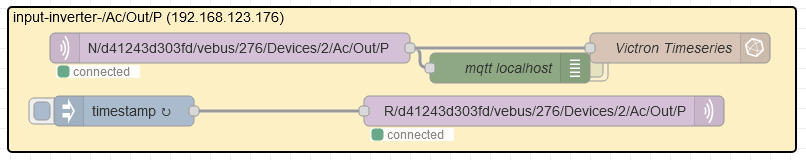
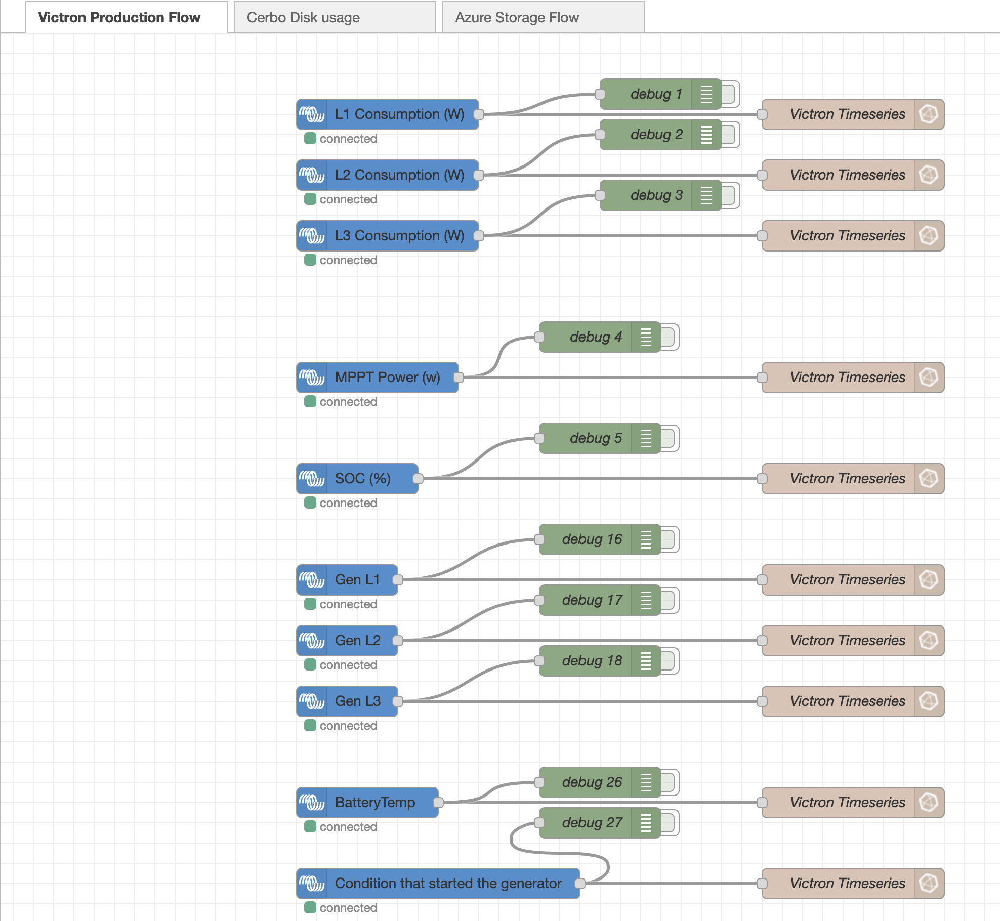
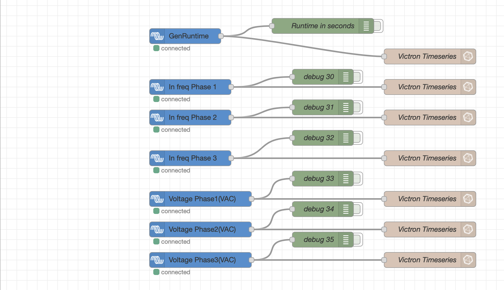

# NodeRed with Cerbo OS large - v.0.2
##
ref: https://github.com/victronenergy/dbus-flashmq

When a value on the D-Bus changes, the plugin will initiate a publish. The MQTT topic looks like this:

```
N/<portal ID>/<service_type>/<device instance>/<D-Bus path>
````

- Portal ID is the VRM portal ID associated with the CCGX. You can find the portal ID on the CCGX in Settings->VRM online portal->VRM Portal ID. On the VRM portal itself, you can find the ID in Settings tab.
- Service type is the part of the D-Bus service name that describes the service.
- Device instance is a number used to make all services of the same type unique (this value is published on the D-Bus as /DeviceInstance).

The payload of the D-Bus value is wrapped in a dictionary and converted to json.

As an example of a notification, suppose we have a PV inverter, which reports a total AC power of 936W. The topic of the MQTT message would be:

```
Topic: N/<portal ID>/pvinverter/20/Ac/Power
Payload: {"value": 936}
````
The value 20 in the topic is the device instance which may be different on other systems.
There are 2 special cases:
- A D-Bus value may be invalid. This happens with values that are not always present. For example: a single phase PV inverter will not provide a power value on phase 2. So /Ac/L2/Power is invalid. In that case the payload of the MQTT message will be {"value": null}.
- A device may disappear from the D-Bus. For example: most PV inverters shut down at night, causing a communication breakdown. If this happens a notification will be sent for all topics related to the device. The payload will be empty (zero bytes, so no valid JSON).



## MQTT End point 
Topic: N/d41243d303fd/vebus/276/Devices/2/Ac/Out/P

N   ?
d41243d303fd = system id
vebus = bus
276 = bus id
Devices = ? naming meta desc ?
2 = Device number/id
Ac = ?
Out = ?
P = ?

# NodeRed with Cerbo OS large - v.0.1
Logic here would be responsible for transferring from victron based data directly to local Influxdb v2 - without any outside network connection.  Navively same information and more, is transferred to the Victron cloud for full remote control - secured only with usernames and passwords. That is not mandatory, but it's nice to have - build in - feature. It can be turned off from remote console by de activating victron world connections.

If victron remote capabilities are turned off, the MQTT & MODBUS are still usable inside local network, but below is flow based data integration extract, transform and load (ETL) functionality. Data is usable for Influx, Grafana and Homeassistant dashboard.

## This is base minimum local data transformation done by NodeRed.



