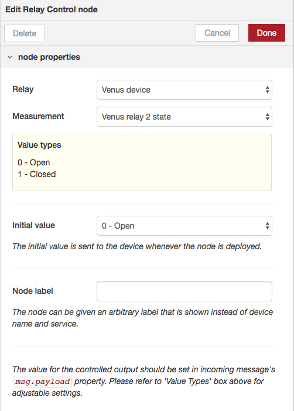

Ref:
https://github.com/victronenergy/node-red-contrib-victron/wiki/Available-nodes

# Available nodes(26.3.2024)

On this page you find and overview of all possible services and measurements for the available nodes. The edit panel will only show items available in your system. For example a Cerbo CX has 2 relays and thus will show 2 relays to control. An EasySolar-II GX has only one relay and thus will only show one.

You can find more background information on the paths and how to use them here. https://github.com/victronenergy/venus/wiki/dbus

**Input nodes:** 
AC Charger, AC Load, Alternator, Battery Monitor, DC-DC, DC Load, DC Source, DC System, Digital Input, Energy Meter, ESS, EV Charger, Fuel cell, Generator, GPS, Grid Meter, Inverter, Meteo, Motordrive, Multi RS, Pulsemeter, Pump, PV Inverter, Relay, Settings, Solar Charger, System, Tank Sensor, Temperature Sensor, VE.Bus System

**Output nodes:** 
AC Charger Control, Battery Monitor Control, Charger Control, DC-DC Control, ESS Control, EV Charger Control, GX Generator Control, Inverter Control, Multi RS Control, Pump Control, PV Inverter Control, Relay Control, Settings Control, Solar Charger Control, VE.Bus System Control
If there are services and paths not covered by the above nodes, there are also 2 custom nodes that allow you to read from and write to all found dbus services and paths.

## Input nodes
The input nodes have two selectable inputs: the devices select and measurement select. The available options are dynamically updated based on the data that is actually available on the Venus device.

    - Device select - lists all available devices
    - Measurement select - lists all available device-specific measurements
    - Node label input field - sets a custom label for the node

The measurement unit type is shown in the measurement label in brackets, e.g. Battery voltage (V). In case the data type is enumerated, an appropriate enum legend is shown below the selected option.

If the data type is float, a dropdown for rounding the output appears.

By default the node outputs its value every five seconds. If the only changes is checked, the node will only output on value changes.

### AC Charger
The AC charger can be read with this node.

AC Current limit (A), dbus path: /Ac/In/CurrentLimit, type float
AC Current (A), dbus path: /Ac/In/L1/I, type float
AC Power (W), dbus path: /Ac/In/L1/P, type float
High voltage alarm, dbus path: /Alarms/HighVoltage, type enum

    0 - No alarm
    1 - Warning
    2 - Alarm

Low voltage alarm, dbus path: /Alarms/LowVoltage, type enum

    0 - No alarm
    2 - Alarm

Output 1 - current (A), dbus path: /Dc/0/Current, type float
Output 1 - temperature (°C), dbus path: /Dc/0/Temperature, type float
Output 1 - voltage (V), dbus path: /Dc/0/Voltage, type float
Output 2 - current (A), dbus path: /Dc/1/Current, type float
Battery 1 temperature (°C), dbus path: /Dc/1/Temperature, type float
Output 2 - voltage (V), dbus path: /Dc/1/Voltage, type float
Output 3 - current (A), dbus path: /Dc/2/Current, type float
Battery 2 temperature (°C), dbus path: /Dc/2/Temperature, type float
Output 3 - voltage (V), dbus path: /Dc/2/Voltage, type float
Error, dbus path: /ErrorCode, type enum

    0 - No error
    1 - Err 1: Battery temperature too high
    2 - Err 2: Battery voltage too high
    3 - Err 3: Battery temperature sensor miswired (+)
    4 - Err 3: Battery temperature sensor miswired (-)
    5 - Err 5: Battery temperature sensor disconnected
    6 - Err 6: Battery voltage sense miswired (+)
    7 - Err 7: Battery voltage sense miswired (-)
    8 - Err 8: Battery voltage sense disconnected
    9 - Err 9: Battery voltage wire losses too high
    17 - Err 17: Charger temperature too high
    18 - Err 18: Charger over-current
    19 - Err 19: Charger current polarity reversed
    20 - Err 20: Bulk time limit reached
    22 - Err 22: Charger temperature sensor miswired
    23 - Err 23: Charger temperature sensor disconnected
    34 - Err 34: Input current too high
    67 - Err 67: No BMS

Charger on/off, dbus path: /Mode, type enum

    1 - On
    4 - Off

Relay on the charger, dbus path: /Relay/0/State, type enum

    0 - Open
    1 - Closed

Charge state, dbus path: /State, type enum

    0 - Off
    2 - Fault
    3 - Bulk
    4 - Absorption
    5 - Float
    6 - Storage
    7 - Equalize
    11 - Power supply mode
    246 - Repeated absorption
    247 - Equalize
    248 - Battery safe

### AC Load
This node allows for AC load monitoring. Measuring can be done by using an energy meter and assigning it the 'ac load' role.

L1 Current (A), dbus path: /Ac/L1/Current, type float
L1 Energy (kWh), dbus path: /Ac/L1/Energy/Forward, type float
L1 Power (W), dbus path: /Ac/L1/Power, type float
L1 Voltage (V AC), dbus path: /Ac/L1/Voltage, type float
L2 Current (A), dbus path: /Ac/L2/Current, type float
L2 Energy (kWh), dbus path: /Ac/L2/Energy/Forward, type float
L2 Power (W), dbus path: /Ac/L2/Power, type float
L2 Voltage (V AC), dbus path: /Ac/L2/Voltage, type float
L3 Current (A), dbus path: /Ac/L3/Current, type float
L3 Energy (kWh), dbus path: /Ac/L3/Energy/Forward, type float
L3 Power (W), dbus path: /Ac/L3/Power, type float
L3 Voltage (V AC), dbus path: /Ac/L3/Voltage, type float
Serial number, dbus path: /Serial, type string

### Alternator
This node allows for monitoring the state of BMVs configured in Monitor Mode and DC meter type is Alternator or an alternator controller which is interfaced to the Venus OS.

High auxiliary voltage alarm, dbus path: /Alarms/HighStarterVoltage, type enum

    0 - Ok
    1 - Warning
    2 - Alarm

High temperature alarm, dbus path: /Alarms/HighTemperature, type enum

    0 - Ok
    1 - Warning
    2 - Alarm

High voltage alarm, dbus path: /Alarms/HighVoltage, type enum

    0 - Ok
    1 - Warning
    2 - Alarm

Low auxiliary voltage alarm, dbus path: /Alarms/LowStarterVoltage, type enum

    0 - Ok
    1 - Warning
    2 - Alarm

Low temperature alarm, dbus path: /Alarms/LowTemperature, type enum

    0 - Ok
    1 - Warning
    2 - Alarm

Low voltage alarm, dbus path: /Alarms/LowVoltage, type enum

    0 - No alarm
    2 - Alarm

Battery current (A), dbus path: /Dc/0/Current, type float
Battery temperature (°C), dbus path: /Dc/0/Temperature, type float
Battery voltage (V), dbus path: /Dc/0/Voltage, type float
Auxiliary voltage (V DC), dbus path: /Dc/1/Voltage, type float
Input voltage (before DC/DC converter) (V DC), dbus path: /Dc/In/V, type float
Input power (W DC), dbus path: /Dc/In/P, type float
Engine speed (RPM), dbus path: /Engine/Speed, type float
Alternator error code, dbus path: /ErrorCode, type enum

    12 - High battery temperature
    13 - High battery voltage
    14 - Low battery voltage
    15 - VBat exceeds $CPB
    21 - High alternator temperature
    22 - Alternator overspeed
    24 - Internal error
    41 - High field FET temperature
    42 - Sensor missing
    43 - Low VAlt
    44 - High Voltage offset
    45 - VAlt exceeds $CPB
    53 - Battery instance out of range
    54 - Too many BMSes
    55 - AEBus fault
    56 - Too many Victron devices
    91 - BMS lost
    92 - Forced idle
    201 - DCDC converter fail
    51-52 - Battery disconnect request
    58-61 - Battery requested disconnection
    201-207 - DCDC error

Alternator Field Drive %, dbus path: /FieldDrive, type float
Cumulative amp-hours charged (Ah), dbus path: /History/Cumulative/User/ChargedAh, type float
Total energy produced (kWh), dbus path: /History/EnergyOut, type float
Mode, dbus path: /Mode, type enum

    1 - On
    4 - Off

Alternator speed (RPM), dbus path: /Speed, type float
Alternator state, dbus path: /State, type enum

    0 - Off
    2 - Fault
    3 - Bulk
    4 - Absorption
    5 - Float
    6 - Storage
    7 - Equalize
    11 - Psu
    252 - External control

### Battery Monitor
This node allows for monitoring the state of the battery.

Alarm, dbus path: /Alarms/Alarm, type enum

    0 - No alarm
    2 - Alarm

Cell Imbalance alarm, dbus path: /Alarms/CellImbalance, type enum

    0 - No alarm
    1 - Warning
    2 - Alarm

Fuse blown alarm, dbus path: /Alarms/FuseBlown, type enum

    0 - No alarm
    2 - Alarm

High charge current alarm, dbus path: /Alarms/HighChargeCurrent, type enum

    0 - No alarm
    1 - Warning
    2 - Alarm

High charge temperature alarm, dbus path: /Alarms/HighChargeTemperature, type enum

    0 - No alarm
    1 - Warning
    2 - Alarm

High discharge current alarm, dbus path: /Alarms/HighDischargeCurrent, type enum

    0 - No alarm
    1 - Warning
    2 - Alarm

High fused-voltage alarm, dbus path: /Alarms/HighFusedVoltage, type enum

    0 - No alarm
    2 - Alarm

High internal-temperature alarm, dbus path: /Alarms/HighInternalTemperature, type enum

    0 - No alarm
    2 - Alarm

High starter-voltage alarm, dbus path: /Alarms/HighStarterVoltage, type enum

    0 - No alarm
    2 - Alarm

High battery temperature alarm, dbus path: /Alarms/HighTemperature, type enum

    0 - No alarm
    2 - Alarm

High voltage alarm, dbus path: /Alarms/HighVoltage, type enum

    0 - No alarm
    2 - Alarm

Internal failure, dbus path: /Alarms/InternalFailure, type enum

    0 - No alarm
    1 - Warning
    2 - Alarm

Low cell voltage alarm, dbus path: /Alarms/LowCellVoltage, type enum

    0 - No alarm
    1 - Almost discharged
    2 - Alarm

Low charge temperature alarm, dbus path: /Alarms/LowChargeTemperature, type enum

    0 - No alarm
    1 - Warning
    2 - Alarm

Low fused-voltage alarm, dbus path: /Alarms/LowFusedVoltage, type enum

    0 - No alarm
    2 - Alarm

Low state-of-charge alarm, dbus path: /Alarms/LowSoc, type enum

    0 - No alarm
    2 - Alarm

Low starter-voltage alarm, dbus path: /Alarms/LowStarterVoltage, type enum

    0 - No alarm
    2 - Alarm

Low battery temperature alarm, dbus path: /Alarms/LowTemperature, type enum

    0 - No alarm
    2 - Alarm

Low voltage alarm, dbus path: /Alarms/LowVoltage, type enum

    0 - No alarm
    2 - Alarm

Mid-voltage alarm, dbus path: /Alarms/MidVoltage, type enum

    0 - No alarm
    2 - Alarm

Balancing, dbus path: /Balancing, type enum

    0 - Inactive
    1 - Active

Capacity (Ah), dbus path: /Capacity, type float
Consumed Amphours (Ah), dbus path: /ConsumedAmphours, type float
Battery current (A), dbus path: /Dc/0/Current, type float
Mid-point voltage of the battery bank (V), dbus path: /Dc/0/MidVoltage, type float
Mid-point deviation of the battery bank (%), dbus path: /Dc/0/MidVoltageDeviation, type float
Battery power (W), dbus path: /Dc/0/Power, type float
Battery temperature (°C), dbus path: /Dc/0/Temperature, type float
Battery voltage (V), dbus path: /Dc/0/Voltage, type float
Starter battery voltage (V), dbus path: /Dc/1/Voltage, type float
Diagnostics; 1st last error, dbus path: /Diagnostics/LastErrors/1/Error, type enum

    0 - No error
    1 - Battery initialization error
    2 - No batteries connected
    3 - Unknown battery connected
    4 - Different battery type
    5 - Number of batteries incorrect
    6 - Lynx Shunt not found
    7 - Battery measure error
    8 - Internal calculation error
    9 - Batteries in series not ok
    10 - Number of batteries incorrect
    11 - Hardware error
    12 - Watchdog error
    13 - Over voltage
    14 - Under voltage
    15 - Over temperature
    16 - Under temperature
    17 - Hardware fault
    18 - Standby shutdown
    19 - Pre-charge charge error
    20 - Safety contactor check error
    21 - Pre-charge discharge error
    22 - ADC error
    23 - Slave error
    24 - Slave warning
    25 - Pre-charge error
    26 - Safety contactor error
    27 - Over current
    28 - Slave update failed
    29 - Slave update unavailable
    30 - Calibration data lost
    31 - Settings invalid
    32 - BMS cable
    33 - Reference failure
    34 - Wrong system voltage
    35 - Pre-charge timeout

Diagnostics; 1st last error timestamp, dbus path: /Diagnostics/LastErrors/1/Time, type float
Diagnostics; 2nd last error, dbus path: /Diagnostics/LastErrors/2/Error, type float
Diagnostics; 2nd last error timestamp, dbus path: /Diagnostics/LastErrors/2/Time, type float
Diagnostics; 3rd last error, dbus path: /Diagnostics/LastErrors/3/Error, type float
Diagnostics; 3rd last error timestamp, dbus path: /Diagnostics/LastErrors/3/Time, type float
Diagnostics; 4th last error, dbus path: /Diagnostics/LastErrors/4/Error, type float
Diagnostics; 4th last error timestamp, dbus path: /Diagnostics/LastErrors/4/Time, type float
Diagnostics; shutdowns due to error (count), dbus path: /Diagnostics/ShutDownsDueError, type float
Error, dbus path: /ErrorCode, type enum

    0 - No error
    1 - Battery initialization error
    2 - No batteries connected
    3 - Unknown battery connected
    4 - Different battery type
    5 - Number of batteries incorrect
    6 - Lynx Shunt not found
    7 - Battery measure error
    8 - Internal calculation error
    9 - Batteries in series not ok
    10 - Number of batteries incorrect
    11 - Hardware error
    12 - Watchdog error
    13 - Over voltage
    14 - Under voltage
    15 - Over temperature
    16 - Under temperature
    17 - Hardware fault
    18 - Standby shutdown
    19 - Pre-charge charge error
    20 - Safety contactor check error
    21 - Pre-charge discharge error
    22 - ADC error
    23 - Slave error
    24 - Slave warning
    25 - Pre-charge error
    26 - Safety contactor error
    27 - Over current
    28 - Slave update failed
    29 - Slave update unavailable
    30 - Calibration data lost
    31 - Settings invalid
    32 - BMS cable
    33 - Reference failure
    34 - Wrong system voltage
    35 - Pre-charge timeout

Automatic syncs (count), dbus path: /History/AutomaticSyncs, type float
Average discharge (Ah), dbus path: /History/AverageDischarge, type float
Charge cycles (count), dbus path: /History/ChargeCycles, type float
Charged Energy (kWh), dbus path: /History/ChargedEnergy, type float
Deepest discharge (Ah), dbus path: /History/DeepestDischarge, type float
Discharged Energy (kWh), dbus path: /History/DischargedEnergy, type float
Full discharges (count), dbus path: /History/FullDischarges, type float
High fused-voltage alarms (count), dbus path: /History/HighFusedVoltageAlarms, type float
High starter voltage alarms (count), dbus path: /History/HighStarterVoltageAlarms, type float
High voltage alarms (count), dbus path: /History/HighVoltageAlarms, type float
Last discharge (Ah), dbus path: /History/LastDischarge, type float
Low fused-voltage alarms (count), dbus path: /History/LowFusedVoltageAlarms, type float
Low starter voltage alarms (count), dbus path: /History/LowStarterVoltageAlarms, type float
Low voltage alarms (count), dbus path: /History/LowVoltageAlarms, type float
History; Max cell-voltage (V DC), dbus path: /History/MaximumCellVoltage, type float
Maximum fused voltage (V DC), dbus path: /History/MaximumFusedVoltage, type float
Maximum starter voltage (V DC), dbus path: /History/MaximumStarterVoltage, type float
Maximum voltage (V DC), dbus path: /History/MaximumVoltage, type float
History; Min cell-voltage (V DC), dbus path: /History/MinimumCellVoltage, type float
Minimum fused voltage (V DC), dbus path: /History/MinimumFusedVoltage, type float
Minimum starter voltage (V DC), dbus path: /History/MinimumStarterVoltage, type float
Minimum voltage (V DC), dbus path: /History/MinimumVoltage, type float
Time since last full charge (seconds), dbus path: /History/TimeSinceLastFullCharge, type float
Total Ah drawn (Ah), dbus path: /History/TotalAhDrawn, type float
Min discharge voltage (V DC), dbus path: /Info/BatteryLowVoltage, type float
CCL - Charge Current Limit (A), dbus path: /Info/MaxChargeCurrent, type float
CVL - Charge Voltage Limit (V), dbus path: /Info/MaxChargeVoltage, type float
DCL - Discharge Current Limit (A), dbus path: /Info/MaxDischargeCurrent, type float
ATC (Allow to Charge), dbus path: /Io/AllowToCharge, type enum

    0 - No
    1 - Yes

ATD (Allow to Discharge), dbus path: /Io/AllowToDischarge, type enum

    0 - No
    1 - Yes

IO; external relay, dbus path: /Io/ExternalRelay, type enum

    0 - Inactive
    1 - Active

Mode, dbus path: /Mode, type enum

    3 - On
    252 - Standby

Relay status, dbus path: /Relay/0/State, type enum

    0 - Open
    1 - Closed

State of charge (%), dbus path: /Soc, type float
State of health (%), dbus path: /Soh, type float
State, dbus path: /State, type enum

    0 - Initializing (Wait start)
    1 - Initializing (before boot)
    2 - Initializing (Before boot delay)
    3 - Initializing (Wait boot)
    4 - Initializing
    5 - Initializing (Measure battery voltage)
    6 - Initializing (Calculate battery voltage)
    7 - Initializing (Wait bus voltage)
    8 - Initializing (Wait for lynx shunt)
    9 - Running
    10 - Error
    11 - Unused
    12 - Shutdown
    13 - Slave updating
    14 - Standby
    15 - Going to run
    16 - Pre-charging
    17 - Contactor check

System; batteries parallel (count), dbus path: /System/BatteriesParallel, type float
System; batteries series (count), dbus path: /System/BatteriesSeries, type float
System; ID of module with highest cell voltage, dbus path: /System/MaxVoltageCellId, type string
Maximum cell temperature (°C), dbus path: /System/MaxCellTemperature, type float
System; maximum cell voltage (V DC), dbus path: /System/MaxCellVoltage, type float
System; ID of module with highest cell temperature, dbus path: /System/MaxTemperatureCellId, type string
System; ID of module with lowest cell voltage, dbus path: /System/MinVoltageCellId, type string
Minimum cell temperature (°C), dbus path: /System/MinCellTemperature, type float
System; minimum cell voltage (V DC), dbus path: /System/MinCellVoltage, type float
System; ID of module with lowest cell temperature, dbus path: /System/MinTemperatureCellId, type string
System; number of batteries (count), dbus path: /System/NrOfBatteries, type float
System; number of cells per battery (count), dbus path: /System/NrOfCellsPerBattery, type float
Number of modules blocking charge, dbus path: /System/NrOfModulesBlockingCharge, type integer
Number of modules blocking discharge, dbus path: /System/NrOfModulesBlockingDischarge, type integer
Number of offline modules, dbus path: /System/NrOfModulesOffline, type integer
Number of online modules, dbus path: /System/NrOfModulesOnline, type integer
System-switch, dbus path: /SystemSwitch, type enum

    0 - Disabled
    1 - Enabled

*For monitoring the state of the built-in contactor.*

Time to go (s), dbus path: /TimeToGo, type float

### DC-DC
This node allows for monitoring the state of an Orion XS.

/Dc/0/Current (A DC), dbus path: /Dc/0/Current, type float
/Dc/0/Temperature (Degrees celsius), dbus path: /Dc/0/Temperature, type float
/Dc/0/Voltage (V DC), dbus path: /Dc/0/Voltage, type float
/Dc/In/V (V DC), dbus path: /Dc/In/V, type float
/Dc/In/P (W), dbus path: /Dc/In/P, type float
/ErrorCode, dbus path: /ErrorCode, type enum

    0 - No error
    1 - Battery temperature too high
    2 - Battery voltage too high
    3 - Battery temperature sensor miswired (+)
    4 - Battery temperature sensor miswired (-)
    5 - Battery temperature sensor disconnected
    6 - Battery voltage sense miswired (+)
    7 - Battery voltage sense miswired (-)
    8 - Battery voltage sense disconnected
    9 - Battery voltage wire losses too high
    17 - Charger temperature too high
    18 - Charger over-current
    19 - Charger current polarity reversed
    20 - Bulk time limit reached
    22 - Charger temperature sensor miswired
    23 - Charger temperature sensor disconnected
    34 - Input current too high

/FirmwareVersion, dbus path: /FirmwareVersion, type float
/History/Cumulative/User/ChargedAh (Ah), dbus path: /History/Cumulative/User/ChargedAh, type float
/ProductId, dbus path: /ProductId, type float
/State, dbus path: /State, type enum

    0 - Off
    2 - Fault
    3 - Bulk
    4 - Absorption
    5 - Float
    6 - Storage
    7 - Equalize

### DC Load
This node allows for monitoring the state of BMVs configured in Monitor Mode and DC meter type is a load

High starter-voltage alarm, dbus path: /Alarms/HighStarterVoltage, type enum

    0 - No alarm
    2 - Alarm

High battery temperature alarm, dbus path: /Alarms/HighTemperature, type enum

    0 - No alarm
    2 - Alarm

High voltage alarm, dbus path: /Alarms/HighVoltage, type enum

    0 - No alarm
    2 - Alarm

Low starter-voltage alarm, dbus path: /Alarms/LowStarterVoltage, type enum

    0 - No alarm
    2 - Alarm

Low battery temperature alarm, dbus path: /Alarms/LowTemperature, type enum

    0 - No alarm
    2 - Alarm

Low voltage alarm, dbus path: /Alarms/LowVoltage, type enum

    0 - No alarm
    2 - Alarm

Battery current (A), dbus path: /Dc/0/Current, type float
Battery temperature (°C), dbus path: /Dc/0/Temperature, type float
Battery voltage (V), dbus path: /Dc/0/Voltage, type float
Starter battery voltage (V), dbus path: /Dc/1/Voltage, type float
Total energy consumed (kWh), dbus path: /History/EnergyIn, type float
Relay status, dbus path: /Relay/0/State, type enum

    0 - Open
    1 - Closed

### DC Source
This node allows for monitoring the state of Battery Monitor Victron devices (BMV's) configured in Monitor Mode and DC meter type is a source.

High starter-voltage alarm, dbus path: /Alarms/HighStarterVoltage, type enum

    0 - No alarm
    2 - Alarm

High battery temperature alarm, dbus path: /Alarms/HighTemperature, type enum

    0 - No alarm
    2 - Alarm

High voltage alarm, dbus path: /Alarms/HighVoltage, type enum

    0 - No alarm
    2 - Alarm

Low starter-voltage alarm, dbus path: /Alarms/LowStarterVoltage, type enum

    0 - No alarm
    2 - Alarm

Low battery temperature alarm, dbus path: /Alarms/LowTemperature, type enum

    0 - No alarm
    2 - Alarm

Low voltage alarm, dbus path: /Alarms/LowVoltage, type enum

    0 - No alarm
    2 - Alarm

Battery current (A), dbus path: /Dc/0/Current, type float
Battery temperature (°C), dbus path: /Dc/0/Temperature, type float
Battery voltage (V), dbus path: /Dc/0/Voltage, type float
Starter battery voltage (V), dbus path: /Dc/1/Voltage, type float
Total energy produced (kWh), dbus path: /History/EnergyOut, type float
Relay status, dbus path: /Relay/0/State, type enum

    0 - Open
    1 - Closed

### DC System
DC system input node is a DC measurement for loads in your system.

High auxiliary voltage alarm, dbus path: /Alarms/HighStarterVoltage, type enum

    0 - Ok
    1 - Warning
    2 - Alarm

High temperature alarm, dbus path: /Alarms/HighTemperature, type enum

    0 - Ok
    1 - Warning
    2 - Alarm

High voltage alarm, dbus path: /Alarms/HighVoltage, type enum

    0 - No alarm
    1 - Warning
    2 - Alarm

Low auxiliary voltage alarm, dbus path: /Alarms/LowStarterVoltage, type enum

    0 - Ok
    1 - Warning
    2 - Alarm

Low temperature alarm, dbus path: /Alarms/LowTemperature, type enum

    0 - Ok
    1 - Warning
    2 - Alarm

Low voltage alarm, dbus path: /Alarms/LowVoltage, type enum

    0 - No alarm
    1 - Warning
    2 - Alarm

Battery current (A), dbus path: /Dc/0/Current, type float
Battery temperature (°C), dbus path: /Dc/0/Temperature, type float
Battery voltage (V DC), dbus path: /Dc/0/Voltage, type float
Auxiliary voltage (V DC), dbus path: /Dc/1/Voltage, type float
Total energy consumed (kWh), dbus path: /History/EnergyIn, type float
Total energy produced (kWh), dbus path: /History/EnergyOut, type float

### Digital Input
With this node it is possible to read the digital inputs from the Venus device. The node only shows the enabled digital inputs, so first make sure to enable the input from the Venus OS GUI (Settings -> I/O -> digital inputs) for the desired readout.Depending on the selected type of input, different measurements become available.Also see the section on digital inputs in the Cerbo GX manual.

Pulse meter aggregate, dbus path: /Aggregate, type float
Pulse meter count, dbus path: /Count, type float
Digital input alarm, dbus path: /Alarm, type enum

    0 - No alarm
    1 - Warning
    2 - Alarm

Digital input count, dbus path: /Count, type float
Digital input state, dbus path: /State, type enum

    0 - low
    1 - high
    2 - off
    3 - on
    4 - no
    5 - yes
    6 - open
    7 - closed
    8 - ok
    9 - alarm
    10 - running
    11 - stopped

Digital input type, dbus path: /Type, type enum

    0 - Disabled
    1 - Pulse meter
    2 - Door sensor
    3 - Bilge pump
    4 - Bilge alarm
    5 - Burglar alarm
    6 - Smoke alarm
    7 - Fire alarm
    8 - CO2 alarm
    9 - Generator
    10 - Generic input

### ESS
This node gives information on the energy storage system (ESS).

Maximum battery cell temperature, dbus path: /System/MaxCellTemperature, type integer
Maximum battery cell voltage, dbus path: /System/MaxCellVoltage, type integer
Minimum battery cell temperature, dbus path: /System/MinCellTemperature, type integer
Minimum battery cell voltage, dbus path: /System/MinCellVoltage, type integer
Number of modules blocking charge, dbus path: /System/NrOfModulesBlockingCharge, type integer
Number of modules blocking discharge, dbus path: /System/NrOfModulesBlockingDischarge, type integer
Number of offline modules, dbus path: /System/NrOfModulesOffline, type integer
Number of online modules, dbus path: /System/NrOfModulesOnline, type integer
Disable charge, dbus path: /Hub4/DisableCharge, type enum

    0 - No
    1 - Yes

Disable feed-in, dbus path: /Hub4/DisableFeedIn, type enum

    0 - No
    1 - Yes

Feed in overvoltage, dbus path: /Hub4/DoNotFeedInOvervoltage, type enum

    0 - Yes
    1 - No

AC Power L1 setpoint (W), dbus path: /Hub4/L1/AcPowerSetpoint, type integer
Maximum overvoltage feed-in power L1 (W), dbus path: /Hub4/L1/MaxFeedInPower, type integer
AC Power L2 setpoint (W), dbus path: /Hub4/L2/AcPowerSetpoint, type integer
Maximum overvoltage feed-in power L2 (W), dbus path: /Hub4/L2/MaxFeedInPower, type integer
Maximum overvoltage feed-in power L3 (W), dbus path: /Hub4/L3/MaxFeedInPower, type integer
AC Power L3 setpoint (W), dbus path: /Hub4/L3/AcPowerSetpoint, type integer
Disable PV inverter, dbus path: /PvInverter/Disable, type enum

    0 - No
    1 - Yes

VE.Bus system restart, dbus path: /SystemReset, type enum

    0 - No
    1 - Yes

Grid set-point (W), dbus path: /Settings/CGwacs/AcPowerSetPoint, type integer
Minimum Discharge SOC (%), dbus path: /Settings/CGwacs/BatteryLife/MinimumSocLimit, type integer
Schedule 1: Self-consumption above limit, dbus path: /Settings/CGwacs/BatteryLife/Schedule/Charge/0/AllowDischarge, type enum

    0 - Yes
    1 - No

Schedule 1: Day, dbus path: /Settings/CGwacs/BatteryLife/Schedule/Charge/0/Day, type enum

    0 - Sunday
    1 - Monday
    2 - Tuesday
    3 - Wednesday
    4 - Thursday
    5 - Friday
    6 - Saturday
    7 - Every day
    8 - Weekdays
    9 - Weekends

*A negative value means that the schedule has been de-activated.*

Schedule 1: Duration (seconds), dbus path: /Settings/CGwacs/BatteryLife/Schedule/Charge/0/Duration, type integer
Schedule 1: State of charge (%), dbus path: /Settings/CGwacs/BatteryLife/Schedule/Charge/0/Soc, type integer
Schedule 1: Start (seconds after midnight), dbus path: /Settings/CGwacs/BatteryLife/Schedule/Charge/0/Start, type integer
Schedule 2: Self-consumption above limit, dbus path: /Settings/CGwacs/BatteryLife/Schedule/Charge/1/AllowDischarge, type enum

    0 - Yes
    1 - No

Schedule 2: Day, dbus path: /Settings/CGwacs/BatteryLife/Schedule/Charge/1/Day, type enum

    0 - Sunday
    1 - Monday
    2 - Tuesday
    3 - Wednesday
    4 - Thursday
    5 - Friday
    6 - Saturday
    7 - Every day
    8 - Weekdays
    9 - Weekends

*A negative value means that the schedule has been de-activated.*

Schedule 2: Duration (seconds), dbus path: /Settings/CGwacs/BatteryLife/Schedule/Charge/1/Duration, type integer
Schedule 2: State of charge (%), dbus path: /Settings/CGwacs/BatteryLife/Schedule/Charge/1/Soc, type integer
Schedule 2: Start (seconds after midnight), dbus path: /Settings/CGwacs/BatteryLife/Schedule/Charge/1/Start, type integer
Schedule 3: Self-consumption above limit, dbus path: /Settings/CGwacs/BatteryLife/Schedule/Charge/2/AllowDischarge, type enum

    0 - Yes
    1 - No

Schedule 3: Day, dbus path: /Settings/CGwacs/BatteryLife/Schedule/Charge/2/Day, type enum

    0 - Sunday
    1 - Monday
    2 - Tuesday
    3 - Wednesday
    4 - Thursday
    5 - Friday
    6 - Saturday
    7 - Every day
    8 - Weekdays
    9 - Weekends
*A negative value means that the schedule has been de-activated.*

Schedule 3: Duration (seconds), dbus path: /Settings/CGwacs/BatteryLife/Schedule/Charge/2/Duration, type integer
Schedule 3: State of charge (%), dbus path: /Settings/CGwacs/BatteryLife/Schedule/Charge/2/Soc, type integer
Schedule 3: Start (seconds after midnight), dbus path: /Settings/CGwacs/BatteryLife/Schedule/Charge/2/Start, type integer
Schedule 4: Self-consumption above limit, dbus path: /Settings/CGwacs/BatteryLife/Schedule/Charge/3/AllowDischarge, type enum

    0 - Yes
    1 - No

Schedule 4: Day, dbus path: /Settings/CGwacs/BatteryLife/Schedule/Charge/3/Day, type enum

    0 - Sunday
    1 - Monday
    2 - Tuesday
    3 - Wednesday
    4 - Thursday
    5 - Friday
    6 - Saturday
    7 - Every day
    8 - Weekdays
    9 - Weekends
*A negative value means that the schedule has been de-activated.*

Schedule 4: Duration (seconds), dbus path: /Settings/CGwacs/BatteryLife/Schedule/Charge/3/Duration, type integer
Schedule 4: State of charge (%), dbus path: /Settings/CGwacs/BatteryLife/Schedule/Charge/3/Soc, type integer
Schedule 4: Start (seconds after midnight), dbus path: /Settings/CGwacs/BatteryLife/Schedule/Charge/3/Start, type integer
Schedule 5: Self-consumption above limit, dbus path: /Settings/CGwacs/BatteryLife/Schedule/Charge/4/AllowDischarge, type enum

    0 - Yes
    1 - No

Schedule 5: Day, dbus path: /Settings/CGwacs/BatteryLife/Schedule/Charge/4/Day, type enum

    0 - Sunday
    1 - Monday
    2 - Tuesday
    3 - Wednesday
    4 - Thursday
    5 - Friday
    6 - Saturday
    7 - Every day
    8 - Weekdays
    9 - Weekends

*Writing a negative value to the path will de-activate the schedule.* Schedule 5: Duration (seconds), dbus path: /Settings/CGwacs/BatteryLife/Schedule/Charge/4/Duration, type integer
Schedule 5: State of charge (%), dbus path: /Settings/CGwacs/BatteryLife/Schedule/Charge/4/Soc, type integer
Schedule 5: Start (seconds after midnight), dbus path: /Settings/CGwacs/BatteryLife/Schedule/Charge/4/Start, type integer
ESS state, dbus path: /Settings/CGwacs/BatteryLife/State, type enum

    1 - BatteryLife enabled (GUI controlled)
    2 - Optimized Mode /w BatteryLife: self consumption
    3 - Optimized Mode /w BatteryLife: self consumption, SoC exceeds 85%
    4 - Optimized Mode /w BatteryLife: self consumption, SoC at 100%
    5 - Optimized Mode /w BatteryLife: SoC below dynamic SoC limit
    6 - Optimized Mode /w BatteryLife: SoC has been below SoC limit for more than 24 hours. Charging the battery (5A)
    7 - Optimized Mode /w BatteryLife: Inverter/Charger is in sustain mode
    8 - Optimized Mode /w BatteryLife: recharging, SoC dropped by 5% or more below the minimum SoC
    9 - 'Keep batteries charged' mode is enabled
    10 - Optimized mode w/o BatteryLife: self consumption, SoC at or above minimum SoC
    11 - Optimized mode w/o BatteryLife: self consumption, SoC is below minimum SoC
    12 - Optimized mode w/o BatteryLife: recharging, SoC dropped by 5% or more below minimum SoC

ESS mode, dbus path: /Settings/CGwacs/Hub4Mode, type enum

    1 - Optimized mode or 'keep batteries charged' and phase compensation enabled
    2 - Optimized mode or 'keep batteries charged' and phase compensation disabled
    3 - External control

Max charge power (W), dbus path: /Settings/CGwacs/MaxChargePower, type integer

*Not used with DVCC*.

Max inverter power (W), dbus path: /Settings/CGwacs/MaxDischargePower, type integer
Feed excess DC-coupled PV into grid, dbus path: /Settings/CGwacs/OvervoltageFeedIn, type enum

    0 - Don’t feed excess DC-tied PV into grid
    1 - Feed excess DC-tied PV into the grid

Don’t feed excess AC-coupled PV into grid, dbus path: /Settings/CGwacs/PreventFeedback, type enum

    0 - Feed excess AC-tied PV into grid
    1 - Don’t feed excess AC-tied PV into the grid

DVCC Charge current limit (A), dbus path: /Settings/SystemSetup/MaxChargeCurrent, type float
DVCC Maximum charge voltage (V), dbus path: /Settings/SystemSetup/MaxChargeVoltage, type float
Active SOC limit (%), dbus path: /Control/ActiveSocLimit, type integer

### EV Charger
The EV charger input node is for reading from the EV Charging Station.Also see here for more information.

Energy consumed by charger (kWh), dbus path: /Ac/Energy/Forward, type float
L1 Power (W), dbus path: /Ac/L1/Power, type float
L2 Power (W), dbus path: /Ac/L2/Power, type float
L3 Power (W), dbus path: /Ac/L3/Power, type float
Total power (W), dbus path: /Ac/Power, type float
Charging time (seconds), dbus path: /ChargingTime, type float
Charge current (A), dbus path: /Current, type float
Display, dbus path: /EnableDisplay, type enum

    0 - Locked
    1 - Unlocked

Firmware version, dbus path: /FirmwareVersion, type float
Maximum charge current (A), dbus path: /MaxCurrent, type float
Mode, dbus path: /Mode, type enum

    0 - Manual
    1 - Auto
    2 - Schedule

Model, dbus path: /Model, type float
Product ID, dbus path: /ProductId, type float
Serial, dbus path: /Serial, type string
Set charge current (manual mode) (A), dbus path: /SetCurrent, type float
Start/stop charging (manual mode), dbus path: /StartStop, type enum

    0 - Stop
    1 - Start

Status, dbus path: /Status, type enum

    0 - Disconnected
    1 - Connected
    2 - Charging
    3 - Charged
    4 - Waiting for sun
    5 - Waiting for RFID
    6 - Waiting for start
    7 - Low SOC
    8 - Ground fault
    9 - Welded contacts
    10 - CP Input shorted
    11 - Residual current detected
    12 - Under voltage detected
    13 - Overvoltage detected
    14 - Overheating detected

### Fuel cell
See https://github.com/victronenergy/venus/wiki/dbus#fuelcell for more information.

High voltage alarm, dbus path: /Alarms/HighVoltage, type enum

    0 - Ok
    1 - Warning
    2 - Alarm

High auxiliary voltage alarm, dbus path: /Alarms/HighStarterVoltage, type enum

    0 - Ok
    1 - Warning
    2 - Alarm

High temperature alarm, dbus path: /Alarms/HighTemperature, type enum

    0 - Ok
    1 - Warning
    2 - Alarm

Low auxiliary voltage alarm, dbus path: /Alarms/LowStarterVoltage, type enum

    0 - Ok
    1 - Warning
    2 - Alarm

Low temperature alarm, dbus path: /Alarms/LowTemperature, type enum

    0 - Ok
    1 - Warning
    2 - Alarm

Low voltage alarm, dbus path: /Alarms/LowVoltage, type enum

    0 - Ok
    1 - Warning
    2 - Alarm

Battery current (A), dbus path: /Dc/0/Current, type float
Battery temperature (°C), dbus path: /Dc/0/Temperature, type float
Battery voltage (V DC), dbus path: /Dc/0/Voltage, type float
Auxiliary voltage (V DC), dbus path: /Dc/1/Voltage, type float
Total energy produced (kWh), dbus path: /History/EnergyOut, type float

### Generator
Generator input node for relay controlled and Fischer Panda generators.In order to use the relay for controlling a generator, make sure to set the relay to Generator via the (remote) console first.Also see here for more information.

Generator not detected at AC input alarm, dbus path: /Alarms/NoGeneratorAtAcIn, type enum

    0 - No alarm
    2 - Alarm

Auto start enabled/disabled, dbus path: /AutoStartEnabled, type enum

    0 - Autostart disabled
    1 - Autostart enabled

Generator remote error, dbus path: /Error, type enum

    0 - No Error
    1 - Remote disabled
    2 - Remote fault

Manual Start, dbus path: /ManualStart, type enum

    0 - Stop generator
    1 - Start generator

Quiet hours active, dbus path: /QuietHours, type enum

    0 - Quiet hours inactive
    1 - Quiet hours active

Condition that started the generator, dbus path: /RunningByConditionCode, type enum

    0 - Stopped
    1 - Manual
    2 - TestRun
    3 - LossOfComms
    4 - Soc
    5 - AcLoad
    6 - BatteryCurrent
    7 - BatteryVoltage
    8 - InverterTemperatur
    9 - InverterOverload
    10 - StopOnAc1

Runtime in seconds (seconds), dbus path: /Runtime, type float
Service countdown counter (seconds until next generator service), dbus path: /ServiceCounter, type float
Generator start/stop state, dbus path: /State, type enum

    0 - Stopped
    1 - Running
    10 - Error

### Energy Meter
This node is essentially an energy meter showing volts, amps, power, energy etc. It is comparable with the input-gridmeter.

Phase 1 current (A AC), dbus path: /Ac/L1/Current, type float
Phase 1 frequency (Hz), dbus path: /Ac/L1/Frequency, type float
Phase 1 power (W), dbus path: /Ac/L1/Power, type float
Phase 1 voltage (V AC), dbus path: /Ac/L1/Voltage, type float
Phase 2 current (A AC), dbus path: /Ac/L2/Current, type float
Phase 2 frequency (Hz), dbus path: /Ac/L2/Frequency, type float
Phase 2 power (W), dbus path: /Ac/L2/Power, type float
Phase 2 voltage (V AC), dbus path: /Ac/L2/Voltage, type float
Phase 3 current (A AC), dbus path: /Ac/L3/Current, type float
Phase 3 frequency (Hz), dbus path: /Ac/L3/Frequency, type float
Phase 3 power (W), dbus path: /Ac/L3/Power, type float
Phase 3 voltage (V AC), dbus path: /Ac/L3/Voltage, type float
Auto start, dbus path: /AutoStart, type enum

    0 - Disabled
    1 - Enabled

DC output 1 - Current (A), dbus path: /Dc/0/Current, type float
DC output 1 - Power (W), dbus path: /Dc/0/Power, type float
DC output 1 - Voltage (V), dbus path: /Dc/0/Voltage, type float
Engine coolant temperature (°C), dbus path: /Engine/CoolantTemperature, type float
Engine exhaust temperature (°C), dbus path: /Engine/ExaustTemperature, type float
Engine load (%), dbus path: /Engine/Load, type float
Oil pressure (kPa), dbus path: /Engine/OilPressure, type float
Engine operating hours (s), dbus path: /Engine/OperatingHours, type float
Engine speed (RPM), dbus path: /Engine/Speed, type float
Engine winding temperature (°C), dbus path: /Engine/WindingTemperature, type float
Error, dbus path: /ErrorCode, type enum

    0 - No error
    1 - AC voltage L1 too low
    2 - AC frequency L1 too low
    3 - AC current too low
    4 - AC power too low
    5 - Emergency stop
    6 - Servo current too low
    7 - Oil pressure too low
    8 - Engine temperature too low
    9 - Winding temperature too low
    10 - Exhaust temperature too low
    13 - Starter current too low
    14 - Glow current too low
    15 - Glow current too low
    16 - Fuel holding magnet current too low
    17 - Stop solenoid hold coil current too low
    18 - Stop solenoid pull coil current too low
    19 - Optional DC out current too low
    20 - 5V output voltage too low
    21 - Boost output current too low
    22 - Panel supply current too high
    25 - Starter battery voltage too low
    26 - Startup aborted (rotation too low)
    28 - Rotation too low
    29 - Power contactor current too low
    30 - AC voltage L2 too low
    31 - AC frequency L2 too low
    32 - AC current L2 too low
    33 - AC power L2 too low
    34 - AC voltage L3 too low
    35 - AC frequency L3 too low
    36 - AC current L3 too low
    37 - AC power L3 too low
    62 - Fuel temperature too low
    63 - Fuel level too low
    65 - AC voltage L1 too high
    66 - AC frequency too high
    67 - AC current too high
    68 - AC power too high
    70 - Servo current too high
    71 - Oil pressure too high
    72 - Engine temperature too high
    73 - Winding temperature too high
    74 - Exhaust temperature too low
    77 - Starter current too low
    78 - Glow current too high
    79 - Glow current too high
    80 - Fuel holding magnet current too high
    81 - Stop solenoid hold coil current too high
    82 - Stop solenoid pull coil current too high
    83 - Optional DC out current too high
    84 - 5V output voltage too high
    85 - Boost output current too high
    89 - Starter battery voltage too high
    90 - Startup aborted (rotation too high)
    92 - Rotation too high
    93 - Power contactor current too high
    94 - AC voltage L2 too high
    95 - AC frequency L2 too high
    96 - AC current L2 too high
    97 - AC power L2 too high
    98 - AC voltage L3 too high
    99 - AC frequency L3 too high
    100 - AC current L3 too high
    101 - AC power L3 too high
    126 - Fuel temperature too high
    127 - Fuel level too high
    130 - Lost control unit
    131 - Lost panel
    132 - Service needed
    133 - Lost 3-phase module
    134 - Lost AGT module
    135 - Synchronization failure
    137 - Intake airfilter
    139 - Lost sync. module
    140 - Load-balance failed
    141 - Sync-mode deactivated
    142 - Engine controller
    148 - Rotating field wrong
    149 - Fuel level sensor lost
    150 - Init failed
    151 - Watchdog
    152 - Out: winding
    153 - Out: exhaust
    154 - Out: Cyl. head
    155 - Inverter over temperature
    156 - Inverter overload
    157 - Inverter communication lost
    158 - Inverter sync failed
    159 - CAN communication lost
    160 - L1 overload
    161 - L2 overload
    162 - L3 overload
    163 - DC overload
    164 - DC overvoltage
    165 - Emergency stop
    166 - No connection

Heatsink temperature (°C), dbus path: /HeatsinkTemperature, type float
Generator model, dbus path: /ProductId, type float
Starter voltage (V DC), dbus path: /StarterVoltage, type float
Status, dbus path: /StatusCode, type enum

    0 - Standby
    1 - Startup 1
    2 - Startup 2
    3 - Startup 3
    4 - Startup 4
    5 - Startup 5
    6 - Startup 6
    7 - Startup 7
    8 - Running
    9 - Stopping
    10 - Error

### GPS
GPS information can be obtained with this node. For an example usage see the location based scheduling example.

Altitude (m), dbus path: /Altitude, type float
Course (Deg), dbus path: /Course, type float
Fix, dbus path: /Fix, type integer
Number of satellites, dbus path: /NrOfSatellites, type integer
Latitude (LAT), dbus path: /Position/Latitude, type float
Longitude (LNG), dbus path: /Position/Longitude, type float
Speed (m/s), dbus path: /Speed, type float

### Grid Meter
This node gives allows for monitoring the grid. See also energy meters accessories.

Frequency (Hz), dbus path: /Ac/Frequency, type float
Total Forward Energy (bought) (kWh), dbus path: /Ac/Energy/Forward, type float
Total Reverse Energy (sold) (kWh), dbus path: /Ac/Energy/Reverse, type float
L1 Current (A), dbus path: /Ac/L1/Current, type float
L1 Forward energy (bought) (kWh), dbus path: /Ac/L1/Energy/Forward, type float
L1 Reverse energy (sold) (kWh), dbus path: /Ac/L1/Energy/Reverse, type float
L1 Power (W), dbus path: /Ac/L1/Power, type float
L1 Voltage (V), dbus path: /Ac/L1/Voltage, type float
L2 Current (A), dbus path: /Ac/L2/Current, type float
L2 Forward energy (bought) (kWh), dbus path: /Ac/L2/Energy/Forward, type float
L2 Reverse energy (sold) (kWh), dbus path: /Ac/L2/Energy/Reverse, type float
L2 Power (W), dbus path: /Ac/L2/Power, type float
L2 Voltage (V), dbus path: /Ac/L2/Voltage, type float
L3 Current (A), dbus path: /Ac/L3/Current, type float
L3 Forward energy (bought) (kWh), dbus path: /Ac/L3/Energy/Forward, type float
L3 Reverse energy (sold) (kWh), dbus path: /Ac/L3/Energy/Reverse, type float
L3 Power (W), dbus path: /Ac/L3/Power, type float
L3 Voltage (V), dbus path: /Ac/L3/Voltage, type float
Power (W), dbus path: /Ac/Power, type float
Serial, dbus path: /Serial, type string

### Inverter
This node is for reading from an inverter.

Output current (A), dbus path: /Ac/Out/L1/I, type float
Output power (W AC), dbus path: /Ac/Out/L1/P, type float
Output voltage (V), dbus path: /Ac/Out/L1/V, type float
High temperature alarm, dbus path: /Alarms/HighTemperature, type enum

    0 - No alarm
    1 - Warning
    2 - Alarm

High battery voltage alarm, dbus path: /Alarms/HighVoltage, type enum

    0 - No alarm
    1 - Warning
    2 - Alarm

High AC-Out voltage alarm, dbus path: /Alarms/HighVoltageAcOut, type enum

    0 - No alarm
    1 - Warning
    2 - Alarm

Low SOC alarm, dbus path: /Alarms/LowSoc, type enum

    0 - No alarm
    1 - Warning
    2 - Alarm

Low temperature alarm, dbus path: /Alarms/LowTemperature, type enum

    0 - No alarm
    1 - Warning
    2 - Alarm

Low battery voltage alarm, dbus path: /Alarms/LowVoltage, type enum

    0 - No alarm
    1 - Warning
    2 - Alarm

Low AC-Out voltage alarm, dbus path: /Alarms/LowVoltageAcOut, type enum

    0 - No alarm
    1 - Warning
    2 - Alarm

Overload alarm, dbus path: /Alarms/Overload, type enum

    0 - No alarm
    1 - Warning
    2 - Alarm

Ripple alarm, dbus path: /Alarms/Ripple, type enum

    0 - No alarm
    1 - Warning
    2 - Alarm

Battery current (A DC), dbus path: /Dc/0/Current, type float
Input voltage (V), dbus path: /Dc/0/Voltage, type float
Energy from battery to AC-out (kWh), dbus path: /Energy/InverterToAcOut, type float
Energy from AC-out to battery (kWh), dbus path: /Energy/OutToInverter, type float
Energy from solar to AC-out (kWh), dbus path: /Energy/SolarToAcOut, type float
Energy from solar to battery (kWh), dbus path: /Energy/SolarToBattery, type float
Firmware version, dbus path: /FirmwareVersion, type float
Maximum power for today on tracker 0 (W), dbus path: /History/Daily/0/Pv/0/MaxPower, type float
Yield today for today on tracker 0 (kWh), dbus path: /History/Daily/0/Pv/0/Yield, type float
Maximum power for today on tracker 1 (W), dbus path: /History/Daily/0/Pv/1/MaxPower, type float
Yield today for today on tracker 1 (kWh), dbus path: /History/Daily/0/Pv/1/Yield, type float
Maximum power for today on tracker 2 (W), dbus path: /History/Daily/0/Pv/2/MaxPower, type float
Yield today for today on tracker 2 (kWh), dbus path: /History/Daily/0/Pv/2/Yield, type float
Maximum power for today on tracker 3 (W), dbus path: /History/Daily/0/Pv/3/MaxPower, type float
Yield today for today on tracker 3 (kWh), dbus path: /History/Daily/0/Pv/3/Yield, type float
Maximum power for yesterday on tracker 0 (W), dbus path: /History/Daily/1/Pv/0/MaxPower, type float
Yield today for yesterday on tracker 0 (kWh), dbus path: /History/Daily/1/Pv/0/Yield, type float
Maximum power for yesterday on tracker 1 (W), dbus path: /History/Daily/1/Pv/1/MaxPower, type float
Yield today for yesterday on tracker 1 (kWh), dbus path: /History/Daily/1/Pv/1/Yield, type float
Maximum power for yesterday on tracker 2 (W), dbus path: /History/Daily/1/Pv/2/MaxPower, type float
Yield today for yesterday on tracker 2 (kWh), dbus path: /History/Daily/1/Pv/2/Yield, type float
Maximum power for yesterday on tracker 3 (W), dbus path: /History/Daily/1/Pv/3/MaxPower, type float
Yield today for yesterday on tracker 3 (kWh), dbus path: /History/Daily/1/Pv/3/Yield, type float
Mode, dbus path: /Mode, type enum

    2 - Inverter on
    4 - Off
    5 - Low Power/ECO

Inverter model, dbus path: /ProductId, type float
MPP operation mode tracker 1, dbus path: /Pv/0/MppOperationMode, type enum

    0 - Off
    1 - Voltage/current limited
    2 - MPPT active
    255 - Not available

PV power for tracker 0 (W), dbus path: /Pv/0/P, type float
PV voltage for tracker 0 (V DC), dbus path: /Pv/0/V, type float
MPP operation mode tracker 2, dbus path: /Pv/1/MppOperationMode, type enum

    0 - Off
    1 - Voltage/current limited
    2 - MPPT active
    255 - Not available

PV power for tracker 1 (W), dbus path: /Pv/1/P, type float
PV voltage for tracker 1 (V DC), dbus path: /Pv/1/V, type float
MPP operation mode tracker 3, dbus path: /Pv/2/MppOperationMode, type enum

    0 - Off
    1 - Voltage/current limited
    2 - MPPT active
    255 - Not available

PV power for tracker 2 (W), dbus path: /Pv/2/P, type float
PV voltage for tracker 2 (V DC), dbus path: /Pv/2/V, type float
MPP operation mode tracker 4, dbus path: /Pv/3/MppOperationMode, type enum

    0 - Off
    1 - Voltage/current limited
    2 - MPPT active
    255 - Not available

PV power for tracker 3 (W), dbus path: /Pv/3/P, type float
PV voltage for tracker 3 (V DC), dbus path: /Pv/3/V, type float
PV voltage (for single tracker units) (V DC), dbus path: /Pv/V, type float
Relay state, dbus path: /Relay/0/State, type enum

    0 - Open
    1 - Closed

State, dbus path: /State, type enum

    0 - Off
    1 - Low Power
    2 - Fault
    9 - Inverting

### Meteo
input-meteo node allows for Solar Irradiance, Temperature and Wind Speed Sensors measuring.More information and supported devices can be found in the manual.

Sensor cell temperature (°C), dbus path: /CellTemperature, type float
External temperature (°C), dbus path: /ExternalTemperature, type float
External temperature – second sensor (Degrees celsius), dbus path: /ExternalTemperature2, type float
Solar Irradiance (W/m^2), dbus path: /Irradiance, type float
Wind speed (m/s), dbus path: /WindSpeed, type float

### Motordrive

This is the motordrive input node. See https://bitbucket.org/oceanvolt/dbus_motordrive/src for more information.

Controller Temperature (°C), dbus path: /Controller/Temperature, type float
Motor RPM (RPM), dbus path: /Motor/RPM, type float
Motor temperature (°C), dbus path: /Motor/Temperature, type float
Controller DC Current (A DC), dbus path: /Dc/0/Current, type float
Controller DC Power (W), dbus path: /Dc/0/Power, type float
Controller DC Voltage (V DC), dbus path: /Dc/0/Voltage, type float

### Multi RS

This is the Multi RS input node.

Active AC input, dbus path: /Ac/ActiveIn/ActiveInput, type enum

    0 - AC Input 1
    1 - AC Input 2
    240 - Disconnected

Ac input 1 current limit (A), dbus path: /Ac/In/1/CurrentLimit, type float
Input frequency phase 1 (Hz), dbus path: /Ac/In/1/L1/F, type float
Input current phase 1 (A AC), dbus path: /Ac/In/1/L1/I, type float
Input power phase 1 (W), dbus path: /Ac/In/1/L1/P, type float
Input voltage phase 1 (V AC), dbus path: /Ac/In/1/L1/V, type float
Input current phase 2 (A AC), dbus path: /Ac/In/1/L2/I, type float
Input power phase 2 (W), dbus path: /Ac/In/1/L2/P, type float
Input voltage phase 2 (V AC), dbus path: /Ac/In/1/L2/V, type float
Input current phase 3 (A AC), dbus path: /Ac/In/1/L3/I, type float
Input power phase 3 (W), dbus path: /Ac/In/1/L3/P, type float
Input voltage phase 3 (V AC), dbus path: /Ac/In/1/L3/V, type float
AC input 1 source type, dbus path: /Ac/In/1/Type, type enum

    0 - Unused
    1 - Grid
    2 - Genset
    3 - Shore

Ac input 2 current limit (A), dbus path: /Ac/In/2/CurrentLimit, type float
AC input 2 source type, dbus path: /Ac/In/2/Type, type enum

    0 - Unused
    1 - Grid
    2 - Genset
    3 - Shore

Phase count (count), dbus path: /Ac/NumberOfPhases, type float
Output frequency phase 1 (Hz), dbus path: /Ac/Out/L1/F, type float
Output current phase 1 (A AC), dbus path: /Ac/Out/L1/I, type float
Output power phase 1 (W), dbus path: /Ac/Out/L1/P, type float
Output voltage phase 1 (V AC), dbus path: /Ac/Out/L1/V, type float
Output current phase 2 (A AC), dbus path: /Ac/Out/L2/I, type float
Output power phase 2 (W), dbus path: /Ac/Out/L2/P, type float
Output voltage phase 2 (V AC), dbus path: /Ac/Out/L2/V, type float
Output current phase 3 (A AC), dbus path: /Ac/Out/L3/I, type float
Output power phase 3 (W), dbus path: /Ac/Out/L3/P, type float
Output voltage phase 3 (V AC), dbus path: /Ac/Out/L3/V, type float
Temperature alarm, dbus path: /Alarms/HighTemperature, type enum

    0 - Ok
    1 - Warning
    2 - Alarm

High voltage alarm, dbus path: /Alarms/HighVoltage, type enum

    0 - Ok
    1 - Warning
    2 - Alarm

High AC-Out voltage alarm, dbus path: /Alarms/HighVoltageAcOut, type enum

    0 - Ok
    1 - Warning
    2 - Alarm

Low SOC alarm, dbus path: /Alarms/LowSoc, type enum

    0 - No alarm
    1 - Warning
    2 - Alarm

Low battery temperature alarm, dbus path: /Alarms/LowTemperature, type enum

    0 - Ok
    1 - Warning
    2 - Alarm

Low voltage alarm, dbus path: /Alarms/LowVoltage, type enum

    0 - Ok
    1 - Warning
    2 - Alarm

Low AC-Out voltage alarm, dbus path: /Alarms/LowVoltageAcOut, type enum

    0 - Ok
    1 - Warning
    2 - Alarm

Overload alarm, dbus path: /Alarms/Overload, type enum

    0 - Ok
    1 - Warning
    2 - Alarm

High DC ripple alarm, dbus path: /Alarms/Ripple, type enum

    0 - Ok
    1 - Warning
    2 - Alarm

Battery current (A DC), dbus path: /Dc/0/Current, type float
Battery temperature (°C), dbus path: /Dc/0/Temperature, type float
Battery voltage (V DC), dbus path: /Dc/0/Voltage, type float
Energy from AC-in-1 to AC-out (kWh), dbus path: /Energy/AcIn1ToAcOut, type float
Energy from AC-in-1 to battery (kWh), dbus path: /Energy/AcIn1ToInverter, type float
Energy from AC-in-2 to AC-out (kWh), dbus path: /Energy/AcIn2ToAcOut, type float
Energy from AC-in-2 to battery (kWh), dbus path: /Energy/AcIn2ToInverter, type float
Energy from AC-out to AC-in-1 (kWh), dbus path: /Energy/AcOutToAcIn1, type float
Energy from AC-out to AC-in-2 (kWh), dbus path: /Energy/AcOutToAcIn2, type float
Energy from battery to AC-in-1 (kWh), dbus path: /Energy/InverterToAcIn1, type float
Energy from battery to AC-in-2 (kWh), dbus path: /Energy/InverterToAcIn2, type float
Energy from battery to AC-out (kWh), dbus path: /Energy/InverterToAcOut, type float
Energy from AC-out to battery (kWh), dbus path: /Energy/OutToInverter, type float
Energy from solar to AC-in-1 (kWh), dbus path: /Energy/SolarToAcIn1, type float
Energy from solar to AC-in-2 (kWh), dbus path: /Energy/SolarToAcIn2, type float
Energy from solar to AC-out (kWh), dbus path: /Energy/SolarToAcOut, type float
Energy from solar to battery (kWh), dbus path: /Energy/SolarToBattery, type float
Error code, dbus path: /ErrorCode, type enum

    0 - No error
    1 - Battery temperature too high
    2 - Battery voltage too high
    3 - Battery temperature sensor miswired (+)
    4 - Battery temperature sensor miswired (-)
    5 - Battery temperature sensor disconnected
    6 - Battery voltage sense miswired (+)
    7 - Battery voltage sense miswired (-)
    8 - Battery voltage sense disconnected
    9 - Battery voltage wire losses too high
    17 - Charger temperature too high
    18 - Charger over-current
    19 - Charger current polarity reversed
    20 - Bulk time limit reached
    22 - Charger temperature sensor miswired
    23 - Charger temperature sensor disconnected
    34 - Input current too high

Maximum charge power today (W), dbus path: /History/Daily/0/MaxPower, type float
Maximum charge power today for tracker 0 (W), dbus path: /History/Daily/0/Pv/0/MaxPower, type float
Yield today for tracker 0 (kWh), dbus path: /History/Daily/0/Pv/0/Yield, type float
Maximum charge power today for tracker 1 (W), dbus path: /History/Daily/0/Pv/1/MaxPower, type float
Yield today for tracker 1 (kWh), dbus path: /History/Daily/0/Pv/1/Yield, type float
Maximum charge power today for tracker 2 (W), dbus path: /History/Daily/0/Pv/2/MaxPower, type float
Yield today for tracker 2 (kWh), dbus path: /History/Daily/0/Pv/2/Yield, type float
Yield today for tracker 3 (kWh), dbus path: /History/Daily/0/Pv/3/Yield, type float
Maximum charge power today for tracker 3 (W), dbus path: /History/Daily/0/Pv/3/MaxPower, type float
Yield today (kWh), dbus path: /History/Daily/0/Yield, type float
Maximum charge power yesterday (W), dbus path: /History/Daily/1/MaxPower, type float
Maximum charge power yesterday tracker 0 (W), dbus path: /History/Daily/1/Pv/0/MaxPower, type float
Yield yesterday for tracker 0 (kWh), dbus path: /History/Daily/1/Pv/0/Yield, type float
Maximum charge power yesterday tracker 1 (W), dbus path: /History/Daily/1/Pv/1/MaxPower, type float
Yield yesterday for tracker 1 (kWh), dbus path: /History/Daily/1/Pv/1/Yield, type float
Maximum charge power yesterday tracker 2 (W), dbus path: /History/Daily/1/Pv/2/MaxPower, type float
Yield yesterday for tracker 2 (kWh), dbus path: /History/Daily/1/Pv/2/Yield, type float
Maximum charge power yesterday tracker 3 (W), dbus path: /History/Daily/1/Pv/3/MaxPower, type float
Yield yesterday for tracker 3 (kWh), dbus path: /History/Daily/1/Pv/3/Yield, type float
Yield yesterday (kWh), dbus path: /History/Daily/1/Yield, type float
MPP operation mode, dbus path: /MppOperationMode, type enum

    0 - Off
    1 - Voltage/current limited
    2 - MPPT active
    255 - Not available

MPP operation mode tracker 1, dbus path: /Pv/0/MppOperationMode, type enum

    0 - Off
    1 - Voltage/current limited
    2 - MPPT active
    255 - Not available

PV power for tracker 0 (W), dbus path: /Pv/0/P, type float
PV voltage for tracker 0 (V DC), dbus path: /Pv/0/V, type float
MPP operation mode tracker 2, dbus path: /Pv/1/MppOperationMode, type enum

    0 - Off
    1 - Voltage/current limited
    2 - MPPT active
    255 - Not available

PV power for tracker 1 (W), dbus path: /Pv/1/P, type float
PV voltage for tracker 1 (V DC), dbus path: /Pv/1/V, type float
MPP operation mode tracker 3, dbus path: /Pv/2/MppOperationMode, type enum

    0 - Off
    1 - Voltage/current limited
    2 - MPPT active
    255 - Not available

PV power for tracker 2 (W), dbus path: /Pv/2/P, type float
PV voltage for tracker 2 (V DC), dbus path: /Pv/2/V, type float
MPP operation mode tracker 4, dbus path: /Pv/3/MppOperationMode, type enum

    0 - Off
    1 - Voltage/current limited
    2 - MPPT active
    255 - Not available

PV power for tracker 3 (W), dbus path: /Pv/3/P, type float
PV voltage for tracker 3 (V DC), dbus path: /Pv/3/V, type float
PV voltage (V DC), dbus path: /Pv/V, type float
Relay on the Multi RS, dbus path: /Relay/0/State, type enum

    0 - Open
    1 - Closed

Battery State of Charge (%), dbus path: /Soc, type float
Inverter/Charger state, dbus path: /State, type enum

    0 - Off
    1 - Low Power
    2 - Fault
    3 - Bulk
    4 - Absorption
    5 - Float
    6 - Storage
    7 - Equalize
    8 - Passthru
    9 - Inverting
    10 - Power assist
    11 - Power supply
    252 - External control

Switch position, dbus path: /Mode, type enum

    1 - Charger Only
    2 - Inverter Only
    3 - On
    4 - Off

PV power (W), dbus path: /Yield/Power, type float
User yield (kWh), dbus path: /Yield/User, type float

### Pulsemeter

This node is for obtaining information from a pulsemeter. In order to use this, set a digital input to Pulse meter first via the GUI (Under I/O -> Digital inputs).

Count (number of pulses on meter), dbus path: /Count, type float
Aggregate (measured value) (m3), dbus path: /Aggregate, type float
Pump

Node for getting pump information.

Pump State, dbus path: /State, type enum

    0 - Stopped
    1 - Running

Auto start enabled, dbus path: /Settings/Pump0/AutoStartEnabled, type enum

    0 - Disabled
    1 - Enabled

Mode, dbus path: /Settings/Pump0/Mode, type enum

    0 - Auto
    1 - On
    2 - Off

Start value (%), dbus path: /Settings/Pump0/StartValue, type float
Stop value (%), dbus path: /Settings/Pump0/StopValue, type float

### PV Inverter

This node is for obtaining information from the PV inverter.

Total energy (kWh), dbus path: /Ac/Energy/Forward, type float
L1 Current (A), dbus path: /Ac/L1/Current, type float
L1 Energy (kWh), dbus path: /Ac/L1/Energy/Forward, type float
L1 Power (W), dbus path: /Ac/L1/Power, type float
Power limit (W), dbus path: /Ac/PowerLimit, type float
L1 Voltage (V), dbus path: /Ac/L1/Voltage, type float
L2 Current (A), dbus path: /Ac/L2/Current, type float
L2 Energy (kWh), dbus path: /Ac/L2/Energy/Forward, type float
L2 Power (W), dbus path: /Ac/L2/Power, type float
L2 Voltage (V), dbus path: /Ac/L2/Voltage, type float
L3 Current (A), dbus path: /Ac/L3/Current, type float
L3 Energy (kWh), dbus path: /Ac/L3/Energy/Forward, type float
L3 Power (W), dbus path: /Ac/L3/Power, type float
L3 Voltage (V), dbus path: /Ac/L3/Voltage, type float
Maximum Power Capacity (kW), dbus path: /Ac/MaxPower, type float
Total Power (W), dbus path: /Ac/Power, type float
Error, dbus path: /ErrorCode, type enum

    0 - No Error

Position, dbus path: /Position, type enum

    0 - AC input 1
    1 - AC output
    2 - AC input 2

Serial, dbus path: /Serial, type string
Status, dbus path: /StatusCode, type enum

    0 - Startup 0
    1 - Startup 1
    2 - Startup 2
    3 - Startup 3
    4 - Startup 4
    5 - Startup 5
    6 - Startup 6
    7 - Running
    8 - Standby
    9 - Boot loading
    10 - Error
    11 - Running (MPPT)
    12 - Running (Throttled)

### Relay

input-relay node reads the state of the relay(s) of the Venus device.

Venus relay 1 state, dbus path: /Relay/0/State, type enum

    0 - Open
    1 - Closed

Venus relay 2 state, dbus path: /Relay/1/State, type enum

    0 - Open
    1 - Closed

Venus relay 3 state, dbus path: /Relay/2/State, type enum

    0 - Open
    1 - Closed

Venus relay 4 state, dbus path: /Relay/3/State, type enum

    0 - Open
    1 - Closed

Relay on the charger, dbus path: /Relay/0/State, type enum

    0 - Open
    1 - Closed

Relay status, dbus path: /Relay/0/State, type enum

    0 - Open
    1 - Closed

Relay on the charger, dbus path: /Relay/0/State, type enum

    0 - Open
    1 - Closed

Relay state, dbus path: /Relay/0/State, type enum

    0 - Open
    1 - Closed

Relay on the Multi RS, dbus path: /Relay/0/State, type enum

    0 - Open
    1 - Closed

Relay on the charger, dbus path: /Relay/0/State, type enum

    0 - Open
    1 - Closed

### Settings

With this node several settings can be read. Currently the focus is mainly on the Carlo Gavazzi Wired AC Sensors (cgwacs).

ESS max charge current (fractional) (%), dbus path: /Settings/CGwacs/MaxChargePercentage, type float
ESS max discharge current (fractional) (%), dbus path: /Settings/CGwacs/MaxDischargePercentage, type float
Maximum System Grid Feed In (W), dbus path: /Settings/CGwacs/MaxFeedInPower, type integer

    -1: No limit
    >=0: limited system feed-in

Applies to DC-coupled and AC-coupled feed-in.
ESS BatteryLife SoC limit (read only) (%), dbus path: /Settings/CGwacs/BatteryLife/SocLimit, type float
Enable status LEDs, dbus path: /Settings/LEDs/Enable, type enum

    0 - Disabled
    1 - Enabled

AC input 1 source (for VE.Bus inverter/chargers), dbus path: /Settings/SystemSetup/AcInput1, type enum

    0 - Unused
    1 - Grid
    2 - Genset
    3 - Shore

AC input 2 source (for VE.Bus inverter/chargers), dbus path: /Settings/SystemSetup/AcInput2, type enum

    0 - Unused
    1 - Grid
    2 - Genset
    3 - Shore

System name, dbus path: /Settings/SystemSetup/SystemName, type string
Grid limiting status, dbus path: /PvPowerLimiterActive, type enum

    0 - Feed-in limiting is inactive
    1 - Feed-in limiting is active

Applies to both AC-coupled and DC-coupled limiting.
Solar Charger

Information from the Solar charger can be read with this node.

Alarm, dbus path: /Alarms/Alarm, type enum

    0 - No alarm
    2 - Alarm

High batt. voltage alarm, dbus path: /Alarms/HighVoltage, type enum

    0 - No alarm
    1 - Alarm

Low batt. voltage alarm, dbus path: /Alarms/LowVoltage, type enum

    0 - No alarm
    1 - Alarm

Battery current (A), dbus path: /Dc/0/Current, type float
Battery temperature (°C), dbus path: /Dc/0/Temperature, type float
Battery voltage (V), dbus path: /Dc/0/Voltage, type float
Equalization pending, dbus path: /Equalization/Pending, type enum

    0 - No
    1 - Yes
    2 - Error
    3 - Unavailable- Unknown

Equalization time remaining (seconds), dbus path: /Equalization/TimeRemaining, type float
Error code, dbus path: /ErrorCode, type enum

    0 - No error
    1 - #1 - Battery temperature too high
    2 - #2 - Battery voltage too high
    3 - #3 - Battery temperature sensor miswired (+)
    4 - #4 - Battery temperature sensor miswired (-)
    5 - #5 - Battery temperature sensor disconnected
    6 - #6 - Battery voltage sense miswired (+)
    7 - #7 - Battery voltage sense miswired (-)
    8 - #8 - Battery voltage sense disconnected
    9 - #9 - Battery voltage wire losses too high
    10 - #10 - Battery voltage too low
    11 - #11 - Battery ripple voltage on terminals too high
    12 - #12 - Battery low state of charge
    13 - #13 - Battery mid-point voltage issue
    14 - #14 - Battery temperature too low
    17 - #17 - Charger temperature too high
    18 - #18 - Charger over-current
    19 - #19 - Charger current polarity reversed
    20 - #20 - Max Bulk-time exceeded
    21 - #21 - Charger current sensor issue
    22 - #22 - Temperature sensor miswired
    23 - #23 - Charger temperature sensor disconnected
    24 - #24 - Charger internal fan not detected
    25 - #25 - Charger internal fan over-current
    26 - #26 - Charger terminal overheated
    27 - #27 - Charger short circuit
    28 - #28 - Charger issue with power stage
    29 - #29 - Over-charge protection
    31 - #31 - Input voltage out of range
    32 - #32 - Input voltage too low
    33 - #33 - Input voltage too high
    34 - #34 - PV over current
    35 - #35 - Input excessive power
    36 - #36 - Input polarity issue
    37 - #37 - Input voltage absent (mains removed, fuse blown?)
    38 - #38 - Input shutdown due to battery over-voltage
    39 - #39 - Input shutdown due to battery over-voltage
    40 - #40 - Internal failure (PV Input failed to shutdown)
    41 - #41 - Inverter shutdown (panel isolation resistance too low)
    42 - #42 - Inverter shutdown (ground current too high: >30mA)
    43 - #43 - Inverter shutdown (voltage over ground relay too high)
    50 - #50 - Inverter overload (iit protection)
    51 - #51 - Inverter temperature too high
    52 - #52 - Inverter excessive current
    53 - #53 - Inverter dc level (internal dc rail voltage)
    54 - #54 - Inverter ac level (output voltage not ok)
    55 - #55 - Inverter dc fail (dc on output)
    56 - #56 - Inverter ac fail (shape wrong)*/
    57 - #57 - Inverter ac on output (inverter only)
    58 - #58 - Inverter bridge fault (hardware signal)
    59 - #59 - ACIN1 relay test fault
    60 - #60 - ACIN2 relay test fault
    65 - #65 - Device disappeared during parallel operation (broken cable?)
    66 - #66 - Incompatible device encountered for parallel operation (e.g. old firmware/different settings)
    67 - #67 - No BMS
    68 - #68 - Network misconfigured
    113 - #113 - Non-volatile storage write error
    114 - #114 - CPU temperature to high
    115 - #115 - CAN/SCI communication lost (when critical)
    116 - #116 - Calibration data lost
    117 - #117 - Incompatible firmware encountered
    118 - #118 - Incompatible hardware encountered
    119 - #119 - Settings data lost
    120 - #120 - Reference voltage failure
    121 - #121 - Tester fail
    122 - #122 - Non-volatile history data invalid/corrupted
    200 - #200 - Internal error
    201 - #201 - Internal error
    203 - #203 - Internal error
    205 - #205 - Internal error
    212 - #212 - Internal error
    215 - #215 - Internal error

Maximum charge power today (W), dbus path: /History/Daily/0/MaxPower, type float
Maximum charge power today for tracker 0 (W), dbus path: /History/Daily/0/Pv/0/MaxPower, type float
Yield today for tracker 0 (kWh), dbus path: /History/Daily/0/Pv/0/Yield, type float
Maximum charge power today for tracker 1 (W), dbus path: /History/Daily/0/Pv/1/MaxPower, type float
Yield today for tracker 1 (kWh), dbus path: /History/Daily/0/Pv/1/Yield, type float
Maximum charge power today for tracker 2 (W), dbus path: /History/Daily/0/Pv/2/MaxPower, type float
Yield today for tracker 2 (kWh), dbus path: /History/Daily/0/Pv/2/Yield, type float
Maximum charge power today for tracker 3 (W), dbus path: /History/Daily/0/Pv/3/MaxPower, type float
Yield today for tracker 3 (kWh), dbus path: /History/Daily/0/Pv/3/Yield, type float
Yield today (kWh), dbus path: /History/Daily/0/Yield, type float
Maximum charge power yesterday (W), dbus path: /History/Daily/1/MaxPower, type float
Maximum charge power yesterday tracker 0 (W), dbus path: /History/Daily/1/Pv/0/MaxPower, type float
Yield yesterday for tracker 0 (kWh), dbus path: /History/Daily/1/Pv/0/Yield, type float
Maximum charge power yesterday tracker 1 (W), dbus path: /History/Daily/1/Pv/1/MaxPower, type float
Yield yesterday for tracker 1 (kWh), dbus path: /History/Daily/1/Pv/1/Yield, type float
Maximum charge power yesterday tracker 2 (W), dbus path: /History/Daily/1/Pv/2/MaxPower, type float
Yield yesterday for tracker 2 (kWh), dbus path: /History/Daily/1/Pv/2/Yield, type float
Maximum charge power yesterday tracker 3 (W), dbus path: /History/Daily/1/Pv/3/MaxPower, type float
Yield yesterday for tracker 3 (kWh), dbus path: /History/Daily/1/Pv/3/Yield, type float
Yield yesterday (kWh), dbus path: /History/Daily/1/Yield, type float
Load state, dbus path: /Load/State, type enum

    0 - Off
    1 - On

Charger on/off, dbus path: /Mode, type enum

    1 - On
    4 - Off

MPP operation mode, dbus path: /MppOperationMode, type enum

    0 - Off
    1 - Voltage or current limited
    2 - MPPT Tracker active
    255 - Not available

MPP operation mode tracker 1, dbus path: /Pv/0/MppOperationMode, type enum

    0 - Off
    1 - Voltage/current limited
    2 - MPPT active
    255 - Not available

Tracker 1 power, dbus path: /Pv/0/P, type float
Tracker 1 voltage, dbus path: /Pv/0/V, type float
MPP operation mode tracker 2, dbus path: /Pv/1/MppOperationMode, type enum

    0 - Off
    1 - Voltage/current limited
    2 - MPPT active
    255 - Not available

Tracker 2 power, dbus path: /Pv/1/P, type float
Tracker 2 voltage, dbus path: /Pv/1/V, type float
MPP operation mode tracker 3, dbus path: /Pv/2/MppOperationMode, type enum

    0 - Off
    1 - Voltage/current limited
    2 - MPPT active
    255 - Not available

Tracker 3 power, dbus path: /Pv/2/P, type float
Tracker 3 voltage, dbus path: /Pv/2/V, type float
MPP operation mode tracker 4, dbus path: /Pv/3/MppOperationMode, type enum

    0 - Off
    1 - Voltage/current limited
    2 - MPPT active
    255 - Not available

Tracker 4 power, dbus path: /Pv/3/P, type float
Tracker 4 voltage, dbus path: /Pv/3/V, type float
PV voltage, dbus path: /Pv/V, type float
Relay on the charger, dbus path: /Relay/0/State, type enum

    0 - Open
    1 - Closed

Charge state, dbus path: /State, type enum

    0 - Off
    2 - Fault
    3 - Bulk
    4 - Absorption
    5 - Float
    6 - Storage
    7 - Equalize
    245 - Off
    247 - Equalize
    252 - External Control

PV Power (W), dbus path: /Yield/Power, type float
Yield since last update (kWh), dbus path: /Yield/System, type string
Yield since reset (kWh), dbus path: /Yield/User, type string

### System

This input node takes is for retrieving information from the com.victronenergy.system dbus path.

AC-Input, dbus path: /Ac/ActiveIn/Source, type enum

    0 - Not available
    1 - Grid
    2 - Generator
    3 - Shore
    240 - Inverting

AC Consumption L1 (W), dbus path: /Ac/Consumption/L1/Power, type float
AC Consumption L2 (W), dbus path: /Ac/Consumption/L2/Power, type float
AC Consumption L3 (W), dbus path: /Ac/Consumption/L3/Power, type float
Genset Device Type, dbus path: /Ac/Genset/DeviceType, type float
Genset L1 (W), dbus path: /Ac/Genset/L1/Power, type float
Genset L2 (W), dbus path: /Ac/Genset/L2/Power, type float
Genset L3 (W), dbus path: /Ac/Genset/L3/Power, type float
Genset Number Of Phases, dbus path: /Ac/Genset/NumberOfPhases, type integer
Grid Device Type, dbus path: /Ac/Grid/DeviceType, type float
Grid L1 (W), dbus path: /Ac/Grid/L1/Power, type float
Grid L2 (W), dbus path: /Ac/Grid/L2/Power, type float
Grid L3 (W), dbus path: /Ac/Grid/L3/Power, type float
Grid Number Of Phases, dbus path: /Ac/Grid/NumberOfPhases, type integer
PV Power AC-tied on Generator L1, dbus path: /Ac/PvOnGenset/L1/Power, type float
PV Power AC-tied on Generator L2, dbus path: /Ac/PvOnGenset/L2/Power, type float
PV Power AC-tied on Generator L3, dbus path: /Ac/PvOnGenset/L3/Power, type float
PV Power AC-tied on Generator Number Of Phases, dbus path: /Ac/PvOnGenset/NumberOfPhases, type integer
PV - AC-coupled on input L1 (W), dbus path: /Ac/PvOnGrid/L1/Power, type float
PV - AC-coupled on input L2 (W), dbus path: /Ac/PvOnGrid/L2/Power, type float
PV - AC-coupled on input L3 (W), dbus path: /Ac/PvOnGrid/L3/Power, type float
PV - AC-coupled on input Number Of Phases, dbus path: /Ac/PvOnGrid/NumberOfPhases, type integer
PV - AC-coupled on output L1 (W), dbus path: /Ac/PvOnOutput/L1/Power, type float
PV - AC-coupled on output L2 (W), dbus path: /Ac/PvOnOutput/L2/Power, type float
PV - AC-coupled on output L3 (W), dbus path: /Ac/PvOnOutput/L3/Power, type float
PV - AC-coupled on output Number Of Phases, dbus path: /Ac/PvOnOutput/NumberOfPhases, type integer
Buzzer State, dbus path: /Buzzer/State, type float
ESS active SOC limit (%), dbus path: /Control/ActiveSocLimit, type integer
Battery Consumed Amphours (Ah), dbus path: /Dc/Battery/ConsumedAmphours, type float
Battery current (A), dbus path: /Dc/Battery/Current, type float
Battery Power (W), dbus path: /Dc/Battery/Power, type float
Battery State of Charge (%), dbus path: /Dc/Battery/Soc, type float
Battery state, dbus path: /Dc/Battery/State, type enum

    0 - idle
    1 - charging
    2 - discharging

Battery temperature (°C), dbus path: /Dc/Battery/Temperature, type float
Battery Time to Go (s), dbus path: /Dc/Battery/TimeToGo, type float
Battery voltage (V), dbus path: /Dc/Battery/Voltage, type float
AC-Chargers - power (W), dbus path: /Dc/Charger/Power, type integer
MPPTs - current (A), dbus path: /Dc/Pv/Current, type float
MPPTs - power (W), dbus path: /Dc/Pv/Power, type float
DC System (W), dbus path: /Dc/System/Power, type float
VE.Bus charge current (A), dbus path: /Dc/Vebus/Current, type float
VE.Bus charge power (W), dbus path: /Dc/Vebus/Power, type float
Serial (System), dbus path: /Serial, type string
System type, dbus path: /SystemType, type string
Time off (s), dbus path: /Timers/TimeOff, type float
Time generator (s), dbus path: /Timers/TimeOnGenerator, type float
Time grid (s), dbus path: /Timers/TimeOnGrid, type float
Time inverting (s), dbus path: /Timers/TimeOnInverter, type float

### Tank Sensor

The input-tank node is for retrieving tank level sensor information.Also see the manual for more information.

Tank capacity (m3), dbus path: /Capacity, type float
Fluid type, dbus path: /FluidType, type enum

    0 - Fuel
    1 - Fresh water
    2 - Waste water
    3 - Live well
    4 - Oil
    5 - Black water (sewage)
    6 - Gasoline
    7 - Diesel
    8 - Liquid Petroleum Gas (LPG)
    9 - Liquid Natural Gas (LNG)
    10 - Hydraulic oil
    11 - Raw water

Tank level (%), dbus path: /Level, type float
Product ID, dbus path: /ProductId, type float
Fluid remaining (m3), dbus path: /Remaining, type float
Tank sensor status, dbus path: /Status, type enum

    0 - Ok
    1 - Disconnected
    2 - Short circuited
    3 - Unknown

### Temperature Sensor

input-temperature node reads the temperate information from the dbus. This means that source of the temperature sensor can obtain its information from different sources (e.g. directly connected probe or Bluetooth connected Ruuvi tag).See the manual for information on connecting a temperature sensor.Tank sensors also expose temperature, so they can appear under the dropdown too.

Acceleration X (g), dbus path: /AccelX, type float
Acceleration Y (g), dbus path: /AccelY, type float
Acceleration Z (g), dbus path: /AccelZ, type float
Sensor battery voltage (V), dbus path: /BatteryVoltage, type float
Humidity (%), dbus path: /Humidity, type float
Temperature offset, dbus path: /Offset, type float
Pressure (kPa), dbus path: /Pressure, type float
Product ID, dbus path: /ProductId, type float
Temperature scale factor, dbus path: /Scale, type float
Sensor status, dbus path: /Status, type enum

    0 - Ok
    1 - Disconnected
    2 - Short circuited
    3 - Reverse polarity
    4 - Unknown

Temperature (°C), dbus path: /Temperature, type float
Sensor type, dbus path: /TemperatureType, type enum

    0 - Battery
    1 - Fridge
    2 - Generic

Sensor battery voltage (V), dbus path: /BatteryVoltage, type float
Temperature (°C), dbus path: /Temperature, type float
VE.Bus System

Information from VE.Bus connected devices can be obtained with this node.

Active input, dbus path: /Ac/ActiveIn/ActiveInput, type enum

    0 - AC Input 1
    1 - AC Input 2
    240 - Disconnected

Active input current limit (A), dbus path: /Ac/ActiveIn/CurrentLimit, type float
Input frequency phase 1 (Hz), dbus path: /Ac/ActiveIn/L1/F, type float
Input current phase 1 (A), dbus path: /Ac/ActiveIn/L1/I, type float
Input power phase 1 (W), dbus path: /Ac/ActiveIn/L1/P, type float
Input voltage phase 1 (VAC), dbus path: /Ac/ActiveIn/L1/V, type float
Input frequency phase 2 (Hz), dbus path: /Ac/ActiveIn/L2/F, type float
Input current phase 2 (A), dbus path: /Ac/ActiveIn/L2/I, type float
Input power phase 2 (W), dbus path: /Ac/ActiveIn/L2/P, type float
Input voltage phase 2 (VAC), dbus path: /Ac/ActiveIn/L2/V, type float
Input frequency phase 3 (Hz), dbus path: /Ac/ActiveIn/L3/F, type float
Input current phase 3 (A), dbus path: /Ac/ActiveIn/L3/I, type float
Input power phase 3 (W), dbus path: /Ac/ActiveIn/L3/P, type float
Input voltage phase 3 (VAC), dbus path: /Ac/ActiveIn/L3/V, type float
Select Remote Generator, dbus path: /Ac/Control/RemoteGeneratorSelected, type enum

    0 - Generator not selected
    1 - Generator selected

Input 1 current limit (A), dbus path: /Ac/In/1/CurrentLimit, type float
Input 1 current limit is adjustable, dbus path: /Ac/In/1/CurrentLimitIsAdjustable, type enum

    0 - No
    1 - Yes

Input 2 current limit (A), dbus path: /Ac/In/2/CurrentLimit, type float
Input 2 current limit is adjustable, dbus path: /Ac/In/2/CurrentLimitIsAdjustable, type enum

    0 - No
    1 - Yes

Phase count, dbus path: /Ac/NumberOfPhases, type float
Output frequency phase 1 (Hz), dbus path: /Ac/Out/L1/F, type float
Output current phase 1 (A), dbus path: /Ac/Out/L1/I, type float
Output power phase 1 (W), dbus path: /Ac/Out/L1/P, type float
Output voltage phase 1 (VAC), dbus path: /Ac/Out/L1/V, type float
Output current phase 2 (A), dbus path: /Ac/Out/L2/I, type float
Output power phase 2 (W), dbus path: /Ac/Out/L2/P, type float
Output voltage phase 2 (VAC), dbus path: /Ac/Out/L2/V, type float
Output current phase 3 (A), dbus path: /Ac/Out/L3/I, type float
Output power phase 3 (W), dbus path: /Ac/Out/L3/P, type float
Output voltage phase 3 (VAC), dbus path: /Ac/Out/L3/V, type float
AC input 1 ignored, dbus path: /Ac/State/IgnoreAcIn1, type enum

    0 - AC input not ignored
    1 - AC input ignored

AC input 2 ignored, dbus path: /Ac/State/IgnoreAcIn2, type enum

    0 - AC input not ignored
    1 - AC input ignored

Remote generator selected, dbus path: /Ac/State/RemoteGeneratorSelected, type enum

    0 - Generator not selected
    1 - Generator selected

Low cell voltage imminent, dbus path: /Alarms/BmsPreAlarm, type enum

    0 - OK
    1 - Warning

Grid lost alarm, dbus path: /Alarms/GridLost, type enum

    0 - Ok
    2 - Alarm

Temperature, dbus path: /Alarms/HighTemperature, type enum

    0 - Ok
    1 - Warning
    2 - Alarm

Temperature alarm L1, dbus path: /Alarms/L1/HighTemperature, type enum

    0 - Ok
    1 - Warning
    2 - Alarm

Low battery alarm L1, dbus path: /Alarms/L1/LowBattery, type enum

    0 - Ok
    1 - Warning
    2 - Alarm

Overload alarm L1, dbus path: /Alarms/L1/Overload, type enum

    0 - Ok
    1 - Warning
    2 - Alarm

Ripple alarm L1, dbus path: /Alarms/L1/Ripple, type enum

    0 - Ok
    1 - Warning
    2 - Alarm

Temperature alarm L2, dbus path: /Alarms/L2/HighTemperature, type enum

    0 - Ok
    1 - Warning
    2 - Alarm

Low battery alarm L2, dbus path: /Alarms/L2/LowBattery, type enum

    0 - Ok
    1 - Warning
    2 - Alarm

Overload alarm L2, dbus path: /Alarms/L2/Overload, type enum

    0 - Ok
    1 - Warning
    2 - Alarm

Ripple alarm L2, dbus path: /Alarms/L2/Ripple, type enum

    0 - Ok
    1 - Warning
    2 - Alarm

Temperature alarm L3, dbus path: /Alarms/L3/HighTemperature, type enum

    0 - Ok
    1 - Warning
    2 - Alarm

Low battery alarm L3, dbus path: /Alarms/L3/LowBattery, type enum

    0 - Ok
    1 - Warning
    2 - Alarm

Overload alarm L3, dbus path: /Alarms/L3/Overload, type enum

    0 - Ok
    1 - Warning
    2 - Alarm

Ripple alarm L3, dbus path: /Alarms/L3/Ripple, type enum

    0 - Ok
    1 - Warning
    2 - Alarm

Low battery, dbus path: /Alarms/LowBattery, type enum

    0 - Ok
    1 - Warning
    2 - Alarm

Overload, dbus path: /Alarms/Overload, type enum

    0 - Ok
    1 - Warning
    2 - Alarm

Phase Rotation, dbus path: /Alarms/PhaseRotation, type enum

    0 - Ok
    1 - Warning

Temperature sensor alarm, dbus path: /Alarms/TemperatureSensor, type enum

    0 - Ok
    1 - Warning
    2 - Alarm

Voltage sensor alarm, dbus path: /Alarms/VoltageSensor, type enum

    0 - Ok
    1 - Warning
    2 - Alarm

BMS allows battery to be charged, dbus path: /Bms/AllowToCharge, type enum

    0 - No
    1 - Yes

BMS allows battery to be discharged, dbus path: /Bms/AllowToDischarge, type enum

    0 - No
    1 - Yes

VE.Bus BMS is expected, dbus path: /Bms/BmsExpected, type enum

    0 - No
    1 - Yes

VE.Bus BMS error, dbus path: /Bms/Error, type enum

    0 - No
    1 - Yes

Low cell voltage imminent, dbus path: /Bms/PreAlarm, type enum

    0 - OK
    1 - Pre-Alarm

Battery current (A), dbus path: /Dc/0/Current, type float
Prefer Renewable Energy, dbus path: /Dc/0/PreferRenewableEnergy, type enum

    0 - Renewable energy not preferred
    1 - Renewable energy preferred

Battery temperature (°C), dbus path: /Dc/0/Temperature, type float
Battery voltage (V), dbus path: /Dc/0/Voltage, type float
Configured boost factor for VE.Bus unit 1, dbus path: /Devices/0/Settings/AssistCurrentBoostFactor, type float
Configured output voltage for VE.Bus unit 1 (V AC), dbus path: /Devices/0/Settings/InverterOutputVoltage, type float
PowerAssist enabled unit 1, dbus path: /Devices/0/Settings/PowerAssistEnabled, type enum

    0 - Disabled
    1 - Enabled

Configured boost factor for VE.Bus unit 1, dbus path: /Devices/1/Settings/AssistCurrentBoostFactor, type float
Configured output voltage for VE.Bus unit 1 (V AC), dbus path: /Devices/1/Settings/InverterOutputVoltage, type float
PowerAssist enabled unit 1, dbus path: /Devices/1/Settings/PowerAssistEnabled, type enum

    0 - Disabled
    1 - Enabled

Configured boost factor for VE.Bus unit 1, dbus path: /Devices/2/Settings/AssistCurrentBoostFactor, type float
Configured output voltage for VE.Bus unit 1 (V AC), dbus path: /Devices/2/Settings/InverterOutputVoltage, type float
PowerAssist enabled unit 1, dbus path: /Devices/2/Settings/PowerAssistEnabled, type enum

    0 - Disabled
    1 - Enabled

Configured boost factor for VE.Bus unit 1, dbus path: /Devices/3/Settings/AssistCurrentBoostFactor, type float
Configured output voltage for VE.Bus unit 1 (V AC), dbus path: /Devices/3/Settings/InverterOutputVoltage, type float
PowerAssist enabled unit 1, dbus path: /Devices/3/Settings/PowerAssistEnabled, type enum

    0 - Disabled
    1 - Enabled

Configured boost factor for VE.Bus unit 1, dbus path: /Devices/4/Settings/AssistCurrentBoostFactor, type float
Configured output voltage for VE.Bus unit 1 (V AC), dbus path: /Devices/4/Settings/InverterOutputVoltage, type float
PowerAssist enabled unit 1, dbus path: /Devices/4/Settings/PowerAssistEnabled, type enum

    0 - Disabled
    1 - Enabled

Configured boost factor for VE.Bus unit 1, dbus path: /Devices/5/Settings/AssistCurrentBoostFactor, type float
Configured output voltage for VE.Bus unit 1 (V AC), dbus path: /Devices/5/Settings/InverterOutputVoltage, type float
PowerAssist enabled unit 1, dbus path: /Devices/5/Settings/PowerAssistEnabled, type enum

    0 - Disabled
    1 - Enabled

Configured boost factor for VE.Bus unit 1, dbus path: /Devices/6/Settings/AssistCurrentBoostFactor, type float
Configured output voltage for VE.Bus unit 1 (V AC), dbus path: /Devices/6/Settings/InverterOutputVoltage, type float
PowerAssist enabled unit 1, dbus path: /Devices/6/Settings/PowerAssistEnabled, type enum

    0 - Disabled
    1 - Enabled

Configured boost factor for VE.Bus unit 1, dbus path: /Devices/7/Settings/AssistCurrentBoostFactor, type float
Configured output voltage for VE.Bus unit 1 (V AC), dbus path: /Devices/7/Settings/InverterOutputVoltage, type float
PowerAssist enabled unit 1, dbus path: /Devices/7/Settings/PowerAssistEnabled, type enum

    0 - Disabled
    1 - Enabled

Configured boost factor for VE.Bus unit 1, dbus path: /Devices/8/Settings/AssistCurrentBoostFactor, type float
Configured output voltage for VE.Bus unit 1 (V AC), dbus path: /Devices/8/Settings/InverterOutputVoltage, type float
PowerAssist enabled unit 1, dbus path: /Devices/8/Settings/PowerAssistEnabled, type enum

    0 - Disabled
    1 - Enabled

Configured boost factor for VE.Bus unit 1, dbus path: /Devices/9/Settings/AssistCurrentBoostFactor, type float
Configured output voltage for VE.Bus unit 1 (V AC), dbus path: /Devices/9/Settings/InverterOutputVoltage, type float
PowerAssist enabled unit 1, dbus path: /Devices/9/Settings/PowerAssistEnabled, type enum

    0 - Disabled
    1 - Enabled

Configured boost factor for VE.Bus unit 1, dbus path: /Devices/10/Settings/AssistCurrentBoostFactor, type float
Configured output voltage for VE.Bus unit 1 (V AC), dbus path: /Devices/10/Settings/InverterOutputVoltage, type float
PowerAssist enabled unit 1, dbus path: /Devices/10/Settings/PowerAssistEnabled, type enum

    0 - Disabled
    1 - Enabled

Configured boost factor for VE.Bus unit 1, dbus path: /Devices/11/Settings/AssistCurrentBoostFactor, type float
Configured output voltage for VE.Bus unit 1 (V AC), dbus path: /Devices/11/Settings/InverterOutputVoltage, type float
PowerAssist enabled unit 1, dbus path: /Devices/11/Settings/PowerAssistEnabled, type enum

    0 - Disabled
    1 - Enabled

Energy ACIn1 to AcOut (kWh), dbus path: /Energy/AcIn1ToAcOut, type float
Energy AcIn1 to Inverter (kWh), dbus path: /Energy/AcIn1ToInverter, type float
Energy ACIn2 to AcOut (kWh), dbus path: /Energy/AcIn2ToAcOut, type float
Energy ACIn2 to Inverter (kWh), dbus path: /Energy/AcIn2ToInverter, type float
Energy AcOut to AcIn1 (kWh), dbus path: /Energy/AcOutToAcIn1, type float
Energy AcOut to AcIn2 (kWh), dbus path: /Energy/AcOutToAcIn2, type float
Energy Inverter to AcIn1 (kWh), dbus path: /Energy/InverterToAcIn1, type float
Energy Inverter to AcIn2 (kWh), dbus path: /Energy/InverterToAcIn2, type float
Inverter To AcOut (kWh), dbus path: /Energy/InverterToAcOut, type float
AcOut to Inverter (kWh), dbus path: /Energy/OutToInverter, type float
ESS disable charge flag phase, dbus path: /Hub4/DisableCharge, type enum

    0 - Charge allowed
    1 - Charge disabled

Solar offset voltage, dbus path: /Hub4/FixSolarOffsetTo100mV, type enum

    0 - OvervoltageFeedIn uses 1V offset
    1 - OvervoltageFeedIn uses 0.1V offset

Sustain active, dbus path: /Hub4/Sustain, type enum

    0 - Sustain inactive
    1 - Sustain active

AcPowerSetpoint acts as feed-in limit, dbus path: /Hub4/TargetPowerIsMaxFeedIn, type enum

    0 - AcPowerSetpoint interpreted normally
    1 - AcPowerSetpoint is OvervoltageFeedIn limit

Switch Position, dbus path: /Mode, type enum

    1 - Charger Only
    2 - Inverter Only
    3 - On
    4 - Off

Mode is adjustable, dbus path: /ModeIsAdjustable, type enum

    0 - No
    1 - Yes

VE.Bus state of charge (%), dbus path: /Soc, type float
VE.Bus state, dbus path: /State, type enum

    0 - Off
    1 - Low Power
    2 - Fault
    3 - Bulk
    4 - Absorption
    5 - Float
    6 - Storage
    7 - Equalize
    8 - Passthru
    9 - Inverting
    10 - Power assist
    11 - Power supply
    252 - External control

Charge state, dbus path: /VebusChargeState, type enum

    0 - Initialising
    1 - Bulk
    2 - Absorption
    3 - Float
    4 - Storage
    5 - Absorb repeat
    6 - Forced absorb
    7 - Equalise
    8 - Bulk stopped
    9 - Unknown

VE.Bus Error, dbus path: /VebusError, type enum

    0 - No error
    1 - VE.Bus Error 1: Device is switched off because one of the other phases in the system has switched off
    2 - VE.Bus Error 2: New and old types MK2 are mixed in the system
    3 - VE.Bus Error 3: Not all, or more than, the expected devices were found in the system
    4 - VE.Bus Error 4: No other device whatsoever detected
    5 - VE.Bus Error 5: Overvoltage on AC-out
    6 - VE.Bus Error 6: Error in DDC Program
    7 - VE.Bus Error 7: BMS connected, which requires an Assistant, but no assistant found
    8 - VE.Bus Error 8: Ground relay test failed
    9 - VE.Bus Error 9
    10 - VE.Bus Error 10: System time synchronisation problem occurred
    11 - VE.Bus Error 11: Relay test fault
    12 - VE.Bus Error 12
    13 - VE.Bus Error 13
    14 - VE.Bus Error 14: Device cannot transmit data
    15 - VE.Bus Error 15
    16 - VE.Bus Error 16: Awaiting configuration or dongle missing
    17 - VE.Bus Error 17: Phase master missing
    18 - VE.Bus Error 18: AC Overvoltage on the output of a slave has occurred while already switched off
    19 - VE.Bus Error 19
    20 - VE.Bus Error 20
    21 - VE.Bus Error 21
    22 - VE.Bus Error 22: This device cannot function as slave
    23 - VE.Bus Error 23
    24 - VE.Bus Error 24: Switch-over system protection initiated
    25 - VE.Bus Error 25: Firmware incompatibility. The firmware of one of the connected device is not sufficiently up to date to operate in conjunction with this device
    26 - VE.Bus Error 26: Internal error
    27 - VE.Bus Error 27
    28 - VE.Bus Error 28
    29 - VE.Bus Error 29
    30 - VE.Bus Error 30
    31 - VE.Bus Error 31
    32 - VE.Bus Error 32

## Output nodes
Output nodes have the same options available as input nodes, but the selectable measurement only lists writable services. Additionally, the user can set an initial value to the service, which is sent whenever the flow is deployed.

    - Device select - lists all available devices
    - Measurement select - lists all available device-specific measurements
    - Initial value input field - lists all available device-specific measurements
    - Node label input field - sets a custom label for the node

All output nodes should have the control value set in its incoming messages msg.payload property.

### AC Charger Control

This node is for controlling the AC charger.

AC Current limit (A), dbus path: /Ac/In/CurrentLimit, type float
Charger on/off, dbus path: /Mode, type enum

    1 - On
    4 - Off

Relay on the charger, dbus path: /Relay/0/State, type enum

    0 - Open
    1 - Closed

### Battery Monitor Control

Battery monitor output node, which can be used for controlling a Lynx Smart BMS.

Mode, dbus path: /Mode, type enum

    3 - On
    252 - Standby

### Charger Control

This node allows for controlling a connected charger.

AC Current limit (A AC), dbus path: /Ac/In/CurrentLimit, type float
Charger on/off, dbus path: /Mode, type enum

    0 - Off
    1 - On

### DC-DC Control

This node allows for controlling an Orion XS.

/Mode, dbus path: /Mode, type enum

    1 - On
    4 - Off

### ESS Control

This node allows for controlling the Energy Storage System (ESS).

Disable charge, dbus path: /Hub4/DisableCharge, type enum

    0 - No
    1 - Yes

Disable feed-in, dbus path: /Hub4/DisableFeedIn, type enum

    0 - No
    1 - Yes

Feed in overvoltage, dbus path: /Hub4/DoNotFeedInOvervoltage, type enum

    0 - Yes
    1 - No

AC Power L1 setpoint (W), dbus path: /Hub4/L1/AcPowerSetpoint, type integer
Maximum overvoltage feed-in power L1 (W), dbus path: /Hub4/L1/MaxFeedInPower, type integer
AC Power L2 setpoint (W), dbus path: /Hub4/L2/AcPowerSetpoint, type integer
Maximum overvoltage feed-in power L2 (W), dbus path: /Hub4/L2/MaxFeedInPower, type integer
AC Power L3 setpoint (W), dbus path: /Hub4/L3/AcPowerSetpoint, type integer
Maximum overvoltage feed-in power L3 (W), dbus path: /Hub4/L3/MaxFeedInPower, type integer
Grid set-point (W), dbus path: /Settings/CGwacs/AcPowerSetPoint, type integer
Minimum Discharge SOC (%), dbus path: /Settings/CGwacs/BatteryLife/MinimumSocLimit, type integer
Schedule 1: Self-consumption above limit, dbus path: /Settings/CGwacs/BatteryLife/Schedule/Charge/0/AllowDischarge, type enum

    0 - Yes
    1 - No

Schedule 1: Day, dbus path: /Settings/CGwacs/BatteryLife/Schedule/Charge/0/Day, type enum

    0 - Sunday
    1 - Monday
    2 - Tuesday
    3 - Wednesday
    4 - Thursday
    5 - Friday
    6 - Saturday
    7 - Every day
    8 - Weekdays
    9 - Weekends

Writing a negative value to the path will de-activate the schedule.
Schedule 1: Duration (seconds), dbus path: /Settings/CGwacs/BatteryLife/Schedule/Charge/0/Duration, type integer
Schedule 1: State of charge (%), dbus path: /Settings/CGwacs/BatteryLife/Schedule/Charge/0/Soc, type integer
Schedule 1: Start (seconds after midnight), dbus path: /Settings/CGwacs/BatteryLife/Schedule/Charge/0/Start, type integer
Schedule 2: Self-consumption above limit, dbus path: /Settings/CGwacs/BatteryLife/Schedule/Charge/1/AllowDischarge, type enum

    0 - Yes
    1 - No

Schedule 2: Day, dbus path: /Settings/CGwacs/BatteryLife/Schedule/Charge/1/Day, type enum

    0 - Sunday
    1 - Monday
    2 - Tuesday
    3 - Wednesday
    4 - Thursday
    5 - Friday
    6 - Saturday
    7 - Every day
    8 - Weekdays
    9 - Weekends

Writing a negative value to the path will de-activate the schedule.
Schedule 2: Duration (seconds), dbus path: /Settings/CGwacs/BatteryLife/Schedule/Charge/1/Duration, type integer
Schedule 2: State of charge (%), dbus path: /Settings/CGwacs/BatteryLife/Schedule/Charge/1/Soc, type integer
Schedule 2: Start (seconds after midnight), dbus path: /Settings/CGwacs/BatteryLife/Schedule/Charge/1/Start, type integer
Schedule 3: Self-consumption above limit, dbus path: /Settings/CGwacs/BatteryLife/Schedule/Charge/2/AllowDischarge, type enum

    0 - Yes
    1 - No

Schedule 3: Day, dbus path: /Settings/CGwacs/BatteryLife/Schedule/Charge/2/Day, type enum

    0 - Sunday
    1 - Monday
    2 - Tuesday
    3 - Wednesday
    4 - Thursday
    5 - Friday
    6 - Saturday
    7 - Every day
    8 - Weekdays
    9 - Weekends

Writing a negative value to the path will de-activate the schedule.
Schedule 3: Duration (seconds), dbus path: /Settings/CGwacs/BatteryLife/Schedule/Charge/2/Duration, type integer
Schedule 3: State of charge (%), dbus path: /Settings/CGwacs/BatteryLife/Schedule/Charge/2/Soc, type integer
Schedule 3: Start (seconds after midnight), dbus path: /Settings/CGwacs/BatteryLife/Schedule/Charge/2/Start, type integer
Schedule 4: Self-consumption above limit, dbus path: /Settings/CGwacs/BatteryLife/Schedule/Charge/3/AllowDischarge, type enum

    0 - Yes
    1 - No

Schedule 4: Day, dbus path: /Settings/CGwacs/BatteryLife/Schedule/Charge/3/Day, type enum

    0 - Sunday
    1 - Monday
    2 - Tuesday
    3 - Wednesday
    4 - Thursday
    5 - Friday
    6 - Saturday
    7 - Every day
    8 - Weekdays
    9 - Weekends

Writing a negative value to the path will de-activate the schedule.
Schedule 4: Duration (seconds), dbus path: /Settings/CGwacs/BatteryLife/Schedule/Charge/3/Duration, type integer
Schedule 4: State of charge (%), dbus path: /Settings/CGwacs/BatteryLife/Schedule/Charge/3/Soc, type integer
Schedule 4: Start (seconds after midnight), dbus path: /Settings/CGwacs/BatteryLife/Schedule/Charge/3/Start, type integer
Schedule 5: Self-consumption above limit, dbus path: /Settings/CGwacs/BatteryLife/Schedule/Charge/4/AllowDischarge, type enum

    0 - Yes
    1 - No

Schedule 5: Day, dbus path: /Settings/CGwacs/BatteryLife/Schedule/Charge/4/Day, type enum

    0 - Sunday
    1 - Monday
    2 - Tuesday
    3 - Wednesday
    4 - Thursday
    5 - Friday
    6 - Saturday
    7 - Every day
    8 - Weekdays
    9 - Weekends

Writing a negative value to the path will de-activate the schedule.
Schedule 5: Duration (seconds), dbus path: /Settings/CGwacs/BatteryLife/Schedule/Charge/4/Duration, type integer
Schedule 5: State of charge (%), dbus path: /Settings/CGwacs/BatteryLife/Schedule/Charge/4/Soc, type integer
Schedule 5: Start (seconds after midnight), dbus path: /Settings/CGwacs/BatteryLife/Schedule/Charge/4/Start, type integer
ESS state, dbus path: /Settings/CGwacs/BatteryLife/State, type enum

    1 - BatteryLife enabled (GUI controlled)
    2 - Optimized Mode /w BatteryLife: self consumption
    3 - Optimized Mode /w BatteryLife: self consumption, SoC exceeds 85%
    4 - Optimized Mode /w BatteryLife: self consumption, SoC at 100%
    5 - Optimized Mode /w BatteryLife: SoC below dynamic SoC limit
    6 - Optimized Mode /w BatteryLife: SoC has been below SoC limit for more than 24 hours. Charging the battery (5A)
    7 - Optimized Mode /w BatteryLife: Inverter/Charger is in sustain mode
    8 - Optimized Mode /w BatteryLife: recharging, SoC dropped by 5% or more below the minimum SoC
    9 - 'Keep batteries charged' mode is enabled
    10 - Optimized mode w/o BatteryLife: self consumption, SoC at or above minimum SoC
    11 - Optimized mode w/o BatteryLife: self consumption, SoC is below minimum SoC
    12 - Optimized mode w/o BatteryLife: recharging, SoC dropped by 5% or more below minimum SoC

ESS mode, dbus path: /Settings/CGwacs/Hub4Mode, type enum

    1 - Optimized mode or 'keep batteries charged' and phase compensation enabled
    2 - Optimized mode or 'keep batteries charged' and phase compensation disabled
    3 - External control

Max charge power (W), dbus path: /Settings/CGwacs/MaxChargePower, type integer

*Not used with DVCC.*

Max inverter power (W), dbus path: /Settings/CGwacs/MaxDischargePower, type integer
Maximum System Grid Feed In (W), dbus path: /Settings/CGwacs/MaxFeedInPower, type integer

    -1: No limit
    >=0: limited system feed-in

Applies to DC-coupled and AC-coupled feed-in.
Feed excess DC-coupled PV into grid, dbus path: /Settings/CGwacs/OvervoltageFeedIn, type enum

    0 - Don’t feed excess DC-tied PV into grid
    1 - Feed excess DC-tied PV into the grid

Don’t feed excess AC-coupled PV into grid, dbus path: /Settings/CGwacs/PreventFeedback, type enum

    0 - Feed excess AC-tied PV into grid
    1 - Don’t feed excess AC-tied PV into the grid

Charge current limit (A), dbus path: /Settings/SystemSetup/MaxChargeCurrent, type float
EV Charger Control

With this node the EV charging station can be controlled.Note that you need to refresh the website of the EV charger in order to see the changed settings there.

Display, dbus path: /EnableDisplay, type enum

    0 - Locked
    1 - Unlocked

Maximum charge current (A), dbus path: /MaxCurrent, type float
Mode, dbus path: /Mode, type enum

    0 - Manual
    1 - Auto
    2 - Schedule

Position, dbus path: /Position, type enum

    0 - AC input 1
    1 - AC output
    2 - AC input 2

Set charge current (manual mode) (A), dbus path: /SetCurrent, type float
Start/stop charging (manual mode), dbus path: /StartStop, type enum

    0 - Stop
    1 - Start

### GX Generator Control

This node can be used for controlling a generator via the relay. In order to use the relay for controlling a generator, make sure to set the relay to Generator via the (remote) console first.

Auto start enabled/disabled, dbus path: /AutoStartEnabled, type enum

    0 - Autostart disabled
    1 - Autostart enabled

Manual Start, dbus path: /ManualStart, type enum

    0 - Stop generator
    1 - Start generator

Service countdown reset (1=Reset service counter), dbus path: /ServiceCounterReset, type float
Inverter Control

This node can be used for controlling the inverter.

Mode, dbus path: /Mode, type enum

    2 - Inverter on
    4 - Off
    5 - Low Power/ECO

### Multi RS Control

Multi RS output node.

Ac input 1 current limit (A), dbus path: /Ac/In/1/CurrentLimit, type float
Ac input 2 current limit (A), dbus path: /Ac/In/2/CurrentLimit, type float
Switch position, dbus path: /Mode, type enum

    1 - Charger Only
    2 - Inverter Only
    3 - On
    4 - Off

### Pump Control

Node for controlling a relay connected pump. In auto mode, the pump looks at the connected tank sensor levels for starting and stopping the pump.

Auto start enabled, dbus path: /Settings/Pump0/AutoStartEnabled, type enum

    0 - Disabled
    1 - Enabled

Mode, dbus path: /Settings/Pump0/Mode, type enum

    0 - Auto
    1 - On
    2 - Off

Start value (%), dbus path: /Settings/Pump0/StartValue, type float
Stop value (%), dbus path: /Settings/Pump0/StopValue, type float

### PV Inverter Control

This node is for setting information into the PV inverter.

Power limit (W), dbus path: /Ac/PowerLimit, type float

### Relay Control

The relays of the Venus device can be controlled with this node. Make sure to set the relay(s) to Manual via the Venus OS GUI first.

Venus relay 1 state, dbus path: /Relay/0/State, type enum

    0 - Open
    1 - Closed

Venus relay 2 state, dbus path: /Relay/1/State, type enum

    0 - Open
    1 - Closed

Venus relay 3 state, dbus path: /Relay/2/State, type enum

    0 - Open
    1 - Closed

Venus relay 4 state, dbus path: /Relay/3/State, type enum

    0 - Open
    1 - Closed

Relay status, dbus path: /Relay/0/State, type enum

    0 - Open
    1 - Closed

Relay on the charger, dbus path: /Relay/0/State, type enum

    0 - Open
    1 - Closed

Relay state, dbus path: /Relay/0/State, type enum

    0 - Open
    1 - Closed

Relay on the Multi RS, dbus path: /Relay/0/State, type enum

    0 - Open
    1 - Closed

### Settings Control

With this node several settings can be adjusted. Currently the focus is mainly on the Carlo Gavazzi Wired AC Sensors (cgwacs).

ESS control loop setpoint (W), dbus path: /Settings/CGwacs/AcPowerSetPoint, type float
ESS Minimum SoC (unless grid fails) (%), dbus path: /Settings/CGwacs/BatteryLife/MinimumSocLimit, type float
ESS BatteryLife state, dbus path: /Settings/CGwacs/BatteryLife/State, type enum

    0 - Unused, BL disabled
    1 - Restarting
    2 - Self-consumption
    3 - Self-consumption
    4 - Self-consumption
    5 - Discharge disabled
    6 - Force charge
    7 - Sustain
    8 - Low Soc Recharge
    9 - Keep batteries charged
    10 - BL Disabled
    11 - BL Disabled (Low SoC)
    12 - BL Disabled (Low SOC recharge)

Auto start enabled, dbus path: /Settings/Pump0/AutoStartEnabled, type enum

    0 - Disabled
    1 - Enabled

Mode, dbus path: /Settings/Pump0/Mode, type enum

    0 - Auto
    1 - On
    2 - Off

Start value (%), dbus path: /Settings/Pump0/StartValue, type float
Stop value (%), dbus path: /Settings/Pump0/StopValue, type float
DVCC system max charge current (A DC), dbus path: /Settings/SystemSetup/MaxChargeCurrent, type float
ESS Mode, dbus path: /Settings/CGwacs/Hub4Mode, type enum

    1 - ESS with Phase Compensation
    2 - ESS without phase compensation
    3 - Disabled/External Control

ESS max charge current (fractional) (%), dbus path: /Settings/CGwacs/MaxChargePercentage, type float
ESS max discharge current (fractional) (%), dbus path: /Settings/CGwacs/MaxDischargePercentage, type float
ESS max charge power (W), dbus path: /Settings/CGwacs/MaxChargePower, type float
ESS max discharge power (W), dbus path: /Settings/CGwacs/MaxDischargePower, type float
Maximum System Grid Feed In (W), dbus path: /Settings/CGwacs/MaxFeedInPower, type float
Feed excess DC-coupled PV into grid, dbus path: /Settings/CGwacs/OvervoltageFeedIn, type enum

    0 - Don’t feed excess DC-tied PV into grid
    1 - Feed excess DC-tied PV into the grid

AC-coupled PV - grid feed in excess, dbus path: /Settings/CGwacs/PreventFeedback, type enum

    0 - Feed excess AC-tied PV into grid
    1 - Don’t feed excess AC-tied PV into the grid

Enable status LEDs, dbus path: /Settings/LEDs/Enable, type enum

    0 - Disabled
    1 - Enabled

AC input 1 source (for VE.Bus inverter/chargers), dbus path: /Settings/SystemSetup/AcInput1, type enum

    0 - Unused
    1 - Grid
    2 - Genset
    3 - Shore

AC input 2 source (for VE.Bus inverter/chargers), dbus path: /Settings/SystemSetup/AcInput2, type enum

    0 - Unused
    1 - Grid
    2 - Genset
    3 - Shore

Limit managed battery voltage (V DC), dbus path: /Settings/SystemSetup/MaxChargeVoltage, type float
Solar Charger Control

With this node the solar charger can be switched on and off.

Charger on/off, dbus path: /Mode, type enum

    1 - On
    4 - Off

### VE.Bus System Control

This output node is for writing to VE.Bus connected devices.

Active input current limit (A), dbus path: /Ac/ActiveIn/CurrentLimit, type float
Select Remote Generator, dbus path: /Ac/Control/RemoteGeneratorSelected, type enum

    0 - Generator not selected
    1 - Generator selected

Input 1 current limit (A), dbus path: /Ac/In/1/CurrentLimit, type float
Input 2 current limit (A), dbus path: /Ac/In/2/CurrentLimit, type float
Prefer Renewable Energy, dbus path: /Dc/0/PreferRenewableEnergy, type enum

    0 - Renewable energy not preferred
    1 - Renewable energy preferred

Configured boost factor for VE.Bus unit 1, dbus path: /Devices/0/Settings/AssistCurrentBoostFactor, type float
Configured output voltage for VE.Bus unit 1 (V AC), dbus path: /Devices/0/Settings/InverterOutputVoltage, type float
PowerAssist enabled unit 1, dbus path: /Devices/0/Settings/PowerAssistEnabled, type enum

    0 - Disabled
    1 - Enabled

Configured boost factor for VE.Bus unit 1, dbus path: /Devices/1/Settings/AssistCurrentBoostFactor, type float
Configured output voltage for VE.Bus unit 1 (V AC), dbus path: /Devices/1/Settings/InverterOutputVoltage, type float
PowerAssist enabled unit 1, dbus path: /Devices/1/Settings/PowerAssistEnabled, type enum

    0 - Disabled
    1 - Enabled

Configured boost factor for VE.Bus unit 1, dbus path: /Devices/2/Settings/AssistCurrentBoostFactor, type float
Configured output voltage for VE.Bus unit 1 (V AC), dbus path: /Devices/2/Settings/InverterOutputVoltage, type float
PowerAssist enabled unit 1, dbus path: /Devices/2/Settings/PowerAssistEnabled, type enum

    0 - Disabled
    1 - Enabled

Configured boost factor for VE.Bus unit 1, dbus path: /Devices/3/Settings/AssistCurrentBoostFactor, type float
Configured output voltage for VE.Bus unit 1 (V AC), dbus path: /Devices/3/Settings/InverterOutputVoltage, type float
PowerAssist enabled unit 1, dbus path: /Devices/3/Settings/PowerAssistEnabled, type enum

    0 - Disabled
    1 - Enabled

Configured boost factor for VE.Bus unit 1, dbus path: /Devices/4/Settings/AssistCurrentBoostFactor, type float
Configured output voltage for VE.Bus unit 1 (V AC), dbus path: /Devices/4/Settings/InverterOutputVoltage, type float
PowerAssist enabled unit 1, dbus path: /Devices/4/Settings/PowerAssistEnabled, type enum

    0 - Disabled
    1 - Enabled

Configured boost factor for VE.Bus unit 1, dbus path: /Devices/5/Settings/AssistCurrentBoostFactor, type float
Configured output voltage for VE.Bus unit 1 (V AC), dbus path: /Devices/5/Settings/InverterOutputVoltage, type float
PowerAssist enabled unit 1, dbus path: /Devices/5/Settings/PowerAssistEnabled, type enum

    0 - Disabled
    1 - Enabled

Configured boost factor for VE.Bus unit 1, dbus path: /Devices/6/Settings/AssistCurrentBoostFactor, type float
Configured output voltage for VE.Bus unit 1 (V AC), dbus path: /Devices/6/Settings/InverterOutputVoltage, type float
PowerAssist enabled unit 1, dbus path: /Devices/6/Settings/PowerAssistEnabled, type enum

    0 - Disabled
    1 - Enabled

Configured boost factor for VE.Bus unit 1, dbus path: /Devices/7/Settings/AssistCurrentBoostFactor, type float
Configured output voltage for VE.Bus unit 1 (V AC), dbus path: /Devices/7/Settings/InverterOutputVoltage, type float
PowerAssist enabled unit 1, dbus path: /Devices/7/Settings/PowerAssistEnabled, type enum

    0 - Disabled
    1 - Enabled

Configured boost factor for VE.Bus unit 1, dbus path: /Devices/8/Settings/AssistCurrentBoostFactor, type float
Configured output voltage for VE.Bus unit 1 (V AC), dbus path: /Devices/8/Settings/InverterOutputVoltage, type float
PowerAssist enabled unit 1, dbus path: /Devices/8/Settings/PowerAssistEnabled, type enum

    0 - Disabled
    1 - Enabled

Configured boost factor for VE.Bus unit 1, dbus path: /Devices/9/Settings/AssistCurrentBoostFactor, type float
Configured output voltage for VE.Bus unit 1 (V AC), dbus path: /Devices/9/Settings/InverterOutputVoltage, type float
PowerAssist enabled unit 1, dbus path: /Devices/9/Settings/PowerAssistEnabled, type enum

    0 - Disabled
    1 - Enabled

Configured boost factor for VE.Bus unit 1, dbus path: /Devices/10/Settings/AssistCurrentBoostFactor, type float
Configured output voltage for VE.Bus unit 1 (V AC), dbus path: /Devices/10/Settings/InverterOutputVoltage, type float
PowerAssist enabled unit 1, dbus path: /Devices/10/Settings/PowerAssistEnabled, type enum

    0 - Disabled
    1 - Enabled

Configured boost factor for VE.Bus unit 1, dbus path: /Devices/11/Settings/AssistCurrentBoostFactor, type float
Configured output voltage for VE.Bus unit 1 (V AC), dbus path: /Devices/11/Settings/InverterOutputVoltage, type float
PowerAssist enabled unit 1, dbus path: /Devices/11/Settings/PowerAssistEnabled, type enum

    0 - Disabled
    1 - Enabled

ESS disable charge flag phase, dbus path: /Hub4/DisableCharge, type enum

    0 - Charge allowed
    1 - Charge disabled

ESS disable feedback flag phase, dbus path: /Hub4/DisableFeedIn, type enum

    0 - Feed in allowed
    1 - Feed in disabled

Feed DC overvoltage into grid, dbus path: /Hub4/DoNotFeedInOvervoltage, type enum

    0 - Feed in overvoltage
    1 - Do not feed in overvoltage

Solar offset voltage, dbus path: /Hub4/FixSolarOffsetTo100mV, type enum

    0 - OvervoltageFeedIn uses 1V offset
    1 - OvervoltageFeedIn uses 0.1V offset

ESS power setpoint phase 1 (W), dbus path: /Hub4/L1/AcPowerSetpoint, type float
Maximum overvoltage feed-in power L1 (W), dbus path: /Hub4/L1/MaxFeedInPower, type float
ESS power setpoint phase 2 (W), dbus path: /Hub4/L2/AcPowerSetpoint, type float
Maximum overvoltage feed-in power L2 (W), dbus path: /Hub4/L2/MaxFeedInPower, type float
ESS power setpoint phase 3 (W), dbus path: /Hub4/L3/AcPowerSetpoint, type float
Maximum overvoltage feed-in power L3 (W), dbus path: /Hub4/L3/MaxFeedInPower, type float
AcPowerSetpoint acts as feed-in limit, dbus path: /Hub4/TargetPowerIsMaxFeedIn, type enum

    0 - AcPowerSetpoint interpreted normally
    1 - AcPowerSetpoint is OvervoltageFeedIn limit

Switch Position, dbus path: /Mode, type enum

    1 - Charger Only
    2 - Inverter Only
    3 - On
    4 - Off

_

Note that /ModeIsAdjustable needs to be set to 1.
_ Disable PV inverter, dbus path: /PvInverter/Disable, type enum

    0 - No
    1 - Yes

VE.Bus state of charge (%), dbus path: /Soc, type float
VE.Bus Reset, dbus path: /SystemReset, type enum

    0 - No
    1 - Yes

### Custom nodes

The custom nodes also have 2 selectable inputs: the (dbus) service and the (dbus) path. This obviously comes with a risk, as not all services and paths are supposed to be written to. So only use the custom output node if you have read the documentation and know what you are doing. Also note that used services and paths might change, so there is no guarantee that a node will remain functional after a Venus firmware update.