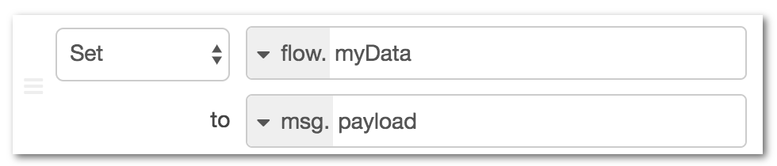
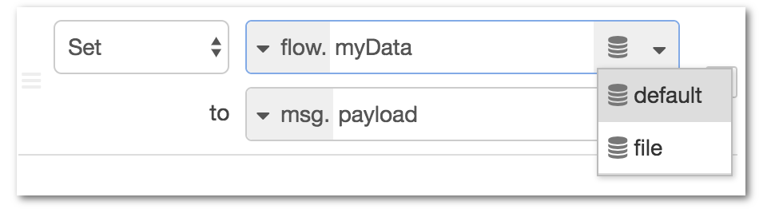

#Working with context

##What is context?
Node-RED provides a way to store information that can be shared between different nodes without using the messages that pass through a flow. This is called ‘context’.

##Context scopes
The ‘scope’ of a particular context value determines who it is shared with. There are three context scope levels:
- Node - only visible to the node that set the value
- Flow - visible to all nodes on the same flow (or tab in the editor)
- Global - visible to all nodes

The choice of scope for any particular value will depend on how it is being used.

If a value only needs to be accessed by a single node, such as a Function node, then Node context is sufficient.

More often context allows some sort of state to be shared between multiple nodes. For example, a sensor may publish new values regularly in one flow and you want to create a separate HTTP triggered flow to return the most recent value. By storing the sensor reading in context it is then available for the HTTP flow to return.

The Global context can be preconfigured with values using the functionGlobalContext property in the settings file.

##Context stores
By default, context is stored in memory only. This means its contents are cleared whenever Node-RED restarts. With the 0.19 release, it is possible to configure Node-RED to save context data so it is available across restarts.

The contextStorage property in settings.js can be used to configure how context data is stored.

Node-RED provides two built-in modules for this: memory and localfilesystem. It is also possible to create custom store plugins to save the data elsewhere.

###Saving context data to the file-system
To enable file-based storage, the following option can be used:
```
contextStorage: {
   default: {
       module: "localfilesystem"
   }
}
```
This sets the default context store to be an instance of the localfilesystem plugin, with all of its default settings. That means:
- it will store the context data in files under ~/.node-red/context/
- it caches the values in memory and only writes them out to the file-system every 30 seconds.


###Using multiple context stores
It is possible to configure more than one store so that some values are saved to the local file-system and some are only held in memory.

For example, to configure the default store to be in-memory only, and a second store for the file-system, the following options can be used:
```
contextStorage: {
   default: "memoryOnly",
   memoryOnly: { module: 'memory' },
   file: { module: 'localfilesystem' }
}
```
In this example, the default property tells Node-RED which store to use if a request to access context doesn’t specify a store.
Full details on the built-in modules, what configuration options they provide and how to create custom modules, are available on the api pages.
https://nodered.org/docs/api/context/

##Using context in a flow
The easiest way to set a value in context is to use the Change node. For example, the following Change node rule will store the value of msg.payload in flow context under the key of myData.

Various nodes can access context directly. For example, the Inject node can be configured to inject a context value and the Switch node can route messages based on a value stored in context.

If you have multiple context stores configured, the UI will allow you to pick which store a value should be stored in.


##Using context in a Function node
https://nodered.org/docs/writing-functions#storing-data
##Using context in a custom node
https://nodered.org/docs/creating-nodes/context
##Deleting context from the file store
