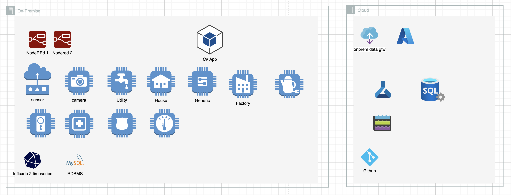

# IT Architecture (draft)

# Construction
Powerplant, House plans and more

## House IoT
- About 106 sensors for humidity & temperature Data
- Flow and temp sensors for all water points to track water consuming events.
- Warm water reserve sensors
- Climate in/out sensors including the ppm for air quality
- Electricity sensors are included and activated/consumed by Victron energy as https://vrm.victronenergy.com/login
-   I will share the actual realtime information as soon as all components are in place and issues has been solved.

