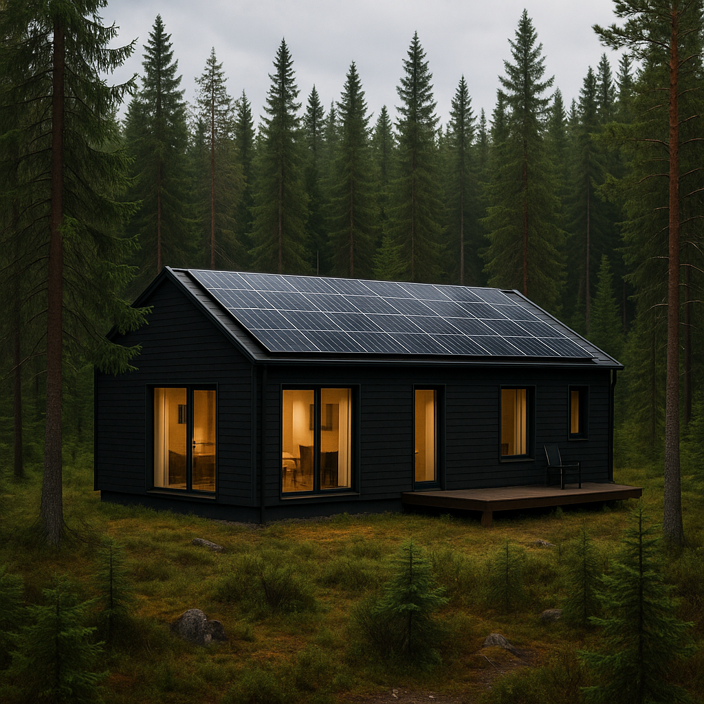
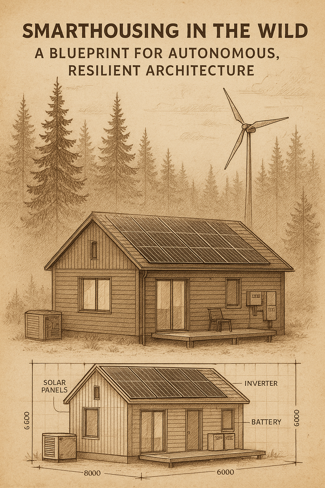
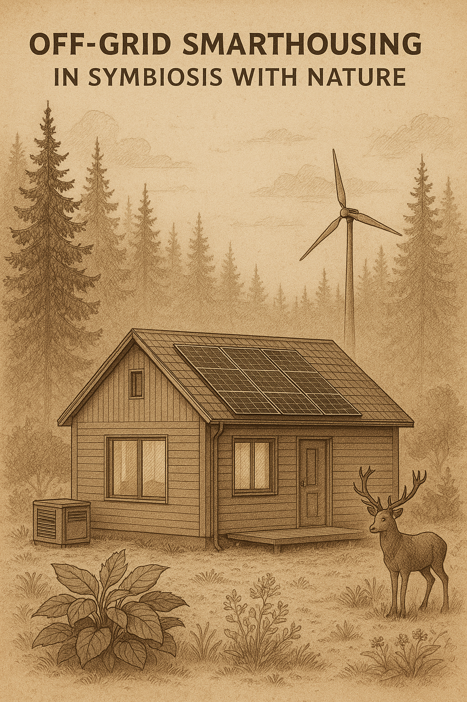

# Introduction in english
[Swedish](/READMESwe.md)
[Finnish](/READMEFin.md)
## General audience:
[Home that Listens the Forest](/A%20Home%20That%20Listens%20to%20the%20Forest.md)
 

## Technical audience:
[Smarthousing in the Wild: A Blueprint for Autonomous, Resilient Architecture](/Technical%20Introduction.md)

## Academic audience:
[Reimagining Shelter: Off-Grid Smarthousing in Symbiosis with Nature](/Architectural%20&%20Sustainability%20Introduction.md)

## Development & Geek stuff
[Latest improvements and ideas](/DevelopmentAndGeekStuff/latest.md)
[Sensordevelopment](/DevelopmentAndGeekStuff/readme.md)

### All IT architectual designs including data architecture
[Architecture stuff](/diagrams/readme.md)
[Semantics generator](/ImplementAndPlan/SementicsGenerator/Semantic_AI_View_Generator_SmartHome.md)