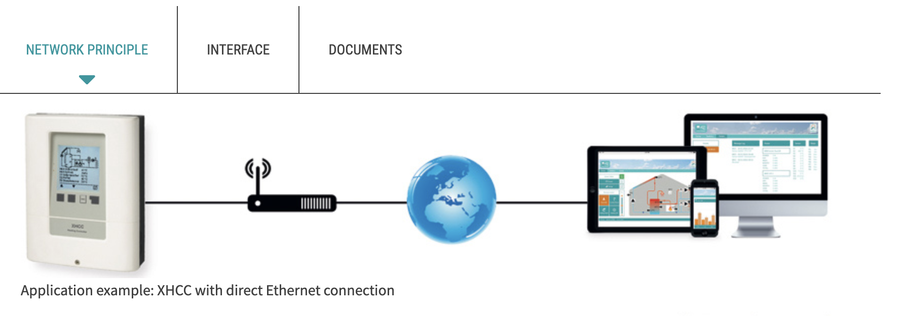

# OnPrem API by Arvosoft Oy

## Data from Jäspi waterheater to OnPrem NoSql

### Sensors on devices
So called 'build in' lives on devices like heat storing chimnies etc. And the logic is onPrem sensor & relays device XHCC (Sorel)

 
### Pumps
3 pieces of Evenes pumps are circulating water to Sabiana heaters and in and out 
##
### Electric heater units

### Heat Kwh from heat input components