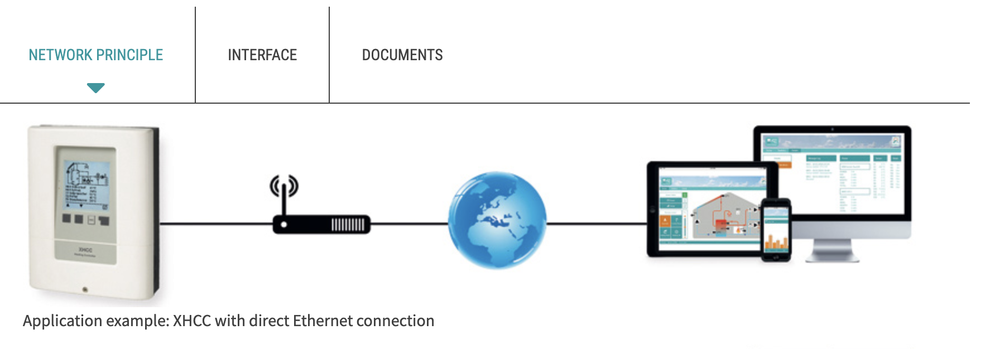

# OnPrem API by Arvosoft Oy

## Data from Jäspi wterheater to OnPrem NoSql

### Sensors on devices
So called 'build in' lives on devices like heat storing chimnies etc. And the logic is onPrem sensor & relays device XHCC (Sorel)
 

### Pumps

### Electric heater units

### Heat Kwh from heat input components