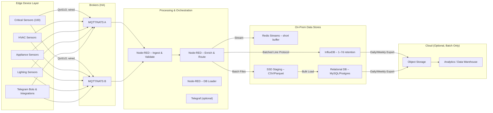
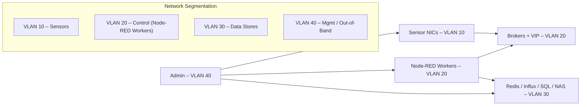
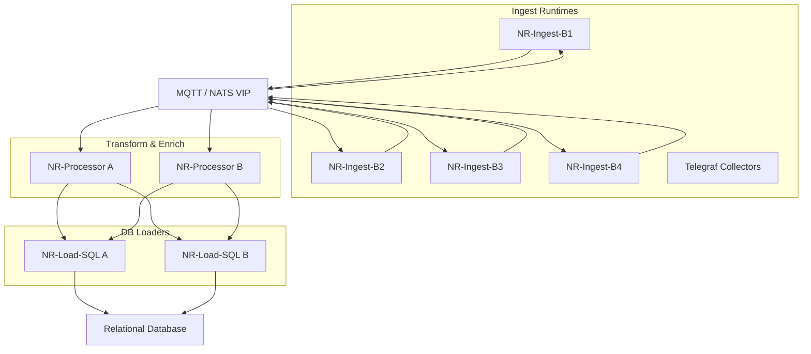
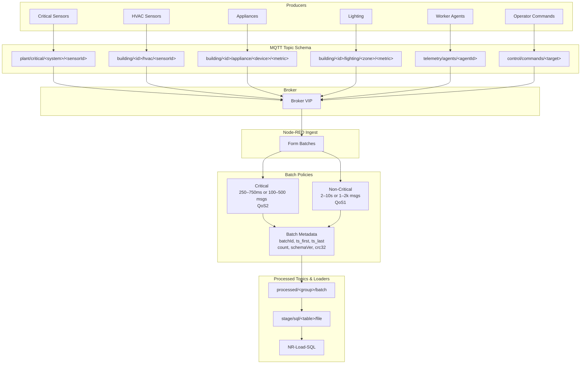
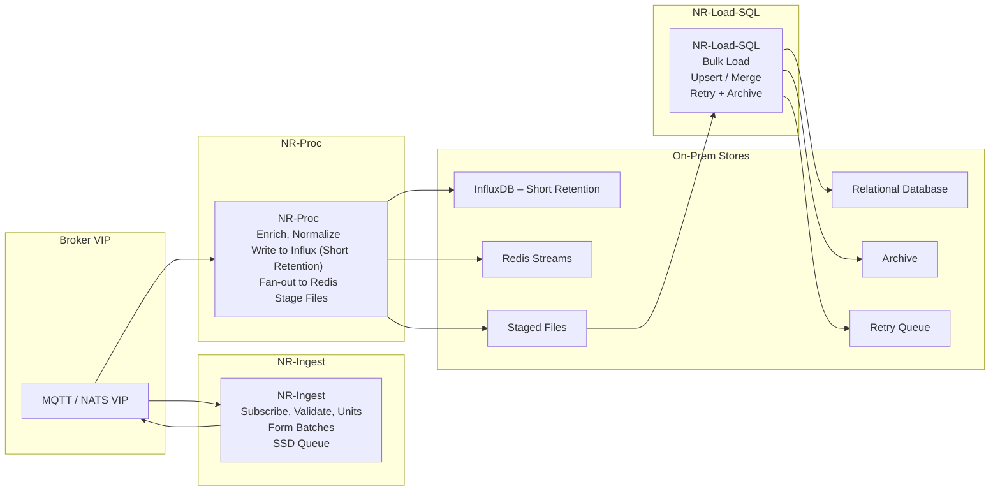
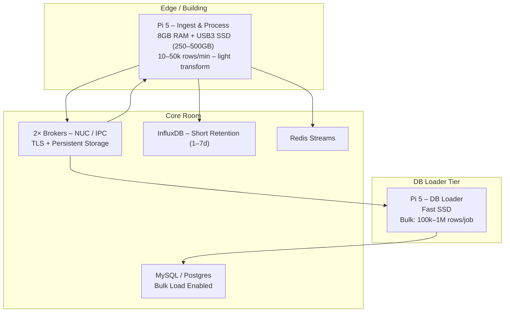
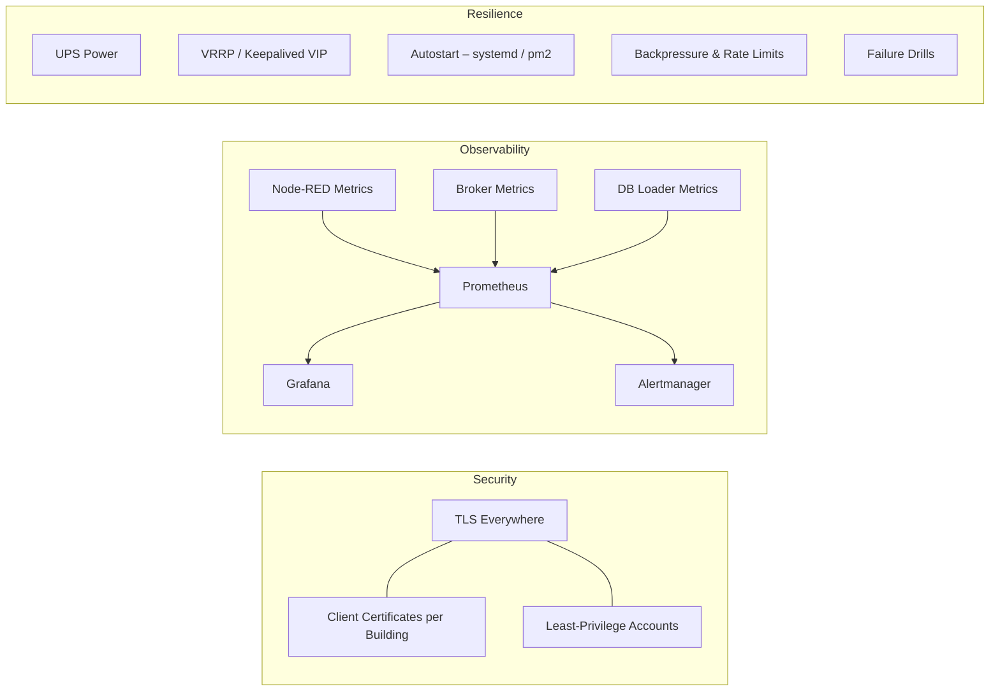
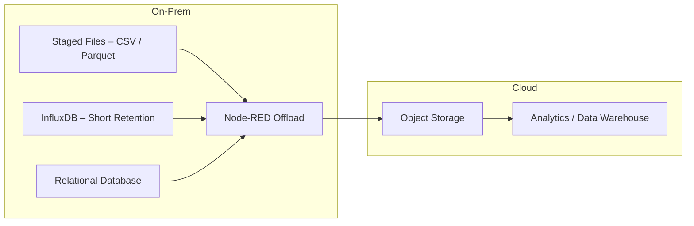

# Diagrams

## Logical Data & Control Flow (High Level)

## 2) On-Prem Infrastructure (Per Building + Core)

```mermaid
flowchart TB
  %% Core Room
  subgraph "Core Room"
    FW["Industrial Firewall"]
    RT["Router"]
    SWC["Core Switch Stack – L3"]
    VMs["Mini-Server / NUC – Proxmox or VMware"]
    MQA["Broker A"]
    MQB["Broker B"]
    VRRP["VRRP / Keepalived VIP"]
    NFS["NAS / NFS – Snapshots"]
  end

  %% Building 1
  subgraph "Building 1"
    SW1["Edge Switch – PoE"]
    P1a["Node-RED Pi 5 – Ingest"]
    P1b["Node-RED Pi 5 – Processor"]
    P1c["Node-RED Pi 5 – DB Loader"]
    G1["Gateway – RS485, Zigbee, BLE"]
  end

  %% Building 2
  subgraph "Building 2"
    SW2["Edge Switch – PoE"]
    P2a["Node-RED Pi 5"]
    P2b["Node-RED Pi 5"]
    G2["Protocol Gateway"]
  end

  %% Building 3
  subgraph "Building 3"
    SW3["Edge Switch – PoE"]
    P3a["Node-RED Pi 5"]
    G3["Protocol Gateway"]
  end

  %% Building 4
  subgraph "Building 4"
    SW4["Edge Switch – PoE"]
    P4a["Node-RED Pi 5"]
    G4["Protocol Gateway"]
  end

  %% Sensor Connections
  SENSORS1["Critical Sensors"] --> SW1
  SENSORS2["HVAC / Appliances / Lights"] --> SW1

  %% Switch Links
  SW1 --- SWC
  SW2 --- SWC
  SW3 --- SWC
  SW4 --- SWC

  %% Node-RED Pi Connections
  P1a --> SW1
  P1b --> SW1
  P1c --> SW1
  P2a --> SW2
  P2b --> SW2
  P3a --> SW3
  P4a --> SW4

  %% Core Interconnects
  MQA --- SWC
  MQB --- SWC
  VRRP --- MQA
  VRRP --- MQB
  NFS --- SWC
  VMs --- SWC
  FW --> RT --> SWC

```

## 3) Network & Reliability Design

## 4) Runtime Topology (Scalable by Role)

## 5) Topics, Queues & Batching Conventions

## 6) Node-RED Flow Roles (What each does)

## 7) Sizing & Targets (Raspberry Pi 5 + SSD)

## 8) Security & Operations

## 9) Cloud Offload (Optional, Scheduled)
