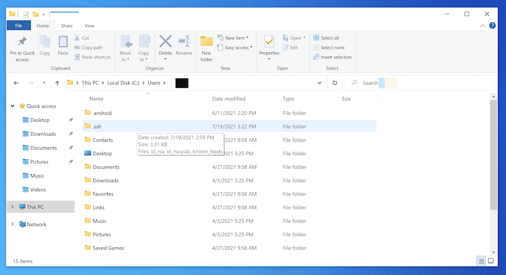
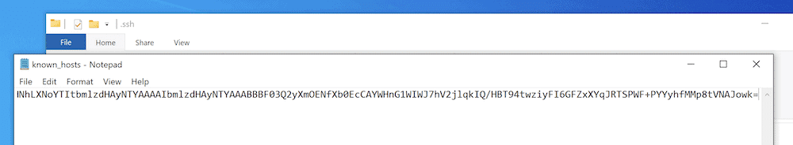
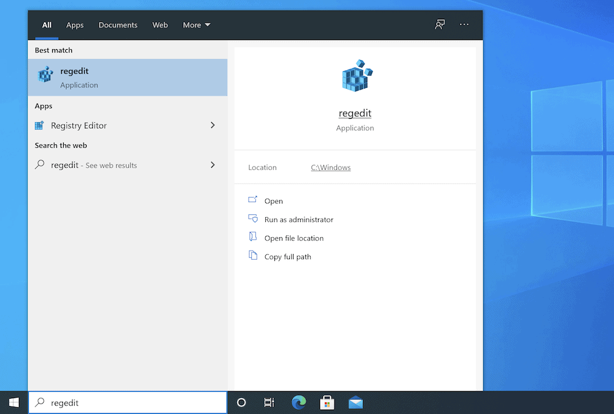
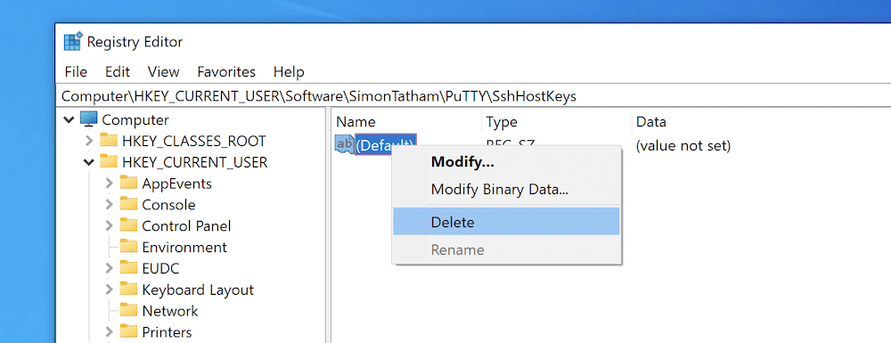
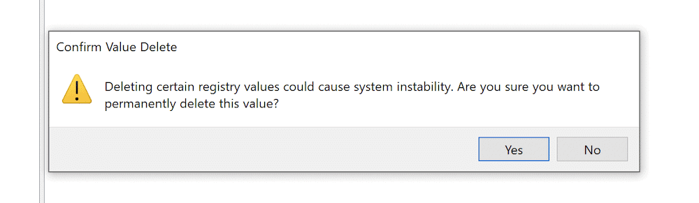
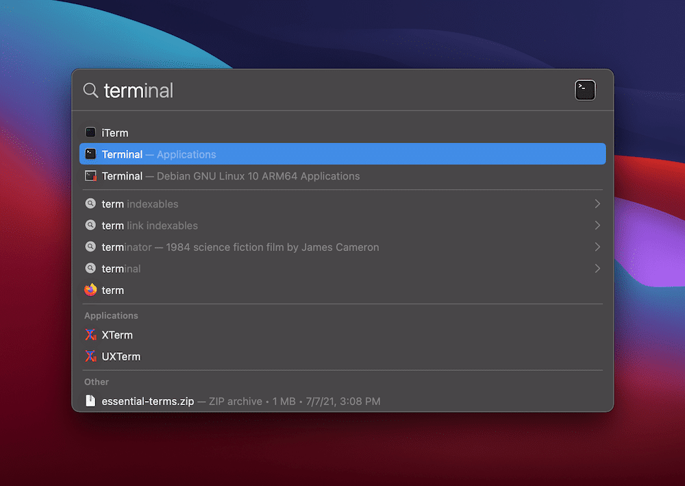

# Details on the networks

# IP level

## Issues
### How to Identify Unknown Devices Connected to Your Network?

(source https://www.geeksforgeeks.org/how-to-identify-unknown-devices-connected-to-your-network/)
Many times, when you sign onto your network and start your work you may find that the YouTube video is stuck on buffering loop and sometimes the website takes more time to load, which will slow down your work. Now when you try to look into the devices connected to your network you may find an unknown network or device connected to your Wi-Fi network which is consuming the bandwidth leading to a slowdown of your network. So, you must first try to identify these unknown devices to remove them.

**Reason Behind Connecting Unknown Devices:**
Computers, laptops, and some other Wi-Fi devices like smart home devices especially smartphones are continuously scanning for available networks to try to find a better network even when they are already connected to one. As a result, your Wi-Fi network is being continuously scanned by these devices and even your Wi-Fi network acknowledges its availability. Wi-Fi network uses WPA (Wi-Fi Protected Access) protocol, which is used to secure wireless network connection with other devices by remote authentication. But still, hackers who want to access your data or your neighbor who doesn’t want to pay for an internet connection connect to your network.

**Find Unknown Device on your Wi-Fi:**
Every device has a unique address called IP (Internet Protocol) address on your network using which they connect to the internet. Every device on your network can be identified, even unknown IP addresses on routers, using the IP address. 

You can find the IP address on the windows by the following steps:


## How To Fix the “Warning: Remote Host Identification Has Changed” Error
A secure internet connection is not just the ideal — it’s essential. In fact, we’re going to go as far as saying it’s the number one priority for your website. The “Warning: Remote host identification has changed” error protects your connection from certain malicious attacks, although in some cases, you can inadvertently cause the error too.

The error is related to your Secure Shell (SSH) keys and the server “fingerprint” a client will check for. If Secure Shell thinks there’s an issue, it will block access to your server and throw an error. But you can fix this in a few steps.

Over the next few minutes, we’re going to show you how to fix the “Warning: Remote host identification has changed” error for both Windows and Mac. First, though, let’s give you some more details on the error message itself.

### What the “Warning: Remote Host Identification Has Changed” Error Is
One of the most secure ways to connect to a web server is to use SSH. It’s a command-line tool that lets you access an insecure network securely. Consider it like a “super-SFTP” type of setup, although it’s not a 1:1 comparison in practice.

You can access your site from almost anywhere you can use the internet, as long as you have the right login credentials. What’s more, most macOS and Linux machines have an SSH client built into the Operating System (OS). For Windows, you’ll use a dedicated interface (and we’ll talk about this in more detail later).

As for the “Warning: Remote host identification has changed” error, it relates to the security checks your client will do. An SSH connection uses dedicated “keys” — small files stored on your computer — as authentication. It’s sort of like a Secure Sockets Layers (SSL) handshake, and in fact, there are some high-level similarities between SSH and SSL.

One aspect the keys help with is to provide a permanent fingerprint of its host server. This will make sure the connection is accurate and that you’re not subject to a “machine-in-the-middle” attack.

If the client thinks those fingerprints differ from what it understands to be correct, you’ll get the “Warning: Remote host identification has changed” error at the point of login:

```bash
[user@hostname ~]$ ssh root@user
@@@@@@@@@@@@@@@@@@@@@@@@@@@@@@@@@@@@@@@@@@@@@@@@@@@@@@@@@@@
@ WARNING: REMOTE HOST IDENTIFICATION HAS CHANGED! @
@@@@@@@@@@@@@@@@@@@@@@@@@@@@@@@@@@@@@@@@@@@@@@@@@@@@@@@@@@@
IT IS POSSIBLE THAT SOMEONE IS DOING SOMETHING NASTY!
Someone could be eavesdropping on you right now (man-in-the-middle attack)!
It is also possible that a host key has just been changed.
The fingerprint for the RSA key sent by the remote host is
xx:xx:xx.
Please contact your system administrator.
Add correct host key in /home/hostname /.ssh/known_hosts to get rid of this message.
Offending RSA key in /var/lib/sss/pubconf/known_hosts:4
RSA host key for user has changed and you have requested strict checking.
Host key verification failed.
```
As errors go, this is detailed and clear — it tells you what’s happened, a potential reason for why, and how you might fix it.

However, there’s one aspect we can touch on a little further before showing you how to fix the “Warning: Remote host identification has changed” error.
### How the known_hosts File Helps SSH Authentication
You’ll notice that the error message references a known_hosts file. The name should give you a clue as to what it contains, but for clarity, it’s a list of SSH remote hosts known to the computer. It’s used as a reference client file for the authentication process.

When you first connect to a server, you’ll often get a confirmation request through your interface, asking whether you want to connect. If so, this fingerprint will become part of your known_hosts file.

Of course, if the fingerprint differs from what is in the known_hosts file, this could indicate a malicious user is targeting you. In other cases, you may already know why there’s a difference, although it pays to be vigilant regardless.

### How To Fix the “Warning: Remote Host Identification Has Changed” Error (on Windows and Mac)

You can work to fix the “Warning: Remote host identification has changed” error for both Windows and macOS. However, you have more flexibility for doing so on Mac.

We’ll cover lots of the ways you can make things right again, starting with Windows.


```python
Important
You shouldn’t attempt to fix the error unless you have complete
confidence that the issue isn’t malicious. If you’re certain
there’s no security risk threatening your connection, 
the below steps are for you.
```
### 1. Windows
It’s important to note that Windows machines might not have a known_hosts file. However, if you use the OpenSSH client, there is a file. To find it, open the Windows search bar, and navigate to your user folder with the %USERPROFILE% command.

This will open the directory within the File Explorer. There will also be a .ssh folder within:


The file we want in this folder is known_hosts. You can open this with Notepad (or your favorite text editor). Inside will be a list of keys:


Here, you can delete the key that’s causing the problem, then resave the file.

Some users may prefer the PuTTY client. The keys sit in the Registry, although they perform the same purpose as OpenSSH.

You’ll want to open the Windows Registry Editor (otherwise known as “regedit”). You can do this in whatever way you’re comfortable, but the quickest way is to type the app’s name into Window’s search bar:

Here, look for the following destination within regedit:
```
HKEY_CURRENT_USER/Software/SimonTatham/PuTTY/SshHostKeys/
```
You’ll see a list of entries here relating to the saved connections on your computer. Your job is to delete whichever one is causing an issue:


Once you click on the Delete button, you’ll also need to confirm that you want to remove the key:


Clicking Yes here means the key will be gone for good, and you shouldn’t get the “Warning: Remote host identification has changed” error any longer.

### 2. Mac
The Mac has a couple of ways to fix the “Warning: Remote host identification has changed” error — either through a premium app such as SSH Config Editor or the Terminal. The results will be the same, so we advise you to choose whichever option is more comfortable (and budget-friendly).

Our preferred approach is to access the file within a Terminal window (or iTerm2 if you use that app), and also open it with a dedicated Nano or Vim editor. This is because it’s accessible to everyone and straightforward to use regardless of your experience level.

Here, we’re going to use Nano. First, open your Terminal using whatever process is most comfortable:

